
Listed below are the items used in battles. This page is currently under construction,
 but it will be finished in the near future.  

You can find a full list of stickers <a href="https://starmen.net/ssbb/items/stickers/">here.</a>



<table class="fixed" border="1">
    <col width="150px" />
    <col width="200px" />
    <col width="1000px" />
  <tr>
    <th>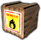&nbsp;</th>
    <th>Blast Box</th>
    <th>...</th>
  </tr>
  <tr>
    <th></th>
    <th>Smash Ball</th>
    <th>...</th>
  </tr>
  <tr>
    <th>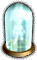</th>
    <th>Assist Trophy</th>
    <th>...</th>
  </tr>
  <tr>
    <th>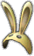</th>
    <th>Bunny Hood</th>
    <th>Allows the wearer to run faster and jump farther</th>
  </tr>
  <tr>
    <th>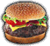</th>
    <th>Food</th>
    <th>...</th>
  </tr>
  <tr>
    <th>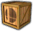</th>
    <th>Crate</th>
    <th>Contain items inside and can be used to damage other players. There are three different crates, and they appear depending on the stage. Some also have wheels at the bottom.</th>
  </tr>
  <tr>
    <th></th>
    <th>Super Spicy Curry</th>
    <th>...</th>
  </tr>
  <tr>
    <th>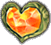</th>
    <th>Heart Piece</th>
    <th>Heals 100 points of damage</th>
  </tr>
  <tr>
    <th>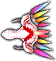</th>
    <th>Dragoon</th>
    <th>...</th>
  </tr>
  <tr>
    <th>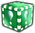</th>
    <th>Metal Box</th>
    <th>...</th>
  </tr>
  <tr>
    <th>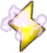</th>
    <th>Lightning</th>
    <th>...</th>
  </tr>
  <tr>
    <th>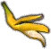</th>
    <th>Banana Peel</th>
    <th>...</th>
  </tr>
  <tr>
    <th>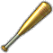</th>
    <th>Home-Run Bat</th>
    <th>The Home-Run Bat can easily be one of the most powerful items in the game. It does quite a bit of damage with regular hits or by throwing it, but if you're able to perform a Smash attack, it's a guaranteed instant KO; it takes a moment to wind up, but the payoff is worth it.</th>
  </tr>
  <tr>
    <th>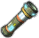</th>
    <th>Cracker Launcher</th>
    <th>...</th>
  </tr>
  <tr>
    <th>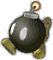</th>
    <th>...</th>
    <th>...</th>
  </tr>
  <tr>
    <th></th>
    <th>Bumper</th>
    <th>...</th>
  </tr>
  <tr>
    <th>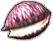</th>
    <th>Deku Nut</th>
    <th>...</th>
  </tr>
  <tr>
    <th>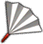</th>
    <th>Fan</th>
    <th>The Fan, while only dealing 2% damage on each strike, can easily be spammed to rack a hefty percentage before the enemy can escape. It breaks shields quickly, can be used to back opposing enemy off the ledge, or trap another player in a corner that can be a very challenging to escape.</th>
  </tr>
  <tr>
    <th>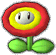</th>
    <th>Fire Flower</th>
    <th>...</th>
  </tr>
  <tr>
    <th></th>
    <th>Franklin Badge</th>
    <th>Reflects projectiles</th>
  </tr>
  <tr>
    <th>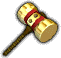</th>
    <th>Golden Hammer</th>
    <th>...</th>
  </tr>
  <tr>
    <th>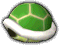</th>
    <th>...</th>
    <th>...</th>
  </tr>
  <tr>
    <th>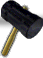</th>
    <th>Hammer</th>
    <th>...</th>
  </tr>
  <tr>
    <th>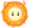</th>
    <th>Hothead</th>
    <th>...</th>
  </tr>
  <tr>
    <th>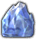</th>
    <th>...</th>
    <th>...</th>
  </tr>

  <tr>
    <th></th>
    <th>Lip's Stick</th>
    <th>This is a melee weapon and when it strikes a character, a flower will appear on their head and will dish out small, but steady increments of damage. If the player is able to successfully land consistent strikes, the flower will become bigger. Powerful attacks make the process quicker.  The flower that appears on the character's head is technically considered a projectile and can be deflected if a Franklin Badge is equipped. Moving the analog stick quickly will eventually cause the flower to fall off the player's head.</th>
  </tr>
  <tr>
    <th>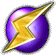</th>
    <th>...</th>
    <th>...</th>
  </tr>
  <tr>
    <th>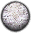</th>
    <th>Smoke Ball</th>
    <th>...</th>
  </tr>
  <tr>
    <th></th>
    <th>Pitfall</th>
    <th>...</th>
  </tr>
  <tr>
    <th>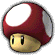</th>
    <th>Poison Mushroom</th>
    <th>...</th>
  </tr>
  <tr>
    <th>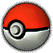</th>
    <th>Poké Ball</th>
    <th>...</th>
  </tr>
  <tr>
    <th>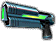</th>
    <th>Ray Gun</th>
    <th>...</th>
  </tr>
  <tr>
    <th>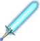</th>
    <th>Beam Sword</th>
    <th>The Beam Sword is similar to how it was in previous titles, but noticeably has changed colors from red to blue. In addition, the weapon now has a longer range. If a smash attack is performed, it can reach up to 3x its normal length. </th>
  </tr>
  <tr>
    <th>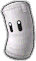</th>
    <th>Sandbag</th>
    <th>...</th>
  </tr>
  <tr>
    <th>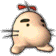</th>
    <th>Mr. Saturn</th>
    <th>...</th>
  </tr>
  <tr>
    <th></th>
    <th>Motion-sensor Bomb</th>
    <th>...</th>
  </tr>
  <tr>
    <th>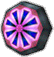</th>
    <th>Cloaking Device</th>
    <th>...</th>
  </tr>
  <tr>
    <th></th>
    <th>Soccer Ball</th>
    <th>...</th>
  </tr>
  <tr>
    <th>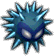</th>
    <th>Unira</th>
    <th>...</th>
  </tr>
  <tr>
    <th>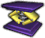</th>
    <th>Spring</th>
    <th>...</th>
  </tr>
  <tr>
    <th></th>
    <th>Warp Star</th>
    <th>...</th>
  </tr>
  <tr>
    <th>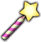</th>
    <th>Star Rod</th>
    <th>...</th>
  </tr>
  <tr>
    <th></th>
    <th>Starman</th>
    <th>...</th>
  </tr>
  <tr>
    <th>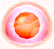</th>
    <th>Gooey Bomb</th>
    <th>...</th>
  </tr>
  <tr>
    <th>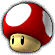</th>
    <th>Super Mushroom</th>
    <th>...</th>
  </tr>
  <tr>
    <th>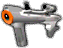</th>
    <th>Super Scope</th>
    <th>...</th>
  </tr>
  <tr>
    <th></th>
    <th>Team Healer</th>
    <th>...</th>
  </tr>
  <tr>
    <th>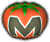</th>
    <th>Maxim Tomato</th>
    <th>...</th>
  </tr>
  <tr>
    <th></th>
    <th>Timer</th>
    <th>...</th>
  </tr>
</table>



<table class="fixed" border="1">
    <col width="150px" />
    <col width="200px" />
    <col width="1000px" />
  <tr>
    <th>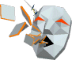&nbsp;</th>
    <th>Andross</th>
    <th>Andross will take his form from the original Star Fox game, and shoot tiles at opponents from the background. He will actively aim these tiles at opposing characters, and despite their low speed, the sheer volume can make them difficult to avoid. A permanent Andross assist will also appear in the event match “Shadow of Andross.”</th>
</tr>
  <tr>
    <th>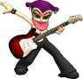&nbsp;</th>
    <th>Barbara</th>
    <th>Barbara will continuously strum her guitar, creating large sound waves that grow and shrink with her volume. Similar to Donkey Kong’s Final Smash, but with less duration and power.</th></tr>

  <tr>
    <th>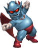&nbsp;</th>
    <th>Devil</th>
    <th>The Devil will float to the top of the screen before pointing in various different directions. The screen (blast lines included) will move in the opposite direction of which he points. Before disappearing, he will move the screen back to its original position.</th>
</tr>
  <tr>
    <th>&nbsp;</th>
    <th>Dr. Wright</th>
    <th>When he comes out of the trophy, Dr. Wright will summon buildings out of the ground (occasionally summons a skyscraper instead of buildings). These provide great vertical knockback when the opponent gets hit with one, but when it just sits on the field, the building does nothing.</th>
</tr>
  <tr>
    <th>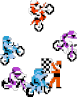&nbsp;</th>
    <th>Excitebikes</th>
    <th>The Excitebike racers will ride around the stage, and may fall off of the stage when they hit the edge. Some of them may just keep racing around the stage until they disappear.</th>
</tr>
  <tr>
    <th>&nbsp;</th>
    <th>Gray Fox</th>
    <th>Gray Fox will run around the stage, slashing opponents of the summoner with his sword. His sword will also reflect any stray projectiles, like the Blaster or Super Scope.</th>
</tr>
  <tr>
    <th>&nbsp;</th>
    <th>Hammer Bro</th>
    <th>Hammer Bro will stay in place (except for jumping) and toss hammers at the opponent.</th>
</tr>
  <tr>
    <th>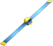&nbsp;</th>
    <th>Helirin</th>
    <th>Helirin will float around the stage and rotate. It acts as a wall, and because of this, with unlucky placement it can crush opponents, something which is only usually possible in certain areas of the Subspace Emissary.</th>
</tr>
  <tr>
    <th>&nbsp;</th>
    <th>Infantry and Tanks</th>
    <th>Some of the weaker units from the Nintendo Wars series take on their appearance from Advance Wars. They will jump around the area, shooting the enemy various times before disappearing.</th>
</tr>
  <tr>
    <th>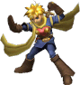&nbsp;</th>
    <th>Isaac</th>
    <th>Isaac will stay in one place and use his Move power to push opponents around with giant hands. It’s easy to get trapped in, thanks to fixed knockback.</th>
</tr>
  <tr>
    <th>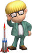&nbsp;</th>
    <th>Jeff</th>
    <th>Everybody’s favourite nerdy genius will shoot five rockets at his opponent from his trusty Multi Bottle Rocket (four small and one large). They will home in on opponents, and move fairly quickly.</th>
</tr>
  <tr>
    <th>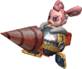&nbsp;</th>
    <th>Jill</th>
    <th>Jill will move and jump at random intervals, attacking opponents with her drill.</th>
</tr>
  <tr>
    <th>&nbsp;</th>
    <th>Kat and Ana</th>
    <th>The ninja twins from the WarioWare games have the same basic effect as Latios and Latias; they will slash various times across the stage, always connecting in the middle, before moving to the middle of the stage and disappearing.</th>
</tr>
  <tr>
    <th>&nbsp;</th>
    <th>Knuckle Joe</th>
    <th>The Fighter enemy from the Kirby games will deliver a series of Vulcan Jabs to his opponents to rack up damage, before finishing them with a high-knockback Smash Punch or an uppercut attack called Rising Break.</th>
</tr>
  <tr>
    <th>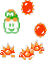&nbsp;</th>
    <th>Lakitu and Spinies</th>
    <th>As in his appearance in various Mario games, Lakitu will float to the top of the screen and drop Spinies on unwary victims below. When falling from Lakitu, the Spinies will meteor smash opponents. Unique in the fact that a smasher can go to the top of the screen to damage and KO Lakitu.</th>
</tr>
  <tr>
    <th>&nbsp;</th>
    <th>Little Mac</th>
    <th>Little Mac will run and jump around, delivering jabs and uppercuts not unlike Knuckle Joe.</th>
</tr>
  <tr>
    <th>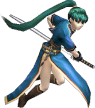&nbsp;</th>
    <th>Lyn</th>
    <th>The noble swordfighter of Fire Emblem will quietly say “I’ll handle this…” while the screen turns dark. She will then concentrate a slash on the closest opponent. This move is a lot like Meta Knight’s Final Smash, and has high KO potential.</th>
</tr>
  <tr>
    <th>&nbsp;</th>
    <th>Metroid</th>
    <th>A Metroid will latch onto a player and deal constant damage for a short time. Metroid can travel through walls. While the character’s life force is being sucked up by Metroid, they cannot make any moves except for frantically flailing around to get the Metroid off of their head. If the Metroid comes off in the air, they will not be able to make any recovery moves.</th>
</tr>
  <tr>
    <th>&nbsp;</th>
    <th>Mr. Resetti</th>
    <th>The infamous Mr. Resetti will give various speeches about different topics. His text bubbles block almost all of the top half of the screen. He lasts longer than any other Assist Trophy and attacking him will cause an explosion.</th>
</tr>
  <tr>
    <th>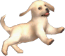&nbsp;</th>
    <th>Nintendog</th>
    <th>A Nintendog will appear for a second, disappear, and then come back, much bigger and blocking the screen.</th>
</tr>
  <tr>
    <th>&nbsp;</th>
    <th>Ray MK III</th>
    <th>Ray MK III will fly around the stage shooting missiles and energy bullets.</th>
</tr>
  <tr>
    <th>&nbsp;</th>
    <th>Saki Amamiya</th>
    <th>He will slash with his sword and fire with his cannon gun. Saki Amamiya is one of the most versatile assist trophies in that he can attack powerfully in close range and from a distance.</th>
</tr>
  <tr>
    <th>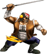&nbsp;</th>
    <th>Samurai Goroh</th>
    <th>The Samurai Goroh will chase opponents down and hit them with his sword. He’s REALLY fast.</th>
</tr>
  <tr>
    <th>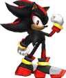&nbsp;</th>
    <th>Shadow the Hedgehog</th>
    <th>Shadow will shout “Chaos control!” and slow down time. This makes enemies move slower than with the Timer, but has shorter duration. The summoner still stays at normal speed.</th>
</tr>
  <tr>
    <th>&nbsp;</th>
    <th>Starfy</th>
    <th>Starfy spins around. This deals minimal damage and a bit of knockback, but if he’s THAT annoying, you can knock him off of the stage.</th>
</tr>
  <tr>
    <th>&nbsp;</th>
    <th>Tingle</th>
    <th>Tingle will pop out of the Assist Trophy and cause one of these five effects (the first two are the most common, in my experience). 
He can inflate a lot of balloons and float off of the stage. The balloons can carry characters above the upper blast line but won’t deal any damage. 
He can cause a shower of Hammers and Golden Hammers (beware, they might be duds. The Hammers can lose their heads and the Golden Hammers could be squeaky.) 
He can create a banana peel effect. This will cause every character except the summoner to trip constantly until Tingle disappears. 
He can burst into flames, which gives everybody a Superspicy Curry status. 
He can produce a flower graphic. This will zoom the camera in on the summoner.</th>
</tr>
  <tr>
    <th>&nbsp;</th>
    <th>Waluigi</th>
    <th>Waluigi will repeatedly stomp the ground, which can bury opponents and knock them out of the air, and then follow up with a kick or hit from his tennis racket.</th>
</tr>
</table>



<table class="fixed" border="1">
    <col width="150px" />
    <col width="200px" />
    <col width="1000px" />
<tr>
    <th>&nbsp;</th>
    <th>Bellossom</th>
    <th>Bellossom will target any enemy in a short range around them and cause them to fall into a deep sleep.</th>
</tr>
<tr>
    <th>&nbsp;</th>
    <th>Bonsly</th>
    <th>Bonsly will walk across the stage harmlessly. However, it is treated as a heavy item (in lieu of the crate and barrel items) and can be thrown at enemies. It will deal about 30% on contact.</th>
</tr>
<tr>
    <th>&nbsp;</th>
    <th>Celebi</th>
    <th>Much like Mew, Celebi will deal no damage and simply fly gracefully off of the screen. Extremely rare, and will leave a trail of trophies in its wake.</th>
</tr>
  <tr>
    <th>&nbsp;</th>
    <th>Chikorita</th>
    <th>Chikorita will release a Razor Leaf attack at a horizontal trajectory and disappear after a short time. Good at brief trapping, but not as good as Meowth and Staryu. Deals a maximum of 8%.</th>
</tr>
<tr>
    <th>&nbsp;</th>
    <th>Deoxys</th>
    <th>Deoxys will appear in its Attack Forme, fly to the top of the screen, and unleash a deadly Hyper Beam below it. High potential to OHKO opponents. This attack deals a maximum of 38% damage.</th>
</tr>
  <tr>
    <th>&nbsp;</th>
    <th>Electrode</th>
    <th>Electrode will stay stationary on the field and explode after three seconds, dealing massive knockback to anyone who’s near it, including the person who threw the ball. Occasionally, the Electrode will be a dud, at which point it can instead be picked up and thrown. It deals a maximum of 45% damage.</th>
</tr>
<tr>
    <th>&nbsp;</th>
    <th>Entei</th>
    <th>Entei will produce a massive pillar of fire, with range around it and high above it. It will trap opponents in its vertical range. This attack deals a maximum of 72% damage.</th>
</tr>
<tr>
    <th>&nbsp;</th>
    <th>Gardevoir</th>
    <th>Gardevoir will erect a circular shield around itself and walk around the stage. The shield will stop all projectile attacks, such as shots from the Super Scope, R.O.B.’s laser, or the blasters utilized by Fox, Falco, and Wolf.</th>
</tr>
  <tr>
    <th>&nbsp;</th>
    <th>Goldeen</th>
    <th>Goldeen will flop around on the stage, doing nothing at all. If it splashes into water, it will swim around and still do nothing at all.</th>
</tr>
<tr>
    <th>&nbsp;</th>
    <th>Groudon</th>
    <th>Groudon’s superheated body damages any opponent that comes in contact with it. Groudon stays mostly stationary, but its massive body is difficult to avoid. This attack deals a maximum of 30% damage.</th>
</tr>
<tr>
    <th>&nbsp;</th>
    <th>Gulpin</th>
    <th>Gulpin will swallow any opponent that gets close to it. While the opponent is inside of Gulpin’s stomach, they will take constant damage, and take damage from any attacks that someone hits Gulpin with. Gulpin itself will deal a maximum of 22% damage.</th>
</tr>
<tr>
    <th>&nbsp;</th>
    <th>Ho-Oh</th>
    <th>Ho-Oh will also fly to the background, but instead release a stream of flame over the portion of the stage that’s directly in front of it. This attack can deal a maximum of 80% damage.</th>
</tr>
<tr>
    <th>&nbsp;</th>
    <th>Jirachi</th>
    <th>Again, like Celebi and Mew, Jirachi will deal no damage to opponents. It will instead fly gracefully off the screen and leave a stream of stickers behind it.</th>
</tr>
<tr>
    <th>&nbsp;</th>
    <th>Kyogre</th>
    <th>Kyogre deals no damage, but homes in on an opponent and releases a massive stream of water out of its mouth that pushes the opponent far off the stage. Much like Lugia’s, designed to be an OHKO move.</th>
</tr>
<tr>
    <th>&nbsp;</th>
    <th>Latias and Latios</th>
    <th>These Pokemon have the same effect. One will come out of the Pokeball, fly off of the stage, and then fly back in at high speeds in diagonal lines with its partner. They have the same frequency of being spawned as a non-legendary Pokemon, oddly enough, as they are considered Legendaries. The two together deal a maximum of 50% damage.</th>
</tr>
<tr>
    <th>&nbsp;</th>
    <th>Lugia</th>
    <th>Lugia will fly to the background of the stage and release a powerful beam attack to the section of the stage in front of it. This is an OHKO move that was actually designed to KO any characters that come in contact with it, making Lugia one of the deadliest Pokemon in the game, and surprisingly, deals no damage.</th>
</tr>
<tr>
    <th>&nbsp;</th>
    <th>Manaphy</th>
    <th>Manaphy will deal no damage, and instead use its signature attack, Heart Swap, to change control between all characters on the field.</th>
</tr>
  <tr>
    <th>&nbsp;</th>
    <th>Meowth</th>
    <th>Meowth will face the closest enemy and release an extremely fast stream of coins that will keep them trapped. If the target escapes, Meowth will turn to the next-closest enemy. It can deal a maximum of 66% damage.</th>
</tr>
<tr>
    <th>&nbsp;</th>
    <th>Metagross</th>
    <th>Metagross will continually stomp the ground around itself, burying grounded opponents and launching airborne ones upward. It can deal a maximum of 104% damage.</th>
</tr>
<tr>
    <th>&nbsp;</th>
    <th>Mew</th>
    <th>Mew, when spawned, will not hurt opponents and fly gracefully off of the stage. Incredibly rare, and when it flies off the stage, a CD will spawn. If all music is collected, a sticker will spawn instead.</th>
</tr>
<tr>
    <th>&nbsp;</th>
    <th>Moltres</th>
    <th>Moltres will simply spawn from the Pokeball and fly off of the stage, but damage any opponent it comes into contact with. Moltres can deal a maximum of 40% damage.</th>
</tr>
<tr>
    <th>&nbsp;</th>
    <th>Munchlax</th>
    <th>Munchlax will walk harmlessly across the field. Unlike Bonsly, it cannot be picked up and thrown, and if an item spawns on the stage, Munchlax will run over to the item and eat it, making it disappear. Munchlax will never eat a Smash Ball, Assist Trophy, or other Pokeball.</th>
</tr>
<tr>
    <th>&nbsp;</th>
    <th>Piplup</th>
    <th>When Piplup is released from the Pokeball, it will form a wave and ride it across and off the stage. Any opponent caught in the wave will be forced to ride with Piplup off of the stage, making this a very deadly attack that is difficult to recover from.</th>
</tr>
  <tr>
    <th>&nbsp;</th>
    <th>Snorlax</th>
    <th>Snorlax will hop into the air, damaging anyone (except the thrower) who’s near it, and come down again at about the entire length of some stages. This move deals incredible knockback. It can deal a maximum of 33% damage.</th>
</tr>
  <tr>
    <th>&nbsp;</th>
    <th>Staryu</th>
    <th>Staryu will float to the nearest enemy and let loose with a Swift attack, bombarding the target with stars. This is good at trapping. Like Meowth, if the target moves out of Staryu’s Swift, it will home in on the next closest enemy. It can deal a maximum of 38% damage.</th>
</tr>
<tr>
    <th>&nbsp;</th>
    <th>Suicune</th>
    <th>Suicune will fire a powerful beam out of its mouth. Travels across the stage horizontally and has high KO potential. It can deal a maximum of 35% damage.</th>
</tr>
<tr>
    <th>&nbsp;</th>
    <th>Togepi</th>
    <th>Togepi will randomly attack with Smokescreen, Earthquake, Powder Snow, Sleep Powder, or Leech Seed. Damage is random depending on what move it uses.</th>
</tr>
<tr>
    <th>&nbsp;</th>
    <th>Torchic</th>
    <th>Torchic will trap any opponents in a short radius around it in a ring of fire for a few seconds. It can deal a maximum of 40% damage.</th>
</tr>
<tr>
    <th>&nbsp;</th>
    <th>Weavile</th>
    <th>Weavile will flail its claws while running back and forth across the stage, akin to the Side-Special moves of Fox, Falco, and Wolf. Any opponent caught in Weavile’s path will take damage and become stunned until they get knocked out of Weavile’s path, or the Pokemon disappears. It can deal a maximum of 28% damage.</th>
</tr>
<tr>
    <th>&nbsp;</th>
    <th>Wobbuffet</th>
    <th>Wobbuffet does nothing directly, but if it is attacked by any character (including the thrower), it will bounce around, and deal the same amount of damage to its attacker as it would if the attacker hit another player. (Example: if an attack would deal 17% to a player, but hits Wobbuffet, Wobbuffet will bounce back and deal 17% to the attacker)</th>
</tr>
</table>

