
<table class="fixed" border="1">
    <col width="200px" />
    <col width="150px" />
    <col width="250px" />
    <col width="150px" />
    <col width="250px" />
  <tr>
    <th>Sticker</th>
    <th>Name</th>
    <th>Game</th>
    <th>Effect</th>
    <th>Character</th>
  </tr>
  <tr>
    <th></th>
    <th>1-Up Mushroom</th>
    <th>New Super Mario Bros.</th>
    <th>[Leg] Attack +4</th>
    <th>Bowser, Luigi, Mario, Peach, Yoshi</th>
  </tr>
  <tr>
    <th>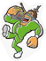</th>
    <th>18-Volt</th>
    <th>WarioWare: Touched!</th>
    <th>[Arm] Attack +4</th>
    <th>All</th>
  </tr>
  <tr>
    <th>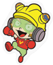</th>
    <th>9-Volt</th>
    <th>WarioWare, Inc.: Mega Party Game$!</th>
    <th>[Electric] Attack +8</th>
    <th>All</th>
  </tr>
  <tr>
    <th></th>
    <th>9-Volt</th>
    <th>WarioWare: Touched!</th>
    <th>[Head] Attack +5</th>
    <th>All</th>
  </tr>
  <tr>
    <th>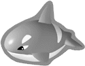</th>
    <th>Acro</th>
    <th>Kirby Series</th>
    <th>[Magic] Attack +15</th>
    <th>Peach, Zelda</th>
  </tr>
  <tr>
    <th></th>
    <th>Aijou Boom no Ya</th>
    <th>Sennen Kazoku</th>
    <th>[Arm] Attack +8</th>
    <th>All</th>
  </tr>
  <tr>
    <th></th>
    <th>Akari Hayami</th>
    <th>1080°: Avalanche</th>
    <th>[Freezing] Attack +14</th>
    <th>All</th>
  </tr>
  <tr>
    <th></th>
    <th>Akari Hayami</th>
    <th>Wave Race: Blue Storm</th>
    <th>[Water] Attack +8</th>
    <th>Pokemon Trainer</th>
  </tr>
  <tr>
    <th>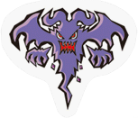</th>
    <th>Akuma</th>
    <th>Sennen Kazoku</th>
    <th>[Flame] Resistance +19</th>
    <th>All</th>
  </tr>
  <tr>
    <th></th>
    <th>Amy Rose</th>
    <th>Sonic The Hedgehog CD</th>
    <th>[Leg] Attack +14</th>
    <th>All</th>
  </tr>
  <tr>
    <th></th>
    <th>Ana</th>
    <th>Mother</th>
    <th>[Body] [Spin] Attack +7</th>
    <th>All</th>
  </tr>
  <tr>
    <th></th>
    <th>Ana</th>
    <th>WarioWare: Touched!</th>
    <th>[Body] [Spin] Attack +7</th>
    <th>Anyone</th>
  </tr>
  <tr>
    <th></th>
    <th>Andrew</th>
    <th>Star Fox: Assault</th>
    <th>Launch Resistance +7</th>
    <th>Falco, Fox, Wolf</th>
  </tr>
  <tr>
    <th>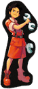</th>
    <th>Andy</th>
    <th>Advance Wars</th>
    <th>[Specials: Indirect] Attack +6</th>
    <th>Anyone</th>
  </tr>
  <tr>
    <th>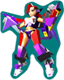</th>
    <th>Annie</th>
    <th>Custom Robo V2</th>
    <th>Launch Power +10</th>
    <th>Anyone</th>
  </tr>
  <tr>
    <th>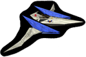</th>
    <th>Arwing</th>
    <th>Star Fox 64</th>
    <th>[Leg] Attack +6</th>
    <th>Falco, Fox, Wolf</th>
  </tr>
  <tr>
    <th>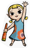</th>
    <th>Aryll</th>
    <th>Legend of Zelda: Wind Waker</th>
    <th>[Electric] Attack +8</th>
    <th>All</th>
  </tr>
  <tr>
    <th></th>
    <th>Ashley</th>
    <th>Trace Memory</th>
    <th>[Throwing] Attack +16</th>
    <th>All</th>
  </tr>
  <tr>
    <th></th>
    <th>Ashley</th>
    <th>WarioWare: Touched!</th>
    <th>[Magic] Attack +22</th>
    <th>Peach, Zelda</th>
  </tr>
  <tr>
    <th></th>
    <th>Ashley Viewing DTS</th>
    <th>Trace Memory</th>
    <th>[Specials: Direct] Attack +17</th>
    <th>R.O.B</th>
  </tr>
  <tr>
    <th>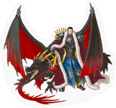</th>
    <th>Ashnard</th>
    <th>Fire Emblem: Path of Radiance</th>
    <th>[Splash] Resistance +34</th>
    <th>Ike, Marth</th>
  </tr>
  <tr>
    <th></th>
    <th>Baby Mario</th>
    <th>Yoshi’s Island</th>
    <th>[Flame] Attack +5</th>
    <th>All</th>
  </tr>
  <tr>
    <th></th>
    <th>Balloon Fight Enemy</th>
    <th>Balloon Fight</th>
    <th>[Special: Indirect] Attack +4</th>
    <th>Ice Climbers</th>
  </tr>
  <tr>
    <th></th>
    <th>Balloon Fighter</th>
    <th>Balloon Fight</th>
    <th>[Weapon] Attack + 4</th>
    <th>Pit</th>
  </tr>
  <tr>
    <th></th>
    <th>Ballyhoo & Big Top</th>
    <th>Mario Party 8</th>
    <th>[Head] Attack +10</th>
    <th>All</th>
  </tr>
  <tr>
    <th>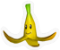</th>
    <th>Banana</th>
    <th>Mario Kart DS</th>
    <th>[Flame] Attack + 4</th>
    <th>All</th>
  </tr>
  <tr>
    <th></th>
    <th>Banana Bunch</th>
    <th>Donkey Kong Barrel Blast</th>
    <th>[Specials: Indirect] Attack + 6</th>
    <th>All</th>
  </tr>
  <tr>
    <th></th>
    <th>Banana Coin</th>
    <th>Donkey Kong 64</th>
    <th>[Leg] Attack + 4</th>
    <th>All</th>
  </tr>
  <tr>
    <th>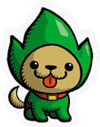</th>
    <th>Barkle</th>
    <th>Freshly-Picked Tingle's Rosy Rupeeland</th>
    <th>[Tail] Attack +32</th>
    <th>Diddy Kong, Pikachu, Pokemon Trainer, Yoshi</th>
  </tr>
  <tr>
    <th></th>
    <th>Barrel Train</th>
    <th>Mario Kart: Double Dash</th>
    <th>[Leg] Attack +19</th>
    <th>All</th>
  </tr>
  <tr>
    <th>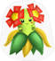</th>
    <th>Bellossom</th>
    <th>Pokémon series</th>
    <th>[Grass] Attack +8</th>
    <th>Pokémon Trainer</th>
  </tr>
  <tr>
    <th></th>
    <th>Big Boss</th>
    <th>Metal Gear Solid: The Twin Snakes</th>
    <th>Trophy Drops +30</th>
    <th>All</th>
  </tr>
  <tr>
    <th></th>
    <th>Big Switch</th>
    <th>Kirby & The Amazing Mirror</th>
    <th>Launch Resistance +18</th>
    <th>All</th>
  </tr>
  <tr>
    <th></th>
    <th>Big the Cat</th>
    <th>Sonic Adventure DX: Director's Cut</th>
    <th>[Battering] Resistance +14</th>
    <th>All</th>
  </tr>
  <tr>
    <th></th>
    <th>Black Shadow</th>
    <th>F-Zero GX</th>
    <th>[Flame] Attack +37</th>
    <th>Captain Falcon</th>
  </tr>
  <tr>
    <th>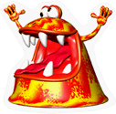</th>
    <th>Blargg</th>
    <th>Yoshi's Story</th>
    <th>[Specials: Direct] Attack +13</th>
    <th>All</th>
  </tr>
  <tr>
    <th>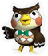</th>
    <th>Blathers</th>
    <th>Animal Crossing: Wild World</th>
    <th>[Tail] Attack + 7</th>
    <th>Diddy Kong, Pikachu, Pokemon Trainer, Yoshi</th>
  </tr>
  <tr>
    <th></th>
    <th>Blaze the Cat</th>
    <th>Sonic Rush</th>
    <th>Shield Recovery +7</th>
    <th>All</th>
  </tr>
  <tr>
    <th>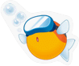</th>
    <th>Blipper</th>
    <th>Kirby: Squeak Squad</th>
    <th>Swim Time +20</th>
    <th>All</th>
  </tr>
  <tr>
    <th></th>
    <th>Blood Falcon</th>
    <th>F-Zero GX</th>
    <th>[Head] Attack +18</th>
    <th>All</th>
  </tr>
  <tr>
    <th></th>
    <th>Blue Falcon</th>
    <th>F-Zero GX</th>
    <th>[Specials: Direct] Attack + 3</th>
    <th>Captain Falcon</th>
  </tr>
  <tr>
    <th></th>
    <th>Blue Pellet</th>
    <th>Pikmin 2</th>
    <th>[Pikmin] Attack +6</th>
    <th>Olimar</th>
  </tr>
  <tr>
    <th></th>
    <th>Blue Pikmin</th>
    <th>Pikmin</th>
    <th>[Pikmin] Attack +16</th>
    <th>Olimar</th>
  </tr>
  <tr>
    <th></th>
    <th>Blue Virus</th>
    <th>Nintendo Puzzle Collection</th>
    <th>[Electric] Attack +5</th>
    <th>Any</th>
  </tr>
  <tr>
    <th></th>
    <th>Bone Dragon</th>
    <th>Yoshi's Story</th>
    <th>[Bite] Attack +13</th>
    <th>Pokemon Trainer, Wario, Wolf, Yoshi</th>
  </tr>
  <tr>
    <th>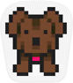</th>
    <th>Boney</th>
    <th>Mother 3</th>
    <th>[PK] Attack +16</th>
    <th>Lucas, Ness</th>
  </tr>  
<tr>
    <th>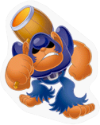</th>
    <th>Bonkers</th>
    <th>Kirby: Squeak Squad</th>
    <th>[Weapon] Attack +16</th>
    <th>King Dedede, Kirby, Metaknight</th>
  </tr>
  <tr>
    <th></th>
    <th>Bonley</th>
    <th>Pokémon series</th>
    <th>[Leg] Attack + 3</th>
    <th>All</th>
  </tr>
  <tr>
    <th>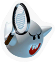</th>
    <th>Boo</th>
    <th>Mario Tennis</th>
    <th>[Throwing] Attack +14</th>
    <th>All</th>
  </tr>
  <tr>
    <th>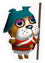</th>
    <th>Booker</th>
    <th>Animal Crossing: Wild World</th>
    <th>Food Effect +5</th>
    <th>All</th>
  </tr>
  <tr>
    <th>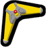</th>
    <th>Boomerang</th>
    <th>The Legend of Zelda: The Wind Waker</th>
    <th>[Weapon] Attack + 4</th>
    <th>Ganondorf, Link, Toon Link, Zelda</th>
  </tr>
  <tr>
    <th>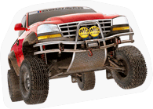</th>
    <th>Boulder</th>
    <th>Excite Truck</th>
    <th>[Body, Spin] Attack +32</th>
    <th>All</th>
  </tr>
  <tr>
    <th></th>
    <th>Boundish</th>
    <th>Digiluxe</th>
    <th>[Flame] Attack +7</th>
    <th>All</th>
  </tr>
  <tr>
    <th>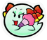</th>
    <th>Bow</th>
    <th>Paper Mario</th>
    <th>[Magic] Attack + 8</th>
    <th>Peach, Zelda</th>
  </tr>
  <tr>
    <th></th>
    <th>Bowser</th>
    <th>Dance Dance Revolution: Mario Mix</th>
    <th>[Throwing] Attack +20</th>
    <th>Bowser, Luigi, Mario, Peach, Yoshi</th>
  </tr>  
<tr>
    <th></th>
    <th>Bowser</th>
    <th>Mario Kart 64</th>
    <th>[Weapon] Attack +13</th>
    <th>Bowser, Luigi, Mario, Peach, Yoshi</th>
  </tr>  
<tr>
    <th></th>
    <th>Bowser</th>
    <th>Mario Power Tennis</th>
    <th>[Darkness] Attack +21</th>
    <th>Ganondorf</th>
  </tr>  
<tr>
    <th></th>
    <th>Bowser</th>
    <th>Super Paper Mario</th>
    <th>[Arm] Attack +23</th>
    <th>Bowser, Luigi, Mario, Peach, Yoshi</th>
  </tr>  
<tr>
    <th></th>
    <th>Bowser Coin</th>
    <th>Mario Party 6</th>
    <th>[Arm] Attack + 8</th>
    <th>All</th>
  </tr>  
<tr>
    <th></th>
    <th>Bowser Jr.</th>
    <th>Mario Superstar Baseball</th>
    <th>Trophy Drops +25</th>
    <th>All</th>
  </tr>  
<tr>
    <th></th>
    <th>Bowser Jr.</th>
    <th>Super Mario Sunshine</th>
    <th>[Tail] Attack +25</th>
    <th>Diddy Kong, Pikachu, Pokemon Trainer, Yoshi</th>
  </tr>  
<tr>
    <th></th>
    <th>Box Boxer</th>
    <th>Kirby: Squeak Squad</th>
    <th>[Aura] Attack +26</th>
    <th>Lucario</th>
  </tr>  
<tr>
    <th></th>
    <th>Boxy</th>
    <th>Kirby: Squeak Squad</th>
    <th>[Bite] Attack +24</th>
    <th>Pokemon Trainer, Wario, Wolf, Yoshi</th>
  </tr>  
<tr>
    <th>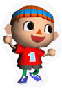</th>
    <th>Boy</th>
    <th>Animal Crossing: Wild World</th>
    <th>[Arm] Attack +11</th>
    <th>All</th>
  </tr>  
<tr>
    <th></th>
    <th>Boy</th>
    <th>Magical Starsign</th>
    <th>[Flame] Attack + 7</th>
    <th>All</th>
  </tr>
  <tr>
    <th></th>
    <th>Boy</th>
    <th>Magical Vacation</th>
    <th>[Throwing] Attack +22</th>
    <th>All</th>
  </tr>
  <tr>
    <th>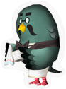</th>
    <th>Brewster</th>
    <th>Animal Crossing: Wild World</th>
    <th>[Throwing] Attack +13</th>
    <th>All</th>
  </tr>
  <tr>
    <th>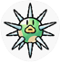</th>
    <th>Brier</th>
    <th>Yoshi Touch & Go</th>
    <th>Launch Resistance +7</th>
    <th>All</th>
  </tr>
  <tr>
    <th>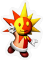</th>
    <th>Brighton</th>
    <th>Mario Party 6</th>
    <th>Shield Resistance +8</th>
    <th>All</th>
  </tr>  
<tr>
    <th></th>
    <th>Bronto Burt</th>
    <th>Kirby 64: The Crystal Shards</th>
    <th>[Body, Spin] Attack +4</th>
    <th>All</th>
  </tr>
<tr>
    <th></th>
    <th>Bubble Baby Mario</th>
    <th>Yoshi's Island</th>
    <th>[Bite] Attack +6</th>
    <th>Pokemon Trainer, Wario, Wolf, Yoshi</th>
  </tr>
<tr>
    <th>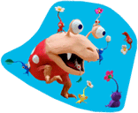</th>
    <th>Bulborb</th>
    <th>Pikmin 2</th>
    <th>[Pikmin] Attack +34</th>
    <th>Olimar</th>
  </tr>
<tr>
    <th></th>
    <th>Bullet Bill</th>
    <th>New Super Mario Bros.</th>
    <th>Launch Power +12</th>
    <th>All</th>
  </tr>
<tr>
    <th></th>
    <th>Bullet Blaster</th>
    <th>Mario Kart: Double Dash</th>
    <th>Launch Power +50</th>
    <th>All</th>
  </tr>
<tr>
    <th>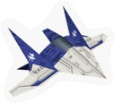</th>
    <th>Bullfrog</th>
    <th>Star Fox Command</th>
    <th>Carry Bob-omb</th>
    <th>All</th>
  </tr>
<tr>
    <th></th>
    <th>Burt the Bashful</th>
    <th>Super Mario World 2: Yoshi's Island</th>
    <th>[Bite] Attack +6</th>
    <th>Pokemon Trainer, Wario, Wolf, Yoshi</th>
  </tr>
<tr>
    <th>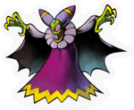</th>
    <th>Cackletta</th>
    <th>Mario & Luigi: Superstar Saga</th>
    <th>Flinch Resistance +84</th>
    <th>All</th>
  </tr>
<tr>
    <th></th>
    <th>Candy</th>
    <th>Kirby: Squeak Squad</th>
    <th>[Specials: Direct] Attack +4</th>
    <th>R.O.B.</th>
  </tr>
<tr>
    <th></th>
    <th>Capsule</th>
    <th>Nintendo Puzzle Collection</th>
    <th>[Flame] Attack +5</th>
    <th>All</th>
  </tr>
<tr>
    <th></th>
    <th>Captain Falcon</th>
    <th>F-Zero</th>
    <th>[Slash] Resistance +23</th>
    <th>Captain Falcon</th>
  </tr>
<tr>
    <th></th>
    <th>Captain Falcon</th>
    <th>F-Zero GX</th>
    <th>[Arm, Leg] Attack +8</th>
    <th>Captain Falcon</th>
  </tr>
<tr>
    <th></th>
    <th>Captain Falcon</th>
    <th>F-Zero X</th>
    <th>[Specials: Direct] Attack +19</th>
    <th>Captain Falcon</th>
  </tr>
<tr>
    <th>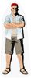</th>
    <th>Captain</th>
    <th>Trace Memory</th>
    <th>[Weapon] Attack +4</th>
    <th>All</th>
  </tr>
<tr>
    <th></th>
    <th>Car Yoshi</th>
    <th>Yoshi's Island</th>
    <th>[Tail] Attack +7</th>
    <th>Yoshi</th>
  </tr>
<tr>
    <th>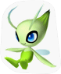</th>
    <th>Celebi</th>
    <th>Pokémon series</th>
    <th>[Grass] Attack +14</th>
    <th>Pokémon Trainer</th>
  </tr>
<tr>
    <th>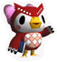</th>
    <th>Celeste</th>
    <th>Animal Crossing: Wild World</th>
    <th>[Head] Attack +6</th>
    <th>All</th>
  </tr>
<tr>
    <th></th>
    <th>Cell Phone</th>
    <th>Kirby & The Amazing Mirror</th>
    <th>[Slash] Resistance +4</th>
    <th>King Dedede, Kirby, Meta Knight</th>
  </tr>
<tr>
    <th></th>
    <th>Chain Chomp</th>
    <th>Mario Party 8</th>
    <th>[Bite] Attack +23</th>
    <th>Pokemon Trainer, Wario, Wolf, Yoshi</th>
  </tr>
<tr>
    <th>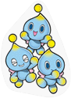</th>
    <th>Chao</th>
    <th>Sonic Adventure DX: Director's Cut</th>
    <th>Flinch Resistance +49</th>
    <th>All</th>
  </tr>
<tr>
    <th>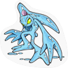</th>
    <th>Chaos</th>
    <th>Sonic Adventure DX: Director's Cut</th>
    <th>Food Effect +4</th>
    <th>All</th>
  </tr>
<tr>
    <th>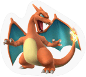</th>
    <th>Charizard</th>
    <th>Pokémon series</th>
    <th>[Arm, Leg] Attack +10</th>
    <th>Jigglypuff, Lucario, Pikachu, Pokemon Trainer</th>
  </tr>
<tr>
    <th></th>
    <th>Charmy Bee</th>
    <th>Knuckles' Chaotix</th>
    <th>[Slash] Attack +7</th>
    <th>All</th>
  </tr>
<tr>
    <th></th>
    <th>Cheep Cheep</th>
    <th>New Super Mario Bros.</th>
    <th>Sticker Drops +9</th>
    <th>All</th>
  </tr>
<tr>
    <th>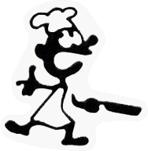</th>
    <th>Chef</th>
    <th>Game & Watch</th>
    <th>[Specials: Indirect] Attack +25</th>
    <th>Mr. Game & Watch</th>
  </tr>
<tr>
    <th></th>
    <th>Chef</th>
    <th>Shaberu! DS Cooking Navi</th>
    <th>Food Effect +3</th>
    <th>All</th>
  </tr>
<tr>
    <th></th>
    <th>Chef Kawasaki</th>
    <th>Kirby Super Star</th>
    <th>Launch Resistance +20</th>
    <th>All</th>
  </tr>
<tr>
    <th></th>
    <th>Chibi-Robo</th>
    <th>Chibi-Robo</th>
    <th>[Weapon] Attack +3</th>
    <th>All</th>
  </tr>
<tr>
    <th></th>
    <th>Chibi-Robo</th>
    <th>Chibi-Robo: Park Patrol</th>
    <th>[Electric] Resistance +19</th>
    <th>All</th>
  </tr>
<tr>
    <th>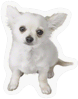</th>
    <th>Chihuahua</th>
    <th>Nintendogs</th>
    <th>[Tail] Attack +12</th>
    <th>Diddy Kong, Pikachu, Pokemon Trainer, Yoshi</th>
  </tr>
<tr>
    <th>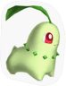</th>
    <th>Chikorita</th>
    <th>Pokémon series</th>
    <th>[Aura] Attack +13</th>
    <th>Lucario</th>
  </tr>
<tr>
    <th>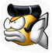</th>
    <th>Chonmagyo</th>
    <th>Densetsu no Stafy 2</th>
    <th>[Weapon] Attack +5</th>
    <th>All</th>
  </tr>
<tr>
    <th></th>
    <th>Chozo Statue</th>
    <th>Metroid II: Return of Samus</th>
    <th>[Aura] Attack +25</th>
    <th>Lucario</th>
  </tr>
<tr>
    <th></th>
    <th>Chromatron</th>
    <th>Digiluxe</th>
    <th>[Electric] Attack +7</th>
    <th>All</th>
  </tr>
<tr>
    <th></th>
    <th>Chunky Kong</th>
    <th>Donkey Kong 64</th>
    <th>[Throwing] Attack +31</th>
    <th>Diddy Kong, Donkey Kong</th>
  </tr>
<tr>
    <th></th>
    <th>Classic Sonic</th>
    <th>Sonic the Hedgehog JP Version</th>
    <th>[Arm] Attack +21</th>
    <th>All</th>
  </tr>
<tr>
    <th></th>
    <th>Classic Sonic</th>
    <th>Sonic the Hedgehog USA Version</th>
    <th>[Throwing] Attack +20</th>
    <th>Sonic</th>
  </tr>
<tr>
    <th>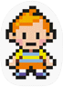</th>
    <th>Claus</th>
    <th>Mother 3</th>
    <th>[PK] Attack +13</th>
    <th>Lucas, Ness</th>
  </tr>
<tr>
    <th></th>
    <th>Coin</th>
    <th>New Super Mario Bros.</th>
    <th>[Specials: Indirect] Attack +4</th>
    <th>Bowser, Luigi, Mario, Peach, Yoshi</th>
  </tr>
<tr>
    <th></th>
    <th>Colin</th>
    <th>The Legend of Zelda: Twilight Princess</th>
    <th>[Special: Direct] Attack +4</th>
    <th>Ganondorf, Link, Toon Link, Zelda</th>
  </tr>
<tr>
    <th>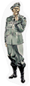</th>
    <th>Colonel</th>
    <th>Metal Gear Solid 2: Sons of Liberty</th>
    <th>[Energy] Attack +8</th>
    <th>All</th>
  </tr>
<tr>
    <th></th>
    <th>Commander Kahn</th>
    <th>Elite Beat Agents</th>
    <th>[Arm] Attack +18</th>
    <th>All</th>
  </tr>
<tr>
    <th></th>
    <th>Cook Kirby</th>
    <th>Kirby Super Star</th>
    <th>Flinch Resistance +140</th>
    <th>All</th>
  </tr>
<tr>
    <th>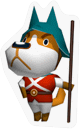</th>
    <th>Copper</th>
    <th>Animal Crossing: Wild World</th>
    <th>[Body, Spin] Attack +12</th>
    <th>All</th>
  </tr>
<tr>
    <th>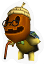</th>
    <th>Cornimer</th>
    <th>Animal Crossing: Wild World</th>
    <th>Trophy Stand Drops +21</th>
    <th>All</th>
  </tr>
<tr>
    <th></th>
    <th>Count Bleck</th>
    <th>Super Paper Mario</th>
    <th>[Flame] Resistance +5</th>
    <th>All</th>
  </tr>
<tr>
    <th></th>
    <th>Cranky Kong</th>
    <th>Donkey Konga 3 JP!</th>
    <th>[Special: Indirect] Attack +7</th>
    <th>All</th>
  </tr>
<tr>
    <th></th>
    <th>Crazee Dayzee</th>
    <th>Yoshi's Island DS</th>
    <th>[Grass] Attack +7</th>
    <th>Pokemon Trainer</th>
  </tr>
<tr>
    <th></th>
    <th>Crazy Redd</th>
    <th>Animal Crossing: Wild World</th>
    <th>[PK] Attack +16</th>
    <th>Lucas, Ness</th>
  </tr>
<tr>
    <th></th>
    <th>Cream the Rabbit and Cheese Chao</th>
    <th>Sonic Advance 2</th>
    <th>[Electric] Resistance +9</th>
    <th>All</th>
  </tr>
<tr>
    <th></th>
    <th>Crimson Candypop Bud</th>
    <th>Pikmin 2</th>
    <th>[Pikmin] Attack +12</th>
    <th>Olimar</th>
  </tr>
<tr>
    <th></th>
    <th>Cupid Kirby</th>
    <th>Kirby & The Amazing Mirror</th>
    <th>Carry Star Rod</th>
    <th>All</th>
  </tr>
<tr>
    <th></th>
    <th>Cupit</th>
    <th>Sennen Kazoku</th>
    <th>[Electric] Attack +5</th>
    <th>All</th>
  </tr>
<tr>
    <th>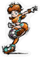</th>
    <th>Daisy</th>
    <th>Super Mario Strikers</th>
    <th>[Leg] Attack +5</th>
    <th>Sll</th>
  </tr>
<tr>
    <th></th>
    <th>Daohnes Nohansen Hyrule</th>
    <th>The Legend of Zelda: The Wind Waker</th>
    <th>[Electric] Attack +31</th>
    <th>Ganondorf, Link, Toon Link, Zelda</th>
  </tr>
<tr>
    <th></th>
    <th>Dark Samus</th>
    <th>Metroid Prime 2: Echoes</th>
    <th>[Electric] Attack +31</th>
    <th>Ganondorf, Link, Toon Link, Zelda</th>
  </tr>
<tr>
    <th></th>
    <th>Dark Suit Samus</th>
    <th>Metroid Prime 2: Echoes</th>
    <th>[Throwing] Attack +16</th>
    <th>All</th>
  </tr>
<tr>
    <th>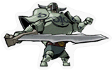</th>
    <th>Darknut</th>
    <th>The Legend of Zelda: The Wind Waker</th>
    <th>[Slash] Attack +13</th>
    <th>Ganondorf, Link, Toon Link, Zelda</th>
  </tr>
<tr>
    <th>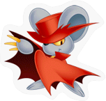</th>
    <th>Daroach</th>
    <th>Kirby: Squeak Squad</th>
    <th>[Electric] Attack +24</th>
    <th>All</th>
  </tr>
<tr>
    <th>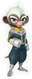</th>
    <th>Dash</th>
    <th>Star Fox Command</th>
    <th>[Arm, Leg] Attack +3</th>
    <th>All</th>
  </tr>
<tr>
    <th>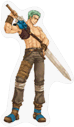</th>
    <th>Deke</th>
    <th>Fire Emblem: The Binding Blade</th>
    <th>[Slash] Attack +9</th>
    <th>Ike, Marth</th>
  </tr>
<tr>
    <th></th>
    <th>Deku Baba</th>
    <th>The Legend of Zelda: Ocarina of Time</th>
    <th>[Arm, Leg] Attack +4</th>
    <th>All</th>
  </tr>
<tr>
    <th></th>
    <th>Deku Link</th>
    <th>The Legend of Zelda: Majora's Mask</th>
    <th>[Electric] Resistance +5</th>
    <th>All</th>
  </tr>
<tr>
    <th></th>
    <th>Deku Nut</th>
    <th>The Legend of Zelda: Ocarina of Time</th>
    <th>[Special: Indirect] Attack +4</th>
    <th>All</th>
  </tr>
<tr>
    <th>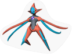</th>
    <th>Deoxys</th>
    <th>Pokémon series</th>
    <th>[Slash] Attack +10</th>
    <th>Jigglypuff, Lucario, Pikachu, Pokemon Trainer</th>
  </tr>
<tr>
    <th>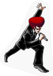</th>
    <th>Derek</th>
    <th>Elite Beat Agents</th>
    <th>[Head] Attack +13</th>
    <th>All</th>
  </tr>
<tr>
    <th></th>
    <th>Devil Car</th>
    <th>Mother</th>
    <th>[PK] Attack +14</th>
    <th>Lucas, Ness</th>
  </tr>
<tr>
    <th></th>
    <th>Dice Block</th>
    <th>Mario Party 8</th>
    <th>[Arm] Attack +8</th>
    <th>Bowser, Luigi, Mario, Peach, Yoshi</th>
  </tr>
<tr>
    <th></th>
    <th>Diddy Kong</th>
    <th>Donkey Kong 64</th>
    <th>Launch Power +20</th>
    <th>Diddy Kong, Donkey Kong</th>
  </tr>
<tr>
    <th></th>
    <th>Diddy Kong</th>
    <th>Donkey Kong Country</th>
    <th>[Tail] Attack +28</th>
    <th>Diddy Kong</th>
  </tr>
<tr>
    <th></th>
    <th>Diddy Kong</th>
    <th>Mario Hoops 3-on-3</th>
    <th>[Leg] Attack +28</th>
    <th>Diddy Kong, Donkey Kong</th>
  </tr>
<tr>
    <th></th>
    <th>Diddy Kong</th>
    <th>Mario Superstar Baseball</th>
    <th>[Leg] Attack +12</th>
    <th>Diddy Kong, Donkey Kong</th>
  </tr>
<tr>
    <th></th>
    <th>Digidrive</th>
    <th>Digiluxe</th>
    <th>[Flame] Attack +6</th>
    <th>All</th>
  </tr>
<tr>
    <th></th>
    <th>Dixie Kong</th>
    <th>Donkey Konga 2</th>
    <th>Launch Resistance +39</th>
    <th>Diddy Kong, Donkey Kong</th>
  </tr>
<tr>
    <th></th>
    <th>DK</th>
    <th>Mario Superstar Baseball</th>
    <th>[Head] Attack +27</th>
    <th>Diddy Kong, Donkey Kong</th>
  </tr>
<tr>
    <th></th>
    <th>DK Barrel</th>
    <th>Donkey Kong Country</th>
    <th>Launch Power +53</th>
    <th>Diddy Kong, Donkey Kong</th>
  </tr>
<tr>
    <th></th>
    <th>DK with Barrel</th>
    <th>Mario vs. Donkey Kong 2: March of the Minis</th>
    <th>[Specials: Direct] Attack +15</th>
    <th>All</th>
  </tr>
<tr>
    <th></th>
    <th>Don Bongo</th>
    <th>Yoshi's Story</th>
    <th>[Explosive] Attack +25</th>
    <th>All</th>
  </tr>
<tr>
    <th></th>
    <th>Donbe</th>
    <th>Shin Onigashima</th>
    <th>[Slash] Resistance +26</th>
    <th>Ice Climbers, Mr. Game & Watch, Pit, R.O.B.</th>
  </tr>
<tr>
    <th></th>
    <th>Donkey Kong</th>
    <th>Donkey Kong Jungle Beat</th>
    <th>[Arm] Attack +22</th>
    <th>Diddy Kong, Donkey Kong</th>
  </tr>
<tr>
    <th></th>
    <th>Donkey Kong</th>
    <th>Donkey Kong Country</th>
    <th>[Electric] Resistance +10</th>
    <th>Diddy Kong, Donkey Kong</th>
  </tr>
<tr>
    <th></th>
    <th>Donkey Kong</th>
    <th>Mario Kart DS</th>
    <th>[Flame] Resistance</th>
    <th>All</th>
  </tr>
<tr>
    <th></th>
    <th>Donkey Kong Jr.</th>
    <th>Mario Tennis</th>
    <th>[Arm] Attack +14</th>
    <th>Diddy Kong, Donkey Kong</th>
  </tr>
<tr>
    <th></th>
    <th>Dr. Crygor</th>
    <th>WarioWare: Touched!</th>
    <th>[Arm, Leg] Attack +2</th>
    <th>All</th>
  </tr>
<tr>
    <th></th>
    <th>Dr. Eggman</th>
    <th>Sonic The Hedgehog</th>
    <th>Launch Resistance +39</th>
    <th>Sonic</th>
  </tr>
<tr>
    <th></th>
    <th>Dr. Lobe</th>
    <th>Big Brain Academy</th>
    <th>[Arm, Leg] Attack +10</th>
    <th>All</th>
  </tr>
<tr>
    <th></th>
    <th>Dr. Lobe</th>
    <th>Big Brain Academy: Wii Degree</th>
    <th>Sticker Drops +11</th>
    <th>All</th>
  </tr>
<tr>
    <th></th>
    <th>Dr. Mario</th>
    <th>Nintendo Puzzle Collection</th>
    <th>[Head] Attack +18</th>
    <th>Bowser, Luigi, Mario, Peach, Yoshi</th>
  </tr>
<tr>
    <th></th>
    <th>Dr. Shrunk</th>
    <th>Animal Crossing: Wild World</th>
    <th>Carry Fan</th>
    <th>All</th>
  </tr>
<tr>
    <th></th>
    <th>Dr. Stewart</th>
    <th>F-Zero GX</th>
    <th>[Electric] Attack +6</th>
    <th>All</th>
  </tr>
<tr>
    <th></th>
    <th>Dribble</th>
    <th>WarioWare, Inc.: Mega Party Game$!</th>
    <th>[Battering] Resistance + 6</th>
    <th>All</th>
  </tr>
<tr>
    <th></th>
    <th>Dry Bones</th>
    <th>Mario Party 7</th>
    <th>[Aura] Attack +17</th>
    <th>Lucario</th>
  </tr>
<tr>
    <th></th>
    <th>Dunning Smith</th>
    <th>Hotel Dusk: Room 215</th>
    <th>[Leg] Attack +6</th>
    <th>All</th>
  </tr>
<tr>
    <th></th>
    <th>Duster</th>
    <th>Mother 3</th>
    <th>[Leg] Attack +4</th>
    <th>Lucas, Ness</th>
  </tr>
<tr>
    <th></th>
    <th>Dyna Blade</th>
    <th>Kirby Super Star</th>
    <th>Launch Resistance +46</th>
    <th>King Dedede, Kirby, Meta Knight</th>
  </tr>
<tr>
    <th></th>
    <th>Dzuke-chan</th>
    <th>English Training: Have Fun Improving Your Skills</th>
    <th>Launch Resistance +12</th>
    <th>All</th>
  </tr>
<tr>
    <th></th>
    <th>E-102 Gamma</th>
    <th>Sonic Adventure DX: Director's Cut</th>
    <th>[Flame] Attack +11</th>
    <th>All</th>
  </tr>
<tr>
    <th></th>
    <th>E-123 Omega</th>
    <th>Sonic Heroes</th>
    <th>[Flame] Resistance +17</th>
    <th>All</th>
  </tr>
<tr>
    <th></th>
    <th>Egg</th>
    <th>Game & Watch</th>
    <th>[Weapon] Attack +4</th>
    <th>All</th>
  </tr>
<tr>
    <th></th>
    <th>Eggplant Wizard</th>
    <th>Kid Icarus</th>
    <th>[Special: Indirect] Attack +11</th>
    <th>All</th>
  </tr>
<tr>
    <th></th>
    <th>Eight Yoshis</th>
    <th>Super Mario Advance 3: Yoshi's Island</th>
    <th>[Arm, Leg] Attack +18</th>
    <th>Yoshi</th>
  </tr>
<tr>
    <th></th>
    <th>Eirika</th>
    <th>Fire Emblem: The Sacred Stones</th>
    <th>[Slash] Attack +17</th>
    <th>Marth</th>
  </tr>
<tr>
    <th></th>
    <th>Eldstar</th>
    <th>Mario Party 5</th>
    <th>Launch Resistance +6</th>
    <th>All</th>
  </tr>
<tr>
    <th></th>
    <th>Electrode</th>
    <th>Pokémon series</th>
    <th>[Explosive] Attack +7</th>
    <th>All</th>
  </tr>
<tr>
    <th></th>
    <th>Electroplankton</th>
    <th>Electroplankton</th>
    <th>[Electric] Attack +12</th>
    <th>All</th>
  </tr>
<tr>
    <th></th>
    <th>Eliwood</th>
    <th>Fire Emblem</th>
    <th>Flame Resistance +33</th>
    <th>Ike, Marth</th>
  </tr>
<tr>
    <th></th>
    <th>Emerl</th>
    <th>Sonic Battle</th>
    <th>[Arm] Attack + 6</th>
    <th>All</th>
  </tr>
<tr>
    <th></th>
    <th>Energy Tank</th>
    <th>Metroid</th>
    <th>[Energy] Attack +12</th>
    <th>Samus, Zero Suit Samus</th>
  </tr>
<tr>
    <th></th>
    <th>Enguarde</th>
    <th>Donkey Kong Country</th>
    <th>[Body, Spin] Attack +15</th>
    <th>Diddy Kong, Donkey Kong</th>
  </tr>
<tr>
    <th></th>
    <th>Entei</th>
    <th>Pokémon series</th>
    <th>[Flame] Attack +20</th>
    <th>Jigglypuff, Lucario, Pikachu, Pokemon Trainer</th>
  </tr>
<tr>
    <th></th>
    <th>Ephraim</th>
    <th>Fire Emblem: The Sacred Stones</th>
    <th>[Slash] Attack +23</th>
    <th>All</th>
  </tr>
<tr>
    <th></th>
    <th>Epona & Link</th>
    <th>The Legend of Zelda: Ocarina of Time</th>
    <th>[Arm, Leg] Attack +9</th>
    <th>Ganondorf, Link, Toon Link, Zelda</th>
  </tr>
<tr>
    <th></th>
    <th>Erazor Djinn</th>
    <th>Sonic and the Secret Rings</th>
    <th>[Flame] Attack +28</th>
    <th>All</th>
  </tr>
<tr>
    <th></th>
    <th>Espio The Chameleon</th>
    <th>Knuckles' Chaotix</th>
    <th>[Body, Spin] Attack +12</th>
    <th>Sonic</th>
  </tr>
<tr>
    <th></th>
    <th>Eva</th>
    <th>Metal Gear Solid 3: Snake Eater</th>
    <th>[Electric] Resistance +44</th>
    <th>Snake</th>
  </tr>
<tr>
    <th></th>
    <th>Excitebike</th>
    <th>Excitebike</th>
    <th>[Leg] Attack +31</th>
    <th>All</th>
  </tr>
<tr>
    <th></th>
    <th>Ezlo</th>
    <th>The Legend of Zelda: The Minish Cap</th>
    <th>[Head] Attack +19</th>
    <th>All</th>
  </tr>
<tr>
    <th></th>
    <th>Fairy</th>
    <th>The Legend of Zelda: Twilight Princess</th>
    <th>[Tail] Attack +7</th>
    <th>Diddy Kong, Pikachu, Pokemon Trainer, Yoshi</th>
  </tr>
<tr>
    <th></th>
    <th>Falco</th>
    <th>Star Fox 64</th>
    <th>[Weapon] Attack +11</th>
    <th>Falco, Fox, Wolf</th>
  </tr>
<tr>
    <th></th>
    <th>Falco</th>
    <th>Star Fox Adventures</th>
    <th>[Special: Indirect] Attack +11</th>
    <th>Falco, Fox, Wolf</th>
  </tr>
<tr>
    <th></th>
    <th>Falco</th>
    <th>Star Fox Command</th>
    <th>[Energy] Attack +14</th>
    <th>Falco, Fox, Wolf</th>
  </tr>
<tr>
    <th></th>
    <th>Falco</th>
    <th>Star Fox: Assault</th>
    <th>[Tail] Attack +20</th>
    <th>Falco</th>
  </tr>
<tr>
    <th></th>
    <th>Fat Hockey Player</th>
    <th>Ice Hockey</th>
    <th>[Special: Indirect] Attack +12</th>
    <th>Ice Climbers</th>
  </tr>
<tr>
    <th></th>
    <th>Federation Trooper</th>
    <th>Metroid Prime 2: Echoes</th>
    <th>Carry Super Scope</th>
    <th>All</th>
  </tr>
<tr>
    <th></th>
    <th>Female Pianta</th>
    <th>Super Mario Sunshine</th>
    <th>[Energy] Attack +15</th>
    <th>All</th>
  </tr>
<tr>
    <th></th>
    <th>Fierce Deity Link</th>
    <th>The Legend of Zelda: Majora's Mask</th>
    <th>[Slash] Attack +21</th>
    <th>Ganondorf, Link, Toon Link, Zelda</th>
  </tr>
<tr>
    <th></th>
    <th>Fire</th>
    <th>Game & Watch</th>
    <th>[Arm] Attack + 9</th>
    <th>All</th>
  </tr>
<tr>
    <th></th>
    <th>Fire Flower</th>
    <th>New Super Mario Bros.</th>
    <th>Carry Fire Flower</th>
    <th>All</th>
  </tr>
<tr>
    <th></th>
    <th>Fire Stingray</th>
    <th>F-Zero GX</th>
    <th>[Slash] Attack +7</th>
    <th>All</th>
  </tr>
<tr>
    <th></th>
    <th>Firefly</th>
    <th>Excite Truck</th>
    <th>[Head] Attack +20</th>
    <th>All</th>
  </tr>
<tr>
    <th></th>
    <th>Flag Man</th>
    <th>Game & Watch</th>
    <th>[Special: Indirect] Attack +4</th>
    <th>Mr. Game & Watch</th>
  </tr>
<tr>
    <th></th>
    <th>Flint</th>
    <th>Mother 3</th>
    <th>[Special: Indirect] Attack +4</th>
    <th>Lucas, Ness</th>
  </tr>
<tr>
    <th></th>
    <th>Flower Fairy Lip</th>
    <th>Nintendo Puzzle Collection</th>
    <th>Carry Lip's Stick</th>
    <th>All</th>
  </tr>
<tr>
    <th></th>
    <th>Flower Icon</th>
    <th>Paper Mario: The Thousand-Year Door</th>
    <th>Flinch Resistance +49</th>
    <th>All</th>
  </tr>
<tr>
    <th></th>
    <th>Fly Guy</th>
    <th>Mario Power Tennis</th>
    <th>[Head] Attack + 5</th>
    <th>All</th>
  </tr>
<tr>
    <th></th>
    <th>Fox</th>
    <th>Star Fox 64</th>
    <th>[Energy] Attack +18</th>
    <th>Falco, Fox, Wolf</th>
  </tr>
<tr>
    <th></th>
    <th>Fox</th>
    <th>Star Fox</th>
    <th>[Energy] Attack +23</th>
    <th>All</th>
  </tr>
<tr>
    <th></th>
    <th>Fox</th>
    <th>Star Fox Adventures</th>
    <th>[Arm, Leg] Attack +15</th>
    <th>Falco, Fox, Wolf</th>
  </tr>
<tr>
    <th></th>
    <th>Fox</th>
    <th>Star Fox Command</th>
    <th>[Tail] Attack +18</th>
    <th>Fox</th>
  </tr>
<tr>
    <th></th>
    <th>Fox</th>
    <th>Star Fox: Assault</th>
    <th>[Energy] Attack +33</th>
    <th>Falco, Fox, Wolf</th>
  </tr>
<tr>
    <th></th>
    <th>Free Ranger</th>
    <th>Chibi-Robo: Park Patrol</th>
    <th>[Flame] Attack +27</th>
    <th>All</th>
  </tr>
<tr>
    <th></th>
    <th>F-Type</th>
    <th>Wild Trax</th>
    <th>[Throwing] Attack +22</th>
    <th>Ice Climbers, Mr. Game & Watch, Pit, R.O.B.</th>
  </tr>
<tr>
    <th></th>
    <th>Funky Kong</th>
    <th>Donkey Konga 3</th>
    <th>[Leg] Attack +13</th>
    <th>Diddy Kong, Donkey Kong</th>
  </tr>
<tr>
    <th></th>
    <th>Gale Hawg</th>
    <th>Donkey Kong Jungle Beat</th>
    <th>[Head] Attack +13</th>
    <th>All</th>
  </tr>
<tr>
    <th></th>
    <th>Ganondorf</th>
    <th>The Legend of Zelda: Ocarina of Time</th>
    <th>[Darkness] Attack +29</th>
    <th>Ganondorf</th>
  </tr>
<tr>
    <th></th>
    <th>Ganondorf</th>
    <th>The Legend of Zelda: The Wind Waker</th>
    <th>[Darkness] Attack +33</th>
    <th>Ganondorf</th>
  </tr>
<tr>
    <th></th>
    <th>Gardevoir</th>
    <th>Pokémon series</th>
    <th>Shield Resistance +9</th>
    <th>All</th>
  </tr>
<tr>
    <th></th>
    <th>General Guy</th>
    <th>Paper Mario</th>
    <th>Launch Power +31</th>
    <th>All</th>
  </tr>
<tr>
    <th></th>
    <th>General Pepper</th>
    <th>Star Fox: Assault</th>
    <th>[Arm, Leg] Attack +5</th>
    <th>All</th>
  </tr>
<tr>
    <th></th>
    <th>Girl</th>
    <th>Animal Crossing: Wild World</th>
    <th>[Magic] Attack +21</th>
    <th>Peach, Zelda</th>
  </tr>
<tr>
    <th></th>
    <th>Girl</th>
    <th>Magical Vacation</th>
    <th>[Magic] Attack +19</th>
    <th>Peach, Zelda</th>
  </tr>
<tr>
    <th></th>
    <th>Gleeok</th>
    <th>The Legend of Zelda</th>
    <th>Launch Power +20</th>
    <th>All</th>
  </tr>
<tr>
    <th></th>
    <th>Goldeen</th>
    <th>Pokémon series</th>
    <th>[Leg] Attack +4</th>
    <th>Jigglypuff, Lucario, Pikachu, Pokemon Trainer</th>
  </tr>
<tr>
    <th></th>
    <th>Golden Fox</th>
    <th>F-Zero GX</th>
    <th>[Energy] Attack +5</th>
    <th>All</th>
  </tr>
<tr>
    <th></th>
    <th>Gomar & Shioh</th>
    <th>F-Zero GX</th>
    <th>[Specials: Direct] Attack +10</th>
    <th>Captain Falcon</th>
  </tr>
<tr>
    <th></th>
    <th>Goombella</th>
    <th>Paper Mario: The Thousand-Year Door</th>
    <th>[Throwing] Attack +5</th>
    <th>All</th>
  </tr>
<tr>
    <th></th>
    <th>Goonie</th>
    <th>Yoshi's Island DS</th>
    <th>[Head] Attack +16</th>
    <th>All</th>
  </tr>
<tr>
    <th></th>
    <th>Gordo</th>
    <th>Kirby: Squeak Squad</th>
    <th>[Throwing] Attack + 5</th>
    <th>King Dedede, Kirby Meta Knight</th>
  </tr>
<tr>
    <th></th>
    <th>Goron</th>
    <th>The Legend of Zelda: Ocarina of Time</th>
    <th>[Arm] Attack +21</th>
    <th>All</th>
  </tr>
<tr>
    <th></th>
    <th>Gracie</th>
    <th>Animal Crossing: Wild World</th>
    <th>[Throwing] Attack +10</th>
    <th>All</th>
  </tr>
<tr>
    <th></th>
    <th>Gravity Suit Samus</th>
    <th>Metroid: Zero Mission</th>
    <th>[Weapon] Attack +11</th>
    <th>Samus, Zero Suit Samus</th>
  </tr>
<tr>
    <th></th>
    <th>Gray Fox</th>
    <th>Metal Gear Solid: The Twin Snakes</th>
    <th>Flinch Resistance +98</th>
    <th>All</th>
  </tr>
<tr>
    <th></th>
    <th>Green Rupee</th>
    <th>The Legend of Zelda: Twilight Princess</th>
    <th>[Body, Spin] Attack + 5</th>
    <th>All</th>
  </tr>
<tr>
    <th></th>
    <th>Greil</th>
    <th>Fire Emblem: Path of Radiance</th>
    <th>[Throwing] Attack +14</th>
    <th>Ike, Marth</th>
  </tr>
<tr>
    <th></th>
    <th>Groudon</th>
    <th>Pokémon series</th>
    <th>[Flame] Resistance +14</th>
    <th>Jigglypuff, Lucario, Pikachu, Pokemon Trainer</th>
  </tr>
<tr>
    <th></th>
    <th>Grutch</th>
    <th>Drill Dozer</th>
    <th>Trophy Drops +9</th>
    <th>All</th>
  </tr>
<tr>
    <th></th>
    <th>Gulliver</th>
    <th>Animal Crossing: Wild World</th>
    <th>[Throwing] Attack +8</th>
    <th>All</th>
  </tr>
<tr>
    <th></th>
    <th>Gulpin</th>
    <th>Pokémon series</th>
    <th>[Electric] Attack +16</th>
    <th>Jigglypuff, Lucario, Pikachu, Pokemon Trainer</th>
  </tr>
<tr>
    <th></th>
    <th>Gunship</th>
    <th>Metroid Prime 2: Echoes</th>
    <th>[Explosive] Attack +5</th>
    <th>All</th>
  </tr>
<tr>
    <th></th>
    <th>Guy</th>
    <th>Fire Emblem</th>
    <th>[Slash] Attack +11</th>
    <th>All</th>
  </tr>
<tr>
    <th></th>
    <th>Hajime Tanaka</th>
    <th>Moero! Nekketsu Rhythm Damashii Osu! Tatakae! Ouendan 2</th>
    <th>[Arm] Attack +11</th>
    <th>All</th>
  </tr>
<tr>
    <th></th>
    <th>Hammer Bro</th>
    <th>New Super Mario Bros.</th>
    <th>[Weapon] Attack +6</th>
    <th>All</th>
  </tr>
<tr>
    <th></th>
    <th>Hanenbow</th>
    <th>Electroplankton</th>
    <th>[Electric] Attack +12</th>
    <th>All</th>
  </tr>
<tr>
    <th></th>
    <th>Happy Mask Salesman</th>
    <th>The Legend of Zelda: Majora's Mask</th>
    <th>[Leg] Attack +9</th>
    <th>Ganondorf, Link, Toon Link, Zelda</th>
  </tr>
<tr>
    <th></th>
    <th>Harriet</th>
    <th>Animal Crossing: Wild World</th>
    <th>[Throwing] Attack +4</th>
    <th>All</th>
  </tr>
<tr>
    <th></th>
    <th>Hawke</th>
    <th>Advance Wars: Dual Strike</th>
    <th>[Arm, Leg] Attack + 8</th>
    <th>All</th>
  </tr>
<tr>
    <th></th>
    <th>Hayato Saionji</th>
    <th>Moero! Nekketsu Rhythm Damashii Osu! Tatakae! Ouendan 2</th>
    <th>Flinch Resistance +84</th>
    <th>All</th>
  </tr>
<tr>
    <th></th>
    <th>Hector</th>
    <th>Fire Emblem</th>
    <th>[Slash] Attack +27</th>
    <th>All</th>
  </tr>
<tr>
    <th></th>
    <th>Helibokaan</th>
    <th>Kururin Squash!</th>
    <th>[Weapon] Attack +13</th>
    <th>All</th>
  </tr>
<tr>
    <th></th>
    <th>Hero's Bow</th>
    <th>The Legend of Zelda: Twilight Princess</th>
    <th>[Slash] Attack +8</th>
    <th>All</th>
  </tr>
<tr>
    <th></th>
    <th>Hinawa</th>
    <th>Mother 3</th>
    <th>[Battering] Resistance +4</th>
    <th>Lucas, Ness</th>
  </tr>
<tr>
    <th></th>
    <th>Hiroshi</th>
    <th>Trade & Battle: Card Hero</th>
    <th>Sticker Drops +17</th>
    <th>All</th>
  </tr>
<tr>
    <th></th>
    <th>HM Mech Rosa</th>
    <th>Chosoju Mecha MG</th>
    <th>[Electric] Attack +17</th>
    <th>All</th>
  </tr>
<tr>
    <th></th>
    <th>Ho-oh</th>
    <th>Pokémon series</th>
    <th>[Flame] Attack +12</th>
    <th>All</th>
  </tr>
<tr>
    <th></th>
    <th>Hoofer</th>
    <th>Donkey Kong Jungle Beat</th>
    <th>[Battering] Resistance +10</th>
    <th>All</th>
  </tr>
<tr>
    <th></th>
    <th>Hookshot</th>
    <th>The Legend of Zelda: Ocarina of Time</th>
    <th>[Weapon] Attack +4</th>
    <th>All</th>
  </tr>
<tr>
    <th></th>
    <th>Hooktail</th>
    <th>Paper Mario: The Thousand-Year Door</th>
    <th>[Flame] Resistance +36</th>
    <th>All</th>
  </tr>
<tr>
    <th></th>
    <th>Horse Call</th>
    <th>The Legend of Zelda: Twilight Princess</th>
    <th>[Magic] Attack +9</th>
    <th>Peach, Zelda</th>
  </tr>
<tr>
    <th></th>
    <th>Hot Head</th>
    <th>Kirby: Squeak Squad</th>
    <th>[Flame] Attack +10</th>
    <th>King Dedede, Kirby, Meta Knight</th>
  </tr>
<tr>
    <th></th>
    <th>HP Pot</th>
    <th>Magical Starsign</th>
    <th>[Special: Indirect] Attack +4</th>
    <th>All</th>
  </tr>
<tr>
    <th></th>
    <th>Hylian Shield</th>
    <th>The Legend of Zelda: The Minish Cap</th>
    <th>Shield Recovery +5</th>
    <th>All</th>
  </tr>
<tr>
    <th></th>
    <th>Hylian Shield</th>
    <th>The Legend of Zelda: Twilight Princess</th>
    <th>Slash Resistance +10</th>
    <th>Ganondorf, Link, Toon Link, Zelda</th>
  </tr>
<tr>
    <th></th>
    <th>Ike</th>
    <th>Fire Emblem: Path of Radiance</th>
    <th>[Weapon] Attack +23</th>
    <th>Ike, Marth</th>
  </tr>
<tr>
    <th></th>
    <th>Ike</th>
    <th>Fire Emblem: Radiant Dawn</th>
    <th>[Slash] Attack +27</th>
    <th>Ike, Marth</th>
  </tr>
<tr>
    <th></th>
    <th>Instructor</th>
    <th>Pilotwings</th>
    <th>[Arm] Attack +10</th>
    <th>All</th>
  </tr>
<tr>
    <th></th>
    <th>Iron Tiger</th>
    <th>F-Zero GX</th>
    <th>[Flame] Resistance +4</th>
    <th>All</th>
  </tr>
<tr>
    <th></th>
    <th>Item Box</th>
    <th>Mario Kart: Double Dash</th>
    <th>[Freezing] Attack +8</th>
    <th>All</th>
  </tr>
<tr>
    <th></th>
    <th>Ivysaur</th>
    <th>Pokémon series</th>
    <th>[Grass] Attack +29</th>
    <th>Pokémon Trainer</th>
  </tr>
<tr>
    <th></th>
    <th>J</th>
    <th>Elite Beat Agents</th>
    <th>[Leg] Attack +16</th>
    <th>All</th>
  </tr>
<tr>
    <th></th>
    <th>Jake</th>
    <th>Advance Wars: Dual Strike</th>
    <th>[Arm] Attack +11</th>
    <th>All</th>
  </tr>
<tr>
    <th></th>
    <th>Jeff</th>
    <th>EarthBound</th>
    <th>[PK] Attack +24</th>
    <th>Lucas, Ness</th>
  </tr>
<tr>
    <th></th>
    <th>Jessica</th>
    <th>Trace Memory</th>
    <th>[Explosive] Attack +8</th>
    <th>All</th>
  </tr>
<tr>
    <th></th>
    <th>Jet The Hawk</th>
    <th>Sonic Riders</th>
    <th>[Leg] Attack +17</th>
    <th>All</th>
  </tr>
<tr>
    <th></th>
    <th>Jewel Fairy Ruby</th>
    <th>Nintendo Puzzle Collection</th>
    <th>[Body, Spin] Attack +12</th>
    <th>All</th>
  </tr>
<tr>
    <th></th>
    <th>Jigglypuff</th>
    <th>Pokémon series</th>
    <th>[Body, Spin] Attack +31</th>
    <th>Jigglypuff, Lucario, Pikachu, Pokemon Trainer</th>
  </tr>
<tr>
    <th></th>
    <th>Jill</th>
    <th>Drill Dozer</th>
    <th>[Electric] Resistance +4</th>
    <th>All</th>
  </tr>
<tr>
    <th></th>
    <th>Jill & Drill Dozer</th>
    <th>Drill Dozer</th>
    <th>[Slash] Attack +18</th>
    <th>All</th>
  </tr>
<tr>
    <th></th>
    <th>Jimmy T.</th>
    <th>WarioWare, Inc.: Mega Party Game$!</th>
    <th>[Freezing] Attack +9</th>
    <th>All</th>
  </tr>
<tr>
    <th></th>
    <th>Jirachi</th>
    <th>Pokémon series</th>
    <th>[Arm, Leg] Attack + 7</th>
    <th>Jigglypuff, Lucario, Pikachu, Pokemon Trainer</th>
  </tr>
<tr>
    <th></th>
    <th>Joan</th>
    <th>Animal Crossing: Wild World</th>
    <th>[Battering] Resistance +12</th>
    <th>All</th>
  </tr>
<tr>
    <th></th>
    <th>Joshua</th>
    <th>Fire Emblem: The Sacred Stones</th>
    <th>[Slash] Attack +9</th>
    <th>All</th>
  </tr>
<tr>
    <th></th>
    <th>Judge</th>
    <th>Game & Watch</th>
    <th>Judge</th>
    <th>All</th>
  </tr>
<tr>
    <th></th>
    <th>Junior</th>
    <th>Donkey Kong Jr.</th>
    <th>Launch Resistance +21</th>
    <th>All</th>
  </tr>
<tr>
    <th></th>
    <th>Kafei & Keaton Mask</th>
    <th>The Legend of Zelda: Majora's Mask</th>
    <th>Shield Recovery +10</th>
    <th>All</th>
  </tr>
<tr>
    <th></th>
    <th>Kai Doumeki</th>
    <th>Moero! Nekketsu Rhythm Damashii Osu! Tatakae! Ouendan 2</th>
    <th>[Weapon] Attack +17</th>
    <th>All</th>
  </tr>
<tr>
    <th></th>
    <th>Kalypso</th>
    <th>Donkey Kong Barrel Blast</th>
    <th>Launch Power +26</th>
    <th>All</th>
  </tr>
<tr>
    <th></th>
    <th>Kamek</th>
    <th>Yoshi Touch & Go</th>
    <th>[Special: Indirect] Attack +5</th>
    <th>All</th>
  </tr>
<tr>
    <th></th>
    <th>Kamek</th>
    <th>Yoshi's Island</th>
    <th>[Magic] Attack +11</th>
    <th>Peach, Zelda</th>
  </tr>
<tr>
    <th></th>
    <th>Kamisama</th>
    <th>Sennen Kazoku</th>
    <th>Shield Resistance +26</th>
    <th>All</th>
  </tr>
<tr>
    <th></th>
    <th>Kammy Koopa</th>
    <th>Paper Mario</th>
    <th>[Specials: Direct] Attack + 8</th>
    <th>All</th>
  </tr>
<tr>
    <th></th>
    <th>Kanden</th>
    <th>Metroid Prime Hunters</th>
    <th>[Slash] Resistance +15</th>
    <th>All</th>
  </tr>
<tr>
    <th></th>
    <th>Kapp'n</th>
    <th>Animal Crossing: Wild World</th>
    <th>[Leg] Attack +8</th>
    <th>All</th>
  </tr>
<tr>
    <th></th>
    <th>Karate Kong</th>
    <th>Donkey Kong Jungle Beat</th>
    <th>[Battering] Resistance +25</th>
    <th>Diddy Kong, Donkey Kong</th>
  </tr>
<tr>
    <th></th>
    <th>Kat</th>
    <th>WarioWare: Touched!</th>
    <th>[Slash] Attack + 4</th>
    <th>All</th>
  </tr>
<tr>
    <th></th>
    <th>Katrina</th>
    <th>Animal Crossing: Wild World</th>
    <th>[Magic] Attack +13</th>
    <th>All</th>
  </tr>
<tr>
    <th></th>
    <th>King Bulbin & Lord Bulbo</th>
    <th>The Legend of Zelda: Twilight Princess</th>
    <th>[Leg] Attack +19</th>
    <th>All</th>
  </tr>
<tr>
    <th></th>
    <th>King Dedede</th>
    <th>Kirby: Squeak Squad</th>
    <th>[Throwing] Attack +30</th>
    <th>King Dedede</th>
  </tr>
<tr>
    <th></th>
    <th>King Dedede</th>
    <th>Kirby Super Star</th>
    <th>[Leg] Attack +28</th>
    <th>King Dedede, Kirby, Meta Knight</th>
  </tr>

<tr>
    <th></th>
    <th>King Dedede & Kirby</th>
    <th>Kirby 64: The Crystal Shards</th>
    <th>[Specials: Direct] Attack +21</th>
    <th>King Dedede, Kirby, Meta Knight</th>
  </tr>
<tr>
    <th></th>
    <th>King Dodongo</th>
    <th>The Legend of Zelda: Ocarina of Time</th>
    <th>[Flame] Attack +38</th>
    <th>All</th>
  </tr>
<tr>
    <th></th>
    <th>King K. Rool</th>
    <th>Donkey Kong 64</th>
    <th>[Throwing] Attack +29</th>
    <th>All</th>
  </tr>
<tr>
    <th></th>
    <th>King of Red Lions & Link</th>
    <th>The Legend of Zelda: The Wind Waker</th>
    <th>[Explosive] Attack +20</th>
    <th>All</th>
  </tr>
<tr>
    <th></th>
    <th>King Zora</th>
    <th>The Legend of Zelda: Ocarina of Time</th>
    <th>[Electric] Resistance +33</th>
    <th>All</th>
  </tr>
<tr>
    <th></th>
    <th>Kirby</th>
    <th>Kirby & The Amazing Mirror</th>
    <th>Swim Time +40</th>
    <th>All</th>
  </tr>
<tr>
    <th></th>
    <th>Kirby</th>
    <th>Kirby 64: The Crystal Shards</th>
    <th>[Body, Spin] Attack +22</th>
    <th>King Dedede, Kirby, Meta Knight</th>
  </tr>
<tr>
    <th></th>
    <th>Kirby</th>
    <th>Kirby Air Ride</th>
    <th>[Arm, Leg] Attack +17</th>
    <th>King Dedede, Kirby, Meta Knight</th>
  </tr>
<tr>
    <th></th>
    <th>Kirsh</th>
    <th>Magical Vacation</th>
    <th>[Flame] Attack +11</th>
    <th>All</th>
  </tr>
<tr>
    <th></th>
    <th>K.K. Slider</th>
    <th>Animal Crossing: Wild World</th>
    <th>[Slash] Resistance +28</th>
    <th>All</th>
  </tr>
<tr>
    <th></th>
    <th>Klaptrap</th>
    <th>Donkey Kong Country</th>
    <th>[Electric] Resistance +7</th>
    <th>All</th>
  </tr>
<tr>
    <th></th>
    <th>Knuckles The Echidna</th>
    <th>Sonic The Hedgehog 3</th>
    <th>[Electric] Resistance +23</th>
    <th>Sonic</th>
  </tr>
<tr>
    <th></th>
    <th>Koopa</th>
    <th>Super Mario Strikers</th>
    <th>[Body, Spin] Attack +10</th>
    <th>Bowser, Luigi, Mario, Peach, Yoshi</th>
  </tr>
<tr>
    <th></th>
    <th>Kooper</th>
    <th>Paper Mario</th>
    <th>[Arm] Attack +10</th>
    <th>All</th>
  </tr>
<tr>
    <th></th>
    <th>Kraid</th>
    <th>Metroid: Zero Mission</th>
    <th>[Head] Attack +33</th>
    <th>All</th>
  </tr>
<tr>
    <th></th>
    <th>Kritter</th>
    <th>DK: King of Swing</th>
    <th>Launch Resistance +13</th>
    <th>All</th>
  </tr>
<tr>
    <th></th>
    <th>Kritter</th>
    <th>Mario Strikers Charged</th>
    <th>[Specials: Direct] Attack +28</th>
    <th>All</th>
  </tr>
<tr>
    <th></th>
    <th>Krystal</th>
    <th>Star Fox Adventures</th>
    <th>[Electric] Attack +28</th>
    <th>Falco, Fox, Wolf</th>
  </tr>
<tr>
    <th></th>
    <th>Krystal</th>
    <th>Star Fox: Assault</th>
    <th>[Tail] Attack +17</th>
    <th>Falco, Fox, Wolf</th>
  </tr>
<tr>
    <th></th>
    <th>Krystal</th>
    <th>Star Fox Command</th>
    <th>[Energy] Attack +12</th>
    <th>Falco, Fox, Wolf</th>
  </tr>
<tr>
    <th></th>
    <th>Kumatora</th>
    <th>Mother 3</th>
    <th>[PK] Attack +11</th>
    <th>Lucas, Ness</th>
  </tr>
<tr>
    <th></th>
    <th>Kururin</th>
    <th>Kururin Paradise</th>
    <th>[Head] Attack + 4</th>
    <th>All</th>
  </tr>
<tr>
    <th></th>
    <th>Kyle Hyde</th>
    <th>Hotel Dusk: Room 215</th>
    <th>[Energy] Attack +25</th>
    <th>All</th>
  </tr>
<tr>
    <th></th>
    <th>Kyogre</th>
    <th>Pokémon series</th>
    <th>Flinch Resistance +42</th>
    <th>All</th>
  </tr>
<tr>
    <th></th>
    <th>Kyorusuke</th>
    <th>Densetsu no Stafy 4</th>
    <th>[Magic] Attack +8</th>
    <th>Peach, Zelda</th>
  </tr>
<tr>
    <th></th>
    <th>Lakitu</th>
    <th>Mario Kart: Super Circuit</th>
    <th>[Leg] Attack +13</th>
    <th>Bowser, Luigi, Mario, Peach, Yoshi</th>
  </tr>
<tr>
    <th></th>
    <th>Lakitu</th>
    <th>New Super Mario Bros.</th>
    <th>[Aura] Attack +6</th>
    <th>Lucario</th>
  </tr>
<tr>
    <th></th>
    <th>Lanky Kong</th>
    <th>Donkey Kong 64</th>
    <th>[Throwing] Attack + 6</th>
    <th>Diddy Kong, Donkey Kong</th>
  </tr>
<tr>
    <th></th>
    <th>Lantern</th>
    <th>The Legend of Zelda: Twilight Princess</th>
    <th>[Flame] Resistance +7</th>
    <th>Ganondorf, Link, Toon Link, Zelda</th>
  </tr>
<tr>
    <th></th>
    <th>Latias & Latios</th>
    <th>Pokémon series</th>
    <th>[Grass] Attack +22</th>
    <th>Pokémon Trainer</th>
  </tr>
<tr>
    <th></th>
    <th>Legend of Outset</th>
    <th>The Legend of Zelda: The Wind Waker</th>
    <th>[Arm] Attack +26</th>
    <th>Ganondorf, Link, Toon Link, Zelda</th>
  </tr>
<tr>
    <th></th>
    <th>Leon</th>
    <th>Star Fox Command</th>
    <th>[Energy] Attack +9</th>
    <th>All</th>
  </tr>
<tr>
    <th></th>
    <th>Leon</th>
    <th>Star Fox: Assault</th>
    <th>[Throwing] Attack +7</th>
    <th>All</th>
  </tr>
<tr>
    <th></th>
    <th>Lightning</th>
    <th>Mario Kart DS</th>
    <th>[Electric] Attack +4</th>
    <th>All</th>
  </tr>
<tr>
    <th></th>
    <th>Lilina</th>
    <th>Fire Emblem: The Binding Blade</th>
    <th>[Leg] Attack +5</th>
    <th>Ike, Marth</th>
  </tr>
<tr>
    <th></th>
    <th>Linebeck</th>
    <th>The Legend of Zelda: Phantom Hourglass</th>
    <th>[Throwing] Attack +20</th>
    <th>Ganondorf, Link, Toon Link, Zelda</th>
  </tr>
<tr>
    <th></th>
    <th>Link</th>
    <th>The Legend of Zelda: The Wind Waker</th>
    <th>[Flame] Attack +31</th>
    <th>Ganondorf, Link, Toon Link, Zelda</th>
  </tr>
<tr>
    <th></th>
    <th>Link</th>
    <th>The Legend of Zelda</th>
    <th>[Special: Indirect] Attack +17</th>
    <th>All</th>
  </tr>
<tr>
    <th></th>
    <th>Link</th>
    <th>The Legend of Zelda: Link to the Past</th>
    <th>[Electric] Resistance +31</th>
    <th>Ganondorf, Link, Toon Link, Zelda</th>
  </tr>
<tr>
    <th></th>
    <th>Link</th>
    <th>The Legend of Zelda: Twilight Princess</th>
    <th>[Slash] Resistance +27</th>
    <th>Ganondorf, Link, Toon Link, Zelda</th>
  </tr>
<tr>
    <th></th>
    <th>Link & Pigs</th>
    <th>The Legend of Zelda: The Wind Waker</th>
    <th>Sticker Drops +40</th>
    <th>All</th>
  </tr>
<tr>
    <th></th>
    <th>Link's Grandma</th>
    <th>The Legend of Zelda: The Wind Waker</th>
    <th>[Arm, Leg] Attack +2</th>
    <th>Ganondorf, Link, Toon Link, Zelda</th>
  </tr>
<tr>
    <th></th>
    <th>Link with Goron Mask</th>
    <th>The Legend of Zelda: Majora's Mask</th>
    <th>[Slash] Attack +17</th>
    <th>Ganondorf, Link, Toon Link, Zelda</th>
  </tr>
<tr>
    <th></th>
    <th>Lion</th>
    <th>Game & Watch</th>
    <th>[Specials: Direct] Attack +13</th>
    <th>Mr. Game & Watch</th>
  </tr>
<tr>
    <th></th>
    <th>Liquid Snake</th>
    <th>Metal Gear Solid: The Twin Snakes</th>
    <th>Food Effect +6</th>
    <th>All</th>
  </tr>
<tr>
    <th></th>
    <th>Little Saucer</th>
    <th>Mother</th>
    <th>[Electric] Attack +24</th>
    <th>All</th>
  </tr>
<tr>
    <th></th>
    <th>Lloyd</th>
    <th>Mother</th>
    <th>[PK] Attack + 6</th>
    <th>Lucas, Ness</th>
  </tr>
<tr>
    <th></th>
    <th>Lon Lon Milk</th>
    <th>The Legend of Zelda: Ocarina of Time</th>
    <th>Launch Power +18</th>
    <th>Ganondorf, Link, Toon Link, Zelda</th>
  </tr>
<tr>
    <th></th>
    <th>Louie</th>
    <th>Pikmin 2</th>
    <th>[Explosive] Attack +10</th>
    <th>All</th>
  </tr>
<tr>
    <th></th>
    <th>Lucario</th>
    <th>Pokémon series</th>
    <th>[Aura] Attack +41</th>
    <th>Lucario</th>
  </tr>
<tr>
    <th></th>
    <th>Lucas</th>
    <th>Mother 3</th>
    <th>[PK] Attack +13</th>
    <th>Lucas, Ness</th>
  </tr>
<tr>
    <th></th>
    <th>Ludwig von Koopa</th>
    <th>Super Mario Bros. 3</th>
    <th>[Explosive] Attack +8</th>
    <th>All</th>
  </tr>
<tr>
    <th></th>
    <th>Lugia</th>
    <th>Pokémon series</th>
    <th>[Grass] Attack +18</th>
    <th>Pokémon Trainer</th>
  </tr>
<tr>
    <th></th>
    <th>Luigi</th>
    <th>Mario & Luigi: Superstar Saga</th>
    <th>Launch Power +23</th>
    <th>Bowser, Luigi, Mario, Peach, Yoshi</th>
  </tr>
<tr>
    <th></th>
    <th>Luigi</th>
    <th>Luigi's Mansion</th>
    <th>Launch Power +8</th>
    <th>All</th>
  </tr>
<tr>
    <th></th>
    <th>Luigi</th>
    <th>Super Paper Mario</th>
    <th>[Electric] Attack +20</th>
    <th>All</th>
  </tr>
<tr>
    <th></th>
    <th>Luigi & Baby Luigi</th>
    <th>Mario & Luigi: Partners in Time</th>
    <th>Launch Power +5</th>
    <th>Bowser, Luigi, Mario, Peach, Yoshi</th>
  </tr>
<tr>
    <th></th>
    <th>Luminoth</th>
    <th>Metroid Prime 2: Echoes</th>
    <th>[Slash] Attack + 9</th>
    <th>All</th>
  </tr>
<tr>
    <th></th>
    <th>Lyle</th>
    <th>Animal Crossing: Wild World</th>
    <th>[Weapon] Attack +11</th>
    <th>Sll</th>
  </tr>
<tr>
    <th></th>
    <th>Lyn</th>
    <th>Fire Emblem</th>
    <th>Food Effect +7</th>
    <th>All</th>
  </tr>
<tr>
    <th></th>
    <th>Mabel</th>
    <th>Animal Crossing: Wild World</th>
    <th>[Flame] Attack +6</th>
    <th>All</th>
  </tr>
<tr>
    <th></th>
    <th>Mace Guy</th>
    <th>Yoshi Topsy-Turvy</th>
    <th>[Weapon] Attack +22</th>
    <th>All</th>
  </tr>
<tr>
    <th></th>
    <th>Mach Rider</th>
    <th>Mach Rider</th>
    <th>[Explosive] Attack +29</th>
    <th>All</th>
  </tr>
<tr>
    <th></th>
    <th>Mad Truck</th>
    <th>Mother</th>
    <th>[Battering] Resistance +23</th>
    <th>Lucas, Ness</th>
  </tr>
<tr>
    <th></th>
    <th>Magkid</th>
    <th>Slide Adventure MAGKID</th>
    <th>[PK] Attack +9</th>
    <th>Lucas, Ness</th>
  </tr>
<tr>
    <th></th>
    <th>Makar</th>
    <th>The Legend of Zelda: The Wind Waker</th>
    <th>[Slash] Resistance +4</th>
    <th>All</th>
  </tr>
<tr>
    <th></th>
    <th>Male Pianta</th>
    <th>Super Mario Sunshine</th>
    <th>Dizzy Time -94</th>
    <th>All</th>
  </tr>
<tr>
    <th></th>
    <th>Malo</th>
    <th>The Legend of Zelda: Twilight Princess</th>
    <th>Launch Resistance +19</th>
    <th>All</th>
  </tr>
<tr>
    <th></th>
    <th>Manaphy</th>
    <th>Pokémon series</th>
    <th>[Special: Direct] Attack +4</th>
    <th>All</th>
  </tr>
<tr>
    <th></th>
    <th>Manhole</th>
    <th>Game & Watch</th>
    <th>[Arm, Leg] Attack +5</th>
    <th>All</th>
  </tr>
<tr>
    <th></th>
    <th>Manky Kong</th>
    <th>Donkey Kong Country</th>
    <th>[Arm] Attack +10</th>
    <th>Diddy Kong, Donkey Kong</th>
  </tr>
<tr>
    <th></th>
    <th>Mario</th>
    <th>Mario Kart DS</th>
    <th>[Leg] Attack +22</th>
    <th>Bowser, Luigi, Mario, Peach, Yoshi</th>
  </tr>
<tr>
    <th></th>
    <th>Mario</th>
    <th>Super Mario Baseball</th>
    <th>Carry Home-Run Bat</th>
    <th>All</th>
  </tr>
<tr>
    <th></th>
    <th>Mario</th>
    <th>Super Paper Mario</th>
    <th>[Electric] Attack +20</th>
    <th>All</th>
  </tr>
<tr>
    <th></th>
    <th>Mario & Luigi</th>
    <th>Mario & Luigi: Superstar Saga</th>
    <th>[Flame] Resistance +19</th>
    <th>Bowser, Luigi, Mario, Peach, Yoshi</th>
  </tr>
<tr>
    <th></th>
    <th>Mario & Yoshi</th>
    <th>Super Mario Sunshine</th>
    <th>[Special: Indirect] Attack +13</th>
    <th>Bowser, Luigi, Mario, Peach, Yoshi</th>
  </tr>
<tr>
    <th></th>
    <th>Marth</th>
    <th>Fire Emblem: Monsho no Nazo</th>
    <th>[Weapon] Attack +19</th>
    <th>Ike, Marth</th>
  </tr>
<tr>
    <th></th>
    <th>Master</th>
    <th>Trade & Battle: Card Hero</th>
    <th>Trophy Drops +30</th>
    <th>All</th>
  </tr>
<tr>
    <th></th>
    <th>Master Belch</th>
    <th>EarthBound</th>
    <th>[Bite] Attack +9</th>
    <th>Pokemon Trainer, Wario, Wolf, Yoshi</th>
  </tr>
<tr>
    <th></th>
    <th>Master Miller</th>
    <th>Metal Gear Solid: The Twin Snakes</th>
    <th>[Battering] Resistance +7</th>
    <th>All</th>
  </tr>
<tr>
    <th></th>
    <th>Materu</th>
    <th>Densetsu no Stafy 4</th>
    <th>[Freezing] Attack +7</th>
    <th>All</th>
  </tr>
<tr>
    <th></th>
    <th>Max</th>
    <th>Advance Wars</th>
    <th>[Arm] Attack + 8</th>
    <th>All</th>
  </tr>
<tr>
    <th></th>
    <th>Maxim Tomato</th>
    <th>Kirby: Squeak Squad</th>
    <th>Maxim Tomato Effect +50</th>
    <th>King Dedede, Kirby, Meta Knight</th>
  </tr>
<tr>
    <th></th>
    <th>Medli</th>
    <th>The Legend of Zelda: The Wind Waker</th>
    <th>[Leg] Attack +9</th>
    <th>All</th>
  </tr>
<tr>
    <th></th>
    <th>Mega Mushroom</th>
    <th>New Super Mario Bros.</th>
    <th>Food Effect +2</th>
    <th>All</th>
  </tr>
<tr>
    <th></th>
    <th>Mega Rush Badge</th>
    <th>Paper Mario: The Thousand-Year Door</th>
    <th>[Specials: Direct] Attack + 8</th>
    <th>Bowser, Luigi, Mario, Peach, Yoshi</th>
  </tr>
<tr>
    <th></th>
    <th>Mei Ling</th>
    <th>Metal Gear Solid: The Twin Snakes</th>
    <th>[Arm, Leg] Attack +3</th>
    <th>All</th>
  </tr>
<tr>
    <th></th>
    <th>Meowth</th>
    <th>Pokémon series</th>
    <th>[Slash] Attack + 5</th>
    <th>Jigglypuff, Lucario, Pikachu, Pokemon Trainer</th>
  </tr>
<tr>
    <th></th>
    <th>Meryl Silverburgh</th>
    <th>Metal Gear Solid: The Twin Snakes</th>
    <th>[Weapon] Attack +7</th>
    <th>Snake</th>
  </tr>
<tr>
    <th></th>
    <th>Meta Knight</th>
    <th>Kirby: Squeak Squad</th>
    <th>[Slash] Attack +32</th>
    <th>King Dedede, Kirby, Meta Knight</th>
  </tr>
<tr>
    <th></th>
    <th>Meta Knight Ball</th>
    <th>Kirby: Canvas Curse</th>
    <th>Launch Power +8</th>
    <th>King Dedede, Kirby, Meta Knight</th>
  </tr>
<tr>
    <th></th>
    <th>Metagross</th>
    <th>Pokémon series</th>
    <th>Launch Resistance +23</th>
    <th>Jigglypuff, Lucario, Pikachu, Pokemon Trainer</th>
  </tr>
<tr>
    <th></th>
    <th>Metal Gear RAY</th>
    <th>Metal Gear Solid 2: Sons of Liberty</th>
    <th>[Body, Spin] Attack +16</th>
    <th>All</th>
  </tr>
<tr>
    <th></th>
    <th>Metal Gear REX</th>
    <th>Metal Gear Solid: The Twin Snakes</th>
    <th>Carry Cracker Launcher</th>
    <th>All</th>
  </tr>
<tr>
    <th></th>
    <th>Metal Sonic</th>
    <th>Sonic CD</th>
    <th>Launch Power +16</th>
    <th>All</th>
  </tr>
<tr>
    <th></th>
    <th>Metroid</th>
    <th>Metroid Prime Pinball</th>
    <th>[Freezing] Attack +18</th>
    <th>All</th>
  </tr>
<tr>
    <th></th>
    <th>Metroid</th>
    <th>Metroid: Zero Mission</th>
    <th>[Electric] Attack +20</th>
    <th>Samus, Zero Suit Samus</th>
  </tr>
<tr>
    <th></th>
    <th>Mew</th>
    <th>Pokémon series</th>
    <th>[Body, Spin] Attack +4</th>
    <th>Jigglypuff, Lucario, Pikachu, Pokemon Trainer</th>
  </tr>
<tr>
    <th></th>
    <th>Micaiah</th>
    <th>Fire Emblem: Radiant Dawn</th>
    <th>[Weapon] Attack +21</th>
    <th>Ike, Marth</th>
  </tr>
<tr>
    <th></th>
    <th>Midna</th>
    <th>The Legend of Zelda: Twilight Princess</th>
    <th>Dizzy Time -50</th>
    <th>All</th>
  </tr>
<tr>
    <th></th>
    <th>Midna & Wolf Link</th>
    <th>The Legend of Zelda: Twilight Princess</th>
    <th>[Leg] Attack +26</th>
    <th>Ganondorf, Link, Toon Link, Zelda</th>
  </tr>
<tr>
    <th></th>
    <th>Midori Mushi</th>
    <th>Slide Adventure MAGKID</th>
    <th>[Arm] Attack +5</th>
    <th>All</th>
  </tr>
<tr>
    <th></th>
    <th>Mila</th>
    <th>Hotel Dusk: Room 215</th>
    <th>[Leg] Attack +5</th>
    <th>All</th>
  </tr>
<tr>
    <th></th>
    <th>Miles "Tails" Prower</th>
    <th>Sonic The Hedgehog 2</th>
    <th>Flinch Resistance +140</th>
    <th>All</th>
  </tr>
<tr>
    <th></th>
    <th>Millenium Star</th>
    <th>Mario Party 3</th>
    <th>[Throwing] Attack +21</th>
    <th>All</th>
  </tr>
<tr>
    <th></th>
    <th>Mini Mario</th>
    <th>Mario vs. Donkey Kong 2: March of the Minis</th>
    <th>Shield Recovery +3</th>
    <th>All</th>
  </tr>
<tr>
    <th></th>
    <th>Miniature Dachshund</th>
    <th>Nintendogs</th>
    <th>[Tail] Attack +28</th>
    <th>Falco, Fox, Wolf</th>
  </tr>
<tr>
    <th></th>
    <th>Misstar</th>
    <th>Mario Party 5</th>
    <th>[Energy] Attack +7</th>
    <th>All</th>
  </tr>
<tr>
    <th></th>
    <th>Mist</th>
    <th>Fire Emblem: Path of Radiance</th>
    <th>[Slash] Attack +8</th>
    <th>Ike, Marth</th>
  </tr>
<tr>
    <th></th>
    <th>Moblin</th>
    <th>The Legend of Zelda: The Wind Waker</th>
    <th>[Slash] Attack +15</th>
    <th>Ganondorf, Link, Toon Link, Zelda</th>
  </tr>
<tr>
    <th></th>
    <th>Mokka</th>
    <th>Magical Starsign</th>
    <th>[Battering] Resistance +27</th>
    <th>All</th>
  </tr>
<tr>
    <th></th>
    <th>Moltres</th>
    <th>Pokémon series</th>
    <th>[Flame] Attack +20</th>
    <th>Jigglypuff, Lucario, Pikachu, Pokemon Trainer</th>
  </tr>
<tr>
    <th></th>
    <th>Mona</th>
    <th>WarioWare: Touched!</th>
    <th>[Slash] Resistance +4</th>
    <th>All</th>
  </tr>
<tr>
    <th></th>
    <th>Mona & Moped</th>
    <th>WarioWare, Inc.: Mega Party Game$!</th>
    <th>[Special: Indirect] Attack +8</th>
    <th>All</th>
  </tr>
<tr>
    <th></th>
    <th>Monster</th>
    <th>Famicom Grand Prix II: 3D Hot Rally</th>
    <th>[Battering] Resistance +4</th>
    <th>All</th>
  </tr>
<tr>
    <th></th>
    <th>Moon Fairy Seren</th>
    <th>Nintendo Puzzle Collection</th>
    <th>[Magic] Attack +16</th>
    <th>Peach, Zelda</th>
  </tr>
<tr>
    <th></th>
    <th>Morph Ball</th>
    <th>Metroid Prime Pinball</th>
    <th>[Weapon] Attack +5</th>
    <th>Samus, Zero Suit Samus</th>
  </tr>
<tr>
    <th></th>
    <th>Morris</th>
    <th>Elite Beat Agents</th>
    <th>[Specials: Direct] Attack +8</th>
    <th>All</th>
  </tr>
<tr>
    <th></th>
    <th>Mother Brain</th>
    <th>Metroid: Zero Mission</th>
    <th>Flinch Resistance +147</th>
    <th>All</th>
  </tr>
<tr>
    <th></th>
    <th>Mouser</th>
    <th>Super Mario Bros. 2</th>
    <th>[Arm] Attack +20</th>
    <th>All</th>
  </tr>
<tr>
    <th></th>
    <th>Mr. EAD</th>
    <th>F-Zero GX</th>
    <th>[Slash] Attack +15</th>
    <th>All</th>
  </tr>
<tr>
    <th></th>
    <th>Mr. Resetti</th>
    <th>Animal Crossing: Wild World</th>
    <th>[Body, Spin] Attack +33</th>
    <th>All</th>
  </tr>
<tr>
    <th></th>
    <th>Mr. Saturn</th>
    <th>EarthBound</th>
    <th>Carry Mr. Saturn</th>
    <th>All</th>
  </tr>
<tr>
    <th></th>
    <th>Mr. Saturn</th>
    <th>Mother 3</th>
    <th>[PK] Attack +7</th>
    <th>Lucas, Ness</th>
  </tr>
<tr>
    <th></th>
    <th>Munchlax</th>
    <th>Pokémon series</th>
    <th>[Aura] Attack +13</th>
    <th>Lucario</th>
  </tr>
<tr>
    <th></th>
    <th>Mushroom</th>
    <th>New Super Mario Bros.</th>
    <th>[Arm, Leg] Attack +5</th>
    <th>Bowser, Luigi, Mario, Peach, Yoshi</th>
  </tr>
<tr>
    <th></th>
    <th>Musketeer Daltania</th>
    <th>Chosoju Mecha MG</th>
    <th>[Slash] Attack +21</th>
    <th>All</th>
  </tr>
<tr>
    <th></th>
    <th>Muskular</th>
    <th>Mario Party 5</th>
    <th>Launch Resistance +13</th>
    <th>All</th>
  </tr>
<tr>
    <th></th>
    <th>Myrrh</th>
    <th>Fire Emblem: The Sacred Stones</th>
    <th>[Magic] Attack +15</th>
    <th>Peach, Zelda</th>
  </tr>
<tr>
    <th></th>
    <th>Nabaaru</th>
    <th>Fire Emblem: Monsho no Nazo</th>
    <th>Trophy Stand Drops +22</th>
    <th>All</th>
  </tr>
<tr>
    <th></th>
    <th>Naked Snake</th>
    <th>Metal Gear Solid 3: Snake Eater</th>
    <th>[Specials: Indirect] Attack +32</th>
    <th>Snake</th>
  </tr>
<tr>
    <th></th>
    <th>Nana</th>
    <th>Ice Climber</th>
    <th>[Specials: Direct] Attack +29</th>
    <th>Ice Climbers</th>
  </tr>
<tr>
    <th></th>
    <th>Nanocarp</th>
    <th>Electroplankton</th>
    <th>[Electric] Attack +12</th>
    <th>All</th>
  </tr>
<tr>
    <th></th>
    <th>Naomi Hunter</th>
    <th>Metal Gear Solid</th>
    <th>[Leg] Attack +5</th>
    <th>Peach, Zelda</th>
  </tr>
<tr>
    <th></th>
    <th>Needle Kirby</th>
    <th>Kirby 64: The Crystal Shards</th>
    <th>[Head] Attack +29</th>
    <th>All</th>
  </tr>
<tr>
    <th></th>
    <th>Ness</th>
    <th>EarthBound</th>
    <th>[PK] Attack +33</th>
    <th>Lucas, Ness</th>
  </tr>
<tr>
    <th></th>
    <th>New Age Retro Hippie</th>
    <th>Mother</th>
    <th>[PK] Attack +11</th>
    <th>Lucas, Ness</th>
  </tr>
<tr>
    <th></th>
    <th>Ningyou Kouchuu Viigaru</th>
    <th>Chosoju Mecha MG</th>
    <th>[Head] Attack +5</th>
    <th>All</th>
  </tr>
<tr>
    <th></th>
    <th>Ninian</th>
    <th>Fire Emblem</th>
    <th>[Arm, Leg] Attack + 6</th>
    <th>Ike, Marth</th>
  </tr>
<tr>
    <th></th>
    <th>Ninten</th>
    <th>Mother</th>
    <th>[PK] Attack +24</th>
    <th>Lucas, Ness</th>
  </tr>
<tr>
    <th></th>
    <th>Noki</th>
    <th>Super Mario Sunshine</th>
    <th>[Leg] Attack +12</th>
    <th>All</th>
  </tr>
<tr>
    <th></th>
    <th>Nruff</th>
    <th>Kirby 64: The Crystal Shards</th>
    <th>[Body, Spin] Attack +5</th>
    <th>King Dedede, Kirby, Meta Knight</th>
  </tr>
<tr>
    <th></th>
    <th>Ocarina of Time</th>
    <th>The Legend of Zelda: Ocarina of Time</th>
    <th>[Arm] Attack +4</th>
    <th>All</th>
  </tr>
<tr>
    <th></th>
    <th>O'Chunks</th>
    <th>Super Paper Mario</th>
    <th>Launch Resistance +35</th>
    <th>All</th>
  </tr>
<tr>
    <th></th>
    <th>Octoman</th>
    <th>F-Zero GX</th>
    <th>[Head] Attack +8</th>
    <th>All</th>
  </tr>
<tr>
    <th></th>
    <th>Octopus</th>
    <th>Game & Watch</th>
    <th>[Leg] Attack +22</th>
    <th>All</th>
  </tr>
<tr>
    <th></th>
    <th>Octorok</th>
    <th>The Legend of Zelda: Ocarina of Time</th>
    <th>[Leg] Attack +4</th>
    <th>Ganondorf, Link, Toon Link, Zelda</th>
  </tr>
<tr>
    <th></th>
    <th>Olimar's Daugher</th>
    <th>Pikmin 2</th>
    <th>[Pikmin] Attack +7</th>
    <th>Olimar</th>
  </tr>
<tr>
    <th></th>
    <th>Olimar & Louie's Ship</th>
    <th>Pikmin 2</th>
    <th>[Pikmin] Attack +40</th>
    <th>Olimar</th>
  </tr>
<tr>
    <th></th>
    <th>Onion</th>
    <th>Pikmin 2</th>
    <th>Launch Resistance +15</th>
    <th>All</th>
  </tr>
<tr>
    <th></th>
    <th>Ooccoo</th>
    <th>The Legend of Zelda: Twilight Princess</th>
    <th>[Explosive] Attack +7</th>
    <th>All</th>
  </tr>
<tr>
    <th></th>
    <th>Orbiter</th>
    <th>Digiluxe</th>
    <th>[Energy] Attack +7</th>
    <th>All</th>
  </tr>
<tr>
    <th></th>
    <th>Orbulon</th>
    <th>WarioWare, Inc.: Mega Party Game$!</th>
    <th>[Freezing] Attack +12</th>
    <th>All</th>
  </tr>
<tr>
    <th></th>
    <th>Otacon</th>
    <th>Metal Gear Solid 2: Sons of Liberty</th>
    <th>[Slash] Resistance +9</th>
    <th>All</th>
  </tr>
<tr>
    <th></th>
    <th>Pak E. Derm</th>
    <th>Yoshi's Story</th>
    <th>[Tail] Attack +9</th>
    <th>Yoshi</th>
  </tr>
<tr>
    <th></th>
    <th>Panel</th>
    <th>Nintendo Puzzle Collection</th>
    <th>Food Effect +2</th>
    <th>All</th>
  </tr>
<tr>
    <th></th>
    <th>Panther</th>
    <th>Star Fox Command</th>
    <th>[Energy] Attack + 9</th>
    <th>All</th>
  </tr>
<tr>
    <th></th>
    <th>Panther</th>
    <th>Star Fox: Assault</th>
    <th>[Tail] Attack +18</th>
    <th>Falco, Fox, Wolf</th>
  </tr>
<tr>
    <th></th>
    <th>Papa</th>
    <th>Chibi-Robo</th>
    <th>[Arm, Leg] Attack +4</th>
    <th>All</th>
  </tr>
<tr>
    <th></th>
    <th>Parachute</th>
    <th>Game & Watch</th>
    <th>[Arm] Attack +8</th>
    <th>All</th>
  </tr>
<tr>
    <th></th>
    <th>Paratroopa</th>
    <th>Super Paper Mario</th>
    <th>[Throwing] Attack +12</th>
    <th>All</th>
  </tr>
<tr>
    <th></th>
    <th>Party Monkey</th>
    <th>Donkey Kong Jungle Beat</th>
    <th>[Head] Attack + 6</th>
    <th>Diddy Kong, Donkey Kong</th>
  </tr>
<tr>
    <th></th>
    <th>Pascal</th>
    <th>Animal Crossing: Wild World</th>
    <th>[Arm] Attack +10</th>
    <th>All</th>
  </tr>
<tr>
    <th></th>
    <th>Paula</th>
    <th>EarthBound</th>
    <th>[PK] Attack +10</th>
    <th>Lucas, Ness</th>
  </tr>
<tr>
    <th></th>
    <th>Pauline & Donkey Kong</th>
    <th>Donkey Kong</th>
    <th>[Arm] Attack +18</th>
    <th>Diddy Kong, Donkey Kong</th>
  </tr>
<tr>
    <th></th>
    <th>Peach</th>
    <th>Mario Strikers Charged</th>
    <th>[Flame] Attack +41</th>
    <th>All</th>
  </tr>
<tr>
    <th></th>
    <th>Peach</th>
    <th>Mario Superstar Baseball</th>
    <th>[Slash] Attack +5</th>
    <th>Bowser, Luigi, Mario, Peach, Yoshi</th>
  </tr>
<tr>
    <th></th>
    <th>Peach</th>
    <th>Super Mario Bros. 2</th>
    <th>Launch Resistance +29</th>
    <th>Bowser, Luigi, Mario, Peach, Yoshi</th>
  </tr>
<tr>
    <th></th>
    <th>Peach</th>
    <th>Super Princess Peach</th>
    <th>[Weapon] Attack +23</th>
    <th>Bowser, Luigi, Mario, Peach, Yoshi</th>
  </tr>
<tr>
    <th></th>
    <th>Peach & Daisy</th>
    <th>Mario Party 7</th>
    <th>[Leg] Attack +27</th>
    <th>Peach, Zelda</th>
  </tr>
<tr>
    <th></th>
    <th>Pelly</th>
    <th>Animal Crossing: Wild World</th>
    <th>Shield Resistance +14</th>
    <th>All</th>
  </tr>
<tr>
    <th></th>
    <th>Penny</th>
    <th>WarioWare: Smooth Moves</th>
    <th>[Arm, Leg] Attack +4</th>
    <th>All</th>
  </tr>
<tr>
    <th></th>
    <th>Peppy</th>
    <th>Star Fox 64</th>
    <th>[Weapon] Attack +7</th>
    <th>All</th>
  </tr>
<tr>
    <th></th>
    <th>Peppy</th>
    <th>Star Fox: Assault</th>
    <th>[Arm, Leg] Attack +5</th>
    <th>All</th>
  </tr>
<tr>
    <th></th>
    <th>Perara</th>
    <th>Super Princess Peach</th>
    <th>[Specials: Direct] Attack +6</th>
    <th>All</th>
  </tr>
<tr>
    <th></th>
    <th>Perry</th>
    <th>Balloon Fight</th>
    <th>[Special: Indirect] Attack +4</th>
    <th>All</th>
  </tr>
<tr>
    <th></th>
    <th>Pete</th>
    <th>Animal Crossing: Wild World</th>
    <th>[Arm, Leg] Attack + 2</th>
    <th>All</th>
  </tr>
<tr>
    <th></th>
    <th>Petey Piranha</th>
    <th>Mario Golf: Toadstool Tour</th>
    <th>[Darkness] Attack +47</th>
    <th>Ganondorf</th>
  </tr>
<tr>
    <th></th>
    <th>Petey Piranha</th>
    <th>Mario Strikers Charged</th>
    <th>[Bite] Attack +32</th>
    <th>Pokemon Trainer, Wario, Wolf, Yoshi</th>
  </tr>
<tr>
    <th></th>
    <th>Phantom Ganon</th>
    <th>The Legend of Zelda: Ocarina of Time</th>
    <th>[Darkness] Attack +40</th>
    <th>Ganondorf</th>
  </tr>
<tr>
    <th></th>
    <th>Phyllis</th>
    <th>Animal Crossing: Wild World</th>
    <th>Sticker Drops +26</th>
    <th>All</th>
  </tr>
<tr>
    <th></th>
    <th>Piece of Heart</th>
    <th>The Legend of Zelda: Twilight Princess</th>
    <th>Heart Container Effect +50</th>
    <th>Ganondorf, Link, Toon Link, Zelda</th>
  </tr>
<tr>
    <th></th>
    <th>Pigma</th>
    <th>Star Fox: Assault</th>
    <th>[Arm] Attack + 7</th>
    <th>Falco, Fox, Wolf</th>
  </tr>
<tr>
    <th></th>
    <th>Pigmask</th>
    <th>Mother 3</th>
    <th>[PK] Attack +7</th>
    <th>Lucas, Ness</th>
  </tr>
<tr>
    <th></th>
    <th>Pikachu</th>
    <th>Pokémon series</th>
    <th>[Electric] Attack +33</th>
    <th>Pikachu</th>
  </tr>
<tr>
    <th></th>
    <th>Pinkle</th>
    <th>Freshly-Picked Tingle's Rosy Rupeeland</th>
    <th>[Magic] Attack +15</th>
    <th>Peach, Zelda</th>
  </tr>
<tr>
    <th></th>
    <th>Piplup</th>
    <th>Pokémon series</th>
    <th>[Water] Attack +26</th>
    <th>Pokémon Trainer</th>
  </tr>
<tr>
    <th></th>
    <th>Pit</th>
    <th>Kid Icarus</th>
    <th>[Weapon] Attack +26</th>
    <th>Pit</th>
  </tr>
<tr>
    <th></th>
    <th>Pit</th>
    <th>Kid Icarus: Of Myths and Monsters</th>
    <th>Launch Power +16</th>
    <th>Pit</th>
  </tr>
<tr>
    <th></th>
    <th>Plum</th>
    <th>Mario Golf</th>
    <th>[Weapon] Attack +5</th>
    <th>All</th>
  </tr>
<tr>
    <th></th>
    <th>Pokémon Trainer</th>
    <th>Pokémon series</th>
    <th>[Arm, Leg] Attack +13</th>
    <th>Jigglypuff, Lucario, Pikachu Pokémon Trainer</th>
  </tr>
<tr>
    <th></th>
    <th>Poo</th>
    <th>EarthBound</th>
    <th>[PK] Attack +9</th>
    <th>Lucas, Ness</th>
  </tr>
<tr>
    <th></th>
    <th>Porky</th>
    <th>EarthBound</th>
    <th>[PK] Attack + 15</th>
    <th>Lucas, Ness</th>
  </tr>
<tr>
    <th></th>
    <th>Postman</th>
    <th>The Legend of Zelda: Majora's Mask</th>
    <th>[Specials: Direct] Attack +3</th>
    <th>All</th>
  </tr>
<tr>
    <th></th>
    <th>Postman</th>
    <th>The Legend of Zelda: Twilight Princess</th>
    <th>[Leg] Attack +11</th>
    <th>All</th>
  </tr>
<tr>
    <th></th>
    <th>Power Jump Badge</th>
    <th>Paper Mario</th>
    <th>[Leg] Attack +5</th>
    <th>All</th>
  </tr>
<tr>
    <th></th>
    <th>Prince Peasley</th>
    <th>Mario & Luigi: Superstar Saga</th>
    <th>[Specials: Direct] Attack +13</th>
    <th>All</th>
  </tr>
<tr>
    <th></th>
    <th>Propeller Shy Guy</th>
    <th>Yoshi's Story</th>
    <th>[Explosive] Attack +14</th>
    <th>All</th>
  </tr>
<tr>
    <th></th>
    <th>Purple Pikmin</th>
    <th>Pikmin 2</th>
    <th>Flinch Resistance +35</th>
    <th>All</th>
  </tr>
<tr>
    <th></th>
    <th>Putty</th>
    <th>Magical Starsign</th>
    <th>[Leg] Attack +5</th>
    <th>All</th>
  </tr>
<tr>
    <th></th>
    <th>Raccoon Mario</th>
    <th>Super Mario Bros. 3</th>
    <th>Flinch Resistance +112</th>
    <th>All</th>
  </tr>
<tr>
    <th></th>
    <th>Rachel</th>
    <th>Advance Wars: Dual Strike</th>
    <th>[Aura] Attack +11</th>
    <th>Lucario</th>
  </tr>
<tr>
    <th></th>
    <th>Rad</th>
    <th>Excite Truck</th>
    <th>[Special: Indirect] Attack +15</th>
    <th>All</th>
  </tr>
<tr>
    <th></th>
    <th>Raiden</th>
    <th>Metal Gear Solid 2: Sons of Liberty</th>
    <th>[Specials: Direct] Attack +14</th>
    <th>All</th>
  </tr>
<tr>
    <th></th>
    <th>Rakensen</th>
    <th>Custom Robo</th>
    <th>[Energy] Attack +7</th>
    <th>All</th>
  </tr>
<tr>
    <th></th>
    <th>Rambi</th>
    <th>Donkey Kong Country</th>
    <th>[Arm] Attack +13</th>
    <th>All</th>
  </tr>
<tr>
    <th></th>
    <th>Raphael the Raven</th>
    <th>Yoshi's Island</th>
    <th>Launch Resistance +6</th>
    <th>All</th>
  </tr>
<tr>
    <th></th>
    <th>Rawk Hawk</th>
    <th>Paper Mario: The Thousand-Year Door</th>
    <th>[Arm] Attack + 5</th>
    <th>Bowser, Luigi, Mario, Peach, Yoshi</th>
  </tr>
<tr>
    <th></th>
    <th>Ray</th>
    <th>Custom Robo</th>
    <th>[Specials: Direct] Attack +6</th>
    <th>All</th>
  </tr>
<tr>
    <th></th>
    <th>Ray 01</th>
    <th>Custom Robo</th>
    <th>Carry Ray Gun</th>
    <th>All</th>
  </tr>
<tr>
    <th></th>
    <th>Ray MK III</th>
    <th>Custom Robo Arena</th>
    <th>[Weapon] Attack +18</th>
    <th>All</th>
  </tr>
<tr>
    <th></th>
    <th>Rayquaza</th>
    <th>Pokémon series</th>
    <th>[Aura] Attack +24</th>
    <th>Lucario</th>
  </tr>
<tr>
    <th></th>
    <th>Reaper & Reapette</th>
    <th>Kid Icarus</th>
    <th>[Flame] Resistance +12</th>
    <th>Pit</th>
  </tr>
<tr>
    <th></th>
    <th>Reclining Red Pikmin</th>
    <th>Pikmin 2</th>
    <th>[Flame] Attack +6</th>
    <th>All</th>
  </tr>
<tr>
    <th></th>
    <th>ReDead</th>
    <th>The Legend of Zelda: Ocarina of Time</th>
    <th>[Weapon] Attack +5</th>
    <th>All</th>
  </tr>
<tr>
    <th></th>
    <th>Red Fire</th>
    <th>Mario Kart: Double Dash</th>
    <th>[Flame] Attack +26</th>
    <th>Bowser, Luigi, Mario, Peach, Yoshi</th>
  </tr>
<tr>
    <th></th>
    <th>Red Gazelle</th>
    <th>F-Zero GX</th>
    <th>[Leg] Attack +5</th>
    <th>All</th>
  </tr>
<tr>
    <th></th>
    <th>Red Pellet Flower</th>
    <th>Pikmin 2</th>
    <th>[Pikmin] Attack +5</th>
    <th>Olimar</th>
  </tr>
<tr>
    <th></th>
    <th>Red Pikmin</th>
    <th>Pikmin</th>
    <th>[Pikmin] Attack +11</th>
    <th>Olimar</th>
  </tr>
<tr>
    <th></th>
    <th>Red Virus</th>
    <th>Nintendo Puzzle Collection</th>
    <th>[Flame] Attack +20</th>
    <th>All</th>
  </tr>
<tr>
    <th></th>
    <th>Revolver Ocelot</th>
    <th>Metal Gear Solid 2: Sons of Liberty</th>
    <th>[Darkness] Attack +17</th>
    <th>Ganondorf</th>
  </tr>
<tr>
    <th></th>
    <th>Ricky Winterborn</th>
    <th>1080°: Avalanche</th>
    <th>[Special: Indirect] Attack +12</th>
    <th>All</th>
  </tr>
<tr>
    <th></th>
    <th>Ridley</th>
    <th>Metroid</th>
    <th>[Darkness] Attack +30</th>
    <th>Ganondorf</th>
  </tr>
<tr>
    <th></th>
    <th>Ridley</th>
    <th>Metroid: Zero Mission</th>
    <th>[Arm] Attack +25</th>
    <th>All</th>
  </tr>
<tr>
    <th></th>
    <th>R.O.B.</th>
    <th>Mario Kart DS</th>
    <th>[Special: Indirect] Attack +15</th>
    <th>R.O.B.</th>
  </tr>
<tr>
    <th></th>
    <th>ROB</th>
    <th>Star Fox Adventures</th>
    <th>[Electric] Resistance +15</th>
    <th>Falco, Fox, Wolf</th>
  </tr>
<tr>
    <th></th>
    <th>ROB 64</th>
    <th>Star Fox: Assault</th>
    <th>[Freezing] Attack +8</th>
    <th>All</th>
  </tr>
<tr>
    <th></th>
    <th>Rob Haywood</th>
    <th>Wave Race: Blue Storm</th>
    <th>[Freezing] Attack +7</th>
    <th>All</th>
  </tr>
<tr>
    <th></th>
    <th>Robo Cube</th>
    <th>Custom Robo</th>
    <th>[Body, Spin] Attack + 5</th>
    <th>All</th>
  </tr>
<tr>
    <th></th>
    <th>Robot</th>
    <th>Mario Kart DS</th>
    <th>[Energy] Attack +32</th>
    <th>R.O.B.</th>
  </tr>
<tr>
    <th></th>
    <th>Robot & Blocks</th>
    <th>Stack Up</th>
    <th>[Special: Indirect] Attack +27</th>
    <th>R.O.B.</th>
  </tr>
<tr>
    <th></th>
    <th>Rosie</th>
    <th>Animal Crossing: Wild World</th>
    <th>[Leg] Attack +8</th>
    <th>All</th>
  </tr>
<tr>
    <th></th>
    <th>Rotohex</th>
    <th>Digiluxe</th>
    <th>Trophy Stand Drops +9</th>
    <th>All</th>
  </tr>
<tr>
    <th></th>
    <th>Rouge The Bat</th>
    <th>Sonic Adventure 2: Battle</th>
    <th>[Tail] Attack +10</th>
    <th>Diddy Kong, Pikachu, Pokemon Trainer, Yoshi</th>
  </tr>
<tr>
    <th></th>
    <th>Rover</th>
    <th>Animal Crossing: Wild World</th>
    <th>[Slash] Attack +10</th>
    <th>All</th>
  </tr>
<tr>
    <th></th>
    <th>Roy</th>
    <th>Fire Emblem: The Binding Blade</th>
    <th>[Slash] Attack +24</th>
    <th>All</th>
  </tr>
<tr>
    <th></th>
    <th>Running Chibi-Robo</th>
    <th>Chibi-Robo</th>
    <th>[Weapon] Attack +3</th>
    <th>All</th>
  </tr>
<tr>
    <th></th>
    <th>Running Zero Suit Samus</th>
    <th>Metroid: Zero Mission</th>
    <th>[Weapon] Attack +25</th>
    <th>Samus, Zero Suit Samus</th>
  </tr>
<tr>
    <th></th>
    <th>Rusl</th>
    <th>The Legend of Zelda: Twilight Princess</th>
    <th>[Explosive] Attack +11</th>
    <th>All</th>
  </tr>
<tr>
    <th></th>
    <th>Rutoga</th>
    <th>Fire Emblem: The Binding Blade</th>
    <th>[Slash] Resistance +12</th>
    <th>Ike, Marth</th>
  </tr>
<tr>
    <th></th>
    <th>Ryota Hayami</th>
    <th>Wave Race: Blue Storm</th>
    <th>[Water] Attack +34</th>
    <th>Pokémon Trainer</th>
  </tr>
<tr>
    <th></th>
    <th>Ryuta Ippongi</th>
    <th>Moero! Nekketsu Rhythm Damashii Osu! Tatakae! Ouendan 2	</th>
    <th>[Battering] Resistance +18</th>
    <th>All</th>
  </tr>
<tr>
    <th></th>
    <th>Sable</th>
    <th>Animal Crossing: Wild World</th>
    <th>[Bite] Attack + 6</th>
    <th>Pokemon Trainer, Wario, Wolf, Yoshi</th>
  </tr>
<tr>
    <th></th>
    <th>Sabure Prince</th>
    <th>Kaeru no Tame ni Kane wa Naru</th>
    <th>[Freezing] Attack +31</th>
    <th>All</th>
  </tr>
<tr>
    <th></th>
    <th>Saharah</th>
    <th>Animal Crossing: Wild World</th>
    <th>[Water] Attack +8</th>
    <th>Pokémon Trainer</th>
  </tr>
<tr>
    <th></th>
    <th>Salsa</th>
    <th>Mother 3</th>
    <th>[PK] Attack +9</th>
    <th>Lucas, NEss</th>
  </tr>
<tr>
    <th></th>
    <th>Salvatore</th>
    <th>The Legend of Zelda: The Wind Waker</th>
    <th>[Electric] Attack +9</th>
    <th>Ganondorf, Link, Toon Link, Zelda</th>
  </tr>
<tr>
    <th></th>
    <th>Sami</th>
    <th>Advance Wars</th>
    <th>[Special: Indirect] Attack +12</th>
    <th>All</th>
  </tr>
<tr>
    <th></th>
    <th>Samurai Goroh</th>
    <th>F-Zero X</th>
    <th>[Arm] Attack +18</th>
    <th>Captain Falcon</th>
  </tr>
<tr>
    <th></th>
    <th>Samurai Goroh</th>
    <th>F-Zero</th>
    <th>Launch Resistance +21</th>
    <th>All</th>
  </tr>
<tr>
    <th></th>
    <th>Samus</th>
    <th>Metroid Fusion</th>
    <th>[Electric] Resistance +16</th>
    <th>Samus, Zero Suit Samus</th>
  </tr>
<tr>
    <th></th>
    <th>Samus</th>
    <th>Metroid Prime 2: Echoes</th>
    <th>[Explosive] Attack +18</th>
    <th>All</th>
  </tr>
<tr>
    <th></th>
    <th>Samus</th>
    <th>Metroid</th>
    <th>[Special: Indirect] Attack +15</th>
    <th>Samus, Zero Suit Samus</th>
  </tr>
<tr>
    <th></th>
    <th>Sayaka Amemiya</th>
    <th>Moero! Nekketsu Rhythm Damashii Osu! Tatakae! Ouendan 2</th>
    <th>[Weapon] Attack +10</th>
    <th>All</th>
  </tr>
<tr>
    <th></th>
    <th>Seal Head</th>
    <th>Custom Robo: Battle Revolution</th>
    <th>[Energy] Attack +10</th>
    <th>All</th>
  </tr>
<tr>
    <th></th>
    <th>Seiuchi-Kun</th>
    <th>Densetsu no Stafy 3</th>
    <th>[Water] Attack +18</th>
    <th>Pokémon Trainer</th>
  </tr>
<tr>
    <th></th>
    <th>Shadow Beast</th>
    <th>The Legend of Zelda: Twilight Princess</th>
    <th>[Darkness] Attack +28</th>
    <th>Ganondorf</th>
  </tr>
<tr>
    <th></th>
    <th>Shadow Mario</th>
    <th>Super Mario Sunshine</th>
    <th>Flinch Resistance +70</th>
    <th>All</th>
  </tr>
<tr>
    <th></th>
    <th>Shadow The Hedgehog</th>
    <th>Sonic Adventure 2: Battle</th>
    <th>[Specials: Direct] Attack +20</th>
    <th>Sonic</th>
  </tr>
<tr>
    <th></th>
    <th>Shagohod</th>
    <th>Metal Gear Solid 3: Snake Eater</th>
    <th>Dizzy Time - 150</th>
    <th>All</th>
  </tr>
<tr>
    <th></th>
    <th>Shahra</th>
    <th>Sonic and the Secret Rings</th>
    <th>[Leg] Attack +7</th>
    <th>Peach, Zelda</th>
  </tr>
<tr>
    <th></th>
    <th>Sheik</th>
    <th>The Legend of Zelda: Ocarina of Time</th>
    <th>[Body, Spin] Attack +17</th>
    <th>Ganondorf, Link, Toon Link, Zelda</th>
  </tr>
<tr>
    <th></th>
    <th>Shiba Inu</th>
    <th>Nintendogs</th>
    <th>Launch Power +12</th>
    <th>All</th>
  </tr>
<tr>
    <th></th>
    <th>Shiida</th>
    <th>Fire Emblem: Monsho no Nazo</th>
    <th>[Specials: Direct] Attack + 7</th>
    <th>Ike, Marth</th>
  </tr>
<tr>
    <th></th>
    <th>Shine Sprite</th>
    <th>Super Mario Sunshine</th>
    <th>[Body, Spin] Attack + 5</th>
    <th>All</th>
  </tr>
<tr>
    <th></th>
    <th>Shroob</th>
    <th>Mario & Luigi: Partners in Time</th>
    <th>Launch Power +7</th>
    <th>All</th>
  </tr>
<tr>
    <th></th>
    <th>Shy Guy</th>
    <th>Yoshi's Story</th>
    <th>[Leg] Attack +4</th>
    <th>All</th>
  </tr>
<tr>
    <th></th>
    <th>Sidestepper</th>
    <th>Mario Bros.</th>
    <th>[Leg] Attack +8</th>
    <th>All</th>
  </tr>
<tr>
    <th></th>
    <th>Silver the Hedgehog</th>
    <th>Sonic The Hedgehog</th>
    <th>Launch Power +4</th>
    <th>All</th>
  </tr>
<tr>
    <th></th>
    <th>Skull Kid</th>
    <th>The Legend of Zelda: Majora's Mask</th>
    <th>[Leg] Attack +20</th>
    <th>All</th>
  </tr>
<tr>
    <th></th>
    <th>Skull Kid</th>
    <th>The Legend of Zelda: Ocarina of Time</th>
    <th>[Darkness] Attack +7</th>
    <th>Ganondorf</th>
  </tr>
<tr>
    <th></th>
    <th>Skulltula</th>
    <th>The Legend of Zelda: Ocarina of Time</th>
    <th>[Arm] Attack +7</th>
    <th>All</th>
  </tr>
<tr>
    <th></th>
    <th>Slippy</th>
    <th>Star Fox 64</th>
    <th>[Weapon] Attack +10</th>
    <th>All</th>
  </tr>
<tr>
    <th></th>
    <th>Slippy</th>
    <th>Star Fox: Assault</th>
    <th>[Special: Indirect] Attack +6</th>
    <th>All</th>
  </tr>
<tr>
    <th></th>
    <th>Snifit</th>
    <th>Mario Party 3</th>
    <th>[Arm, Leg] Attack +3</th>
    <th>All</th>
  </tr>
<tr>
    <th></th>
    <th>Snorlax</th>
    <th>Pokémon series</th>
    <th>[Electric] Attack +5</th>
    <th>All</th>
  </tr>
<tr>
    <th></th>
    <th>Snowman</th>
    <th>1080°: Avalanche</th>
    <th>[Freezing] Attack +26</th>
    <th>All</th>
  </tr>
<tr>
    <th></th>
    <th>Solid Snake</th>
    <th>Metal Gear Solid: The Twin Snakes</th>
    <th>[Arm, Leg] Attack +7</th>
    <th>Snake</th>
  </tr>
<tr>
    <th></th>
    <th>Solid Snake</th>
    <th>Metal Gear Solid 2: Sons of Liberty</th>
    <th>[Explosive] Attack +19</th>
    <th>All</th>
  </tr>
<tr>
    <th></th>
    <th>Sonic the Hedgehog</th>
    <th>Sonic the Hedgehog</th>
    <th>[Body, Spin] Attack +32</th>
    <th>All</th>
  </tr>
<tr>
    <th></th>
    <th>Sothe</th>
    <th>Fire Emblem: Radiant Dawn</th>
    <th>Flinch Resistance +105</th>
    <th>All</th>
  </tr>
<tr>
    <th></th>
    <th>Space Pirate</th>
    <th>Super Metroid</th>
    <th>[Darkness] Attack +13</th>
    <th>Ganondorf</th>
  </tr>
<tr>
    <th></th>
    <th>Sparrow</th>
    <th>Magical Starsign</th>
    <th>[Electric] Resistance +5</th>
    <th>All</th>
  </tr>
<tr>
    <th></th>
    <th>Special Token</th>
    <th>Metroid Prime Pinball</th>
    <th>[Arm] Attack +6</th>
    <th>Samus, Zero Suit Samus</th>
  </tr>
<tr>
    <th></th>
    <th>Spinner</th>
    <th>The Legend of Zelda: Twilight Princess</th>
    <th>[Body, Spin] Attack +4</th>
    <th>All</th>
  </tr>
<tr>
    <th></th>
    <th>Spiny</th>
    <th>New Super Mario Bros.</th>
    <th>[Slash] Attack +9</th>
    <th>All</th>
  </tr>
<tr>
    <th></th>
    <th>Spiny Shell</th>
    <th>Mario Kart: Double Dash</th>
    <th>Launch Power +11</th>
    <th>All</th>
  </tr>
<tr>
    <th></th>
    <th>Spitz</th>
    <th>WarioWare, Inc.: Mega Party Game$!</th>
    <th>[Tail] Attack +12</th>
    <th>Diddy Kong, Pikachu, Pokemon Trainer, Yoshi</th>
  </tr>
<tr>
    <th></th>
    <th>Squeaker</th>
    <th>Kirby: Squeak Squad</th>
    <th>[Special: Direct] Attack +4</th>
    <th>All</th>
  </tr>
<tr>
    <th></th>
    <th>Squirtle</th>
    <th>Pokémon series</th>
    <th>[Water] Attack +41</th>
    <th>Pokémon Trainer</th>
  </tr>
<tr>
    <th></th>
    <th>Stafy</th>
    <th>Densetsu no Stafy</th>
    <th>[Tail] Attack +7</th>
    <th>Diddy Kong, Pikachu, Pokemon Trainer, Yoshi</th>
  </tr>
<tr>
    <th></th>
    <th>Stafy</th>
    <th>Densetsu no Stafy 2</th>
    <th>[Head] Attack +10</th>
    <th>All</th>
  </tr>
<tr>
    <th></th>
    <th>Stapy</th>
    <th>Densetsu no Stafy 3</th>
    <th>[Special: Indirect] Attack +4</th>
    <th>All</th>
  </tr>
<tr>
    <th></th>
    <th>Starman</th>
    <th>EarthBound</th>
    <th>[PK] Attack +10</th>
    <th>Lucas, Ness</th>
  </tr>
<tr>
    <th></th>
    <th>Starman</th>
    <th>Kirby: Squeak Squad</th>
    <th>Launch Power +33</th>
    <th>King Dedede, Kirby, Meta Knight</th>
  </tr>
<tr>
    <th></th>
    <th>Starman</th>
    <th>New Super Mario Bros.</th>
    <th>[Aura] Attack +6</th>
    <th>Lucario</th>
  </tr>
<tr>
    <th></th>
    <th>Starship</th>
    <th>Metroid Fusion</th>
    <th>[Weapon] Attack +9</th>
    <th>Samus, Zero Suit Samus</th>
  </tr>
<tr>
    <th></th>
    <th>Starship</th>
    <th>Metroid Prime Hunters</th>
    <th>Launch Power +22</th>
    <th>All</th>
  </tr>
<tr>
    <th></th>
    <th>Staryu</th>
    <th>Pokémon series</th>
    <th>[Specials: Direct] Attack +3</th>
    <th>Jigglypuff, Lucario, Pikachu, Pokemon Trainer</th>
  </tr>
<tr>
    <th></th>
    <th>Stork</th>
    <th>Yoshi's Island DS</th>
    <th>[Body, Spin] Attack +21</th>
    <th>All</th>
  </tr>
<tr>
    <th></th>
    <th>Stork Stop</th>
    <th>Yoshi's Island DS</th>
    <th>[PK] Attack +12</th>
    <th>Lucas, Ness</th>
  </tr>
<tr>
    <th></th>
    <th>Storm The Albatross</th>
    <th>Sonic Riders</th>
    <th>[Special: Indirect] Attack +12</th>
    <th>All</th>
  </tr>
<tr>
    <th></th>
    <th>Stuffwell</th>
    <th>Mario & Luigi: Partners in Time</th>
    <th>Trophy Drops +8</th>
    <th>All</th>
  </tr>
<tr>
    <th></th>
    <th>Suicune</th>
    <th>Pokémon series</th>
    <th>[Grass] Attack +17</th>
    <th>Pokémon Trainer</th>
  </tr>
<tr>
    <th></th>
    <th>Sukapon</th>
    <th>Joy Mech Fight</th>
    <th>Launch Power +10</th>
    <th>All</th>
  </tr>
<tr>
    <th></th>
    <th>Super Baby</th>
    <th>Yoshi's Island DS</th>
    <th>Launch Resistance +6</th>
    <th>All</th>
  </tr>
<tr>
    <th></th>
    <th>Super Mario Bros.</th>
    <th>Super Mario Bros.</th>
    <th>[Arm, Leg] Attack +15</th>
    <th>Bowser, Luigi, Mario, Peach, Yoshi</th>
  </tr>
<tr>
    <th></th>
    <th>Super Sonic</th>
    <th>Sonic The Hedgehog 2</th>
    <th>[Electric] Resistance +27</th>
    <th>Sonic</th>
  </tr>
<tr>
    <th></th>
    <th>Sylux</th>
    <th>Metroid Prime Hunters</th>
    <th>[Special: Indirect] Attack +12</th>
    <th>All</th>
  </tr>
<tr>
    <th></th>
    <th>Takamaru</th>
    <th>Nazo no Murasamejou</th>
    <th>[Weapon] Attack +11</th>
    <th>All</th>
  </tr>
<tr>
    <th></th>
    <th>Tamagon</th>
    <th>Devil World</th>
    <th>[Flame] Resistance +11</th>
    <th>All</th>
  </tr>
<tr>
    <th></th>
    <th>Tameo</th>
    <th>Trade & Battle: Card Hero</th>
    <th>[Explosive] Attack +16</th>
    <th>All</th>
  </tr>
<tr>
    <th></th>
    <th>Tap-Tap</th>
    <th>Yoshi Touch & Go</th>
    <th>[Body, Spin] Attack +24</th>
    <th>All</th>
  </tr>
<tr>
    <th></th>
    <th>Teddy</th>
    <th>Mother</th>
    <th>[Battering] Resistance +3</th>
    <th>All</th>
  </tr>
<tr>
    <th></th>
    <th>Telly</th>
    <th>Chibi-Robo</th>
    <th>[Head] Attack +4</th>
    <th>All</th>
  </tr>
<tr>
    <th></th>
    <th>Tetra</th>
    <th>The Legend of Zelda: The Wind Waker</th>
    <th>[Flame] Attack +25</th>
    <th>All</th>
  </tr>
<tr>
    <th></th>
    <th>The Black Knight</th>
    <th>Fire Emblem: Path of Radiance</th>
    <th>Launch Power +40</th>
    <th>All</th>
  </tr>
<tr>
    <th></th>
    <th>The Boss</th>
    <th>Metal Gear Solid 3: Snake Eater</th>
    <th>Flinch Resistance +161</th>
    <th>All</th>
  </tr>
<tr>
    <th></th>
    <th>The Great Fairy</th>
    <th>The Legend of Zelda: The Wind Waker</th>
    <th>[Magic] Attack +21</th>
    <th>Peach, Zelda</th>
  </tr>
<tr>
    <th></th>
    <th>The President</th>
    <th>Pikmin 2</th>
    <th>Trophy Stand Drops +7</th>
    <th>All</th>
  </tr>
<tr>
    <th></th>
    <th>Tikal</th>
    <th>Sonic Adventure DX: Director's Cut</th>
    <th>[Flame] Attack +9</th>
    <th>Sonic</th>
  </tr>
<tr>
    <th></th>
    <th>Tingle</th>
    <th>Freshly-Picked Tingle's Rosy Rupeeland</th>
    <th>[Arm] Attack +12</th>
    <th>All</th>
  </tr>
<tr>
    <th></th>
    <th>Tingle</th>
    <th>The Legend of Zelda: The Wind Waker</th>
    <th>[Flame] Resistance +24</th>
    <th>Ganondorf, Link, Toon Link Zelda</th>
  </tr>
<tr>
    <th></th>
    <th>Tiny Kong</th>
    <th>Donkey Kong 64</th>
    <th>[Arm] Attack +4</th>
    <th>Diddy Kong, Donkey Kong</th>
  </tr>
<tr>
    <th></th>
    <th>Tiny Wario</th>
    <th>Virtual Boy Wario Land</th>
    <th>Launch Resistance +26</th>
    <th>Wario</th>
  </tr>
<tr>
    <th></th>
    <th>Tippi</th>
    <th>Super Paper Mario</th>
    <th>[Flame] Resistance +5</th>
    <th>All</th>
  </tr>
<tr>
    <th></th>
    <th>Toad</th>
    <th>Mario Party 6</th>
    <th>Launch Resistance +10</th>
    <th>Bowser, Luigi, Mario, Peach, Yoshi</th>
  </tr>
<tr>
    <th></th>
    <th>Toad</th>
    <th>Mario Party 7</th>
    <th>Launch Resistance +9</th>
    <th>All</th>
  </tr>
<tr>
    <th></th>
    <th>Toad & Toadette</th>
    <th>Mario Party 7</th>
    <th>[Head] Attack +16</th>
    <th>Bowser, Luigi, Mario, Peach, Yoshi</th>
  </tr>
<tr>
    <th></th>
    <th>Toadette</th>
    <th>Mario Party 6</th>
    <th>[Magic] Attack +7</th>
    <th>Peach, Zelda</th>
  </tr>
<tr>
    <th></th>
    <th>Toadsworth</th>
    <th>Mario & Luigi: Partners in Time</th>
    <th>Launch Power +5</th>
    <th>All</th>
  </tr>
<tr>
    <th></th>
    <th>Toadsworth</th>
    <th>Super Mario Sunshine</th>
    <th>[Special: Indirect] Attack +10</th>
    <th>All</th>
  </tr>
<tr>
    <th></th>
    <th>Togepi</th>
    <th>Pokémon series</th>
    <th>[Body, Spin] Attack +11</th>
    <th>Jigglypuff, Lucario, Pikachu, Pokemon Trainer</th>
  </tr>
<tr>
    <th></th>
    <th>Tom Nook</th>
    <th>Animal Crossing: Wild World</th>
    <th>[Energy] Attack +5</th>
    <th>All</th>
  </tr>
<tr>
    <th></th>
    <th>Torchic</th>
    <th>Pokémon series</th>
    <th>[Flame] Attack +8</th>
    <th>Jigglypuff, Lucario, Pikachu, Pokemon Trainer</th>
  </tr>
<tr>
    <th></th>
    <th>Tortimer</th>
    <th>Animal Crossing: Wild World</th>
    <th>[Throwing] Attack +12</th>
    <th>All</th>
  </tr>
<tr>
    <th></th>
    <th>Tractor Trailer</th>
    <th>Wild Trax</th>
    <th>[Special: Direct] Attack +14</th>
    <th>All</th>
  </tr>
<tr>
    <th></th>
    <th>Training Academy Coach</th>
    <th>X</th>
    <th>[Head] Attack +7</th>
    <th>All</th>
  </tr>
<tr>
    <th></th>
    <th>Treasure Chest</th>
    <th>Kirby: Squeak Squad</th>
    <th>Trophy Drops +16</th>
    <th>All</th>
  </tr>
<tr>
    <th></th>
    <th>Triple Red Shells</th>
    <th>Mario Kart: Double Dash</th>
    <th>[Weapon] Attack +15</th>
    <th>All</th>
  </tr>
<tr>
    <th></th>
    <th>Turbo Birdo</th>
    <th>Mario Kart: Double Dash</th>
    <th>[Weapon] Attack +15</th>
    <th>All</th>
  </tr>
<tr>
    <th></th>
    <th>Twila</th>
    <th>Mario Party 6</th>
    <th>Dizzy Time -46</th>
    <th>All</th>
  </tr>
<tr>
    <th></th>
    <th>Valoo</th>
    <th>The Legend of Zelda: The Wind Waker</th>
    <th>[Special: Indirect] Attack +19</th>
    <th>All</th>
  </tr>
<tr>
    <th></th>
    <th>Vector The Crocodile</th>
    <th>Knuckles' Chaotix</th>
    <th>[Specials: Direct] Attack +10</th>
    <th>All</th>
  </tr>
<tr>
    <th></th>
    <th>Vermin</th>
    <th>Game & Watch</th>
    <th>[Weapon] Attack +15</th>
    <th>Mr. Game & Watch</th>
  </tr>
<tr>
    <th></th>
    <th>Vivian</th>
    <th>Paper Mario: The Thousand-Year Door</th>
    <th>[Energy] Attack +5</th>
    <th>All</th>
  </tr>
<tr>
    <th></th>
    <th>Volvoice</th>
    <th>Electroplankton</th>
    <th>[Electric] Attack +10</th>
    <th>All</th>
  </tr>
<tr>
    <th></th>
    <th>Waddle Dee</th>
    <th>Kirby 64: The Crystal Shards</th>
    <th>[Head] Attack +32</th>
    <th>All</th>
  </tr>
<tr>
    <th></th>
    <th>Waddle Dee Ball</th>
    <th>Kirby: Canvas Curse</th>
    <th>[Arm] Attack +5</th>
    <th>All</th>
  </tr>
<tr>
    <th></th>
    <th>Waluigi</th>
    <th>Mario Superstar Baseball</th>
    <th>[Special: Indirect] Attack +8</th>
    <th>Bowser, Luigi, Mario, Peach, Yoshi</th>
  </tr>
<tr>
    <th></th>
    <th>Waluigi</th>
    <th>Super Mario Strikers</th>
    <th>[Slash] Attack +15</th>
    <th>Bowser, Luigi, Mario, Peach, Yoshi</th>
  </tr>
<tr>
    <th></th>
    <th>Wario</th>
    <th>Super Mario 64 DS</th>
    <th>Launch Resistance +57</th>
    <th>Wario</th>
  </tr>
<tr>
    <th></th>
    <th>Wario</th>
    <th>Super Mario Strikers</th>
    <th>[Bite] Attack +15</th>
    <th>Pokemon Trainer, Wario, Wolf, Yoshi</th>
  </tr>
<tr>
    <th></th>
    <th>Wario</th>
    <th>WarioWare: Smooth Moves</th>
    <th>[Arm] Attack +2</th>
    <th>Wario</th>
  </tr>
<tr>
    <th></th>
    <th>Wario & Bike</th>
    <th>WarioWare, Inc.: Mega Microgame$!</th>
    <th>[Body, Spin] Attack +21</th>
    <th>Wario</th>
  </tr>
<tr>
    <th></th>
    <th>Wario Car</th>
    <th>Mario Kart: Double Dash</th>
    <th>Launch Power +47</th>
    <th>Wario</th>
  </tr>
<tr>
    <th></th>
    <th>Wario-Man</th>
    <th>WarioWare: Touched!</th>
    <th>[Arm, Leg] Attack +18</th>
    <th>Wario</th>
  </tr>
<tr>
    <th></th>
    <th>Wario World Symbol</th>
    <th>Wario World</th>
    <th>[Specials: Direct] Attack +15</th>
    <th>Wario</th>
  </tr>
<tr>
    <th></th>
    <th>Warrior Ing</th>
    <th>Metroid Prime 2: Echoes</th>
    <th>[Bite] Attack +10</th>
    <th>Pokemon Trainer, Wario, Wolf, Yoshi</th>
  </tr>
<tr>
    <th></th>
    <th>Warrior Mech Gauss</th>
    <th>Chosoju Mecha MG</th>
    <th>[Weapon] Attack +12</th>
    <th>All</th>
  </tr>
<tr>
    <th></th>
    <th>Water Fairy Elias</th>
    <th>Nintendo Puzzle Collection</th>
    <th>[Water] Attack +30</th>
    <th>Pokemon Trainer</th>
  </tr>
<tr>
    <th></th>
    <th>Wave Race: Blue Storm</th>
    <th>Wave Race: Blue Storm</th>
    <th>Flinch Resistance +168</th>
    <th>All</th>
  </tr>
<tr>
    <th></th>
    <th>Wave the Swallow</th>
    <th>Sonic Riders</th>
    <th>[Arm] Attack +19</th>
    <th>Sonic</th>
  </tr>
<tr>
    <th></th>
    <th>Weavel</th>
    <th>Metroid Prime Hunters</th>
    <th>Carry Beam Sword</th>
    <th>All</th>
  </tr>
<tr>
    <th></th>
    <th>Weavile</th>
    <th>Pokémon series</th>
    <th>[Slash] Attack +5</th>
    <th>Jigglypuff, Lucario, Pikachu, Pokemon Trainer</th>
  </tr>
<tr>
    <th></th>
    <th>Welsh Corgi</th>
    <th>Nintendogs</th>
    <th>Food Effect +6</th>
    <th>All</th>
  </tr>
<tr>
    <th></th>
    <th>Wendel</th>
    <th>Animal Crossing: Wild World</th>
    <th>[Explosive] Attack +14</th>
    <th>All</th>
  </tr>
<tr>
    <th></th>
    <th>Whispy Woods</th>
    <th>Kirby Super Star</th>
    <th>[Weapon] Attack +4</th>
    <th>King Dedede, Kirby, Meta Knight</th>
  </tr>
<tr>
    <th></th>
    <th>White Cat</th>
    <th>F-Zero GX</th>
    <th>[Electric] Attack +4</th>
    <th>All</th>
  </tr>
<tr>
    <th></th>
    <th>White Pikmin</th>
    <th>Pikmin 2</th>
    <th>[Pikmin] Attack +10</th>
    <th>Olimar</th>
  </tr>
<tr>
    <th></th>
    <th>Wiggler</th>
    <th>Mario Power Tennis</th>
    <th>Launch Resistance +16</th>
    <th>All</th>
  </tr>
<tr>
    <th></th>
    <th>Wild Goose</th>
    <th>F-Zero GX</th>
    <th>[Head] Attack + 9</th>
    <th>All</th>
  </tr>
<tr>
    <th></th>
    <th>Wild Gunman</th>
    <th>Wild Gunman</th>
    <th>[Special: Indirect] Attack +5</th>
    <th>Ice Climbers, Mr. Game & Watch, Pit, R.O.B.</th>
  </tr>
<tr>
    <th></th>
    <th>Wobbuffet</th>
    <th>Pokémon series</th>
    <th>[Head] Attack +12</th>
    <th>All</th>
  </tr>
<tr>
    <th></th>
    <th>Wolf</th>
    <th>Excite Truck</th>
    <th>[Weapon] Attack +6</th>
    <th>All</th>
  </tr>
<tr>
    <th></th>
    <th>Wolf</th>
    <th>Star Fox Command</th>
    <th>[Energy] Attack +27</th>
    <th>All</th>
  </tr>
<tr>
    <th></th>
    <th>Wolf</th>
    <th>Star Fox: Assault</th>
    <th>[Arm, Leg] Attack +15</th>
    <th>Falco, Fox, Wolf</th>
  </tr>
<tr>
    <th></th>
    <th>Wolfen</th>
    <th>Star Fox 64</th>
    <th>[Tail] Attack +16</th>
    <th>Falco, Fox, Wolf</th>
  </tr>
<tr>
    <th></th>
    <th>Wolfen</th>
    <th>Star Fox: Assault</th>
    <th>[Tail] Attack +30</th>
    <th>Falco, Fox, Wolf</th>
  </tr>
<tr>
    <th></th>
    <th>Wrinkly Kong</th>
    <th>DK: King of Swing</th>
    <th>[Battering] Resistance +4</th>
    <th>Diddy Kong, Donkey Kong</th>
  </tr>
<tr>
    <th></th>
    <th>Xananab</th>
    <th>DK: Jungle Climber</th>
    <th>Launch Resistance +20</th>
    <th>All</th>
  </tr>
<tr>
    <th></th>
    <th>Yadokaritay</th>
    <th>Densetsu no Stafy</th>
    <th>[Weapon] Attack +8</th>
    <th>All</th>
  </tr>
<tr>
    <th></th>
    <th>Yakuman Player</th>
    <th>Yakuman</th>
    <th>[Electric] Resistance +28</th>
    <th>Ice Climbers, Mr. Game & Watch, Pit, R.O.B.</th>
  </tr>
<tr>
    <th></th>
    <th>Yellow Pellet</th>
    <th>Pikmin 2</th>
    <th>[Pikmin] Attack +22</th>
    <th>Olimar</th>
  </tr>
<tr>
    <th></th>
    <th>Yellow Pikmin</th>
    <th>Pikmin</th>
    <th>[Slash] Resistance +10</th>
    <th>All</th>
  </tr>
<tr>
    <th></th>
    <th>Yellow Virus</th>
    <th>Nintendo Puzzle Collection</th>
    <th>Food Effect +4</th>
    <th>All</th>
  </tr>
<tr>
    <th></th>
    <th>Yoshi</th>
    <th>Yoshi Touch & Go</th>
    <th>[Arm, Leg] Attack +8</th>
    <th>Bowser, Luigi, Mario, Peach, Yoshi</th>
  </tr>
<tr>
    <th></th>
    <th>Yoshi</th>
    <th>Mario Party 2</th>
    <th>Launch Resistance +35</th>
    <th>Bowser, Luigi, Mario, Peach, Yoshi</th>
  </tr>
<tr>
    <th></th>
    <th>Yoshi</th>
    <th>Paper Mario: The Thousand Year Door</th>
    <th>[Throwing] Attack +5</th>
    <th>Bowser, Luigi, Mario, Peach, Yoshi</th>
  </tr>
<tr>
    <th></th>
    <th>Yoshi's Egg</th>
    <th>Yoshi Touch & Go</th>
    <th>[Body, Spin] Attack +12</th>
    <th>Yoshi</th>
  </tr>
<tr>
    <th></th>
    <th>Yoshi Ship</th>
    <th>Yoshi Topsy-Turvy</th>
    <th>[Throwing] Attack +32</th>
    <th>All</th>
  </tr>
<tr>
    <th></th>
    <th>Young Cricket</th>
    <th>WarioWare: Smooth Moves</th>
    <th>[Arm, Leg] Attack +3</th>
    <th>All</th>
  </tr>
<tr>
    <th></th>
    <th>Young Zelda</th>
    <th>The Legend of Zelda: The Minish Cap</th>
    <th>[Battering] Resistance +16</th>
    <th>Ganondorf, Link, Toon Link, Zelda</th>
  </tr>
<tr>
    <th></th>
    <th>Young Zelda</th>
    <th>The Legend of Zelda: Ocarina of Time</th>
    <th>[Electric] Attack +20</th>
    <th>All</th>
  </tr>
<tr>
    <th></th>
    <th>Zant</th>
    <th>The Legend of Zelda: Twilight Princess</th>
    <th>[Weapon] Attack +7</th>
    <th>Ganondorf, Link, Toon Link, Zelda</th>
  </tr>
<tr>
    <th></th>
    <th>Zebes Inhabitant</th>
    <th>Metroid Fusion</th>
    <th>[Arm] Attack +5</th>
    <th>All</th>
  </tr>
<tr>
    <th></th>
    <th>Zelda</th>
    <th>The Legend of Zelda: Link to the Past</th>
    <th>[Magic] Attack +27</th>
    <th>Peach, Zelda</th>
  </tr>
<tr>
    <th></th>
    <th>Zelda</th>
    <th>The Legend of Zelda: Ocarina of Time</th>
    <th>[Flame] Resistance +18</th>
    <th>Ganondorf, Link, Toon Link, Zelda</th>
  </tr>
<tr>
    <th></th>
    <th>Zero Suit Samus</th>
    <th>Metroid: Zero Mission</th>
    <th>[Leg] Attack +9</th>
    <th>Samus, Zero Suit Samus</th>
  </tr>
<tr>
    <th></th>
    <th>Zinger</th>
    <th>DK: King of Swing</th>
    <th>[Slash] Resistance +5</th>
    <th>All</th>
  </tr>
<tr>
    <th></th>
    <th>Zora</th>
    <th>The Legend of Zelda: Ocarina of Time</th>
    <th>Launch Resistance +31</th>
    <th>All</th>
  </tr>
<tr>
    <th></th>
    <th>Zora Link</th>
    <th>The Legend of Zelda: Majora's Mask</th>
    <th>Swim Time +60</th>
    <th>All</th>
  </tr>
</table>

