

Listed below are all the trophies from Brawl and their descriptions.

  

<a href="#animalcrossing">Animal Crossing</a> / <a href="#donkeykong">Donkey Kong</a> /   <a href="#fzero">F-Zero</a> / <a href="#iceclimbers">Ice Climbers</a> / <a href="#kidicarus">Kid Icarus</a> / <a href="#kirby">Kirby</a> / <a href="#metroid">Metroid</a> / <a href="#metalgear">Metal Gear</a> / <a href="#mother">Mother</a> / <a href="#pikmin">Pikmin</a> / <a href="#pokemon">Pokemon</a> / <a href="#sonicthehedgehog">Sonic the Hedgehog</a> / <a href="#starfox">Star Fox</a> / <a href="#supermario">Super Mario</a> / <a href="#supersmashbros">Super Smash Bros.</a> / <a href="#wario">Wario</a> <a href="#yoshisisland">Yoshi's Island</a> / <a href="#other">Other</a>




<table class="fixed" border="1">
    <col width="200px" />
    <col width="150px" />
    <col width="800px" />
<tr>
    <th></th>
    <th><b>Animal Crossing Boy</b></th>
    <td>
The male player character from Animal Crossing. He feels the need to set out on his own and move into town. Chatting with neighbors is a given, but there are a ton of other things to do as well, like collecting furniture, customizing rooms, catching fish and bugs, digging up fossils, etc. He may get bee stung or fall in a pit, but he still has fun.
</td>
  </tr>
  <tr>
    <th></th>
    <th><b>Sable & Mabel</b></th>
    <td>
Sisters who run the Able Sisters tailor shop. Mabel's the younger sibling, the one who deals with customers. Her older sister, Sable, sits at the sewing machine in the back of the shop. Sable's shy and will look slightly miffed if you speak to her. If you drop by to chat with her every day, however, she'll gradually warm up and share some stories with you.
</td>
  </tr>
  <tr>
    <th></th>
    <th><b>Tom Nook</b></th>
    <td>
The owner of the town's only store. He not only helps you find a home when you move in but also gives you a job at his shop. His dream is to expand his business, and as the game progresses, Nook's Cranny becomes Nook 'n' Go, then Nookway, and finally Nookington's. He tends to say "hm" and "yes" quite a bit.
</td>
  </tr>
  <tr>
    <th>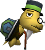</th>
    <th><b>Tortimer</b></th>
    <td>
The mayor of the player's town. Usually in his office in the town hall, he emerges on holidays to usher in special festivities. He's a busy fellow who also serves as the record keeper for fishing and bug-catching tournaments. He cuts a very dashing figure in his hat and bow tie. There may be some link between him and Cornimer, who appears at the fall Acorn Festival.
</td>
  </tr>
  <tr>
    <th></th>
    <th><b>Blathers & Celeste</b></th>
    <td>
Blathers, the elder of this pair, is curator of the town museum, and he's in charge of the insect, art, fish, and fossil displays. He's quite knowledgeable and shares what he knows about donations. He's in charge of donated bugs but hates the majority of them. His younger sis, Celeste, is in charge of the museum's observatory. She's cute even with her feathers ruffled.
</td>
  </tr>
  <tr>
    <th></th>
    <th><b>Pelly & Phyllis</b></th>
    <td>
Sisters who work at the town hall, which is open 24 hours a day. The younger Pelly is at the window from 7 a.m. to 10 p.m., while Phyllis has the night shift. Pelly's cheerful and polite manner makes her the model of good customer service. Phyllis, however, is snooty and treats everyone with impatience and disdain. That said, she's very efficient at her job.
</td>
  </tr>
  <tr>
    <th>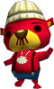</th>
    <th><b>Pascal</b></th>
    <td>
A sea otter in a knit cap. He'll spout philosophy seemingly littered with hidden meanings: "People study what can and can't be done, but I think they're missing the point, maaannn." He comes and goes via the sea, diving in with perfect form. It's really up to you to decide whether Pascal's ramblings are the results of deep thought or too much time spent chatting with scallops.
</td>
  </tr>
  <tr>
    <th></th>
    <th><b>Brewster</b></th>
    <td>
The proprietor of the Roost, a coffee shop in the basement of the museum. He's very closemouthed, preferring to let the coffee he brews speak for itself. The Roost is also visited from time to time by other residents. If you drop by frequently, Brewster will warm up and begin to engage in conversation.
</td>
  </tr>
  <tr>
    <th></th>
    <th><b>Dr. Shrunk</b></th>
    <td>
A traveling therapist and part-time comedian who helps people learn to show their emotions. He'll share jokes from his comedy routine--he's got a million of 'em, folks--as a way to teach people how to display reactions like anger, laughter, and the like.
</td>
  </tr>
<tr>
    <th>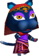</th>
    <th><b>Katrina</b></th>
    <td>
A mystical fortune-teller who sets up shop outside the town hall at dusk. For a fee of 100 bells, she'll use her tarot cards to tell your daily fortune or to check your compatibility. After telling a fortune, she may slip and say, "Sometimes it is just not meant to be," which is considered taboo among fortune-tellers. This surely means that she is hit or miss.
</td>
  </tr>
  <tr>
    <th></th>
    <th><b>Blanca</b></th>
    <td>
A cat whose face is an empty white canvas for you to draw on. After traveling via Nintendo Wi-Fi Connection, she may appear with a face that someone else drew. Draw a new face, and she'll wander for a bit, then take off for a new town. In Animal Crossing, she would appear on the train between towns. Whether you give her a cute or funny face is up to you.
</td>
  </tr>
  <tr>
    <th></th>
    <th><b>Copper & Booker</b></th>
    <td>
The guards stationed at the town gate through which travelers come and go. Copper, who's on the right, is in charge of traveling via Nintendo WFC, and Booker on the left runs the lost and found. Booker's a cute fellow who's known for his indecisive manner...maybe. Copper's diligent, dedicated, and always ready to lend a helping paw.
</td>
  </tr>
  <tr>
    <th>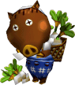</th>
    <th><b>Joan</b></th>
    <td>
Investments in town are made by buying and selling turnips. Joan's an elderly boar who comes to town every Sunday morning to trade in these valuable vegetables. She's easily recognizable by her bandana, work pants, and the basket she carries on her back. Her down-to- earth speech endears her to all her customers. She's been in the turnip business for 60 years.
</td>
  </tr>
  <tr>
    <th>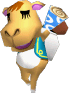</th>
    <th><b>Saharah</b></th>
    <td>
A trader who comes from afar to deliver merchandise. However, since she always forgets to bring a town map, she needs help making her deliveries. Once you've helped her finish all of her tasks, she'll reward you with a gift. Her unique way of phrasing is part of her exotic charm. It is a fine thing, yes?
</td>
  </tr>
  <tr>
    <th></th>
    <th><b>K.K. Slider</b></th>
    <td>
A wandering musician. He plays concerts every Saturday night at the Roost in the basement of the museum. All he carries is a single acoustic guitar, but he can play music from all genres. You can request a single tune per concert, and afterward he'll give you a recording of the song to take home. In Animal Crossing: Wild World, his playlist included 70 songs.
</td>
  </tr>
  <tr>
    <th></th>
    <th><b>Crazy Redd</b></th>
    <td>
The owner and proprietor of Crazy Redd's Emporium, which sells furniture acquired on the black market. It's said he's famous in the underworld. He drops by once a week and sets up his tent in front of the town hall. His shop's full of rare items, but the prices are high. It's open until midnight, an hour longer than Tom Nook's place, which pleases night players.
</td>
  </tr>
  <tr>
    <th></th>
    <th><b>Tommy & Timmy Nook</b></th>
    <td>
When Nookway gets remodeled into Nookington's, these twins make their appearance as second-floor salesmen. Tommy's in charge of greeting customers, while Timmy trails along offering support and echoing his older brother's words. Their earnest dedication coupled with their inherent cuteness makes this diminutive duo quite popular.
</td>
  </tr>
  <tr>
    <th></th>
    <th><b>Katie & Kaitlin</b></th>
    <td>
A mother and child who've gotten separated. After you've gone to visit a friend's town, you'll find either Kaitlin, the mom, or Katie, the wayward kitten, in your town. Both will tell you where they came from, and it's then your duty to travel to that town to reunite the family. Once you do, the player whose town Katie was in will get a letter of thanks and a present.
</td>
  </tr>
  <tr>
    <th>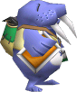</th>
    <th><b>Wendell</b></th>
    <td>
A famous painter who wanders about with a large rucksack on his back. When he arrives in town, he's so hungry he can barely stand. While you think it's probably a good idea to give him something to eat, it's hard to figure out what that should be. That being said, he looks really hungry and would likely devour anything given to him.
</td>
  </tr>
  <tr>
    <th></th>
    <th><b>Kapp'n</b></th>
    <td>
A taxi driver in Animal Crossing: Wild World who drives the player into town for the first time. His questions determine the appearance of the player and sometimes come off as a bit rude. In the original Animal Crossing, you could travel to an island by boat. Kapp'n was the guide who ferried the player to that island and is remembered for his unique speech and salty songs.
</td>
  </tr>
  <tr>
    <th>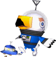</th>
    <th><b>Gulliver</b></th>
    <td>
An astronaut who travels the galaxy in a UFO. Just as he's returning to his hometown, he passes over your village. You can shoot down his UFO with a slingshot. If you do, Gulliver will ask you to recover the parts of his ship that have been scattered about the land.
</td>
  </tr>
  <tr>
    <th></th>
    <th><b>Mr. Resetti (Feet)</b></th>
    <td>
A character who normally appears from underground to lecture the player. However, he is not always underground--in Animal Crossing: Wild World, he can be found sipping coffee at the Roost if you go at a certain time on a certain day. In the Japanese-only "e+" version, he works at a so-called "Resetti Observation Center" where you can pop in for a visit.
</td>
  </tr>
  <tr>
    <th></th>
    <th><b>Pitfall</b></th>
    <td>
A tricky little item you can bury. Any player who passes over it will drop into a hole. If you land in a pitfall, move the Control Stick quickly back and forth to escape, because until you do, you're completely defenseless. In Animal Crossing, this item also dropped passersby into holes. It was a thrill to bury one and wait for a visiting pal to stumble across it.
</td>
  </tr>
  <tr>
    <th></th>
    <th><b>Mr. Resetti</b></th>
    <td>
A mole wearing a hard hat who'll show up when you restart your game without having saved. He pops up and lets you know in no uncertain terms the importance of saving your game. The problem is, his speeches are entertaining enough to warrant breaking the rules at least once. In Animal Crossing, his brother Don appears too. He's the polar opposite of his sibling.
</td>
  </tr>
  </table>



<table class="fixed" border="1">
    <col width="200px" />
    <col width="150px" />
    <col width="800px" />
  <tr>
    <th></th>
    <th><b>Donkey Kong</b></th>
    <td>
A carefree jungle dweller with the charisma of a natural leader. He keeps busy by foiling the plans of the Kremlings and their boss, King K. Rool. As his physique suggests, this ape is a powerhouse. He's got speed to match too, and his love for bananas is second to none. His famous necktie is adorned with his initials, DK.
</td>
  </tr>
  <tr>
    <th></th>
    <th><b>Konga Beat</b></th>
    <td>
DK about to go to town with some bongos! His performance is so magnificent and upbeat that it creates damage-inducing sound waves. Press the buttons in time to the music, and the sound waves may grow stronger. DK's invulnerable when launching this attack, but he's also immobile, so be careful using it on scrolling stages.
</td>
  </tr>
  <tr>
    <th></th>
    <th><b>Diddy Kong</b></th>
    <td>
Donkey Kong's little buddy. He's famous for his quickness and his long tail. He usually plays second banana to DK, but he teamed up with his girlfriend, Dixie, to rescue DK when he got captured. He's spent some time playing music and competing in races, and he's also an expert at using barrels.
</td>
  </tr>
  <tr>
    <th></th>
    <th><b>Rocketbarrel Barrage</b></th>
    <td>
Diddy Kong's Final Smash. Equipping his rocketbarrels and dual peanut popguns, Diddy can fly around attacking opponents in rapid-fire fashion. He can tilt the barrel jets left or right to control his flight and shoot peanuts straight down, too. This is a technique that tests one's ability to control both movement and attack direction.
</td>
  </tr>
  <tr>
    <th>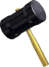</th>
    <th><b>Hammer</b></th>
    <td>
An item that, once grabbed, makes you swing nonstop. It's a powerful attack item that does terrific damage and sends opponents sailing. Once in a great while, the hammer's head will fall off, leaving you nothing but the handle. Of course, you can't tell whether the head is securely fastened just by looking. Hammerheads that fall off can be picked up and thrown as weapons.
</td>
  </tr>
  <tr>
    <th>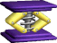</th>
    <th><b>Spring</b></th>
    <td>
An item used to assist jumping. Jump on it, and it will send you bounding sky-high. You can also toss enemies onto it. It originally appeared in the second stage of Donkey Kong Jr., where it was used as a shortcut to leap to a distant platform. It resembles the bouncing projectiles that appeared in Donkey Kong, but those are said to be actually jacks, not springs.
</td>
  </tr>

  <tr>
    <th></th>
    <th><b>Dixie Kong</b></th>
    <td>
Diddy Kong's cutie of a girlfriend with an adorable blond ponytail. That ponytail is hardly for show--it helps propel her through the air for extended hang time and is indispensable for spin-attacking enemies and lifting barrels. Watch out--Dixie packs more power than you might imagine!
</td>
  </tr>

  <tr>
    <th></th>
    <th><b>Funky Kong</b></th>
    <td>
A sunglassed surfer and friend of the Kongs. Funky Kong is indeed funky, from his looks to his lingo. Funky provides different services to the Kong throughout the different games, be it a barrel-transport system or ammunations expertise. He may have tired of business dealings, as he's been a barrel-race participant more recently.
</td>
  </tr>

  <tr>
    <th></th>
    <th><b>Candy Kong</b></th>
    <td>
Donkey Kong's rumored girlfriend--although nobody is quite sure if the rumor is true. With Candy's looks and elegance, she would be quite the catch. There's a mode in Donkey Kong: Barrel Blast where Donkey Kong must compete according to Candy's requests. Candy is also known to have run a music shop.
</td>
  </tr>

  <tr>
    <th></th>
    <th><b>Lanky Kong</b></th>
    <td>
One of the more eccentric Kong friends. He's probably the most laid back of the Kongs and has many comical expressions and mannerisms. He uses his long arms to take out baddies and can walk on his hands to climb steep slopes. Sweet! In the recent game Donkey Kong: Barrel Blast, Lanky appears for the first time in years.
</td>
  </tr>

  <tr>
    <th></th>
    <th><b>Wrinkly Kong</b></th>
    <td>
The wife of Cranky Kong. Wrinkly first appeared as director of Kong Kollege, where she provided game hints. Did you know King K. Rool was also a student of hers? After her passing, she appeared in Donkey Kong 64 as a ghost, where again... she provided hints.
</td>
  </tr>

  <tr>
    <th></th>
    <th><b>Rambi</b></th>
    <td>
A rhino friend who appears to help the Kongs in their adventures... from a wooden box, even! His destructive power lets his rider plow through enemies and super-dash to break through walls and other obstacles. Know what that means? It means uncovering more hidden bananas and life balloons!
</td>
  </tr>

  <tr>
    <th>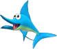</th>
    <th><b>Enguarde</b></th>
    <td>
A swordfish animal buddy. Enguarde always appears on water levels where he can loyally help Donkey Kong get around. Much appreciated, right, DK? Complementing his cute, round eyes, Enguarde's pointed bill proves to be a powerful weapon. One thrust from it will easily down most underwater opponents.
</td>
  </tr>

  <tr>
    <th>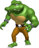</th>
    <th><b>Kritter</b></th>
    <td>
A member of the Kremlings. Led by King K. Rool, Kritters are the grunts of the army. They appear frequently in Donkey Kong Country in green, purple, blue, and other color variations--the blue ones will jump after Donkey Kong. Kritters also appear in Donkey Kong: Barrel Blast, pounding those barrels in pursuit of Donkey Kong.
</td>
  </tr>

  <tr>
    <th></th>
    <th><b>Tiny Kong</b></th>
    <td>
A cute, young Kong in pigtails, a knit cap, and jumbo earrings. In Donkey Kong 64, she could extend her airtime after jumps and fly through the air with helicopter hair. Also a participant in Barrel Blast, her high speed is on full display.
</td>
  </tr>

  <tr>
    <th></th>
    <th><b>Cranky Kong</b></th>
    <td>
A village chief and bitter old codger. Cranky uses his extensive knowledge and wisdom to provide helpful hints. He has also made appearances in a white lab coat as a potion-dealing chemist, granting the Kongs special abilities. Donkey Kong: Barrel Blast features Cranky as a playable character for the first time.
</td>
  </tr>
  <tr>
    <th>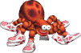</th>
    <th><b>Squitter</b></th>
    <td>
A spider friend of the Kongs. Squitter features a patchy pattern and a fancy sneaker on each foot. With Diddy on board, Squitter will assist by spewing out webs that serve as projectile weapons or temporary platforms. These platforms can be used to access otherwise unreachable areas.
</td>
  </tr>
  <tr>
    <th>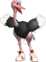</th>
    <th><b>Expresso</b></th>
    <td>
An ostrich friend with sneakers on both feet. Riding Expresso allows for high-speed dashing. As an ostrich, Expresso can't fly, but rapid button pressing can put extra distance on his jumps. This can be used to help Donkey Kong reach distant places.
</td>
  </tr>
  <tr>
    <th></th>
    <th><b>King K. Rool</b></th>
    <td>
The supreme commander of the Kremling Krew. King K. Rool steals bananas from Donkey Kong and ends up kidnapping Diddy Kong. He is so good at playing dead that sometimes the credits even roll as he lies there, feigning defeat. His brother, Kaptain K. Rool, made an appearance in the game Donkey Kong Country 2: Diddy's Kong Quest.
</td>
  </tr>
  <tr>
    <th></th>
    <th><b>Kass</b></th>
    <td>
A precocious Kremling child. Kass is an ever-so-slightly malicious girl who wants to grow up ever so much. Her trademark look is a camisole and jumbo ribbon. She exhibits top-of-the-line cornering and acceleration but has close to the lowest top speed of all the characters in Donkey Kong: Barrel Blast. She attacks with spin moves.
</td>
  </tr>
  <tr>
    <th>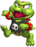</th>
    <th><b>Kip</b></th>
    <td>
The little brat of the Kremlings and a naughty trickster. Kip is quick and corners as well as anyone, but his top speed is quite low. He sports a tough look with his black T-shirt and spiked wristbands--just the look he needs to prove he's one bad little dude. His attack is a double-legged kick.
</td>
  </tr>
  <tr>
    <th>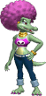</th>
    <th><b>Kalypso</b></th>
    <td>
A cool beauty with chic makeup and groovy hair. Kalypso combines enough acceleration to break free from the pack with a respectable top speed. Her cornering is a bit weak, but good players should be able to overcome this. Her claw attack will get you...if her high-pitched laugh doesn't.
</td>
  </tr>
  <tr>
    <th>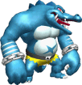</th>
    <th><b>Kludge</b></th>
    <td>
A member of the Kremling Krew making his first appearance in Donkey Kong: Barrel Blast. His less-than-average acceleration and weak cornering are offset by an impressive top speed. Kludge's relation to the physically fit blue Krunchas and Krumples of the Kremling forces is still unknown.
</td>
  </tr>
  <tr>
    <th></th>
    <th><b>Helibird</b></th>
    <td>
A bird that helps Donkey Kong by carrying him with its feet and flying up to higher areas. These beautiful birds feature big, decorated wings and unique coloring. A certain Strawberry Kingdom is home to a Helibird nest populated only by Helibirds.
</td>
  </tr>
  <tr>
    <th></th>
    <th><b>Turret Tusk</b></th>
    <td>
A boss enshrined upon a cliff in the Apple Kingdom. This creature gathers its breath and launches bombs from its nose. The trick is to throw pineapple-shaped bombs into its nose when it's inhaling to blow it up from the inside. For all its austerity, the Turret Tusk is actually quite stupid.
</td>
  </tr>
  <tr>
    <th></th>
    <th><b>Xananab</b></th>
    <td>
A banana alien that shows up as Donkey Kong and company are enjoying a relaxing vacation on the beach. Traveling by spaceship from their banana planet, they mistake the Kongs for enemies and attack. As such, the Kongs retaliate by destroying their ship. To top it off, their superpowerful crystal banana is stolen by the Kremlings.
</td>
  </tr>
  <tr>
    <th></th>
    <th><b>Peanut Popgun</b></th>
    <td>
A unique firearm that only Diddy Kong can use. It's made of a chunk of wood and shoots peanuts. In Donkey Kong 64, he carried two pistols and could fire two shots at a time. In Smash Bros., the peanut ammo bursts out of its shells when fired. The peanuts can be grabbed and eaten to reduce damage. The longer the gun is charged before firing, the faster the peanuts fly.
</td>
  </tr>
  <tr>
    <th></th>
    <th><b>Rocketbarrel Pack</b></th>
    <td>
An item that looks like regular barrels but becomes a rocket-powered jet pack when Diddy Kong straps them on his back. It's a convenient gadget to have when adventuring, but for whatever reason, Diddy also uses it when playing tennis and basketball. The moves he can pull off with the rocketbarrel pack are so cool that they're almost not fair. Almost.
</td>
  </tr>
</table>



<table class="fixed" border="1">
    <col width="200px" />
    <col width="150px" />
    <col width="800px" />
  <tr>
    <th>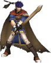</th>
    <th><b>Ike</b></th>
    <td>
A member of Crimea's top fighting force, the Greil Mercenaries. He's a man of few words whose blunt manner gives the impression that he's uncaring, but he's actually a passionate hero. He was crucial to the reconstruction of Crimea. In Radiant Dawn, he continues to show his deep sense of honor and leads the Greil Mercenaries to the aid of the Laguz Alliance.
</td>
  </tr>
  <tr>
    <th></th>
    <th><b>Great Aether</b></th>
    <td>
Ike's Final Smash—a powered-up version of his signature move, Aether. Ike faces a foe and swings his sword up for a hit, then tosses his sword into the air, performs multiple nasty strikes, and finally unleashes a mighty overhand blow to send his opponent plummeting down. It's a very impressive sight, but if Ike misses with the first upward swing, he can't use the move.
</td>
  </tr>
  <tr>
    <th>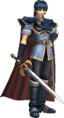</th>
    <th><b>Marth</b></th>
    <td>
The prince of Altea, in whose veins the blood of heroes runs. He and a small group of stalwarts fought to free Altea after it was invaded by the kingdom of Doluna and the dark dragon, Medeus. With his divine sword, Falchion, he fought and defeated Medeus. However, Altea was then invaded by King Hardin of Akaneia and eventually destroyed.
</td>
  </tr>
  <tr>
    <th></th>
    <th><b>Critical Hit</b></th>
    <td>
Marth's Final Smash. He thrusts his sword skyward, then rushes to meet his targeted enemy with furious speed. The blow he strikes is so powerful that his foe is instantly launched off the screen. As in Fire Emblem, a window appears that shows the character's hit points dropping rapidly to zero—but this is just for effect. Smash Bros. does not use a hit-point system.
</td>
  </tr>
  <tr>
    <th>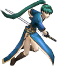</th>
    <th><b>Lyn</b></th>
    <td>
A 15-year-old nomadic girl. Lyn is a strong-willed youth whose skill with the blade draws many admirers. Lyn sets out on her quest to become a master swordsman after coming to the aid of a fallen traveler. She soon learns she's a living member of the nobility of Lycia, a neighboring country. Soon she's involved in a violent dispute over the ascension of the Caelin throne.
</td>
  </tr>
  <tr>
    <th>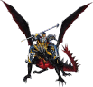</th>
    <th><b>Ashnard</b></th>
    <td>
The 13th king of Daein, feared across the land as the "Mad King." He ignited a continent-wide war after attacking the neighboring kingdom of Crimea. Aiming to free the dark goddess locked inside Lehran's Medallion, he is stopped and defeated by Crimean forces. Ashnard's armor is blessed by the goddess, like the Black Knight's, and he uses the sword Gurugant.
</td>
  </tr>
  <tr>
    <th>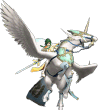</th>
    <th><b>Elincia</b></th>
    <td>
The queen of Crimea, a kingdom ruled by the wise beorc race. With deep pride and consideration for her people, Elincia rules justly, having taken the crown three years prior after winning the war against Daein. However, there are rumblings of discontent among Crimean nobles that threaten her kingdom. Elincia wields the mighty sword Amiti, passed down by Crimean royalty.
</td>
  </tr>
  <tr>
    <th></th>
    <th><b>Black Knight</b></th>
    <td>
One of Daein's Four Riders and wielder of the blessed sword Ettard. Once an apprentice to Ike's father, Greil, the two eventually duel, resulting in Greil's defeat. Thought to be dead after losing to Ike and the blessed sword Ragnell, the Black Knight survives and comes to the aid of Micaiah, the leader of the Dawn Brigade, a band of Daein freedom fighters.
</td>
  </tr>
  <tr>
    <th>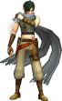</th>
    <th><b>Sothe</b></th>
    <td>
A skilled swordsman, thief, and member of the Dawn Brigade, a band of freedom fighters operating out of the old Daein capital, Nevassa. Although not related to Micaiah, the light-magic-dealing leader of the Dawn Brigade, he was raised like a brother and considers her safety his top priority. He grows from boy to young man between "Path of Radiance" and "Radiant Dawn."
</td>
  </tr>
</table>



<table class="fixed" border="1">
    <col width="200px" />
    <col width="150px" />
    <col width="800px" />
  <tr>
    <th></th>
    <th><b>Captain Falcon</b></th>
    <td>
A skilled F-Zero pilot and resourceful bounty hunter. All that's known of his past is that he hails from Port Town. He's won fame and fortune outracing his opponents in his beloved Blue Falcon. His incredible athleticism and never-say-die attitude makes him the pilot to turn to in times of trouble.
</td>
  </tr>
 <tr>
    <th></th>
    <th><b>Blue Falcon</b></th>
    <td>
Captain Falcon's Final Smash. His beloved ship, the Blue Falcon, roars onto the screen once he touches a foe in front of him. The enemy gets sent to a racetrack, at which point the Blue Falcon screams down at a ridiculous speed and launches the unlucky victim. What track is it? Where did the machine come from? This is one technique that's an utter mystery.
</td>
  </tr>
  <tr>
    <th></th>
    <th><b>Samurai Goroh</b></th>
    <td>
A man who presents himself as a bounty hunter much like Captain Falcon but is also the boss of a notorious bandit group. He tries to collect criminal bounties but always fails to beat Captain Falcon to the collar. He considers himself Falcon's archrival and always tries to beat him in F-Zero races. His machine, the Fire Stingray (#05), has a high top speed.
</td>
  </tr>
  <tr>
    <th></th>
    <th><b>Dr. Stewart</b></th>
    <td>
A charismatic former surgeon of a legendary statue, Dr. Stewart joined the F-Zero circuit after the death of his father. He once put his medical skills to use as a paramedic following an accident during a race. The Golden Fox (#03), passed down by his father, features excellent acceleration but awful grip, perfect for drift racing.
</td>
  </tr>
  <tr>
    <th>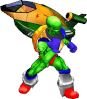</th>
    <th><b>Pico</b></th>
    <td>
A war veteran who used to belong to a special-forces unit of the Poripoto army. He runs a small shop, but there's a rumor that he works behind the scenes as an effective assassin. His aggressive personality is also reflected in competition as a reckless pilot. The durable nature of his machine, the Wild Goose (#06), supports this destructive racing style.
</td>
  </tr>
  <tr>
    <th></th>
    <th><b>Jody Summer</b></th>
    <td>
A racer affiliated with the Galactic Space Federation. Jody Summer was highly regarded for her skills and chosen as the Federation race representative for entry into F-Zero. Although unable to secure victory in F-Zero X, Jody was chosen as Miss Galactic Space Federation. Her machine, the White Cat (#02), excels in grip strength and handling.
</td>
  </tr>
 <tr>
    <th></th>
    <th><b>Mr. EAD</b></th>
    <td>
An android created by the shrouded development group EAD. Mr. EAD entered the Grand Prix for testing in IQ and AI programming. Mr. EAD pilots the Great Star (#09), which is much weaker than its tough exterior might suggest. With weaknesses in most fundamental areas, the Great Star has a high learning curve and will reap rewards for only the best pilots.
</td>
  </tr>
  <tr>
    <th></th>
    <th><b>The Skull</b></th>
    <td>
A legendary pilot who holds numerous records in the F-Max Grand Prix, which predates F-Zero by some 200 years. Through the powers of science and black magic, he returned to compete again in F-Zero X. With a high top speed and decent boost power, The Skull's machine, the Sonic Phantom (#16), should satisfy the needs of speed demons.
</td>
  </tr>
  <tr>
    <th></th>
    <th><b>Blood Falcon</b></th>
    <td>
A clone created with the DNA stolen from Captain Falcon after his post-accident hospitalization. He abides strictly by the orders of Black Shadow, who fully supports his criminal activities. Blood Falcon pilots the Blood Hawk, which happens to be nearly identical in its performance traits to Captain Falcon's Blue Falcon (#25).
</td>
  </tr>
  <tr>
    <th></th>
    <th><b>Black Shadow</b></th>
    <td>
The undisputed lord of evil, feared by all. By capturing many of Black Shadow's underlings, Captain Falcon thwarted many of Shadow's plans, causing the cruel racer to enter the F-Zero Grand Prix solely to eliminate his antagonist. Shadow's machine, the Black Bull (#30), is a heavier vehicle that lags in acceleration but excels in body strength and speed.
</td>
  </tr>
  <tr>
    <th>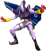</th>
    <th><b>Zoda</b></th>
    <td>
A racer shrouded in mystery. This master of sinister plots has long battled with the just and good Super Arrow. With a big bounty on his head, he was once nearly captured by Captain Falcon. His machine, the Death Anchor (#13), excels in top speed and cornering and features high boost power to boot.
</td>
  </tr>
 <tr>
    <th></th>
    <th><b>Falcon Flyer</b></th>
    <td>
Captain Falcon's speedy, midsized galactic cruiser, equipped with an onboard computer. Captain Falcon uses the Falcon Flyer mainly to track down criminals when he's plying his trade as a bounty hunter. Of course, it also comes in handy for transporting and maintaining the Blue Falcon. The Falcon Flyer is an exceedingly reliable partner.
</td>
  </tr>
</table>



<table class="fixed" border="1">
    <col width="200px" />
    <col width="150px" />
    <col width="800px" />
<tr>
    <th></th>
    <th><b>Mr. Game & Watch</b></th>
    <td>
The monochrome hero of the Game & Watch series, a fellow who oozes personality. First appearing in 1980, the series were the original portable game systems. The first games in the series were quite simple, but as time passed, technology evolved. The multiscreen series featured game play on dual screens. As the name states, the games also kept time.
</td>
  </tr>
  <tr>
    <th>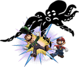</th>
    <th><b>Octopus</b></th>
    <td>
Mr. Game & Watch's Final Smash. He turns into the huge cephalopod that made its debut in the Game & Watch game Octopus. Of course, you can damage enemies by running into them, but you can do more damage by pressing the attack button to extend four arms and launch foes. In the original Octopus game, you had to avoid the octopus while salvaging treasure from the sea.
</td>
  </tr>
</table>



<table class="fixed" border="1">
    <col width="200px" />
    <col width="150px" />
    <col width="800px" />

  <tr>
    <th></th>
    <th><b>Ice Climbers</b></th>
    <td>
The one in blue is Popo, and the one in pink is Nana. They use their incredible jumping powers and hammers to break blocks and climb to the summit. They grab veggies, and if they can catch the condor at the end, they conquer the mountain. Other than breaking blocks, their hammers are good for sending foes flying, climbing down from blocks, and destroying icicles.
</td>
  </tr>
  <tr>
    <th>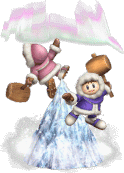</th>
    <th><b>Iceberg</b></th>
    <td>
The Ice Climbers' Final Smash. This giant ice mountain appears in the middle of a stage--it's incredibly slippery, so it's hard to control yourself when traversing it. In addition to being slick, this ice is also COLD, so opponents will take damage just from touching it. Attack the ice, and it will take damage and slowly shrink. Is it actually useful? That's a mystery.
</td>
  </tr>
  <tr>
    <th>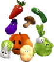</th>
    <th><b>Vegatables</b></th>
    <td>
The Ice Climbers' goal is to climb peaks. Just below each peak is a bonus stage where these bonus items appear in this order: eggplant, carrot, cabbage, cucumber, corn, turnip, pumpkin, Chinese cabbage, potato, and mushroom. You'll also get points for grabbing the condor at the peak after collecting the veggies. Why vegetables? That's a mystery for the ages.
</td>
  </tr>

</table>



<table class="fixed" border="1">
    <col width="200px" />
    <col width="150px" />
    <col width="800px" />

  <tr>
    <th>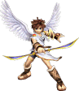</th>
    <th><b>Pit</b></th>
    <td>
The captain of the royal bodyguards of Palutena, goddess of light and ruler of Angel Land. The dark goddess, Medusa, conquered the underworld, the surface world, and the heavens, and imprisoned Palutena. Pit escaped and, armed with Palutena's magical bow, set out to free her. Along the way, he gathered Three Sacred Treasures with which he challenged Medusa.
</td>
  </tr>
  <tr>
    <th></th>
    <th><b>Palutena's Army</b></th>
    <td>
Pit's Final Smash. An image of the goddess Palutena appears, heralding the arrival of Palutenas's Army's legions, the Centurions. These flying warriors proceed to attack all enemies with fierce savagery. Once a Centurion strikes an enemy, he falls from the sky, never to fly again. Centurions are so fast that dodging them is very hard. Take heart, Centurions! Your deaths are not in vain!
</td>
  </tr>
  <tr>
    <th>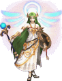</th>
    <th><b>Palutena</b></th>
    <td>
The ruling goddess of Angel Land. Palutena showered the earth with rays of light, using her powers for the good of mankind. But Medusa, who in her hate for mankind was banished to the underworld, makes war on Palutena and wins, capturing and holding the goddess deep within a temple. Palutena entrusts Pit with a sacred bow and the task of defeating Medusa.
</td>
  </tr>
  <tr>
    <th></th>
    <th><b>Palutena's Bow</b></th>
    <td>
The bow Pit got from Palutena after the Medusa incident. As a standard bow, it's capable of firing arrows of light that can change direction. It can also be split to form two short swords--Pit holds one sword in his right hand in a standard grip and one in his left in a reverse grip. He may hold them like this so he can shift between bow and swords without losing a beat.
</td>
  </tr>
</table>



<table class="fixed" border="1">
    <col width="200px" />
    <col width="150px" />
    <col width="800px" />

  <tr>
    <th>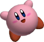</th>
    <th><b>Kirby</b></th>
    <td>
A round, pink ball of cuteness from a distant, peaceful star. He can swallow anything with his gigantic mouth, then spit it out as ammo. He has the handy ability to copy powers and use them as his own. His hovering ability lets him fly through the air with ease. He's so round, he's sometimes treated like a ball.
</td>
  </tr>
  <tr>
    <th></th>
    <th><b>Cook Kirby</b></th>
    <td>
Kirby in chef's garb. When Kirby throws on his chef's hat, a giant pot appears in the center of the screen. Characters, items, and even long-distance weapons are sucked into the pot. Once they've simmered a bit, food items equal to the number of things in the pot appear. Characters in the mix get blasted straight up out of the pot.
</td>
  </tr>
  <tr>
    <th></th>
    <th><b>Meta Knight</b></th>
    <td>
The head of the Meta-Knights, and something of a rival to Kirby. He's quite an accomplished swordsman. Following his code of knightly ethics, he once delivered a sword to Kirby and demanded single combat. His giant cape transforms into wings, giving him the power of flight. He's shown his face briefly before, but his relationship to Kirby is still a mystery.
</td>
  </tr>
  <tr>
    <th></th>
    <th><b>Galaxia Darkness</b></th>
    <td>
Meta Knight's Final Smash. He flips his cape, and the darkness within envelops his foes and plunges the world into shadow. He then unleashes a series of sword strikes that do terrible damage and launch his foes. In the darkness, Meta Knight can also reach and attack distant enemies. One can imagine Meta Knight zipping back and forth at high speed to accomplish this.
</td>
  </tr>
  <tr>
    <th></th>
    <th><b>King Dedede</b></th>
    <td>
The self-styled king of the amazingly peaceful Dream Land. He continually does things unbecoming a king, like stealing the kingdom's food supplies or all the stars from the sky. He's not all bad, though, and sometimes performs good deeds. While he and Kirby often battle, they've been known to compete good-naturedly at speed-eating contests and minigames.
</td>
  </tr>
  <tr>
    <th></th>
    <th><b>Waddle Dee Army</b></th>
    <td>
King Dedede's Final Smash. He whistles, and an army of Gordos, Waddle Dees, and Waddle Doos rain down and rampage, pummeling all in their way. After a bit, they'll pack it in and hit the road. Any left can be forcibly removed. They are fast and numerous, which makes it difficult to get through their ranks without taking any damage.
</td>
  </tr>
  <tr>
    <th></th>
    <th><b>Maxim Tomato</b></th>
    <td>
A juicy tomato that heals 50 percentage points of the damage you've accumulated. When one of these appears in combat, rest assured there will be a race to see who can reach it first. It's a race of desperation between players who want to heal their damage and those who want to stop them from doing so. In the Kirby series, Maxim Tomatoes healed all damage.
</td>
  </tr>
  <tr>
    <th>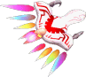</th>
    <th><b>Dragoon</b></th>
    <td>
An attack-capable Air Ride machine you can assemble by combining parts A, B, and C. You can knock off parts held by foes in combat, so stealing parts is something that's sure to occur. In Kirby Air Ride, you control legendary machines, but the Dragoon not only towers above all others in terms of speed, it is also able to fly.
</td>
  </tr>
  <tr>
    <th></th>
    <th><b>Warp Star</b></th>
    <td>
A warp-speed item. In the Kirby series, Warpstars are used to move between stages. In Smash Bros., they're ultrafast attack items that zoom up and down to devastate anyone they hit. You can shift your landing spot by moving the Control Stick left or right during your descent. Choose your target and hang on! Don't overshoot the mark and plummet off the stage, though.
</td>
  </tr>
  <tr>
    <th></th>
    <th><b>Superspicy Curry</b></th>
    <td>
The spiciest curry around. Eat it, and you'll be able to attack by spitting out fireballs. The eater of the curry will soon be unable to handle the heat, however, and end up frantically dashing about the screen. This is a pretty funny sight that never gets old, especially when it's Samus or Snake. Eat this mouth-scorching dish if you dare.
</td>
  </tr>
  <tr>
    <th></th>
    <th><b>Star Rod</b></th>
    <td>
A magic wand. Perform a standard attack with it, and it's a battering weapon. Perform a strong or smash attack, and it fires a barrage of star shots. Throw it at a foe, and that opponent will get sent flying sideways. In the Kirby series, the Star Rod is the power source of the Fountain of Dreams. King Dedede once stole it to imprison the Nightmare Wizard.
</td>
  </tr>
  <tr>
    <th></th>
    <th><b>Knuckle Joe</b></th>
    <td>
A martial artist known for amazing attacks like the Vulcan Jab. With his bandana, he looks and fights the part of a Muay Thai boxer. When Kirby copies Knuckle Joe, he gains the fighting techniques of a hand-to-hand-combat expert. Knuckle Joe also engages in friendly block-breaking competitions with Kirby. His other famous techniques are the Smash Punch and Rising Break.
</td>
  </tr>
  <tr>
    <th></th>
    <th><b>Beam Kirby</b></th>
    <td>
Kirby in a jester cap...and a supercute Kirby at that. Beam Kirby features a Beam ability, acquired by inhaling Waddle Doo, that allows him to shoot a whiplike beam at his enemies. With a wide attack range, this ability is extremely easy to use, especially for taking out enemies in bunches. In Kirby Super Star, this beam can also be charged and fired.
</td>
  </tr>
  <tr>
    <th></th>
    <th><b>Needle Kirby</b></th>
    <td>
A Kirby ability made when Kirby inhales a spiked enemy. When attacking, the needles on Needle Kirby 's body extend, giving him a porcupine-like look. This ability provides both offensive and defensive measures against nearby enemies. Plus, needles which extend on Kirby's underside when jumping eliminate any threats on landing.
</td>
  </tr>
  <tr>
    <th></th>
    <th><b>Sword Kirby</b></th>
    <td>
A Kirby ability made when Kirby inhales a sword-wielding foe or a sword itself. Doing so provides Kirby with a rapid sword slash, a jumping sword spin, or even the energy-beam blast of the Final Sword. It wouldn't be a stretch to say that this is the #1 Copy Ability in terms of accessibility.
</td>
  </tr>
  <tr>
    <th></th>
    <th><b>Sleep Kirby</b></th>
    <td>
Kirby after he copies the ability to sleep peacefully. Kirby takes on this form when he inhales Noddy or other such enemies. Kirby cannot move at all while sleeping, so extra care should be taken not to use this ability when enemies are near. Kirby, in his slumber, tends to drool, and in his panicked awakening, isn't it cute how he forgets to wipe off the drool?
</td>
  </tr>
  <tr>
    <th></th>
    <th><b>Wing Kirby</b></th>
    <td>
Kirby when he inhales a winged enemy and copies its flying ability. This ability can be used to proceed through strong winds that would otherwise be too tough to overcome. Wing Kirby can also perform a plethora of attack moves, such as the Bomber Head, where Kirby dive-bombs onto enemy heads.
</td>
  </tr>
  <tr>
    <th></th>
    <th><b>Fighter Kirby</b></th>
    <td>
Kirby when he is skilled in martial arts, especially close-quarters combat. Inhaling brawny challengers like Knuckle Joe will transform Kirby, allowing him to use a bunch of fight moves like Rising Break, the heroic uppercut. His Mega Power Shot in Kirby & The Amazing Mirror, which used charged energy to take out faraway enemies, is another Fighter Kirby highlight.
</td>
  </tr>
  <tr>
    <th></th>
    <th><b>Fire Kirby</b></th>
    <td>
Kirby when he inhales an enemy who uses fire. Shooting fire from his mouth, Fire Kirby can cook enemies from afar. This ability also allows Kirby to light explosive blocks, fuses, and so on. In Kirby Super Star and Kirby & The Amazing Mirror, Fire Kirby can roll his burning body into enemies as an attack move.
</td>
  </tr>
  <tr>
    <th></th>
    <th><b>Ice Kirby</b></th>
    <td>
Kirby when he copies an enemy with chilly abilities. Ice Kirby can blow an icy wind from his mouth and freeze enemies solid. These frozen enemies can then be knocked into other enemies as an additional means of attack. These blocks are not only effective against enemies but can also be used on terrain such as magma or water.
</td>
  </tr>
  <tr>
    <th></th>
    <th><b>Plasma Kirby</b></th>
    <td>
Kirby when he inhales Plasma Wisps, which glow with a neon green flame. Plasma Kirby can charge the plasma strength up to a maximum level of 5. In Kirby Super Star, your attack--be it a Plasma Laser or a Plasma Wave Cannon--varies with the length of time you charge it.
</td>
  </tr>
  <tr>
    <th></th>
    <th><b>Tonado Kirby</b></th>
    <td>
Kirby when he inhales enemies that fly around like twisters through the sky. When in tornado form, Kirby can spin freely through the air for short amounts of time, clearing out groups of enemies. Tornado Kirby will continue spinning and bouncing violently off of obstacles until he comes to a stop. One drawback of Tornado Kirby is the control difficulty.
</td>
  </tr>
  <tr>
    <th></th>
    <th><b>Waddle Dee</b></th>
    <td>
A carefree creature that wanders the hills and dales of Dream Land. Basically harmless to creatures great and small, Waddle Dees sometimes use parasols to float down through the skies. If Kirby swallows a parasol, he'll get one he can use to float or ward off enemy attacks. On the other hand, Kirby can't copy anything by swallowing Waddle Dees themselves.
</td>
  </tr>
  <tr>
    <th></th>
    <th><b>Waddle Doo</b></th>
    <td>
A creature identified by a single, unblinking eye. Like Waddle Dees, Waddle Doos roam about Dream Land and sometimes use parasols. Unlike their counterparts, though, they hate being approached--they'll fire a beam of energy at anyone who nears them, so don't think they're harmless like Waddle Dees. If Kirby swallows one, he copies the Beam ability and gains a jester's hat.
</td>
  </tr>
  <tr>
    <th>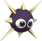</th>
    <th><b>Gordo</b></th>
    <td>
A creature that sits in one place and doesn't even try to move. They won't even even budge if Kirby tries to inhale them--they're the definitive obstacle. In addition, they're covered in spikes, so they damage whoever touches them. They're found stopped in groups, blocking narrow passageways, etc. Nothing's harder to get by than an encampment of Gordos.
</td>
  </tr>
  <tr>
    <th></th>
    <th><b>Dyna Blade</b></th>
    <td>
A monstrous bird with white- and rainbow-colored bladed wings and huge talons. Challengers who face Dyna Blade are forced to contend with her speed and armor plating that can reflect any attack. The only weak point is her head. In Kirby Super Star, she's destroying Dream Land's crops, but there's apparently a perfectly good reason for this.
</td>
  </tr>
  <tr>
    <th></th>
    <th><b>Blade Knight</b></th>
    <td>
A sword wielder covered head to toe in armor. Kirby can copy his Sword ability by inhaling him. Blade Knight has a variety of sword techniques, including chops and 100-slash combo attacks. As a helper, you can take him with you, and he will assist by taking out enemies with sword attacks. He's about as strong as Sword Knight.
</td>
  </tr>
  <tr>
    <th>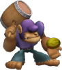</th>
    <th><b>Bonkers</b></th>
    <td>
A large enemy who wields a giant hammer as a weapon. Bonkers battles you with several moves -- his hammer attack and coconut throw could be considered his specialities. Kirby can inhale Bonkers to learn Hammer and Smash techniques. Not many know this, but Hammer Kirby can also break walls and pound down stakes.
</td>
  </tr>
  <tr>
    <th></th>
    <th><b>Bronto Burt</b></th>
    <td>
A bird that looks a lot like Kirby. Bronto Burt has clear wings that he uses to busily flutter around the skies of Dream Land. He will pull off sudden dive bombs on occasion, and although he has no ill will toward Kirby, Bronto Burt will sometimes collide with the pink hero if he gets in the way. You should be especially careful of these collisions.
</td>
  </tr>
  <tr>
    <th>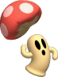</th>
    <th><b>Cappy</b></th>
    <td>
A creature that looks like a walking mushroom at first glance. Inhaling him will strip off only his cap, revealing his true identity. Cappy tends to run around wildly, flailing his arms... and then gently eases back into a relaxed strut as if nothing ever happened.
</td>
  </tr>
  <tr>
    <th>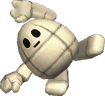</th>
    <th><b>Golem</b></th>
    <td>
One of many statues found in Mirror Country, far up in the skies of Dream Land. Typically inert, Golems will only move to attack if Kirby draws near. Other Golems protect treasure chests, and some get shot from the mouth of the King Golem. Kirby can inhale Golems with a super inhale to copy the Stone ability.
</td>
  </tr>
  <tr>
    <th>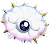</th>
    <th><b>Kracko</b></th>
    <td>
A well-known boss from the Kirby series. Kracko is a cloud with a big eye and numerous spikes. He threatens Kirby with a number of weapons, including beam and rain attacks. In Kirby Super Star, Kracko first appears as Kracko Jr., continuing his onslaught on Kirby as he grows in size.
</td>
  </tr>
  <tr>
    <th>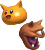</th>
    <th><b>Scarfies</b></th>
    <td>
Creatures with cute, catlike faces that float through the sky in a playful, gentle manner. Try to inhale them, however, and Scarfies take to the offensive in a new, scary form. They can't be inhaled and eventually explode on their own. This is one enemy that you should probably attack as little as possible. That's right -- let sleeping Scarfies lie.
</td>
  </tr>
  <tr>
    <th></th>
    <th><b>Sir Kibble</b></th>
    <td>
An armor-clad foe. Sir Kibble grips the blade on his head between his hands before launching it at Kirby. By inhaling Sir Kibble, Kirby can copy his Cutter ability to throw boomerang-like blades. At close range, Sir Kibble can use his cutter like a sword for a direct attack.
</td>
  </tr>
  <tr>
    <th>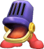</th>
    <th><b>Walky</b></th>
    <td>
A microphone who trudges along and enjoys himself as he sings. By inhaling Walky, Kirby gains the ability to shout, allowing him to clear all enemies off the screen with a high-volume blast. This is a powerful ability that can only be used up to three times. In Kirby Air Ride, this ability sends every racer within range into a spin.
</td>
  </tr>
  <tr>
    <th></th>
    <th><b>Wheelie</b></th>
    <td>
A real speed demon. Once Wheelie gets going, he can't be stopped. Wheelies are sometimes known to run in packs too. Kirby can copy the Wheel ability, turn into a tire, and run over enemies. The momentum will keep him rolling until he runs into an obstacle such as a wall.
</td>
  </tr>
  <tr>
    <th>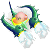</th>
    <th><b>Hydra</b></th>
    <td>
One of only two legendary Air Ride machines. Known also as the King of Destruction, the Hydra was born to battle. Collecting its three parts on City Trial will reveal its fiendish side. With high offensive and defensive levels, the Hydra can easily blast through rivals and obstacles, leaving a swath of ruin. This is the ultimate Air Ride machine for attacking the course.
</td>
  </tr>
  <tr>
    <th>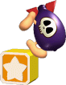</th>
    <th><b>Bomber</b></th>
    <td>
One dangerous dude -- as evidenced by the skull drawn on his body. Bomber walks around on two legs, but whenever he falls from stairs or other high places, he hits his head and explodes, covering a significant blast radius. Kirby can suck him up to learn the Crash ability, the ultimate weapon for wiping out every last enemy on the screen. Use it once and it's gone!
</td>
  </tr>
  <tr>
    <th>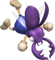</th>
    <th><b>Bugzzy</b></th>
    <td>
One of Kirby's foes. Those unlucky enough to get too close will get body-slammed with Bugzzy's vicious pincers. He also releases smaller bugs. Kirby can copy the ability to body-slam by inhaling him. In Kirby Super Star, this ability is called quick stamping. It's just one of many pro-wrestling moves he uses.
</td>
  </tr>
  <tr>
    <th></th>
    <th><b>Combo Canon</b></th>
    <td>
The main gun of the battleship Halberd. As the name references, it has two guns -- the top one shoots out slow-moving shells, and the bottom one fires a powerful laser. There's a mechanical arm at the base that is used to grab enemies and hold them to be blasted by the laser cannon. It has a wide attack range and once shot down Dyna Blade after she aided Kirby.
</td>
  </tr>
  <tr>
    <th>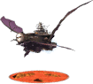</th>
    <th><b>Halberd</b></th>
    <td>
Meta Knight's battleship, built to help Meta Knight take control of Dream Land. It's crewed by Meta Knight and the Meta-Knights and is equipped with the Combo Cannon and a shrimplike robot called the Heavy Lobster. Kirby destroys the ship's reactor, causing the Wheelies who power the ship to flee. In the end, the ship crashes into the sea while the sun sets in the background.
</td>
  </tr>
  <tr>
    <th>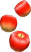</th>
    <th><b>Apples</b></th>
    <td>
Fruit that falls from above when you're battling Whispy Woods. Kirby can suck them up and spit them out as useful projectile weapons. They're nice to have around when you don't have any Copy Abilities, but they do damage when they hit you, so they can be a bother too. They offer no ability when swallowed. These apples are not produced by Whispy Woods.
</td>
  </tr>

</table>



<table class="fixed" border="1">
    <col width="200px" />
    <col width="150px" />
    <col width="800px" />

  <tr>
    <th>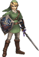</th>
    <th><b>Link</b></th>
    <td>
A young man who emerged to rescue Hyrule from peril. He's the bearer of the Triforce of Courage who fights to keep Ganondorf from conquering the world. His green outfit is a constant throughout the series. He's a skilled swordsman, horseman, and archer. He's also proficient with bombs and boomerangs.
</td>
  </tr>
  <tr>
    <th></th>
    <th><b>Triforce Slash (Link)</b></th>
    <td>
Link with a Smash Ball, releasing his ultimate attack. Light flares from the Triforce symbol on the back of his hand and rushes out to meet the enemy he faces. The enemy gets trapped within the glittering Triforce, is quickly cut to shreds, and is launched by the last strike. The attack works on one enemy at a time, so it's best to go after the character in first place.
</td>
  </tr>
  <tr>
    <th>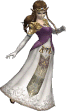</th>
    <th><b>Zelda</b></th>
    <td>
The princess of Hyrule. In other games, her role changes between titles. In Ocarina of Time, she was hunted by the would-be conqueror, Ganondorf. She deceived him, however, by adopting the persona of Sheik. In Twilight Princess, she surrendered to Zant and was held as his prisoner.
</td>
  </tr>
  <tr>
    <th></th>
    <th><b>Light Arrow (Zelda)</b></th>
    <td>
Princess Zelda's Final Smash. She wields a mighty bow of light with which she can attack from afar. Her arrow travels in a straight line and flies through all characters unlucky enough to be in the way. This attack cannot be blocked. The more enemies there are, the higher the chances to get them all with one shot. More is always better!
</td>
  </tr>
  <tr>
    <th>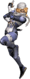</th>
    <th><b>Sheik</b></th>
    <td>
The persona Zelda adopted to escape from Ganondorf. She completely hid all traces of her Zelda identity and appeared to Link as the last member of the Sheikah tribe. She taught Link essential ocarina melodies and then vanished in an instant. She didn't appear very often--rather, she would show up to support Link in crucial situations.
</td>
  </tr>
  <tr>
    <th></th>
    <th><b>Light Arrow (Sheik)</b></th>
    <td>
Sheik's Final Smash. After grabbing a Smash Ball, Sheik will be able to wield a bow of light. The arrow fired from this bow has the power to pass through multiple targets, so it will damage all enemies in the direction it flies. This, coupled with its shield-breaking power, makes it even more terrible. Even in Sheik form, Zelda's ability as an archer is undiminished.
</td>
  </tr>
  <tr>
    <th>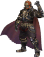</th>
    <th><b>Ganondorf</b></th>
    <td>
A man who wants to use the power of the Triforce to conquer the world. In Twilight Princess, he gives strength to the Twilight King, Zant, and tries to change the land into a world of darkness. He possesses Zelda, transforms into a magical beast, and attacks Link. In the end, however, Link deals him a finishing blow and defeats him.
</td>
  </tr>
  <tr>
    <th></th>
    <th><b>Beast Ganon</b></th>
    <td>
Ganondorf's Final Smash. When he grabs a Smash Ball, he transforms into a repulsive, evil beast. He'll vanish momentarily from the screen, then rampage from one side to the other in a straight, headlong rush. When he begins the move, any character before his eyes will flinch, so try to start the move near other characters.
</td>
  </tr>
  <tr>
    <th></th>
    <th><b>Toon Link</b></th>
    <td>
Link as he appeared in The Wind Waker and Phantom Hourglass, with big eyes and an expressive face. He lived peacefully on Outset Island until a bird captured his little sister, and he came to her rescue. In The Wind Waker, he had to crawl, press up to walls, and the like. His green clothes were worn on his 12th birthday and are the lucky outfit of the hero of legend.
</td>
  </tr>
  <tr>
    <th></th>
    <th><b>Triforce Slash (Toon Link)</b></th>
    <td>
Toon Link's Final Smash. Hit an enemy with the light emanating from the Triforce mark on his hand to initiate the move. The enemy will be trapped within the Triforce and be unable to move--Toon Link will then rush in close and carve up his foe at lightning speed. The final blow will break the Triforce prison and send the opponent off the screen.
</td>
  </tr>
  <tr>
    <th></th>
    <th><b>Heart Container</b></th>
    <td>
The best recovery item! Grab this and heal 100 percentage points of damage. It falls slowly, so it's best to grab it in midair. Damage recovery won't happen instantly, though, so try not to get launched while your damage is counting down. In the Legend of Zelda series, Heart Containers raise the player's maximum health. Bosses always have one in their possession.
</td>
  </tr>
  <tr>
    <th></th>
    <th><b>Bunny Hood</b></th>
    <td>
Headgear that hugely improves your jump and movement abilities. True to its name, the hood comes with a pair of cute, fuzzy ears. On the right characters, they're as cute as can be, but on the wrong ones, they're...scary. Of course, that adds to the item's charm. The sudden speed increase you get is responsible for more than a few self-destructs, so be careful.
</td>
  </tr>
  <tr>
    <th></th>
    <th><b>Deku Nuts</b></th>
    <td>
Items that explode in a flash of blinding light shortly after they appear or when they take damage. Those caught in a blast will be dazed and immobile for a few moments. If the item is thrown, it has the same effect on whomever it hits. In The Legend of Zelda: Ocarina of Time, Deku Nuts stunned enemies and were indispensable when Link was surrounded.
</td>
  </tr>
  <tr>
    <th>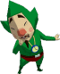</th>
    <th><b>Tingle</b></th>
    <td>
A strange little man easily spotted by his trademark green bodysuit, bright nose, and pointy beard. Tingle has frequently appeared around Hyrule and always lets those he meets know that he's a fairy and selling homemade maps. In a recent adventure, Tingle escapes a sad and dreary life to embark on a magical adventure in the delightful, dreamlike paradise of Rupeeland.
</td>
  </tr>
  <tr>
    <th></th>
    <th><b>Wolf Link</b></th>
    <td>
Link's alternate form in the Twilight Realm. In this form, he cannot use weapons such as swords or shields, but he can attack with a ferocious wolf bite. He also has a number of unqiue skills inherent to his beast form, such as a keen sense of smell, the ability to dig, and a loud wolf howl.
</td>
  </tr>
  <tr>
    <th></th>
    <th><b>Robed Zelda (With Hood)</b></th>
    <td>
The princess of Hyrule, loved and trusted by the people. When Hyrule is invaded by Zant from the Twilight Realm, Zelda is resolute in opposing him...but she chooses to protect her people and must surrender. From then on, she is imprisoned in the Twilight Hyrule Castle. In memory of the lost people of Hyrule, Zelda wears a black robe of mourning.
</td>
  </tr>
  <tr>
    <th>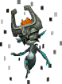</th>
    <th><b>Midna</b></th>
    <td>
A mysterious masked being. Midna was a princess in the Twilight Realm who was transformed into an imp by Zant. Midna's personality is characterized by a sharp tongue and a tendency to act on whims. Midna pairs with Link to save the world. She also possesses powerful magic skills, such as the ability to warp through space.
</td>
  </tr>
  <tr>
    <th>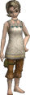</th>
    <th><b>Ilia</b></th>
    <td>
Link's childhood friend and daughter of Bo, Ordon Village's mayor. She's always considerate of Link and looks after his horse, Epona. One day, however, she is kidnapped by enemies and loses her memory. Her kidnapping is what prompts Link to set off on his adventure.
</td>
  </tr>
  <tr>
    <th></th>
    <th><b>Malo</b></th>
    <td>
The brother of Ordon Village's "tough" kid, Talo. Malo is much more reserved than his troublemaker brother and is actually quite mature. This, combined with his almost babylike appearance, can make adults feel awkward. Despite his childlike looks, Malo becomes an esteemed businessman with his chain of Malo Marts.
</td>
  </tr>
  <tr>
    <th></th>
    <th><b>Zant</b></th>
    <td>
The self-proclaimed king of twilight. Zant is the ringleader scheming to cover Hyrule in twilight. Zant long served under the royal family of the Twilight Realm. Ganondorf grants great power to Zant in exchange for his allegiance, and Zant makes it his ultimate goal to become the supreme leader of both light and dark.
</td>
  </tr>
  <tr>
    <th></th>
    <th><b>King Bulblin</b></th>
    <td>
King Bulblin is the boss of the creatures who kidnapped Ilia, Colin, and the rest of Ordon Village's children. Characterized by his appearance atop a boarlike beast named Lord Bullbo, he encounters Link time and time again. When he loses in his final battle, he pays subtle respect to Link when he says, "I follow the strongest side!"
</td>
  </tr>
  <tr>
    <th></th>
    <th><b>Agitha</b></th>
    <td>
A strange young girl who lives like a fairy-tale princess in Hyrule Castle Town. She has an eccentric attachment to Golden Bugs. In exchange for these bugs, Agitha gives you wallets and Rupees. Whether or not you actually have any bugs, Agitha suggests that you must be hiding them from her.
</td>
  </tr>
  <tr>
    <th></th>
    <th><b>Darknut</b></th>
    <td>
A knight enemy clad in heavy armor that defends with a shield and attacks with sword techniques and kicks. Darknuts lose their armor as they take hits, but they grow faster in the process. Their sword skills are quite accomplished. The most fundamental way of dealing with Darknuts is having good command of spin attacks and back slices.
</td>
  </tr>
  <tr>
    <th></th>
    <th><b>Bulblin</b></th>
    <td>
Creatures that serve under King Bulblin. They follow their superiors and pillage the land like hyenas. They typically attack with spears and fiery arrows but sometimes attack while mounted on boarlike beasts. They're not the strongest creatures but can prove dangerous in packs.
</td>
  </tr>
  <tr>
    <th></th>
    <th><b>Ooccoo & Son</b></th>
    <td>
One of the Oocca, Ooccoo travels around with her son in search of a means to return to her home, the City in the Sky. Her human-masked bird form is incredibly mysterious, but she's nice and likes to talk. If you use Ooccoo in dungeons like you would an item, she'll warp you outside the dungeon.
</td>
  </tr>
  <tr>
    <th></th>
    <th><b>Shadow Beast</b></th>
    <td>
A loyal minion sent in from the Twilight Realm by Zant. Shadow Beasts suddenly appear from portals in the sky and attack in groups. As long as one is left alive, any others will be revived, so you must leave at least two living and defeat them at the same time. If you wipe them all out successfully a warp point will open.
</td>
  </tr>
  <tr>
    <th></th>
    <th><b>Yeta</b></th>
    <td>
The wife of Yeto. She is a yeti who lives in the Snowpeak Ruins. In her illness, which was caused by the magic of a Twilight Mirror shard, Yeta was unable to leave her house. Although usually a kind lady, she became possessed by the mirror and was transformed into the great, icy Blizzeta. Yeta is also quite an accomplished sledder.
</td>
  </tr>
  <tr>
    <th></th>
    <th><b>Ashei</b></th>
    <td>
A brave, young female warrior and part of the resistance movement to save Hyrule, which is thrown into unrest by Zant. She holds strategy for resistance members at Telma's Bar in Hyrule Castle Town. Ashei is in charge of covering the Snowpeak region. She is sometimes seen out and about wearing a yeti hide.
</td>
  </tr>
  <tr>
    <th></th>
    <th><b>Darbus</b></th>
    <td>
Boasting a tough body and herculean strength, Darbus is the well-trusted chief of the Gorons. Under his rugged exterior lies a warm, personable character. Darbus is brimming with pride and valor. He is transformed into the lava-monster, Fyrus, by the sealed-off Fused Shadow. The Goron Elders imprison Fyrus inside the mines, where he battles Link.
</td>
  </tr>
  <tr>
    <th></th>
    <th><b>Ralis</b></th>
    <td>
The prince of the Zora people, aquatic humanoids that inhabit the waters of Hyrule. Ralis is the son of Queen Rutela, who was executed by creatures from the Twilight Realm. As a memento, Ralis kepps a coral earring. He is a great reekfish angler-the best, in fact, of all the Zora people.
</td>
  </tr>
  <tr>
    <th></th>
    <th><b>Goron</b></th>
    <td>
A proud guardian of Death Mountain. Entering without gaining the trust of the Gorons will earn you a rolling-rock attack. They like sumo wrestling, as seen in Twilight Princess, when you need to wrestle Gor Coron. The complete shift to a friendly attitude by the tribal chief after being rescued suggests a prudent side to the Gorons.
</td>
  </tr>
  <tr>
    <th></th>
    <th><b>Zora</b></th>
    <td>
An aquatic creature. Most of a Zora's life is spent in the water but the creatures also can live on land for limited time periods. In Twilight Princess, King Zora is already dead and succeeded by Prince Ralis. Clothing made by the late King Zora allows non-Zoras to breathe underwater.
</td>
  </tr>
  <tr>
    <th></th>
    <th><b>Sages</b></th>
    <td>
Beings that help maintain order in the world. The sage are wise ancients that protect the Mirror of Twilight, which connects in the light and twilight worlds. They are the ones that imprisoned Ganondorf in the Twilight Realm and are also those responsible for crafting the Master Sword. They feature strange floating masks but vary in appearance from title to title.
</td>
  </tr>
  <tr>
    <th></th>
    <th><b>Outset Link</b></th>
    <td>
Link in his traditional clothing. He wears a blue, V-neck, long-sleeved top with a lobster pattern, coordinated with slender orange pants. It makes you think that, even on his home, Outset Island, Link was quite the fashion leader, and suggests that he may have changed into his green hero's clothing somewhat grudgingly.
</td>
  </tr>
  <tr>
    <th></th>
    <th><b>Zelda (Wind Waker)</b></th>
    <td>
The rightful successor of the throne and descendant of the true royal bloodline of Hyrule. She strove to put an end to the ongoing battles with Ganondorf. As the bearer of the Triforce of Wisdom, she became a target of the resurrected Ganondorf. Although she was hidden in Hyrule Castle, Ganondorf managed to find and kidnap her.
</td>
  </tr>
  <tr>
    <th></th>
    <th><b>Ganondorf (Wind Waker)</b></th>
    <td>
The king of evil. Ganondorf aims to collect the Triforce pieces and rule the world. Already in possession of the Triforce of Power, he secures Zelda and her Triforce of Wisdom, thus luring Link to his castle. However, he is ultimately defeated by Zelda's Light Arrows and Link's Master Sword.
</td>
  </tr>
  <tr>
    <th></th>
    <th><b>Medl</b></th>
    <td>
A young Rito girl who is an attendant to the Dragon Spirit, Valoo, on the island of Dragon Roost. She is kind and cheerful. When Valoo becomes enraged, she attempts to reach the dragon so that Komali can get his scale. Despite the violent winds, she refuses to give up and battles on through exhaustion.
</td>
  </tr>
  <tr>
    <th></th>
    <th><b>Aryll</b></th>
    <td>
Link's cheerful younger sister, often seen wearing a hibiscus-print dress. Despite her age, she has a good head on her shoulders and carries her turtle-marked telescope with care. On Link's birthday, Aryll is mistaken for the female pirate captain, Tetra and captured by the Helmaroc King. Imprisoned in the Forsaken Fortress, she awaits rescue by Link.
</td>
  </tr>
  <tr>
    <th></th>
    <th><b>Tetra</b></th>
    <td>
A pirate captain who roams the seas in search of sunken treasure. Her disposition garners trust from her followers. Even she doesn't realize that she's THE Princess Zelda. Once Ganondorf learns of her existence, the King of Red Lions explains to her the truth about her true self. She is often recognized by her cute pose, where she crosses her arms and winks.
</td>
  </tr>
  <tr>
    <th></th>
    <th><b>Helmaroc King</b></th>
    <td>
A monstrous bird that wears a mask. On orders from Ganondorf, he sets out in search of Zelda, capturing every pointy-eared little girl he can find. His weak point is the area directly under his mask. This fellow also appears in "A Link to the Past," but that version was more beastly and was called the Helmasaur King... He still wore a mask, of course.
</td>
  </tr>
  <tr>
    <th></th>
    <th><b>Salvatore</b></th>
    <td>
A guy who runs the minigame where you try to sink groups of giant squid with a set number of shots for prizes. Not only is the game fun, but his little one-man play using the funky little illustrated props leaves quite an impression. If you say you didn't understand his explanation, the expression on his face is priceless.
</td>
  </tr>
  <tr>
    <th></th>
    <th><b>Link's Grandma</b></th>
    <td>
Link and Aryll's grandmother. She's a fine cook, and Link and Aryll are particularly fond of her soup. Grandma cares for Link with a kind tone and a warm demeanor, but when Aryll is kidnapped and Link gives chase, her health deteriorates, leaving her bedridden. If you help her recover with a fairy, she'll comfort Link with warm soup whenever he wants.
</td>
  </tr>
  <tr>
    <th></th>
    <th><b>Valoo</b></th>
    <td>
A spirit of the skies sacred to the Rito people. He lives atop Dragon Roost Island. Adult Ritos receive a scale from Valoo that allows them to grow wings and fly. Usually the friendly type, he becomes enraged when the evil creature Gohma grabs his tail, tethering him. Link battles Gohma and frees Valoo, who expresses his thanks to Link and labels him "The Hero of Winds."
</td>
  </tr>
  <tr>
    <th></th>
    <th><b>Pigs</b></th>
    <td>
Cute creatures that roam the land. They are usually pink or black but are also sometimes patterned or even miniature. Perhaps due to their timid natures, they tend to run away when approached. To catch them, you need to creep towards them ever so slowly. Throwing them in the water will reveal that they can swim back to the shore, not by "doggy-paddling" but by "piggy-paddling".
</td>
  </tr>
  <tr>
    <th></th>
    <th><b>Great Fairy</b></th>
    <td>
A mystical being. From Outset Island to Fairy Island to areas all throughout the world, there are many fairy springs. Great Fairies are powerful fairies residing at springs called Great Fairy Fountains. These powerful fairies often reward Link with Rupees, arrows, and bombs. The ones in The Wind Waker look very different from the ones in Ocarina of Time.
</td>
  </tr>
  <tr>
    <th></th>
    <th><b>King of Red Lions</b></th>
    <td>
A talking ship that rescues Link when he is thrown out to sea by the Helmaroc King. Rich with knowledge, he is a valuable partner, guiding Link in his adventures. As the ship is without a sail, Link must first acquire one on Windfall Island before venturing out on the Great Sea. It has been revealed that the King of Red Lions is actually the king of Hyrule.
</td>
  </tr>
  <tr>
    <th></th>
    <th><b>Pirate Ship</b></th>
    <td>
A ship commandeered by Tetra that sails to the far corners of the deep blue sea. When Link gets on board, he is challenged with a test given by the pirate underling Niko. In that test, Link must learn to use jumps and rope swinging to get through an obstacle course and reach Niko. If successful, he receives the Spoils Bag and bombs.
</td>
  </tr>
  

</table>



<table class="fixed" border="1">
    <col width="200px" />
    <col width="150px" />
    <col width="800px" />

<tr>
    <th></th>
    <th><b>Solid Snake</b></th>
    <td>
A former member of FOXHOUND with an IQ of 180 and mastery of six languages. He's an infiltration specialist whose ability to carry out missions under any conditions has made him a legend. He's saved the world three times from the threat of bipedal, nuclear-armed mechs called Metal Gear. Currently he's working with the anti-Metal Gear group known as Philanthropy.
</td>
  </tr>
  <tr>
    <th></th>
    <th><b>Grenade Launcher</b></th>
    <td>
Snake's Final Smash. He grabs a ladder hanging from a helicopter and appears in the foreground, then fires a grenade launcher at foes. The grenades explode on impact and damage anyone in the vicinity. Each clip holds six grenades--empty one, and Snake reloads. He can fire a total of twelve shots, but with such limited time, it's better to shoot 'em all.
</td>
  </tr>
<tr>
    <th></th>
    <th><b>Gray Fox</b></th>
    <td>
An enigmatic soldier with great physical and combat skills. Calling himself "Deepthroat" and equipped with an enhanced environmental camouflage suit, he dedicated his life to fighting Snake. In a twist of fate, Gray Fox ends up protecting his sworn rival from Metal Gear REX. Long ago, Gray Fox fought Snake in Zanzibarland.
</td>
  </tr>
  <tr>
    <th></th>
    <th><b>Iroquois Pliskin</b></th>
    <td>
A SEAL member who infiltrates the Big Shell to suppress a terrorist group threatening to destroy it. He joins forces with Raiden, a new recruit in the special-forces unit called FOXHOUND. Disguised in order to secretly infiltrate the Big Shell, Pliskin is actually Solid Snake.
</td>
  </tr>
<tr>
    <th></th>
    <th><b>Naked Snake</b></th>
    <td>
As a member of the special-forces unit FOX, Naked Snake assassinated The Boss and ruined the Shagohod, a Soviet nuclear weapon. Years later, he was used to plant the seeds of Les Enfants Terribles, a project designed to create cloned super soldiers. The three Snakes--Liquid, Solid, and Solidus--were thus born. He would then embrace his name, Big Boss, and duel Solid Snake.
</td>
  </tr>
  <tr>
    <th></th>
    <th><b>Shagohod</b></th>
    <td>
A massive, nuclear-capable tank developed by the Soviet weapons specialist Nikolai Sokolov. In parallel development with the Metal Gear, the Shagohod is selected for military deployment over its rival. The body is made up of two front and two rear sections. The front uses a pair of drills on hydraulic legs to pull the bulky rear section which houses its ballistic missile.
</td>
  </tr>
<tr>
    <th></th>
    <th><b>Mteal Gear RAY</b></th>
    <td>
An amphibious Metal Gear developed by the U.S. Marines. Revisions to the prototype enabled mass production and made it a viable battle weapon with massive firepower and remote operation. Wings and a tail make it look monsterlike, but scarier still is the high-pressure water cannon in its mouth that fires a stream of water that can slice through rock.
</td>
  </tr>
  <tr>
    <th></th>
    <th><b>Metal Gear REX</b></th>
    <td>
A war machine of ruinous power. Metal Gear REX was developed at the weapons company ArmsTech under the eye of Hal "Otacon" Emmerich. It had the ability to launch nuclear warheads from a mounted rail gun. During testing, REX was captured by FOXHOUND, a rogue special-forces unit headed by Liquid Snake, but Solid Snake managed to destroy the machine before calamity ensued.
</td>
  </tr>
<tr>
    <th></th>
    <th><b>Gekko</b></th>
    <td>
A Metal Gear with a pair of animal-like legs. Gekko are mass-produced weapons used in military combat. Its distinctive legs allow Gekko to move at high speed, jump incredible distances, and even cling to walls, giving it unprecedented mobility. Other noteworthy features of this model include prehensile tentacles strong enough to pick up soldiers and its signature deafening roar.
</td>
  </tr>
  <tr>
    <th></th>
    <th><b>Cypher</b></th>
    <td>
An unmanned aerial surveillance vehicle used by the U.S. Army. It uses a fan in the center of its body to hover and a camera on its upper fuselage to monitor from the skies. It has a number of models, including the armed Gun Cypher and the remodeled Cypher II. Its small size and continuous flight ability make it extremely effective in guarding against intruders.
</td>
  </tr>
<tr>
    <th></th>
    <th><b>Cardboard Box</b></th>
    <td>
A common, run-of-the-mill cardboard box that is somehow very effective at preventing detection by enemies. Hide inside it and enemies will walk on by. But put it somewhere too odd and you'll be discovered. You can move while in the box, but if anyone sees the box moving, you're in trouble. Both Liquid and Solid Snake have a deep affection for cardboard.
</td>
  </tr>
</table>



<table class="fixed" border="1">
    <col width="200px" />
    <col width="150px" />
    <col width="800px" />

  <tr>
    <th></th>
    <th><b>Lucas</b></th>
    <td>
The younger of twin brothers living in Tazumili Village in the Nowhere Islands. He's a kind boy who can communicate with animals, but he's shy and never really got over the tragedy that struck his mother. He fights a warped dictatorship, hunts the Seven Needles, and crosses swords with his missing brother, Claus. In the end, the young boy with psychic PSI powers grows up.
</td>
  </tr>
  <tr>
    <th></th>
    <th><b>PK Starstorm (Lucas)</b></th>
    <td>
Lucas's Final Smash. He pulls a large group of stars from the sky and sends them smashing down among his enemies, causing damage to one and all. In Mother 3, this move was used by Lucas's traveling companion, Princess Kumatora. As Ness learned this move from Poo, Princess Kumatora taught Lucas when he learned he would appear in Super Smash Bros. Brawl.
</td>
  </tr>
  <tr>
    <th></th>
    <th><b>Ness</b></th>
    <td>
An average boy whose life changed when he found a meteor and an alien on a nearby mountain. The alien warned him of a future threat, and adventure ensued. He can use psychic energy known as PSI and also wields a bat and yo-yo. This brave youth gives his all to defeat the evil Giygas.
</td>
  </tr>
  <tr>
    <th></th>
    <th><b>PK Starstorm (Ness)</b></th>
    <td>
Ness as he calls down a host of damage-dealing stars in his Final Smash. Everyone on the screen must dodge like crazy to avoid getting hurt, but that's no easy task. This attack appeared in the Mother series, but it was Poo, not Ness, who wielded it. Perhaps Poo taught Ness the secret of the attack for use in Super Smash Bros. Brawl.
</td>
  </tr>
  <tr>
    <th></th>
    <th><b>Mr. Saturn</b></th>
    <td>
A creature from a race of unknown origin that speaks its own unique language. Some say they came from outer space, but the facts behind their appearance are wrapped in mystery. In Smash Bros., they'll wait a bit after appearing before wandering off on their own. They can be picked up and thrown at foes for minimal damage. Their shield-breaking properties are high.
</td>
  </tr>
  <tr>
    <th></th>
    <th><b>Franklin Badge</b></th>
    <td>
A badge you can put on to gain the ability to reflect all projectiles. It has exactly the same effect as other reflectors in the game, like the one Fox uses. In EarthBound, it was used to counter Thunder attacks. The lightning bolt on the badge is proof of its capacity. Its importance and usefulness made a deep impression on players.
</td>
  </tr>
  <tr>
    <th></th>
    <th><b>Jeff</b></th>
    <td>
Dr. Andonuts's son, who attends a boarding school in Winters. He receives a telepathic message from Paula saying that she and Ness have been captured, and he sets out to rescue them. He's Ness's age but has the knowledge of an established scientist. He repairs broken items and makes them into other things. As his IQ increases, so does the number of things he can create.
</td>
  </tr>
  <tr>
    <th></th>
    <th><b>Porky</b></th>
    <td>
A self-centered, rotten brat who lives next door to Ness. As the events of the game progress, he's rapidly led astray and becomes Giygas's right-hand man. Afterward, he goes missing in time and then reappears in the Nowhere Islands of Mother 3. He leads the Pig Mask Army invasion but is eventually defeated by Lucas and friends.
</td>
  </tr>
  <tr>
    <th></th>
    <th><b>Porky Statue</b></th>
    <td>
A guardian statue standing inside New Pork City that's clearly based on Porky himself. Investigate it, and the statue will turn hostile and start a battle. And it has 100,000,000 HP! It has very high stats, so you'll never win if you attack it straight-on. Thankfully, there's an item called "New Year's Eve" that can reduce its HP to 1-- then you can defeat it with ease.
</td>
  </tr>
</table>



<table class="fixed" border="1">
    <col width="200px" />
    <col width="150px" />
    <col width="800px" />

  <tr>
    <th></th>
    <th><b>Pikmin & Olimar</b></th>
    <td>
Veteran spacefarers in the employ of Hocotate Freight. After crash- landing on an enigmatic planet, Olimar met the mysterious beings known as Pikmin. He enlisted their aid to find his spaceship parts and help him escape. Once home, he found his employer on the verge of bankruptcy. He was sent back to the Pikmin world with his partner, Louie, to repay the company debt.
</td>
  </tr>
  <tr>
    <th></th>
    <th><b>End of Day</b></th>
    <td>
Olimar's Final Smash. Dusk falls, and his spaceship makes a landing. Olimar takes the Onion, with all his Pikmin aboard, and blasts off for the stars. In Pikmin, native life-forms grew active and violent at night, making it lethal to remain on the surface--this is why Olimar would take his Onions and leave at night. This technique breaks the framework of the game.
</td>
  </tr>
  <tr>
    <th></th>
    <th><b>Red Pikmin</b></th>
    <td>
A type of Pikmin--which are odd beings who grow like plants yet are as mobile as animals. Red ones are heat and fire resistant and are strong attackers, which makes them valuable when facing dangerous foes. Purple Pikmin are also tough fighters, but since it's difficult to increase their numbers, red Pikmin are easier to manage. Red Pikmin have distinct pointed noses.
</td>
  </tr>
  <tr>
    <th></th>
    <th><b>Blue Pikmin</b></th>
    <td>
A type of Pikmin, which are curious creatures that follow and obey the person who picks them. If you take advantage of this trait, you can get them to help Capt. Olimar and Louie. The blue Pikmin are at home in water and cannot drown. Need to retrieve an object underwater or cross a water hazard to disarm a trap? Blue Pikmin are just the allies you need.
</td>
  </tr>
  <tr>
    <th></th>
    <th><b>Yellow Pikmin</b></th>
    <td>
A type of Pikmin. Take a nutrient- rich pellet to a flying saucer known as an Onion, and it will produce the mysterious beings known as Pikmin. Yellow ones fly higher than other Pikmin when tossed by Olimar or Louie. Unlike other Pikmin, they're also highly resistant to electricity, which makes them invaluable when battling enemies like anode dweevils.
</td>
  </tr>
  <tr>
    <th></th>
    <th><b>White Pikmin</b></th>
    <td>
A type of Pikmin. White Pikmin are resistant to poisons and are themselves toxic to creatures that eat them. Their low weight makes them very speedy, and they can also dig up buried items. White and purple Pikmin do not live inside Onions, so you must change other Pikmin into them by tossing them into ivory candypop buds and violet candypop buds.
</td>
  </tr>
  <tr>
    <th></th>
    <th><b>Purple Pikmin</b></th>
    <td>
A type of Pikmin, much heavier and slower than other Pikmin. When thrown, they impact with such force that they may kill or stun enemies. They're also incredibly strong--one of them can carry an item that normally would require ten Pikmin. While they're more powerful fighters than their red cousins, their slow speed hampers their effectiveness.
</td>
  </tr>
  <tr>
    <th></th>
    <th><b>Louie</b></th>
    <td>
A new Hocotate Freight employee. Louie is responsible for Captain Olimar having to venture back to the Pikmin planet. On his first delivery, Louie was supposedly attacked by a space bunny that devoured his whole lot of pikpik carrots. Pushed to the verge of bankruptcy, Hocotate Freight takes out an enormous loan that Louie and Olimar set out to pay back.
</td>
  </tr>
  <tr>
    <th></th>
    <th><b>The President</b></th>
    <td>
The president of Hocotate Freight. After venturing into space in his youth, he made a shipping company. When it almost collapses after Louie's incident, and Olimar comes back from the Pikmin planet, the president discovers the outstanding value of Olimar's souvenir. He then sends his employees back to collect valuable treasures. His treatment of employees is questionable.
</td>
  </tr>
  <tr>
    <th></th>
    <th><b>Hocotate Ship</b></th>
    <td>
A battered old spaceship used when Hocotate Freight first opened. Its appraisal gauge analyzed garbage Olimar brought home and found it to be valuable. With his new ship sold off to pay company debts, Louie and Olimar flew this one back to the Pikmin world to find more treasure. The ship's removable research pod accompanied the adventurers when they ventured underground.
</td>
  </tr>
  <tr>
    <th></th>
    <th><b>Onions</b></th>
    <td>
Items considered to be the places where Pikmin are born. As to the actual biology of the process, much is still unclear. Onions absorb the prey that Pikmin capture and use it to produce new Pikmin. In addition, Onions can take in Pikmin and later release them. These organisms are crowned with distinctive propeller- like sets of leaves that spin around, enabling them to fly.
</td>
  </tr>
  <tr>
    <th></th>
    <th><b>Creeping Chrysanthemum</b></th>
    <td>
An enemy flower and a member of the chrysanthemum family that closely resembles the Margaret flower. This flower feeds on prey and, despite being a plant, performs no photosynthesis and exposes no leaves--just flowers on top. It usually stays underground with only its flowers exposed, waiting to jump out and attack. It also uses rootlike legs to walk around.
</td>
  </tr>
  <tr>
    <th></th>
    <th><b>Red Bulborb</b></th>
    <td>
A creature whose Japanese name translates as "spotted crimson bug-eye." These bulky nocturnal animals have white-and-red-flecked rumps that resemble strawberries. Red bulborbs sleep in the day and wake in the evening to feed on small animals. Several colors of bulborb subspecies have been discovered--their classification is a hot subject for scholars.
</td>
  </tr>
  <tr>
    <th></th>
    <th><b>Empress Blublax</b></th>
    <td>
A member of the grub-dog family, transformed by environmental factors. Due to her ridiculous size, the empress bulblax can no longer walk on her tiny legs. She just wiggles around, rolling from left to right. Although the female continues spawning bulborb larvae, she unfortunately rolls over them with her massive body.
</td>
  </tr>
  <tr>
    <th></th>
    <th><b>Careening Dirigibug</b></th>
    <td>
A dangerous, offensive-minded creature. It uses balloons to keep it afloat as it flies through the air and drops bomb-rocks on ground- bound prey. These bomb-rocks sometimes turn out to be duds, but since the slightest stimulus can set these things off, the utmost care should be taken when dealing with them.
</td>
  </tr>
  <tr>
    <th></th>
    <th><b>Fiery Blowhog</b></th>
    <td>
A member of the blowhog family characterized by its bottle-shaped body and slow, lumbering movement. Skillful in the use of its red snout and able to violently shake off Pikmin, the fiery blowhog is also capable of spitting a volatile phosphorus compound that combusts on contact with air, threatening nearby enemies.
</td>
  </tr>
  <tr>
    <th></th>
    <th><b>Burrowing Snaret</b></th>
    <td>
A member of the snavian family with a birdlike head and a snakelike neck and body. An underground dweller, the snagret makes sudden strikes aboveground to capture surface-dwelling prey. It uses its beak to scoop up daily nutrition and can snatch up three Pikmin at once--a relatively small amount made deadly by its strike speed. No one has ever seen its tail.
</td>
  </tr>
  <tr>
    <th></th>
    <th><b>Iridescent Flint Beetle</b></th>
    <td>
A member of the flint beetle family featuring an iridescent, shining shell that is also prized for its strength. These beetles are packed with nectar and pellets, which they drop when attacked. These can be collected, although the reason for doing so is unknown. Apparently, Pikmin are quite attracted to these beetles--the sight of one will send them running after it.
</td>
  </tr>
  <tr>
    <th></th>
    <th><b>Wallywog</b></th>
    <td>
A member of the amphituber family known to be quite quick witted upon spotting enemies, despite its slow- moving, easygoing nature. Be aware that wollywogs will make aggressive attempts to smash Pikmin. It is believed that the wollywog's whitish coloration is a result of a lack of sunlight over its generations spent in caves.
</td>
  </tr>
  <tr>
    <th></th>
    <th><b>Swooping Snitchbug</b></th>
    <td>
A member of the scarpanid family. Although originally a ground dweller, its oversized antennae developed into wings, allowing it to fly around freely. The snitchbug doesn't eat Pikmin, but rather picks them up, carries them away, and firmly replants them in another location.
</td>
  </tr>
  <tr>
    <th></th>
    <th><b>Pellets</b></th>
    <td>
Items that contain concentrated essence of the Pikmin's home world. This essence is the keystone to all life on the planet. Harvested from pellet grass or flowers, Pikmin can take pellets back to Onions to produce more Pikmin. If the Onion and the pellet are the same color, it produces more Pikmin. The number on the top of a pellet tells how many Pikmin must carry it.
</td>
  </tr>
  </table>




<table class="fixed" border="1">
    <col width="200px" />
    <col width="150px" />
    <col width="800px" />

  <tr>
    <th></th>
    <th><b>Pikachu</b></th>
    <td>
A Mouse Pokémon. Its lightning-bolt tail and round cheeks are its trademarks. When danger draws near, it uses tiny electric pouches within its cheeks to discharge electricity. When it's really fired up, it unleashes thunderbolts on its rivals. It's said to recharge when it's sleeping. It evolves into Raichu.
</td>
  </tr>
  <tr>
    <th></th>
    <th><b>Volt Tackle</b></th>
    <td>
Pikachu, transformed into a ball of light that can slam into foes. It can also fly to chase down those who try to jump out of range. Sparks get stronger when you press the attack button. However, its increased inertia makes midair movement tough. If you get carried away flying, the effect will end, and you'll destroy yourself. Be careful it doesn't happen to you
</td>
  </tr>
 <tr>
    <th></th>
    <th><b>Pokémon Trainer</b></th>
    <td>
A person who raises Pokémon and trains them as partners in battle. In battle, a Trainer gives orders to the Pokémon and uses items. It's not an exaggeration to say battles can be won or lost on a Trainer's single strategic move. Trainers pour their hearts into their Pokémon and share anger, sadness, and joy as they adventure in hopes of becoming Pokémon Masters.
</td>
  </tr>
  <tr>
    <th></th>
    <th><b>Triple Finish</b></th>
    <td>
The Final Smash of the Pokémon Trainer. Squirtle, Ivysaur, and Charizard join forces to simultaneously use Hydro Pump, SolarBeam, and Fire Blast. This is the only time all three of them appear on the screen together, so this move boasts the strength of three in one. A window will appear on the screen, but don't worry about it.
</td>
  </tr>
  <tr>
    <th></th>
    <th><b>Charizard</b></th>
    <td>
A Flame Pokémon. Its fiery breath is hot enough to burn up rocks, and its wings let it fly up to 4,600 feet into the air. It's a proud Pokémon that will never use its flame breath on an opponent weaker than itself. The flame on its tail is a barometer of how much vitality it has remaining. Its signature move, Flamethrower, is a reliable technique.
</td>
  </tr>
  <tr>
    <th></th>
    <th><b>Squirtle</b></th>
    <td>
A Tiny Turtle Pokémon. In times of danger, it pulls its arms and legs inside its shell to protect itself from enemy attacks. When it conceals its neck, it also shoots a powerful stream of water from its mouth. Its shell not only protects its body, it also reduces water friction when it's in the water. When it levels up, it evolves into Wartortle.
</td>
  </tr>
  <tr>
    <th></th>
    <th><b>Ivysaur</b></th>
    <td>
A Seed Pokémon that is the evolved form of Bulbasaur. It has a flower bulb on its back, the weight of which has made it develop strong legs and hips. If the blossom gets too big, the Pokémon can't stand on two legs alone. At a certain level, it evolves into Venusaur. When this happens, the bulb absorbs nutrients and blossoms into a large-petaled flower.
</td>
  </tr>
 <tr>
    <th></th>
    <th><b>Lucario</b></th>
    <td>
An Aura Pokémon. It can track energy called Aura, which is given off by all living creatures. It's a unique combination of both Fighting-type and Steel-type Pokémon. Lucario evolves from Riolu during the day if its happiness has reached a certain point. It specializes in attacks that use Aura energy, like Dark Pulse and a can't-miss technique, Aura Sphere.
</td>
  </tr>
  <tr>
    <th></th>
    <th><b>Aura Storm</b></th>
    <td>
Lucario's Final Smash. After flying off the screen, Lucario reappears in its center. He then launches a powerful Aura attack against all foes within a certain distance. The key to this attack is the ability to change its angle--it's a must to sweep slowly left and right to hit selected enemies multiple times. The last blow will send the victim flying away.
</td>
  </tr>
  <tr>
    <th></th>
    <th><b>Jigglypuff</b></th>
    <td>
A Balloon Pokémon. It invites opponents in close with its big, round eyes, then puts them to sleep with a calming song. The secret to the song's unfailing efficacy is Jigglypuff's ability to sing on the wavelength that will make its opponent the sleepiest. It also uses Attract to infatuate opponents who touch it. It uses a Moon Stone to evolve into Wigglytuff.
</td>
  </tr>
  <tr>
    <th></th>
    <th><b>Puff Up</b></th>
    <td>
Jigglypuff's Final Smash. It wills its body to get bigger and bigger and bigger. It can't move, and it can't attack--all it can do is get bigger while everyone else looks on. However, it's invulnerable, and it overpowers all attacks to gradually push its opponents off the screen. It's a very simple technique, but how it's used determines its effectiveness.
</td>
  </tr>
  <tr>
    <th></th>
    <th><b>Pokéball</b></th>
    <td>
An item used for capturing Pokemon and calling them out to battle. Pokemon live in these items which, despite appearances, actually contain a wide, comfortable, Pokemon-friendly world inside them. In Super Smash Bros., Pokemon give temporary support to whoever calls them out. You never know which Pokemon you'll get, but some of them are devastatingly powerful.
</td>
  </tr>
 <tr>
    <th></th>
    <th><b>Piplup</b></th>
    <td>
A Penguin Pokémon. It's one of the starter Pokémon received from Professor Rowan when the player departs from the Sinnoh region. It's a Water type, so it's strong versus Rock and Ground types. It's very cute but filled with pride-- it hates to accept food from people. When it levels up, it evolves into Prinplup.
</td>
  </tr>
  <tr>
    <th></th>
    <th><b>Munchlax</b></th>
    <td>
A Big Eater Pokémon. It's normally a slow-moving creature, but when it spots food, it moves surprisingly fast. It's native to the Sinnoh region and can be lured out by coating certain trees with sweet honey. Once it's attached to its Trainer, it will level up and evolve into Snorlax.
</td>
  </tr>
  <tr>
    <th></th>
    <th><b>Bonsly</b></th>
    <td>
A Bonsai Pokémon. It looks like a plant, but its history reveals it is actually a Rock type. Its best move among all its specialty moves is Fake Tears. As it grows, it will become skilled at using Mimic, which allows it to copy an opponent's previous move. If it levels up under certain conditions, it evolves into Sudowoodo.
</td>
  </tr>
  <tr>
    <th></th>
    <th><b>Weavile</b></th>
    <td>
A Sharp Claw Pokémon. The crown on its head resembles a fully opened folding fan. Its sharp, hooked claws and outstanding speed are its most memorable features. It's one Pokémon that can be expected to perform well on the front lines of battle. There are many Trainers who teach it the TM False Swipe and travel with it to catch rare Pokémon.
</td>
  </tr>
  <tr>
    <th></th>
    <th><b>Manaphy</b></th>
    <td>
A Seafaring Pokémon. Eighty percent of its body is made of water. It has the ability Hydration, which allows it to heal status effects at the end of a turn if it's raining. It is the only Pokémon that can use the stat-effect-swapping move called Heart Swap. Place a Manaphy and a Ditto in a Pokémon Day Care, and they will produce an Egg that contains a Phione.
</td>
  </tr>
 <tr>
    <th></th>
    <th><b>Torchic</b></th>
    <td>
A Chick Pokémon. It's a Fire type that has a flame sac in its belly where it produces fireballs reaching 1,800 degrees Fahrenheit-- it shoots these out of its mouth. While Torchic is as cute as can be, it will evolve into the powerful Combusken when it levels up. It also then becomes a combination Fighting and Fire type.
</td>
  </tr>
  <tr>
    <th></th>
    <th><b>Gulpin</b></th>
    <td>
A Stomach Pokémon. While it's a carefree Pokémon with a loveable face, it can swallow something the size of itself in one gulp. Its stomach is filled with gastric juices strong enough to dissolve whatever it eats. As it matures, it can learn Wring Out, which is as strong as the remaining strength of the opponent Pokémon. It evolves into Swalot.
</td>
  </tr>
  <tr>
    <th></th>
    <th><b>Metagross</b></th>
    <td>
An Iron Leg Pokémon. When two Beldum combine, they evolve into a Metang. In the same way, a Metagross is the result of two Metang combining. It's said to have intelligence that can match a supercomputer. Though it weighs 1,212.5 pounds, it is somehow able to fold up its legs and float.
</td>
  </tr>
  <tr>
    <th></th>
    <th><b>Gardevoir</b></th>
    <td>
An Embrace Pokémon. Despite its elegant, feminine appearance, there are both male and female Gardevoir. A Psychic type, it has the ability to predict the future and levitate. It's a brave Pokémon that will risk its own life to protect its Trainer. It uses the ability Synchronize to pass on status problems like poison, paralysis, and burn to its foes.
</td>
  </tr>
  <tr>
    <th></th>
    <th><b>Latias and Latios</b></th>
    <td>
Eon Pokémon. There are only female Latias and only male Latios. If they sense the presence of a human or an enemy, they will generally use the light-bending trait of their down coats to make themselves invisible. They use telepathy to speak to companions. They travel in herds, but even so, they are rarely seen. They're a combination of Dragon and Psychic types.
</td>
  </tr>
 <tr>
    <th></th>
    <th><b>Groudon</b></th>
    <td>
A Continent Pokémon. In ancient times, it brought about droughts to save people who had suffered from floods. It is normally found in the profound depths of the earth, where it slumbers in magma. With a mighty roar, it uses Earthquake to shake the ground and mow down enemies. In battle, summons sunlight to bathe the area. It once had an epic battle with Kyogre.
</td>
  </tr>
  <tr>
    <th></th>
    <th><b>Kyogre</b></th>
    <td>
A Sea Basin Pokémon. It brought about heavy rains, which formed seas and relieved droughts. It is usually found slumbering at the bottom of an ocean trench. Its attack Sheer Cold is a technique so powerful, it causes any opponent it strikes to faint instantly. In battle, it causes clouds to form and drenches the area in rain. It once fiercely battled Groudon.
</td>
  </tr>
  <tr>
    <th></th>
    <th><b>Rayquaza</b></th>
    <td>
A Sky High Pokémon. It normally resides high up in the ozone layer where it flies endlessly, so it is rarely seen. However, when Groudon and Kyogre began to fight, it appeared to calm them down. It has the ability Air Lock, which blocks all weather-condition effects. It has exceedingly strong abilities, and its attack power is especially remarkable.
</td>
  </tr>
  <tr>
    <th></th>
    <th><b>Deoxys</b></th>
    <td>
A DNA Pokémon born through the DNA of a space virus. It has multiple formes, and the abilities it possesses and the techniques it can remember change from forme to forme. It has four formes: Normal, Attack, Defense, and Speed. It can be made to change formes by using the power of a meteorite in Veilstone City.
</td>
  </tr>
  <tr>
    <th></th>
    <th><b>Jirachi</b></th>
    <td>
A Wish Pokémon. It's said to awaken for seven days every thousand years, with the ability to grant any wish asked of it. It is truly a Pokémon of which dreams are made. In combat it uses its wish power to attack. Its attack Doom Desire, which causes light to rain down from the heavens to do tremendous damage, is especially powerful.
</td>
  </tr>
 <tr>
    <th></th>
    <th><b>Meowth</b></th>
    <td>
A Scratch Cat Pokémon. It's one of the most famous Pokémon and very fond of things that sparkle--the gold medallion on its head could be seen as an indicator of this infatuation. There are many Pokémon that resemble cats, but Meowth is the only one that can use Pay Day to receive coins at the end of battle. It evolves into Persian.
</td>
  </tr>
  <tr>
    <th></th>
    <th><b>Electrode</b></th>
    <td>
A Ball Pokémon. The more electricity it stores in its body, the quicker it moves. One danger of storing that much electricity is that the slightest stimulus may cause it to explode. Moves it specializes in include Selfdestruct and Explosion. Its love of electricity often causes it to gather in groups near power plants.
</td>
  </tr>
  <tr>
    <th></th>
    <th><b>Goldeen</b></th>
    <td>
A Goldfish Pokémon. In contrast to its elegant appearance, it has a wild temperament, and its attack with its horn is severe. Among the techniques it can master, Horn Drill is especially reliable. It evolves into Seaking, but if it's raised without evolving, it can learn the powerful Bug-type move Megahorn. There are male and female Goldeen--the male's horn is longer.
</td>
  </tr>
  <tr>
    <th></th>
    <th><b>Staryu</b></th>
    <td>
A Star Shape Pokémon. It gathers in groups and flashes the red jewel in the center of its body in time to the twinkling of the stars in the night sky. If it loses appendages, it can regenerate them right away. It can also use Camouflage, which allows it to change its type to match the surrounding terrain. If a Water Stone is used on it, it evolves into Starmie.
</td>
  </tr>
  <tr>
    <th></th>
    <th><b>Snorlax</b></th>
    <td>
A Sleeping Pokémon. It's the ultimate loafer. Sometimes children like to play on top of its big belly. Once in a slumber, not even the hardest rain or the fiercest wind will wake it. Snorlax recovers health and restores its physical state by sleeping, and it proves daunting with its damaging Snore attack. Snorlax is the king of Sleeping Pokémon.
</td>
  </tr>
 <tr>
    <th></th>
    <th><b>Chikorita</b></th>
    <td>
A Leaf Pokémon. It loves sunbathing and can use the leaf on its head to check the temperature and humidity around it. Chikorita releases a sweet aroma from its leaf to becalm opponents into a slumber. It can also learn moves to help recover all Pokémon allies. Chikorita evolves into Bayleef by leveling up.
</td>
  </tr>
  <tr>
    <th></th>
    <th><b>Togepi</b></th>
    <td>
A Spike Ball Pokémon. It's said that its shell is filled with joy, and a proverb asserts that if you can get a sleeping Togepi to stand up, you will gain happiness. Togepi can lower its opponent's attack power using Charm. Once it has become friends with its Trainer, Togepi evolves into Togetic.
</td>
  </tr>
  <tr>
    <th></th>
    <th><b>Bellossom</b></th>
    <td>
A Flower Pokémon. After spells of cloudy weather, Bellossom will gather to call out the sun by performing a dance. When exposed long enough to the sun, the leaves on its body will spin around. A Bellossom's Speed is also known to increase with sun exposure. Its main specialty is poison attacks. Also, Bellossom will close its flowers when sleeping.
</td>
  </tr>
  <tr>
    <th></th>
    <th><b>Wobbuffet</b></th>
    <td>
A Patient Pokémon. A nocturnal, cave-dwelling creature, Wobbuffet is calm and collected, but it will fight back viciously if its black tail is attacked--this hints at something secretive about its tail. If Wobbuffet is put into battle, the opponent cannot run away or switch. Females have lipsticklike markings around their mouths.
</td>
  </tr>
  <tr>
    <th></th>
    <th><b>Moltres</b></th>
    <td>
A Flame Pokémon. It's one of the legendary bird Pokémon. When Moltres appears in a town, it is said that spring will come earlier there than in other towns. If Moltres is injured, it apparently returns to a volcano to heal its wings with magma. Moltres spreads its wide, flame-covered wings and attacks opponents with the exciting and highly damaging Sky Attack.
</td>
  </tr>
 <tr>
    <th></th>
    <th><b>Entei</b></th>
    <td>
A Volcano Pokémon. When Entei barks, a volcano erupts, and it's said that a new Entei is born every time a volcano appears. A proverb claims that the warmth of summer is created by Entei racing through the clouds. Entei uses Fire Spin, a flaming vortex that traps and damages foes for multiple turns.
</td>
  </tr>
  <tr>
    <th></th>
    <th><b>Suicune</b></th>
    <td>
An Aurora Pokémon. It has the power to instantly purify even the filthiest water. Suicune is said to be the reincarnation of the northern wind, so when it shows up, so does that wind. Suicune uses the move Aurora Beam--aurora light focused into a powerful beam. Along with inflicting damage, this attack also lowers the target's attack power.
</td>
  </tr>
  <tr>
    <th></th>
    <th><b>Ho-Oh</b></th>
    <td>
A Rainbow Pokémon. On sparkling wings of seven colors, Ho-Oh leaves a rainbow behind as it flies. Legend says that Ho-Oh suppressed a war that scorched the land in ancient times. Its attack Sacred Fire can melt ice in an instant and also damage the target with burns. Ho-Oh will show its solemn figure only for the most righteous Trainers.
</td>
  </tr>
  <tr>
    <th></th>
    <th><b>Lugia</b></th>
    <td>
A Diving Pokémon. A legendary Pokémon often referred to as "guardian of the seas," it has the impressive ability to control the wind. Lugia typically spends its time quietly at the bottom of the ocean. Highly powerful in all areas, Lugia's Aeroblast move is especially powerful. It uses strong flapping of its wings to target damage on a foe's weak spot.
</td>
  </tr>
  <tr>
    <th></th>
    <th><b>Mew</b></th>
    <td>
A New Species Pokemon. An extremely rare Pokemon that contains the DNA of all other Pokemon, it is thought by many scholars to be a Pokemon ancestor, considering the wide range of moves it can use. On top of being able to make itself invisible, Mew can also transform into any opponent Pokemon and use characteristics and moves in exactly the same way.
</td>
  </tr>
 <tr>
    <th></th>
    <th><b>Celebi</b></th>
    <td>
A Time Travel Pokemon. Celebi can travel throughout time and inhabit multiple places simultaneously. It is said that it appears only during times of peace, greeted by a flourishing of grass and trees. Two turns after Celebi uses its Future Sight move, the foe is bombarded with psychic energy. This proves to have a devastating impact on any Pokemon.
</td>
  </tr>
  <tr>
    <th></th>
    <th><b>Turtwig</b></th>
    <td>
A Tiny Leaf Pokemon. Despite its animal appearance, Turtwig actually has vegetation sprouting from its head. The shell on its back is made of soil and hardens when it drinks water. Much like a plant, Turtwig performs photosynthesis, absorbing sunlight and making oxygen. It also relies heavily on water to keep its plant healthy and thus spends a lot of time near lakes.
</td>
  </tr>
  <tr>
    <th></th>
    <th><b>Chimchar</b></th>
    <td>
A Chimp Pokemon. With a flaming tail, Chimchar is skilled in Fire- type moves. Its light body affords it the ability to scale steep cliffs and live atop rocky mountains. Some say that the fiery tail is fueled by gas made in its stomach. Not even rain can put out the flames, but Chimchar always puts out the fire when asleep. Chimchar evolves into Monferno.
</td>
  </tr>
  <tr>
    <th></th>
    <th><b>Bulbasaur</b></th>
    <td>
A Seed Pokemon. From birth, Bulbasaur carries a large plant seed on its back. It uses the nutrients from the seed to grow bigger and bigger. Extended exposure to the sun will cause its body and seed to grow in size. Some say that once, when the seed was much lighter, Bulbasaur was able to get around on two legs. Bulbasaur evolves into Ivysaur.
</td>
  </tr>
  <tr>
    <th></th>
    <th><b>Charmander</b></th>
    <td>
A Lizard Pokemon. It just downright likes hot stuff. The always-burning tail indicates its mood--waving gently when content and burning intensely when angry. If the tail were to go out, it would be the end of Charmander's life. Its tail is believed to emit steam when it rains. Charmander evolves into Charmeleon by leveling up.
</td>
  </tr>
 <tr>
    <th></th>
    <th><b>Cyndaquil</b></th>
    <td>
A Fire Mouse Pokemon. It's a timid creature that often curls up into a ball. When threatened, it flares up the flames on its back to scare off enemies. When it's angry, it can produce powerful flames, but when it's tired, it has trouble producing fire and suffers from incomplete combustion. When it levels up, it evolves into Quilava. Its squinty eyes are adorable.
</td>
  </tr>
  <tr>
    <th></th>
    <th><b>Totodile</b></th>
    <td>
A Big Jaw Pokemon. This alligator- like Pokemon stands on two legs. It has a small body but an impressive jaw that boasts potent bite power. It can do serious damage to someone even if it's just playing. Its tendency to chomp down on anything that moves in front of it means Trainers have to be extra cautious around it. When it levels up, it evolves into Croconaw.
</td>
  </tr>
  <tr>
    <th></th>
    <th><b>Treecko</b></th>
    <td>
A Wood Gecko Pokemon. It's a calm and cool creature that is not easily upset. It's also bold enough to stare down Pokemon larger than itself. It makes its home in large trees in forests, and its habit of fiercely defending its territory has some people calling it the "protector of the forest." It uses its thick tail to attack. When it levels up, it evolves into Grovyle.
</td>
  </tr>
  <tr>
    <th></th>
    <th><b>Mudkip</b></th>
    <td>
A Mud Fish Pokemon. It has fins on its head and tail. The fin on its head acts like a radar dish to read its surroundings, and its tail fin increases its swimming speed. The gills on its cheeks allow it to move about in water. It's very strong for its size--it can even lift big boulders. It burrows into muddy watersides to sleep. Mudkip evolves into Marshtomp.
</td>
  </tr>
  <tr>
    <th></th>
    <th><b>Starly</b></th>
    <td>
A Starling Pokemon. It usually lives and travels in large flocks, so a single Starly will go unnoticed. To make up for this, its call is very noisy. It can often be found in places with heavy vegetation. Its small frame and cute appearance belie the incredible power with which it flaps its wings. When it levels up, it evolves into Staravia.
</td>
  </tr>
 <tr>
    <th></th>
    <th><b>Buneary</b></th>
    <td>
A Rabbit Pokemon. It rolls up its long ears, then unrolls them with great force to slap enemies. This attack stings enough to make adults jump. It uses its ears not only to attack, but also to sense danger-- they stand straight up when it senses a threat. Its fluffy fur lets it sleep in warmth and comfort on cold nights. When it levels up, it evolves into Lopunny.
</td>
  </tr>
  <tr>
    <th></th>
    <th><b>Glaceon & Leafeon</b></th>
    <td>
A Fresh Snow Pokemon and a Verdant Pokemon. They are both evolutions of Eevee. Eevee can evolve into seven different Pokemon depending on what it has in its possession and where it is when it evolves. Glaceon is an Ice type and can freeze all the fur on its body into protective quills. Leafeon is a Grass type, and the air around it is always fresh and clean.
</td>
  </tr>
  <tr>
    <th></th>
    <th><b>Riolu</b></th>
    <td>
An Emanation Pokemon. It constantly emits Aura energy. When it's frightened or sad, this energy grows stronger and informs its companions of its situation. It's known for its very flexible yet surpassingly powerful body. Thanks to its strength, it can crest three mountains and cross two canyons in a single night. When it levels up, it evolves into Lucario.
</td>
  </tr>
  <tr>
    <th></th>
    <th><b>Gyarados</b></th>
    <td>
An Atrocious Pokémon rarely seen in the wild. When it does appear, it's usually running rampant in a destructive rage--behavior that has the unfortunate side effect of leaving whole cities in ruin. It is said that when humans begin a conflict, Gyarados incinerates the towns of both warring parties. There are records of a Gyarados rampage lasting as long as a month.
</td>
  </tr>
  <tr>
    <th></th>
    <th><b>Pichu</b></th>
    <td>
A Tiny Mouse Pokémon. Because its electric cheek pouches are still small, it cannot store electricity yet. Pichu has been known to flaunt its courage by touching tails with others and setting off sparks. It is easier for Pichu to build up electricity when the humidity is lower. Pichu will evolve into Pikachu.
</td>
  </tr>
 <tr>
    <th></th>
    <th><b>Plusle & Minun</b></th>
    <td>
Cheering Pokemon. Plusle and Minun produce positive and negative energy, respectively. They both love cheering on their partners and place the encouragement of their partners over their own safety. To cheer, they short their electric currents to produce sparks that grow in intensity as their partners get into trouble.
</td>
  </tr>
  <tr>
    <th></th>
    <th><b>Blaziken</b></th>
    <td>
A Blaze Pokemon. When up against a tough opponent, it fights a spirited battle and shoots white- hot flames from its wrists. The stronger the foe, the more intense the flames from its wrists. Blaziken also uses a combination of punches and kicks to leave targets in scorched ruin, and its strong legs allow it to easily leap over 30-story buildings.
</td>
  </tr>
  <tr>
    <th></th>
    <th><b>Mewtwo</b></th>
    <td>
A Genetic Pokémon. This legendary Pokémon was based on a recombination of Mew's DNA, created by a scientist after years of research. However, Mewtwo greatly differs from Mew in both size and personality and is said to be the most twisted and savage Pokémon ever. Mewtwo has incredibly high combat abilities and uses Psychic-type attacks.
</td>
  </tr>
  <tr>
    <th></th>
    <th><b>Darkrai</b></th>
    <td>
A Pitch-Black Pokémon. It becomes active on nights of the new moon. This legendary Pokémon has the power to lull people to sleep and fill their heads with dreams. Proverbs say that Darkrai will make people have terrifying dreams on moonless nights. A Dark-type Pokémon, Darkrai uses the Dark Void move, along with Embargo, which stops foes from using held items.
</td>
  </tr>
  <tr>
    <th></th>
    <th><b>Dugtrio</b></th>
    <td>
A Mole Pokemon. It has three heads that seem to all think the same thing. It lives in caves and is skilled at digging--no matter how hard the ground is, it can dig up to 62 miles below the surface. It's among the fastest of Ground-type Pokemon, a characteristic that can be counted on in combat. Its Sand Tomb is an effective attack that prevents opponents from escaping.
</td>
  </tr>
 <tr>
    <th></th>
    <th><b>Cubone</b></th>
    <td>
A Lonely Pokemon. It wears its mother's skull as a helmet--for this reason, no one has ever seen its face. It sometimes sees its departed mother's face in the full moon, which causes it to grow sad and cry. The stains on the skull are tracks of its tears. When it cries, the skull shakes and emits a mournful sound. When it levels up, it evolves into Marowak.
</td>
  </tr>
  <tr>
    <th></th>
    <th><b>Hoppip</b></th>
    <td>
A Cottonweed Pokemon. Its adorable appearance has captured the hearts of many fans. It's 1'04" in height, which is the same as Pikachu, but it's incredibly light, weighing only 1.1 pounds. Because it's so light, it often huddles with other Hoppip to keep itself from being blown away by strong winds. It evolves into Skiploom.
</td>
  </tr>
  <tr>
    <th></th>
    <th><b>Skarmory</b></th>
    <td>
An Armor Bird Pokémon with a steel- hard body and wings. It flies at speeds up to 186 miles per hour and slices enemies with sharp steel wings that grow dull over time. It grows new wings once a year, which regain their original sharpness. It's said that people used to use fallen wings for swords and knives. It can fly so quickly and freely because it has light, hollow bones.
</td>
  </tr>
  <tr>
    <th></th>
    <th><b>Drifloon</b></th>
    <td>
A Balloon Pokémon that appears each Friday at the Valley Windworks in the Sinnoh region. It's round and cute, but it has a dreadful side too, as it attempts to drag children into the underworld by their hands. It likes damp, humid seasons. If it's on the verge of fainting in battle, it will counterattack by self-destructing. It evolves into Drifblim.
</td>
  </tr>
  <tr>
    <th></th>
    <th><b>Snorunt</b></th>
    <td>
A Snow Hat Pokemon. It usually moves about in groups of around five. According to folklore, "Snorunt seen at night herald deep snow the next day," and "homes in which Snorunt reside are sure to prosper." In reality, however, the truth behind Snorunt tales lies in mystery. Male Snorunt evolve into Glalie, while females given a Dawn Stone evolve into Froslass.
</td>
  </tr>
 <tr>
    <th></th>
    <th><b>Snover</b></th>
    <td>
A Frost Tree Pokémon. It lives in snowy mountains and resembles a wintry peak. In the spring it grows berries that resemble ice candies. In battle it causes a storm to appear, hides itself in fog, and then creates and launches a ball of ice as a preemptive strike. It evolves into Abomasnow.
</td>
  </tr>
  <tr>
    <th></th>
    <th><b>Manezone</b></th>
    <td>
A Magnet Area Pokémon. It's a Magneton that evolved in a special magnetic field at Mt. Coronet. Its appearance is quite different after it evolves, but it still has three round eyes. Its shape changes but not its type--it's still both an Electric and Steel type. It learns Magnet Rise, a technique that temporarily nullifies Ground-type attacks, a traditional weakness.
</td>
  </tr>
  <tr>
    <th></th>
    <th><b>Electivire</b></th>
    <td>
A Thunderbolt Pokémon that attacks by pressing its two tails against a foe and delivering a shock of over 20,000 volts. When hit with an Electric-type attack, it takes no damage, and its Speed increases. Electabuzz evolves into Electivire if you trade it while it's holding an Electirizer. Electivire is famed for having the strongest physical attacks of Electric-type Pokémon.
</td>
  </tr>
  <tr>
    <th></th>
    <th><b>Uxie</b></th>
    <td>
A Knowledge Pokémon. It's said that Uxie's emergence gave humans the wisdom to improve their lives. This Pokémon possesses the ability to erase the memory of those who see its eyes. Uxie uses status-altering moves in battle--its frequent use of Yawn is very effective in putting foes to sleep. Uxie makes its home in Lake Acuity in the Sinnoh region.
</td>
  </tr>
  <tr>
    <th></th>
    <th><b>Mesprit</b></th>
    <td>
An Emotion Pokémon said to have taught humans emotions. Rumor is, if you touch Mesprit, you'll lose all emotions three days later. It sleeps a the base of Lake Verity, but once engaged in battle, it will rise from the water to fly around the Sinnoh region. Even if you see this Pokémon after your initial meeting, it'll try to flee battle, so catching it is quite a task.
</td>
  </tr>
 <tr>
    <th></th>
    <th><b>Azelf</b></th>
    <td>
A Willpower Pokémon. Born from the same Egg as Uxie and Mesprit, this Pokémon maintains the balance of things in the world from the bottom of Lake Valor. Some say that anyone who injures it will become unable to perform any kind of action after seven days. It wields many strong attacks, like the devastating Last Resort. It can also protect itself from sleep attacks with Uproar.
</td>
  </tr>
  <tr>
    <th></th>
    <th><b>Dialga</b></th>
    <td>
A Temporal Pokémon. This Legendary Pokémon is talked about as a deity in fables passed down through generations in the Sinnoh region. Identifiable by the diamondlike crystal in the center of its chest, Dialga is said to have set time in motion at the moment of its birth. Its fearsome Roar of Time attack is so powerful that it must refrain from attacking on the next turn.
</td>
  </tr>
  <tr>
    <th></th>
    <th><b>Palkia</b></th>
    <td>
A Spatial Pokémon. In the Sinnoh region, this Pokémon has been revered for many generations, much like Dialga. It lives between parallel dimensions and is known for its power, rumored to be able to warp space. It can use Spatial Rend to rip through the very space an enemy resides in, damaging the foe at the same time.
</td>
  </tr>
  <tr>
    <th></th>
    <th><b>Cresselia</b></th>
    <td>
A Lunar Pokémon. Cresselia appears on Fullmoon Island and, once discovered, flies around different areas of Sinnoh. Its signature move, Lunar Dance, causes Cresselia to faint but recovers all the HP and cures the status conditions of the next Pokémon its Trainer sends out. Cresselia excels at recovery techniques and is unusual in that it appears only in female form.
</td>
  </tr>

</table>



<table class="fixed" border="1">
    <col width="200px" />
    <col width="150px" />
    <col width="800px" />

  <tr>
    <th></th>
    <th><b>Sonic</b></th>
    <td>
The world's fastest hedgehog, who can run at supersonic speeds. Generally speaking, he loves being able to do what he wants and loathes being constrained. Holding still is something he would never consider. He's got a bit of an attitude but can't pass by someone in trouble. When he collects the seven Chaos Emeralds, he transforms into the mighty, gold Super Sonic.
</td>
  </tr>
<tr>
    <th></th>
    <th><b>Super Sonic</b></th>
    <td>
Sonic's Final Smash. The Chaos Emeralds give energy to all living things, and Sonic's gathered all seven of them, then used their power to transform into Super Sonic. His abilities in this form far surpass his normal ones, and he's even able to fly. He uses a lot of energy in this form, so he can only remain in it for a short time.
</td>
  </tr>
  <tr>
    <th></th>
    <th><b>Shadow</b></th>
    <td>
Shadow The Hedgehog is a black hedgehog who resembles Sonic. He was created by Dr. Eggman's grandfather, Gerald Robotnik, to be the ultimate life-form. Not only does he look like Sonic, but he has equal abilities. He has great skill with the space-time warping technique called Chaos Control. To reach his goals, he'll use any means necessary.
</td>
  </tr>
<tr>
    <th></th>
    <th><b>Tails</b></th>
    <td>
A friendly fox with two tails whose true name is Miles Prower. He can fly for a limited time by spinning his tails rapidly. Originally impressed by the sight of the speedy Sonic, Tails became his sidekick, rarely leaving his side. To assist Sonic in staying one up on Dr. Eggman, Tails utilizes his knowledge of electrical engineering to create mechanical devices.
</td>
  </tr>
  <tr>
    <th></th>
    <th><b>Dr. Eggman</b></th>
    <td>
A self-proclaimed scientific genius. Dr. Eggman sports an IQ of 300 and wants to conquer the world and build his evil empire of Eggmanland. An expert in his field, Dr. Eggman places robotics over all else in life—a reflection of his selfish personality. He doesn't know when to quit and always comes back for more no matter how many times he is defeated by Sonic.
</td>
  </tr>
<tr>
    <th></th>
    <th><b>Knuckles</b></th>
    <td>
A powerful red echidna also known by his full name, Knuckles the Echidna. Knuckles resides on Angel Island, where he guards the Master Emerald. Both friend and rival of Sonic, Knuckles is a martial-arts expert who can break through rocks with his spiked fists. In addition, he can climb walls and use the wind to glide through the air.
</td>
  </tr>
  <tr>
    <th></th>
    <th><b>Amy</b></th>
    <td>
A Sonic-obsessed pink hedgehog whose full name is Amy Rose. Amy is Sonic's self-appointed girlfriend. She is almost always optimistic and cheerful, and while she motivates her friends, she also shows aggressive tendencies, like when she uses her massive Piko Piko Hammer. Speaking of which, her hammer's hiding spot remains unknown to this day.
</td>
  </tr>
<tr>
    <th></th>
    <th><b>Blaze the Cat</b></th>
    <td>
A princess from another dimension and guardian of the Sol Emeralds, also known as Blaze The Cat. Blaze is calm but often seems to be dealing with some inner turmoil. She's also extremely hard on herself, and as a result, she comes across as somewhat shy. She learns to open up after meeting Sonic and his crew and can use the Sol Emeralds to become Burning Blaze.
</td>
  </tr>
  <tr>
    <th></th>
    <th><b>Chao</b></th>
    <td>
A type of creature that can absorb and learn skills and traits from other life-forms, adapting its shape as it does. This results in vast variations in appearance, behavior, and personality. Chao are generally very cute, and their mannerisms are pleasant and relaxing. Chao Gardens are a good place to find them, but they also inhabit areas with freshwater.
</td>
  </tr>
<tr>
    <th></th>
    <th><b>Cream the Rabbit</b></th>
    <td>
A young rabbit who is always accompanied by her Chao friend, Cheese. Once a member of Team Rose, she's a spirited go-getter who always gives it her all. Her polite and courteous manner is thought to be a result of her mother's strict discipline. Cream can use her large ears to fly, and her Chao Attack, where she launches Cheese like a missile, is a powerful weapon.
</td>
  </tr>
  <tr>
    <th></th>
    <th><b>Jet</b></th>
    <td>
A hawk who is the leader of the Babylon Rogues and also goes by the moniker "The Legendary Wind Master." When it comes to Extreme Gear racing, there is no one better. Jet's extremely competitive and takes tremendous pride in winning, so you know things are going to be exciting when he takes on the speedy Sonic in an Extreme Gear battle.
</td>
  </tr>
<tr>
    <th></th>
    <th><b>Silver the Hedgehog</b></th>
    <td>
A hedgehog who traveled back in time to defeat the Iblis Trigger and therefore alter the future. Silver has a positive attitude and a strong sense of justice. He has telekinetic powers that allow him to control physical objects, including abilities to freeze or shock enemies, which he uses to fight for peace and justice.
</td>
  </tr>

</table>



<table class="fixed" border="1">
    <col width="200px" />
    <col width="150px" />
    <col width="800px" />

  <tr>
    <th></th>
    <th><b>Fox</b></th>
    <td>
The leader of the commando unit for hire known as Star Fox. He uses both the team's mother ship, the Great Fox, and his personal Arwing fighter to challenge the evil scientist Andross. He made his name as an ace pilot but has lately shown himself also to be an adventurer with a knack for hand-to-hand combat.
</td>
  </tr>
  <tr>
    <th></th>
    <th><b>Landmaster (Fox)</b></th>
    <td>
Fox's Final Smash. Climb aboard the Landmaster tank, the ultrahigh- performance, antiair, rolling combat vehicle of Team Star Fox. Just like in the Star Fox series, the cannon can be used to blast foes, and the tank can roll over enemies. The jets beneath the main body can be used to hover. Between its firepower and mobility, this tank knows no equal.
</td>
  </tr>
  <tr>
    <th></th>
    <th><b>Falco</b></th>
    <td>
A Star Fox pilot whose real name is Falco Lombardi. He once roamed the starways as the head of a galactic gang, and his piloting skills are superb. He affects an air of cool disdain and is sometimes uncooperative, but in reality his passion for Star Fox is second to none. He once left the team to fly solo for a time.
</td>
  </tr>
  <tr>
    <th></th>
    <th><b>Landmaster (Falco)</b></th>
    <td>
Falco's Final Smash. He jumps aboard the Landmaster high-spec, antiaircraft tank. With the tank's powerful cannon blasts and rolling ability, it's possible to take out all enemies at once. The Landmaster is based on actual production vehicles, but Team Star Fox's Landmaster was customized by the team's mechanic, Slippy Toad.
</td>
  </tr>
  <tr>
    <th></th>
    <th><b>Wolf</b></th>
    <td>
A pilot whose real name is Wolf O'Donnell. He leads a group of mercenaries called Star Wolf. He's crossed paths with Fox many times, and each acknowledges the other as a competent rival. Wolf's constant interference with Fox is a result of Wolf's history with Fox's dad, James. Wolf's long history of criminal enterprise as resulted in a large bounty on his head.
</td>
  </tr>

  <tr>
    <th></th>
    <th><b>Landmaster (Wolf)</b></th>
    <td>
Wolf's Final Smash. Wolf analyzed Fox's Landmaster and built his own improved version, which he now calls out and boards. He's increased the output of the onboard generators and upped the vehicles firepower. However, this has substantially decreased the time the Landmaster can appear on the screen. It sports the same colors as Wolf's Wolfen.
</td>
  </tr>
  <tr>
    <th></th>
    <th><b>Fox (Assault)</b></th>
    <td>
The leader of the one and only Star Fox team. Fox McCloud is an expert pilot of both the Arwing and Landmaster. In on-foot battles, Fox starts with a blaster and continues on with four other types of weapons as he fights through the Aparoids. Fox also demonstrates his skills in air combat using the plasma cannons on the Arwing.
</td>
  </tr>
  <tr>
    <th></th>
    <th><b>Falco (Assault)</b></th>
    <td>
A somewhat arrogant and smart-mouthed member of Team Star Fox. He often seems perturbed, especially when antagonized by Panther, and claims to dislike the cold. Although separated from the team, he joins back up for the battle on Sauria and pretends that the reason behind his loyalty to the team is purely monetary.
</td>
  </tr>
  <tr>
    <th></th>
    <th><b>Falco (Command)</b></th>
    <td>
Tired of the daily grind and monotony of work after the events of Star Fox: Assault, Falco seeks more stimulating adventures with his buddies from his days as a space delinquent. He meets up again with Fox, who is battling a new enemy, the Anglar, on the planet Venom. Falco again vows to fight alongside Fox as a member of the Star Fox team.
</td>
  </tr>
  <tr>
    <th></th>
    <th><b>Peppy Hare</b></th>
    <td>
A member of the original Star Fox team. Peppy Hare was an esteemed pilot, now retired and currently commanding the Star Fox team from the mother ship, the Great Fox. Although he's known for a propensity for nagging, the praise and trust his team gives him hasn't changed throughout the years.
</td>
  </tr>
 <tr>
    <th></th>
    <th><b>Slippy Toad</b></th>
    <td>
A top-notch mechanic with less-than-stellar battle skills. Respected for his talent, he joins the Star Fox team and his mechanical genius in everything from vehicle maintenance to weapons development. Slippy often holds the team back with his clumsiness but makes up for it with his likeable personality and morale-boosting presence.
</td>
  </tr>
  <tr>
    <th></th>
    <th><b>Krystal</b></th>
    <td>
A member of the Star Fox team welcomed in Star Fox Adventures after the team met her on planet Sauria when responding to a distress signal. Krystal is capable of telepathy and is a valuable member in combat. After becoming romantically involved with Fox, their relationship gets very rocky in Star Fox Command.
</td>
  </tr>
  <tr>
    <th></th>
    <th><b>Tricky</b></th>
    <td>
The prince of the EarthWalkers, the ruling tribe on the dinosaur planet of Sauria. He helps the Star Fox team take on the tyrannical Genereal Scales in a battle for control over Sauria. In Star Fox: Assault, Krystal catches a distress signal from Sauria after coming under attack from the Aparoids, and the Star Fox team ventures out to help Tricky and his planet.
</td>
  </tr>
  <tr>
    <th></th>
    <th><b>General Pepper</b></th>
    <td>
Commander in chief of the Cornerian Defense Forces. General Pepper also served as superior officer to Fox's father when they were in the army together. With his great command record and warm personality, Pepper is well liked and respected by his men. Over the years, he has built a close, trusting relationship with Fox and company.
</td>
  </tr>
  <tr>
    <th></th>
    <th><b>ROB 64</b></th>
    <td>
A bipedal robot and operator of Star Fox's mother ship, the Great Fox. In Star Fox: Assault, he is in charge of observation and analysis duties and assists the Star Fox tea commander, Peppy. ROB 64 is also responsible for the vital job of sending vehicles and items to Star Fox team members in the field.
</td>
  </tr>
 <tr>
    <th></th>
    <th><b>Pather Caroso</b></th>
    <td>
The newest member of the Star Wolf team, rivals of Team Star Fox. A show-off who often embarrasses his teammates, he considers himself quite the ladies' cat and can hardly contain himself from making passes at attractive females, including Krystal, who he's clearly smitten with. All things said, he's still a highly skilled pilot.
</td>
  </tr>
  <tr>
    <th></th>
    <th><b>Leon Powalski</b></th>
    <td>
A member of the Star Wolf Team and a cold-blooded assassin. Without an inkling of goodwill or moral standing, Leon carried out duties as required by the job, remaining indifferent and robotic throughout. On top of his lethal skills, he maintains a solid reputation as a skilled pilot. Leon has been a teammate of Wolf's ever since belonging to the Venom army.
</td>
  </tr>
  <tr>
    <th></th>
    <th><b>Arwing</b></th>
    <td>
A fighter ship the comprises the main combat unit of Team Star Fox. Boasting antigravity systems known as G-Diffusers, Arwings can perform barrel rolls, quick bursts of speed, and loops. They're also equipped with variable wings that can be switched in and out of combat mode. Their main armaments are their laser cannons, and their secondary weapons are smart bombs.
</td>
  </tr>
  <tr>
    <th></th>
    <th><b>Great Fox</b></th>
    <td>
The mother ship of Team Star Fox. Its oversized plasma engines let it warp during interplanetary voyages. It carries the team's Arwings and Landmaster in its cargo hold, kept unlocked in case of emergency, and is equipped for emergency Arwing landings. Its two laser canons can be used to blast asteroids. It's piloted by the robot ROB 64, who also issues directions to the teams.
</td>
  </tr>
  <tr>
    <th></th>
    <th><b>Great Fox (Assault)</b></th>
    <td>
The Great Fox as it appears in Star Fox: Assault, looking more streamlined than in previous appearances. It takes a horrible amount of damage at the hands of the parasitic Aparoid army, and in a last, desperate attack. Peppy crashes it into the Aparoid home world. In the nick of time, Peppy and ROB 64 are whisked to safety.
</td>
  </tr>
 <tr>
    <th></th>
    <th><b>Wolfen</b></th>
    <td>
A class of starfighter piloted by Team Star Fox's rivals, team Star Wolf. Wolfen's boast more gravity-suppressing plates than Arwings, making their performance equal or perhaps even superior. When Team Star Wolf reappeared, they were piloting Wolfen II ships—improved versions with two laser cannons rather than one and capable of reflecting attacks by rolling.
</td>
  </tr>
  <tr>
    <th></th>
    <th><b>Smart Bomb</b></th>
    <td>
A bomb that explodes and causes damage to all characters within its range when thrown or attacked. The explosion from this device is so large, the deployer may be caught in the blast if he or she is not careful. In Star Fox, this item will explode after a set time or can be set off immediately with a button press.
</td>
  </tr>
  <tr>
    <th></th>
    <th><b>Andross</b></th>
    <td>
A brilliant scientist formerly employed by the Cornerian Army. He took his research too far, and the disastrous results labeled him a Level 1 offender, resulting in his banishment to the nearby planet Venom. After building a base and declaring himself emperor, he swore he would rule the Lylat system. Thanks to Team Star Fox's heroism, the madman has yet to achieve this.
</td>
  </tr>

</table>



<table class="fixed" border="1">
    <col width="200px" />
    <col width="150px" />
    <col width="800px" />

  <tr>
    <th></th>
    <th><b>Mario</b></th>
    <td>
A familiar overall-clad figure who is Nintendo's flagship character. His courage and jumping ability have seen him through countless adventures. He's a multitalented plumber with the knowledge of a physician, a top-notch golfer, and a veteran tennis umpire. Is his jumping prowess a boon from his girder-climbing days?
</td>
  </tr>

  <tr>
    <th></th>
    <th><b>Mario Finale</b></th>
    <td>
Mario with a Smash Ball, unleashing his ultimate attack. The twin dragons of flame he releases wallop all characters in range. The flames spread up and down, so it's best to release them from the edge of the screen at an appropriate height. His flaming eyes are proof of his excitement for this explosive attack.
</td>
  </tr>
  <tr>
    <th></th>
    <th><b>Bowser</b></th>
    <td>
The king of the Koopas and Mario's eternal rival. He breathes fire, hurls hammers, attacks from vehicles like the Koopa Clown Car, and uses all sorts of weapons in hopes of taking out Mario. As his size suggests, he's immensely powerful. His son Bowser Jr. is a chip off the old block who spends his time creating trouble for Mario.
</td>
  </tr>
  <tr>
    <th></th>
    <th><b>Giga Bowser</b></th>
    <td>
Bowser, transformed into the terrible and brutal form first seen in Super Smash Bros. Melee. While in this form, he's invulnerable—he takes no damage[1] and cannot be budged. His appearance is so fierce, it's as if he doesn't even belong in the Smash Bros. universe. He cannot maintain this form for long, so dealing out damage efficiently is key.
</td>
  </tr>
  <tr>
    <th></th>
    <th><b>Peach</b></th>
    <td>
The Princess of the Mushroom Kingdom. Her long blonde hair is a perfect match for her pink dress. Regardless of the number of Toad retainers she has, she's often kidnapped by Bowser. Though she's usually the damsel in distress, she got a starring role in Super Princess Peach, where it was her turn to rescue Mario and Luigi.
</td>
  </tr>
  <tr>
    <th></th>
    <th><b>Peach Blossom</b></th>
    <td>
Peach's Final Smash. Images of the princess border of the screen and a rain of peaches falls. While this is happening, all the other characters fall asleep. So, Peach's dilemma is this—does she eat the peaches to lower her damage, or does she smack around her dozing enemies? Take stock of the situation and choose the path that leads to victory.
</td>
  </tr>
  <tr>
    <th></th>
    <th><b>Luigi</b></th>
    <td>
Mario's younger twin brother. He's shy and quiet and overshadowed by his sibling, but he's actually quite talented. His jumping ability surpasses Mario's, and his all- around skills let him overcome any problem. He's a bit cowardly and really afraid of ghosts. Even so, in Luigi's Mansion, he was charged with cleaning up a whole house full of spirits.
</td>
  </tr>
  <tr>
    <th></th>
    <th><b>Negative Zone</b></th>
    <td>
Luigi's Final Smash. As exotic music plays, he performs a dance befitting a sorcerous incantation. A barrier envelops him, negatively impacting all in his area. Random effects include getting launched, sleeping, moving in slow motion, tripping, fainting, and losing attack power. This technique is a reflection of the dark side he embraced in his brother's shadow.
</td>
  </tr>
  <tr>
    <th></th>
    <th><b>Striker Mario</b></th>
    <td>
A team captain in Super Mario Strikers, which features combat- style soccer that allows fighting and items. Mario proves to be a great all-around player, well balanced on offense and defense, and he wields a critical shot—the Mega Strike—that can chalk up a maximum of six goals! Mario is easily identified by the "M" marks on his spikes.
</td>
  </tr>
  <tr>
    <th></th>
    <th><b>Striker Daisy</b></th>
    <td>
The princess of Sarasaland and an upbeat and cheerful go-getter. She has appeared in titles ever since Mario saved her after her kidnapping by the tyrannical alien, Tatanga. Although her iconic look is a yellow and white dress, she goes with a sportier look in Super Mario Strikers to compliment her spunky scoring strikes.
</td>
  </tr>
  <tr>
    <th></th>
    <th><b>Paper Mario</b></th>
    <td>
A legendary hero whose adventure unfolds when he sets out to rescue Princess Peach from the nefarious clutches of Count Bleck. He has the ability to flip the world from 2-D to 3-D and back again. If he grabs a Mega Star, he'll transform into a pixelated giant Mario. In this state, he's invulnerable and capable of stomping through enemies and obstacles with ease.
</td>
  </tr>
  <tr>
    <th></th>
    <th><b>Paper Luigi</b></th>
    <td>
The legendary hero Mario's younger brother. He's teased by Koopas and Goombas alike and is sometimes called "green mustache guy." He goes missing after Bowser and Peach's wedding. He's known for his jumping prowess—his special move is the High Jump. It's said that he has a close relationship to the masked man brainwashed by Count Bleck and known only as "Mister L."
</td>
  </tr>
  <tr>
    <th></th>
    <th><b>Paper Bowser</b></th>
    <td>
The great king of the Koopas who plots to rule the land with a firm fist. In a change of events, Bowser goes from being Mario's rival to adventuring side by side with him. Bowser's special skill is breathing fire and he has nearly twice the attack power of Mario or Peach, which allows him to take out foes from a distance or multiple enemies with a single blow.
</td>
  </tr>
  <tr>
    <th></th>
    <th><b>Paper Peach</b></th>
    <td>
The Princess of the Mushroom Kingdom. With her sparkling crown and gorgeous blonde hair, Peach always looks the part, even when flat as paper. Count Bleck kidnaps her and tries to force her to marry Bowser. While jumping, Peach can use a special umbrella technique that allows her to float down gently or reach otherwise inaccessible places.
</td>
  </tr>
  <tr>
    <th></th>
    <th><b>Wedding Bowser</b></th>
    <td>
The great Koopa king in a sharp, white tuxedo. Bowser is forced into marriage with Princess Peach by Count Bleck, who plots to wipe out the universe with the Chaos Heart. Although it's all part of Count Bleck's plan, Bowser doesn't seem to be displeased with the prospect. This might just be the last time we ever see Bowser in a tuxedo.
</td>
  </tr>
  <tr>
    <th></th>
    <th><b>Wedding Peach</b></th>
    <td>
The princess of the Mushroom Kingdom adorned in a pure white wedding dress rather than her usual pink one. Peach also has her long, blond hair drawn up in a ponytail. And who might she be marrying? Bowser of all people, who was also forced into the marriage by the scandalous Count Bleck. Brainwashed by Nastasia, Peach is even forced into giving her vows.
</td>
  </tr>
  <tr>
    <th></th>
    <th><b>Goomba</b></th>
    <td>
A citizen of the Mushroom Kingdom who sided with Bowser when he invaded. Goombas slowly chase after Mario on stubby legs. They're not the toughest creatures and can generally be defeated by jumping on them, which makes them disappear. They have fierce fangs, but they don't seem to serve any purpose. Though a nuisance to Mario, they're decent at baseball and mah-jongg.
</td>
  </tr>
  <tr>
    <th></th>
    <th><b>Koopa Troopa (Green)</b></th>
    <td>
A henchman of Bowser. In the old days, they'd retreat into their shells for a short while to protect themselves after being stepped on. Recently, however, some have begun to immediately pop back out. You'll often find them marching straight ahead—if the path ends, they'll just march into the abyss. Surely there are no braver turtles to be found.
</td>
  </tr>
  <tr>
    <th></th>
    <th><b>Koopa Troopa (Red)</b></th>
    <td>
A turtle in the employ of Bowser. Koopas formerly traveled on four legs, but they've recently been spotted strolling on two. This has freed up their hands, allowing them to chase Mario with nets.[6] Their adaptability must make Bowser very happy indeed. Unlike their green-shelled brethren, red ones do about-faces when they run out of road. They're a bright group.
</td>
  </tr>
  <tr>
    <th></th>
    <th><b>Koopa Paratroopa (Green)</b></th>
    <td>
A winged Koopa. These can fly to a degree, but in Super Mario Bros., it wasn't like they could soar wherever they pleased. In fact, they merely hovered, moving back and forth over set areas. Some Koopa Paratroopas don't even take to the skies, but just jump up and down. These become regular old Koopa Troopas when stomped.
</td>
  </tr>
  <tr>
    <th></th>
    <th><b>Koopa Paratroopa (Red)</b></th>
    <td>
A flying Koopa with wings. In Super Mario Bros., they possessed the same abilities as green-shelled Koopa Paratroopas, but the routes they flew were different—they flew up and down rather than side to side. There are no red-shelled Koopas who merely hop up and down. You'll often see them participating in two-person kart races and playing basketball.
</td>
  </tr>
  <tr>
    <th></th>
    <th><b>Bullet Bill</b></th>
    <td>
A shell fired from a special cannon known as a Bullet Blaster. Easily identified by their angry eyes, Bullet Bills fly across the land in perfectly straight lines. Though they easily shrug off fireballs, they can be stopped by jumping on them. A unique characteristic of the cannons is that they will not fire a Bullet Bill if Mario is standing right beside one.
</td>
  </tr>
  <tr>
    <th></th>
    <th><b>Giant Goomba</b></th>
    <td>
A giant-sized Goomba, as the name suggests. In Super Mario 64, punching and kicking had no effect on this brute. It could be stopped like normal Goombas—by jumping on it from above. A colossal Goomba appears as the boss of world four in New Super Mario Bros., but that's a Mega Goomba, not a Giant Goomba.
</td>
  </tr>
  <tr>
    <th></th>
    <th><b>Piranha Plant</b></th>
    <td>
A vicious, plantlike monster that typically hides in pipes. Piranha Plants emerge with mouths open, awaiting victims. A poorly timed jump means a chomping—hence the "piranha" name. While there have been exceptions—there are many Piranha Plants with unique traits—they generally don't appear if Mario waits on top of or just next to a pipe. They hate fireballs.
</td>
  </tr>
  <tr>
    <th></th>
    <th><b>Lakitu & Spinies</b></th>
    <td>
A particularly stubborn breed of Koopa. Lakitus chase Mario aboard clouds and attack by throwing Spiny Eggs down from above. More recently, Lakitus have taken over the role of cameramen, filming with cameras that they dangle from long rods. Spinies are Koopa creatures with tough, spiked shells. Jumping onto them has no effect, but fireballs can dispatch them.
</td>
  </tr>
  <tr>
    <th></th>
    <th><b>Hammer Bro</b></th>
    <td>
A character who throws a seemingly endless stream of hammers. Hammer Bros. have also been known to jump every so often. Since they throw their hammers in a high arc, if you manage to get in close, the hammers can't hit you. Unlike Koopas and Buzzy Beetles, Hammer Bros. don't reduce to their shells when jumped on. As the name suggests, most Hammer Bros. are found in pairs.
</td>
  </tr>
  <tr>
    <th></th>
    <th><b>Petey Piranha</b></th>
    <td>
A colossal Piranha Plant. Unlike its pipe-inhabiting cousins, it uses its legs to walk around. It can fly, too. As you might expect, it often appears as a boss character in Mario adventures. This may come as a surprise, but it also displays surprising dexterity in kart races and ball games.
</td>
  </tr>
  <tr>
    <th></th>
    <th><b>Buzzy Beetle</b></th>
    <td>
A Koopa underling with a heavy shell protecting it from fire. Stomping on Buzzy Beetles from above is the main way to deal with them, but spiked variations that cannot be stomped also exist. After saving Princess Peach in Super Mario Bros. and starting a new game, you'll find that most Goombas have turned into Buzzy Beetles.
</td>
  </tr>
  <tr>
    <th></th>
    <th><b>Shy Guy</b></th>
    <td>
A character in a white mask with black eyes and mouth that appears in a number of Mario and Yoshi games. Although Shy Guys' actions are varied—from flying to carrying objects—their true faces are still a mystery. If only for an instant, who wouldn't want to see an unmasked Shy Guy?
</td>
  </tr>
  <tr>
    <th></th>
    <th><b>Boo</b></th>
    <td>
A bashful ghost who draws near when your back is turned but shyly stops and disappears when you face it. Boos have been seen recently in activities like baseball and tennis, so it's thought that they may have conquered their fear of humans. Boos are also characterized by having a variety of different weaknesses between forms.
</td>
  </tr>
  <tr>
    <th></th>
    <th><b>Cheep Cheep</b></th>
    <td>
A round fish with big eyes. Although mainly aquatic, Cheep Cheeps sometimes attack above land like flying fish, at which point Mario can stomp on them. There are a wide variety of Cheep Cheep variations, including spiked ones and enormous ones.
</td>
  </tr>
  <tr>
    <th></th>
    <th><b>Blooper</b></th>
    <td>
A creature who's as squidlike as a squid can be. Bloopers patrol water stages, and with no notable weapons, their threat comes from their unique movements and speed. Some flying Bloopers display the same underwater movement above water. Blooper appeared for the first time as a playable character in Mario Party 8.
</td>
  </tr>
  <tr>
    <th></th>
    <th><b>Toad</b></th>
    <td>
One of the servants at Peach's Castle in the Mushroom Kingdom. Toads give off a strong sense of peace. Most feature white heads with red polka dots, but there are other colors as well. Toad's incredible uprooting speed in Super Mario Bros. 2 is unrivaled, adding to the rumor of his superhuman strength...however out of place it might seem.
</td>
  </tr>
  <tr>
    <th></th>
    <th><b>Toadette</b></th>
    <td>
A girl who's adored as a star among the Toads. She looks much like other toads, but her pink head and mushroom-themed accessories lend her an undeniable charm. She first appeared as a hidden character in Mario Kart: Double Dash!! With the Golden Mushroom, she could perform consecutive boosts to pull ahead of the field.
</td>
  </tr>
  <tr>
    <th></th>
    <th><b>Toadsworth</b></th>
    <td>
An elderly, refined Toad steward of Princess Peach, with a white beard and small glasses. He advises Mario on his adventures and has appeared in many games since his debut in Super Mario Sunshine. Although he can get annoyingly flustered, it's only because he cares for Peach. In the Japanese mah-jongg game Yakuman DS, Toadsworth appears as a competitive opponent.
</td>
  </tr>
  <tr>
    <th></th>
    <th><b>Goombella</b></th>
    <td>
A female archaeology student at the University of Goom. Goombella can be recognized by her ponytail and pith helmet that features a light that aids her archeological aspirations. With her wealth of knowledge, Goombella serves as Mario's tour guide and assists throughout his adventures.
</td>
  </tr>
  <tr>
    <th></th>
    <th><b>Fracktail</b></th>
    <td>
A giant, red, robotic dragon built to be the protector of a Pure Heart. Fracktail has a long body with little arms and wings, and he shoots out of the ground into the air to attack Mario. The only way to beat him is to first jump on his back. You can then pick up the Frackles on his back and score damage by throwing them at his weak point—the yellow antenna orb.
</td>
  </tr>
  <tr>
    <th></th>
    <th><b>Wiggler</b></th>
    <td>
A large caterpillar characterized by a flower on its head and a huge nose. Wigglers typically just walk around minding their own business, with no hint of malice. However, they lose their flowers when jumped upon and fly into a rage, turning bright red and chasing Mario. In Yoshi's Island, certain Wigglers appear as butterflies, with grown wings and flight capabilities.
</td>
  </tr>
  <tr>
    <th></th>
    <th><b>Dry Bones</b></th>
    <td>
A skeletal member of the Koopa Troopa family. Immune to fireballs, Dry Bones will fall apart when stomped upon, then reassemble moments later. They're typically found in dungeon levels in Mario games but have also been known to participate in various sports and activities such as baseball, kart racing, and soccer. They're likely boning up on the competition.
</td>
  </tr>
  <tr>
    <th></th>
    <th><b>Chain Chomp</b></th>
    <td>
A black, spherical character thought to be made of some metal, such as iron. Although usually tethered down with a chain, Chain Chomps will eagerly chomp at passersby, inflicting major damage. In Super Mario 64, a Chain Chomp appears in the first level. It cannot be defeated, but you can daze it temporarily by throwing bombs at it.
</td>
  </tr>
  <tr>
    <th></th>
    <th><b>Perry</b></th>
    <td>
A mysterious talking parasol Peach obtains from Toadsworth before heading out to save the captured Mario and Luigi. Perry provides a number of useful functions to assist Peach on her mission. Besides its obvious combat worth, Perry can also be used to sweep aside enemies, slide across ropes, and float on water. You can also buy upgrades for Perry.
</td>
  </tr>
  <tr>
    <th></th>
    <th><b>Bowser Jr.</b></th>
    <td>
Bowser's son, who appears in Super Mario Sunshine calling Princess Peach his mother—he feels so strongly about her that he kidnaps her. Somewhat spoiled by his father, Bowser Jr. comes off as being on the selfish side. His bib is decorated with drawn-on fangs and worn like a mask—it's most likely an effort to appear more menacing.
</td>
  </tr>
  <tr>
    <th></th>
    <th><b>Birdo</b></th>
    <td>
A pink creature of indeterminate gender that some say would rather be called Birdetta. A big ribbon on its head is its most distinguishing feature. In Super Mario Bros. 2, you can return fire on Birdo by jumping on the eggs shot from its mouth. Be careful not to get psyched out by fake-egg fireballs!
</td>
  </tr>
  <tr>
    <th></th>
    <th><b>Kritter (Goalie)</b></th>
    <td>
An underling of King K. Rool and the one and only goalie of Super Mario Strikers. In other words, it doesn't matter what team you play as—your goalie is going to be Kritter. Despite being at the very bottom of the Kremling ranks, he's responsible for what many might consider to be the toughest AND most important field position.
</td>
  </tr>
  <tr>
    <th></th>
    <th><b>Ballyhoo & Big Top</b></th>
    <td>
The two emcees of the Star Carnival, an event held once a year to determine the biggest superstar. Big Top (on top) and Ballyhoo (on bottom) provide all Star Carnival commentary, and while Ballyhoo is energetic and over the top, Big Top provides a reserved counterpoint to his partner's antics. Despite their conflicting personalities, they're inseparable.
</td>
  </tr>
  <tr>
    <th></th>
    <th><b>F.L.U.D.D.</b></th>
    <td>
A multifunction water cannon invented by Professor Elvin Gadd that Mario totes like a backpack. Since F.L.U.D.D. is able to converse with Mario, it's believed to be equipped with some kind of artificial intelligence. With special nozzles, F.L.U.D.D. can be used like a jet pack to reach high places or for high-speed swimming.
</td>
  </tr>
  <tr>
    <th></th>
    <th><b>Poltergust 3000</b></th>
    <td>
A vacuum cleaner developed by Professor Elvin Gadd of the E. Gadd Science Corporation. He gives it to Luigi, who uses it to trap ghosts in a haunted mansion after stunning them with his flashlight. It also absorbs elements like water, ice, or fire that it can then shoot out. An optional accessory to this fine product is a machine that converts the trapped ghosts into portraits.
</td>
  </tr>
  <tr>
    <th></th>
    <th><b>Luigi's Mansion</b></th>
    <td>
A big, creepy mansion in the heart of a gloomy forest. It was given to Luigi, who found its many rooms (including a dining room, kitchen, rec room, projection room, music room, and tea room) were infested with ghosts. Luigi was supposed to meet Mario here, but his bro went missing. Not known for his bravery, Luigi gathered his courage and set out to explore his new home.
</td>
  </tr>
  <tr>
    <th></th>
    <th><b>Ghosts</b></th>
    <td>
Ghost variations that appeared throughout Luigi's Mansion. They don't have the spectral power required to manifest any truly unusual ghostly phenomena, so they rely on such pedestrian physical methods as punching Luigi to frighten him. There are also some rare varieties that are very rich and drop a lot of coins.
</td>
  </tr>
  <tr>
    <th></th>
    <th><b>Super Mushroom</b></th>
    <td>
A mushroom that makes you giant sized. When you're this big, your attack power increases and you're harder to launch. But you become an easy target and may come under serious fire. Unlike other items, it doesn't remain in one place but moves to the right once it appears. Why to the right? Well, because that's what it did in its original appearance in Super Mario Bros.
</td>
  </tr>
  <tr>
    <th></th>
    <th><b>Poison Mushroom</b></th>
    <td>
A penalty item that shrinks whoever grabs it. It's hard to distinguish from a Super Mushroom, so you may find yourself getting small when you wanted to get big. When you're in miniature form, your attack power drops, and even the lightest attack can send you off the stage. That being said, a small target's hard to hit. Your best plan when you're tiny may be to run.
</td>
  </tr>
  <tr>
    <th></th>
    <td><b>Starman</b> or <b>Super Star</b></td>
    <td>
An erratically bouncing item that is hard to catch. If you can grab it, though, you'll be invulnerable to all attacks for a short time. In addition, no one will be able to grab or throw you, either. Make the effort to grab the Starman when it appears—watching your opponents turn and run from you makes it all worthwhile.
</td>
  </tr>
  <tr>
    <th></th>
    <th><b>Metal Box</b></th>
    <td>
A green box that transforms whoever attacks it into metal. In metal form, you're a lot heavier than normal, so middling and even strong attacks don't move you too much, and standard attacks won't even make you flinch. The time you spend in metal form decreases with the damage you take. In Super Mario 64, the weight of the metal form allowed you to walk underwater.
</td>
  </tr>
  <tr>
    <th></th>
    <th><b>Lightning</b></th>
    <td>
An item that goes off the moment you touch it. It may shrink every other character on the screen. Tiny players suffer a reduction in their attack power and become easier to send flying. After a set amount of time, all the characters will return to their normal sizes. In the Mario Kart series, all players but the item user shrunk, and got flattened when run over.
</td>
  </tr>
  <tr>
    <th></th>
    <th><b>Golden Hammer</b></th>
    <td>
A hammer that glows with golden light. It's easier to swing than a normal hammer, and more powerful too. If you tilt the Control Stick and press the attack button repeatedly, you float in midair. It's a very powerful item, but one that rarely appears. There's also a Golden Squeaky Hammer that does absolutely no damage at all. It's what you would call a fake.
</td>
  </tr>
  <tr>
    <th></th>
    <th><b>Fire Flower</b></th>
    <td>
A flower that breathes flames when you press and hold the attack button. The flames don't last forever, though—after a while, the flower will lose its fiery power. You can also throw Fire Flowers at enemies to set them on fire for a brief moment. In Super Mario Bros., Fire Flowers were used to transform Mario into Fire Mario.
</td>
  </tr>
  <tr>
    <th></th>
    <th><b>Bob-omb</b></th>
    <td>
A mobile bomb with a fuse on its head. It can be picked up and thrown as a powerful explosive, but if no one grabs it, it will tire of waiting and start wandering, then detonate whenever it likes. Its power and unpredictability make it an accident waiting to happen. In sudden-death matches that go on too long, Bob-ombs rain from the sky to move things along.
</td>
  </tr>
  <tr>
    <th></th>
    <th><b>Freezie</b></th>
    <td>
An item that freezes people. If you're frozen, you can't lift a finger to defend yourself. You can break out of ice by shaking the Control Stick back and forth. Hit someone with a Freezie, and you'll hear a delightful sound declaring your success, but frozen enemies don't fly very far. Freezies tend to break easily when being carried.
</td>
  </tr>
  <tr>
    <th></th>
    <th><b>Hothead</b></th>
    <td>
An item that, when tossed, sticks to the terrain and moves, causing damage to those it touches. whoever threw it won't take damage. It will grow larger if it's attacked, which ups its attack range. However, an increase in size corresponds to a decrease in the time it stays on the screen. A really big Hothead will take up the entire screen, and is quite a sight to behold.
</td>
  </tr>
  <tr>
    <th></th>
    <th><b>Green Shell</b></th>
    <td>
An item that, when thrown or jumped on, careens across stages and hurts any player if it hits. Green shells follow the environment's conteurs as they go and reverse direction when they hit walls. They really send opponents flying, so they're very effective as throwing weapons. If a shell's approaching, stop it by jumping on it. This technique is used in the Mario series.
</td>
  </tr>
  <tr>
    <th></th>
    <th><b>Banana Peel</b></th>
    <td>
The peel from a Japanese fibre banana of the Musaceae plant family. It contains a high volume of vegetable oil, which oozes out when the peel is stepped on, making things slippery. In Smash Bros., the peel fulfills its destiny as a comedic prop by making passerby slip. Characters who land on their backsides will be defenseless until they recover their footing.
</td>
  </tr>
  <tr>
    <th></th>
    <th><b>Soccer Ball</b></th>
    <td>
An attack item that flies when struck and explodes as it launches, causing damage to whomever it hits. As it's a soccer ball, you'd think hitting it with your hands would be against the rules[13], but that's not the case. Unleash your fiercest attacks on it. Really, it's OK. The ball's design seems old fashioned, but it sure does bring back lots of soccer memories, doesn't it?
</td>
  </tr>
  <tr>
    <th></th>
    <th><b>Waluigi</b></th>
    <td>
A twig-thin man who sees himself as Luigi's ultimate rival. He spent a long time working silently in the shadow of the Mario Bros. before finally becoming strong enough to compete with them in Mario Tennis. Since then, he's had many brilliant game appearances. While the nature of his relationship to Wario is a mystery, the pair have hatched some devious schemes together.
</td>
  </tr>
  <tr>
    <th></th>
    <th><b>Shellcreepers</b></th>
    <td>
Shelled enemies Mario and Luigi faced back when they were plumbers. They had to be bumped from below to flip them over and then kicked off the stage. The last one on a stage changed colors and raced really fast. If one got flipped but not sent off, it would eventually right itself and move at high speed. They were simply called "turtles" in Japan.
</td>
  </tr>
  <tr>
    <th></th>
    <th><b>Sidesteppers</b></th>
    <td>
Crabby enemies taken on by Mario and Luigi. One bump from below wouldn't flip them over, but rather angered them so they moved faster. These pests had to be bumped twice before they could be upended and kicked off the stage. If left alone after being turned upside down, or if there was one more left, their speed would increase. They went by the basic name of "crabs" in Japan.
</td>
  </tr>
</table>



<table class="fixed" border="1">
    <col width="200px" />
    <col width="150px" />
    <col width="800px" />

  <tr>
    <th></th>
    <th><b>Smash Ball</b></th>
    <td>
A mighty item. Each character has a unique secret technique known as a Final Smash that can only be used when that character acquires a Smash Ball. Use it well, and you'll be one huge step closer to victory. It can turn the battle's tide, help you put the finishing touches on a complete thrashing, or even provide a chaotic finish that's sure to leave you laughing until you cry.
</td>
  </tr>
  <tr>
    <th></th>
    <th><b>Assist Trophy</b></th>
    <td>
A capsule that contains characters who will help you out in battle. You won't know who's in the capsule until you open it. It may be someone everyone knows or someone who's a bit of a mystery. The majority of these characters are invulnerable, so attacking them is not an option. You know what that means, right? RUN!
</td>
  </tr>
  <tr>
    <th></th>
    <th><b>Stickers</b></th>
    <td>
In The Subspace Emissary, you can place stickers on trophy stands to augment the offensive and defensive abilities of your characters. But stickers must be applied neatly-- they must be fully on the stand and must not overlap. Sticker power generally corresponds to sticker size--bigger is better. But big stickers take up more room, so you must strike a balance.
</td>
  </tr>
  <tr>
    <th></th>
    <th><b>CDs</b></th>
    <td>
Each stage in Super Smash Bros. Brawl has several songs prepared for it. You can set the percentage chances for which songs appear in My Music. It's fun to choose songs according to your tastes. Each CD contains one song to increase your music library. Be sure to grab them when you see them. Once you've got all the music that's in the game, CDs will stop appearing.
</td>
  </tr>
  <tr>
    <th></th>
    <th><b>Rolling Crates</b></th>
    <td>
Special crates that look like normal ones but have four wheels attached to the undersides. Try to destroy these and they will go rolling along, smashing everyone in their path. When a rolling crate is destroyed, it will reveal the same sorts of items found in normal crates. You can also jump on a rolling crate for a fun ride.
</td>
  </tr>
  <tr>
    <th></th>
    <th><b>Blast Box</b></th>
    <td>
An explosive-filled box that will detonate when the box is broken. The box can be smashed with normal attacks and will also catch fire and blow up if it's exposed to any flame. Unlike ordinary crates, blast boxes do not change their appearance from stage to stage. There's one fundamental rule when dealing with these items: be out of range when they blow.
</td>
  </tr>
  <tr>
    <th></th>
    <th><b>Sandbag</b></th>
    <td>
An item that appears in the Home-Run Contest, where the goal is to do lots of damage to Sandbag, then send it flying as far as you can. It also appears in the regular game. If you smash it, a storm of confetti and items will burst out. Sandbag doesn't feel pain, though; in fact, it's happy to be of service.
</td>
  </tr>
  <tr>
    <th></th>
    <th><b>Food</b></th>
    <td>
Treats that decrease your damage. The nutritional value of each food, and how much damage it heals, is carefully measured. What's better for you, sushi or a donut? Party Balls contain a lot of food, so if you eat it all yourself, you can really lower your damage. There may be times when you laugh and walk away from food, and times when you watch someone else eating and cry.
</td>
  </tr>
  <tr>
    <th></th>
    <th><b>Timer</b></th>
    <td>
An item that slows down time and your enemies' movements. Only the player who gets the item will move at normal speed. You should enjoy a huge advantage in both attacking enemies and snagging items that appear. If an enemy manages to get to a powerful item first, you'll be able to shield and dodge and keep any damage you take to a minimum.
</td>
  </tr>
  <tr>
    <th></th>
    <th><b>Beam Sword</b></th>
    <td>
A sword with a blade of glowing energy. The length of the blade changes depending on the fighting spirit of the wielder. It has four attacks: a standard attack, a strong side attack, a side smash attack, and a dash attack. When doing a side smash attack, the beam sword's blade grows to three times its normal length--that's the best reach of all battering weapons.
</td>
  </tr>
  <tr>
    <th></th>
    <th><b>Home-Run Bat</b></th>
    <td>
A battering item. Smash a foe with this and be rewarded with the distinctive "KREEEEENG!" sound of a home run as your foe goes flying. The sound echoes with what's surely the timbre of supreme bliss. For the character being hit, though, it must be one of the scariest sounds ever. But it's not easy to use-- it swings slowly and has a limited range. High risk, high reward.
</td>
  </tr>
  <tr>
    <th></th>
    <th><b>Fan</b></th>
    <td>
An item made by taking thick paper, folding it accordion-style, taping one end, and fanning out the other. It's mainly used as a comedic prop by comedians from Osaka and the Kansai region of Japan. Why it's in Smash Bros. is a mystery. Grab this unique item and whack foes to turn them in the opposite direction. Throw a fan at a foe, and that character will fly straight up.
</td>
  </tr>
  <tr>
    <th></th>
    <th><b>Ray Gun</b></th>
    <td>
A gun that shoots rays of light, as the name suggests. Its fat shape is not very realistic--in fact, it looks more like a toy than anything else. Its beams aren't very strong; they're fast and hard to dodge. In addition, they juggle whomever they hit in midair, making it possible to hit with one beam after another. By the way, it only holds 16 shots. When it's empty, you can throw it.
</td>
  </tr>
  <tr>
    <th></th>
    <th><b>Cracker Launcher</b></th>
    <td>
A portable launcher you can carry under your arm. Fire it to launch HUGE missiles... Well, OK, actually it just launches flashy fireworks. You can adjust the barrel angle to change your shot trajectories to blast those in front of you and even above you. It's a great item to have around. Be warned--the recoil pushes you in the opposite direction in which you're firing.
</td>
  </tr>
  <tr>
    <th></th>
    <th><b>Motion Sensor Bomb</b></th>
    <td>
An item that, when placed, will detonate when someone gets too close. It can be stuck on ceilings, walls, and floors. It doesn't matter who places this thing--it'll explode regardless of who passes by. Its explosive power is high, and it launches players with ease. It's small and lies almost flat on surfaces, so it can be very difficult to see.
</td>
  </tr>
  <tr>
    <th></th>
    <th><b>Gooey Bomb</b></th>
    <td>
A bomb encased in a blob of goo. This material is highly adhesive, so you can throw it at and stick it to opponents. Once it's attached to someone, this nefarious device will explode after a set amount of time. Be wary, though--if you come into contact with the character carrying the bomb, it may stick to you. This truly is a high-risk item.
</td>
  </tr>
  <tr>
    <th></th>
    <th><b>Smoke Ball</b></th>
    <td>
An item that activates when tossed and fills the area with clouds of obscuring smoke. The smoke slowly changes color over time, from white to yellow, orange, red, purple, and finally blue before restarting the cycle. The smoke hangs around quite a while before dispersing. You can pick up an active smoke ball and hurl it again. Be careful not to lose track of yourself, though.
</td>
  </tr>
  <tr>
    <th></th>
    <th><b>Bumper</b></th>
    <td>
An item that originally appeared in Super Smash Bros. on the Nintendo 64. After many years, it now makes its triumphant return. Bumpers are used in pinball to send balls flying, and they perform the same role in Smash Bros. They react to anything that touches them, including the people who set them. As they can also be set in midair, using them requires good tactics.
</td>
  </tr>
  <tr>
    <th></th>
    <th><b>Team Healer</b></th>
    <td>
A healing item. Hit a teammate with this item in Team Battle to reduce your ally's accumulated damage. You can throw it at an enemy, but the damage inflicted will be minimal, so you're better off using it to help your friends. This item will not react if attacked. Oh, and one more thing--you can't reduce your own damage by tossing the item up and letting it hit you. Sorry.
</td>
  </tr>
  <tr>
    <th></th>
    <th><b>Crates</b></th>
    <td>
Item holders. You can destroy these to get at the items they contain, but be careful, because they will sometimes explode when broken. In Super Smash Bros. Melee, crates were uniform in design, but this time around, their appearance will change to match the stages. They'll sometimes look futuristic--other times, they'll look like presents with fancy ribbons
</td>
  </tr>
  <tr>
    <th></th>
    <th><b>Barrels</b></th>
    <td>
Item holders similar to crates-- their appearance will also change to fit the area. When you throw a barrel, it won't shatter, but rather roll across the stage. When a rolling barrel hits a character, that character gets sent sailing. Barrels are heavy, so you'll need two hands to pick them up, and your foot speed will decrease too.
</td>
  </tr>
  <tr>
    <th></th>
    <th><b>Capsule</b></th>
    <td>
A small item filled with...items. Break it open to get what's inside. However, there's a 12.5 percent chance that a capsule will contain explosives, so it's important to think about where you're throwing the capsule to break it open. You won't find crates or barrels in capsules, but you may find capsules within barrels and crates.
</td>
  </tr>
  <tr>
    <th></th>
    <th><b>Party Ball</b></th>
    <td>
A giant ball stuffed to bursting with items and food. Throw it or attack it, and after a few seconds, it will burst open with fanfare, spilling items all around. The fluttering confetti adds to the celebratory atmosphere. Some Party Balls are filled with nothing but bombs, though, so handle with care. Perhaps if you just pulled the string...Naw, that doesn't work.
</td>
  </tr>
  <tr>
    <th></th>
    <th><b>Smash Coins</b></th>
    <td>
Items that appear each time you smack an opponent in a Coin Battle. The person who has the most coins when the game ends is the winner. There are gold, silver, and bronze coins, which are worth five, three, and one point respectively. Also, there is money looking like dollar bills. It is worth ten points. Attacks that cause the most damage also produce the most valuable coins. You don't lose coins when you take damage.
</td>
  </tr>
  <tr>
    <th></th>
    <th><b>Red Alloy</b></th>
    <td>
A member of the Fighting Alloys. This one's sporting a red body. Built like an everyday hero, he fights like one too. Typically, when groups are divided into colors, red tends to serve a leadership role. Although this does not necessarily apply to the Alloys, the Red Alloy somehow feels the need to step it up.
</td>
  </tr>
  <tr>
    <th></th>
    <th><b>Blue Alloy</b></th>
    <td>
A beautiful, cobalt blue member of the Alloys. This dainty female-form Alloy relies on a less rough-and-tumble style of fighting. The core at the center of her body provides power for the whole group of Alloys and plays a key role in holding body parts together. However, this is not necessarily a weak point, and attacking this core will not result in greater damage.
</td>
  </tr>
  <tr>
    <th></th>
    <th><b>Yellow Alloy</b></th>
    <td>
A member of the Alloys who stands out from the bunch with a sharp yellow body and horns. He moves like Mario but is bigger and has a longer reach. He can't, however, use items or special moves. Also remember that he is not controlled by a human player, so this is your big chance--show him who's boss!
</td>
  </tr>
  <tr>
    <th></th>
    <th><b>Green Alloy</b></th>
    <td>
The guy who clearly has the biggest head of all the Alloys. In fact, he's all head! When you face him in the 100-Man Brawl, he'll come at you in a group with other Alloys. While kicking around herds of these bad boys can be good fun, the highest-difficulty Brawl challenge is brutal--the Green Alloys will come at you like merciless demons!
</td>
  </tr>
  <tr>
    <th></th>
    <th><b>Primid</b></th>
    <td>
The common soldier of the Subspace Army. It seems pretty harmless, but alas, it's stuffed with Shadow Bugs that leak from its forms. This Primid has no weapons--it will challenge you man-to-man. There are six different Primid types, but all of them are based on this basic form. There are also several different face types.
</td>
  </tr>
  <tr>
    <th></th>
    <th><b>Sword Primid</b></th>
    <td>
A Primid with a sword, as the name suggests. A Sword Primid will generally attack with slashes, but that's not all! It'll also make charging stabs at you, so watch out even when you're a good distance away. It might just be because of the way its sword lights up, but doesn't it remind you of a tarmac worker at an airport?
</td>
  </tr>
  <tr>
    <th></th>
    <th><b>Boom Primid</b></th>
    <td>
A Primid with a boomerang--hence the name. This Primid will use the boomerang to attack from afar (which is pretty much what you'd expect) and adds to its arsenal with close-quarter combat strikes. These two attack patterns may lead you to believe that it has no fun with boomerangs, but no! Boom Primids are just a little on the shy side.
</td>
  </tr>
  <tr>
    <th></th>
    <th><b>Scope Primid</b></th>
    <td>
A bazooka-wielding Primid. A Scope Primid uses weak, three-shot attacks and powerful, single-shot surge cannons. Due to its ability to also fire at targets above its position, you can't play it safe when a Scope Primid is down below you. Probably because of the weight of its weapon, it won't use its bazooka for direct strikes.
</td>
  </tr>
  <tr>
    <th></th>
    <th><b>Big Primid</b></th>
    <td>
The biggest Primid of all. Its attacks are the same in form and function, but considerably more powerful than a normal Primid's. Watch out for its smash attack--it will launch you far. It also has jump and roll attacks. The bigger size means an increase in Shadow Bugs--does that mean it takes more Shadow Bugs to move bigger Primids?
</td>
  </tr>
  <tr>
    <th></th>
    <th><b>Metal Primid</b></th>
    <td>
A Primid covered from head to toe in metallic plating. It cannot be knocked around with conventional attacks due to its hard and heavy nature--we're talking ALL metal, including the frilly feather on its head. On the flip side, the weight of the metal inhibits this Primid's movements. Like a normal Primid, a Metal Primid will also rely on hand-to-hand combat.
</td>
  </tr>
  <tr>
    <th></th>
    <th><b>Fire Primid</b></th>
    <td>
A specialized, fire-breathing Primid with two flamethrowing attacks. Primids with weapons are just normal, armed Primids, but Fire Primids are a whole new species with a whole new color. Although no more special than the others, they may feel slightly more superior with their red-hot color. Dealing with these guys in a group can be especially tricky.
</td>
  </tr>
  <tr>
    <th></th>
    <th><b>Glire</b></th>
    <td>
An enemy shaped like a tire. It's protected by three black shells, but they're not so hard as to be impenetrable. The outermost shell is covered in mucus that lets it stick to surfaces as it rolls along walls and ceilings. The eye in its center is creepy. When it spots the player, it stops, sheds its outer layers, and spouts fire from its inner recesses.
</td>
  </tr>
  <tr>
    <th></th>
    <th><b>Glice</b></th>
    <td>
A soldier in the Subspace Army that moves easily up walls and slopes alike. Like a Glire, it sheds its outer shells to attack, but it releases waves of bitter cold instead of fire. This attack will freeze the player in a lump of ice if it hits. To escape quickly, move the Control Stick rapidly back and forth. This combative enemy will attack whenever it can.
</td>
  </tr>
  <tr>
    <th></th>
    <th><b>Glunder</b></th>
    <td>
An enemy that separates into three parts, then blasts enemies with a high-tension current it produces within its body. When it's ready to attack, it will make a "Bzzt!" sound and produce a lightning flash. When this happens, approach with caution. This enemy type is color coded--Glires are red, Glices are blue, and Glunders are yellow. It's a family of destruction!
</td>
  </tr>
  <tr>
    <th></th>
    <th><b>Poppant</b></th>
    <td>
A creature with a uniquely shaped lower body, where it carries boxes that look like gifts and candies. The boxes are even carefully tied with ribbons. It demonstrates its generosity by scattering its boxes as it wanders, but if it's seen, it will immediately flee at top speed. It redefines the word shy. No one knows why it spends its time scattering presents.
</td>
  </tr>
  <tr>
    <th></th>
    <th><b>Bytan</b></th>
    <td>
A spherical creature divided into two colors. There's a big, staring eye in the colored section, and the white part contains the creature's gaping mouth and exposed fangs. It rolls along and smashes into all enemies it meets. After a short time, it will pop another Bytan out of its eye, so if you leave it alone, it will continue to produce one Bytan after another.
</td>
  </tr>
  <tr>
    <th></th>
    <th><b>Roader</b></th>
    <td>
A Subspace Army enemy that looks like a motorized unicycle. It features an off-road motorbike helmet as a head, revealing creepy eyes that peek from under its visor. It attacks using three head spikes and its wheel and is clearly unconcerned with environmental conservation, since it wheels around freely spouting exhaust from its muffler.
</td>
  </tr>
  <tr>
    <th></th>
    <th><b>Bombed</b></th>
    <td>
An enemy with a bomb for a head, as subtly suggested by the name. It hurls its own bomb head at you-- at least it's kind enough to reveal the bomb fuse, which will light up when hit with a fire attack like Mario's fireball. Then...BOOM! This is an easy way to take it out. It's this weakness that sometimes makes them sad that, regrettably, they were born with bomb heads.
</td>
  </tr>
  <tr>
    <th></th>
    <th><b>Greap</b></th>
    <td>
A terrifying enemy with two giant sickles. It uses these well- sharpened, slice-'em-and-dice-'em sickles for a fearsome attack. With a handle on its back, it almost looks like a baby carriage. Combining horrific qualities with this precious imagery gives the Greap a somewhat conflicted disposition, exuding both creepiness and cuteness.
</td>
  </tr>
  <tr>
    <th></th>
    <th><b>Bucculus</b></th>
    <td>
A Subspace Army enemy found firmly planted in the ground, with only its lips showing. These lips, by the way, are covered with spikes that stick in its victim to... (Get this!)...suck out vitality. Basically, this results in serious damage. The torso area has a poison zone where it stores vitality. The Bucculus not only looks offensive-- boy, it's rotten to the core.
</td>
  </tr>
  <tr>
    <th></th>
    <th><b>Towtow</b></th>
    <td>
A giant, ramlike enemy and member of the Subspace Army. A Towtow looks adorable while sleeping, but when it's awakened, its angelic face changes dramatically. The features turn to demonic nastiness, and the Towtow's body turns bright red as it readies to ram you. Perhaps a result of its tantrum- hindered fashion sense, the Towtow sports a pompadour when angry.
</td>
  </tr>
  <tr>
    <th></th>
    <th><b>Floow</b></th>
    <td>
An enemy that might be described as a ghost patched with strips of darkness. A Floow will float in the air and attack nastily from behind. Harboring pent-up resentment, a Floow's cries reveal one part sadness, one part madness. This especially hits home when gazing into its ghastly red eyes. After taking a certain amount of damage, a Floow will disappear.
</td>
  </tr>
  <tr>
    <th></th>
    <th><b>Auroros</b></th>
    <td>
A unique enemy characterized by a long beak and rainbow-patterned wings and tail. Like most birds, the Auroros flies through the sky. Once one has you in its sights, it will dive in for the attack. Since it has a sharp beak, dodging its attack will leave it stuck firmly in the ground. Fortunately, you can pull it out of the ground and throw it like a javelin.
</td>
  </tr>
  <tr>
    <th></th>
    <th><b>Buckot</b></th>
    <td>
An enemy with arms and a propeller attached to its head that it uses to...um...propel itself through the sky. It has a justified reputation as a dangerous dude with a bucket filled with red-hot iron chunks for dumping on folks. Some say that the phrase "Drop it like it's hot!" came from Buckot's firm belief in dropping scalding metal chunks. Good thing it has thick gloves.
</td>
  </tr>
  <tr>
    <th></th>
    <th><b>Jyk</b></th>
    <td>
A six-spiked enemy. Attacking a Jyk will do no damage, as they can't be defeated. But you'd better believe that a Jyk will deal out damage to you if you get too close. This foe epitomizes player-hindering obstacles--it gets in your way... and it hurts. It definitely isn't thought fondly of by the characters in the game. It may have something to do with its SHARP SPIKES! Ouch.
</td>
  </tr>
  <tr>
    <th></th>
    <th><b>Gamyga</b></th>
    <td>
A Subspace Army enemy that looks like an avant-garde work of art from some young art-school grad. And its size is nothing to scoff at--sitting on top of a four-level Gamyga base is a huge Gamyga mask. You can eliminate the Gamyga base simply by beating the Gamyga mask. A Gamyga faces the screen, but it never takes its eyes off you. Ooh, spooky...in an artsy kind of way.
</td>
  </tr>
  <tr>
    <th></th>
    <th><b>Feyesh</b></th>
    <td>
An enemy that, at first glance, looks like a goldfish, with a tail and dorsal fin. It turns out to be more crazy-eye-creature than fish. (And what's with the funky dangling tentacle thingies?) Floating lazily through the air, a Feyesh usually looks like it's sleeping. BUT! When it spots you, its eye opens, and it attacks with its five tentacles. Gaahh! Attack of the Tentacles!
</td>
  </tr>
  <tr>
    <th></th>
    <th><b>Trowlon</b></th>
    <td>
An enemy that, despite a mechanized look, is made up of a soft, specialized material that allows for smooth, undulating movement and flight. A Trowlon will not attack directly but will instead slip under the player and suddenly ascend. It will try to put players on its back and carry them off the screen.
</td>
  </tr>
  <tr>
    <th></th>
    <th><b>Roturret</b></th>
    <td>
An enemy with a skeletal face at the center of its inner section that deals damage with a rotating attack. Despite a 360-degree attack range, it has a blind spot between its two cannons. It spins toward characters and shoots three shots at a time, spraying spent shells and occasionally reloading. This foe is pretty smart--it'll cease fire when you put up your guard.
</td>
  </tr>
  <tr>
    <th></th>
    <th><b>Spaak</b></th>
    <td>
A Subspace Army member who is mostly cloud but also reveals mechanical parts, like electrodes and batteries. In most cases, a Spaak is white and fires lightning, but it turns into a dark cloud after taking damage and chases you with fast lightning strikes. Its weak point is the battery on its back--attacking that should make it pretty easy to take down.
</td>
  </tr>
  <tr>
    <th></th>
    <th><b>Puppit</b></th>
    <td>
A marionette enemy, suspended from above by piano strings. A Puppit proves vicious with long, sharp claws and a mysterious beam emitted from its eyes. You would think, based on the exterior wood pattern, that it's made of wood, but no one is sure. More importantly, who is the one manipulating those piano strings?! What an enemy! Mystery abounds!
</td>
  </tr>
  <tr>
    <th></th>
    <th><b>Shaydas</b></th>
    <td>
An odd enemy with two heads. Its legs might suggest that it's a beast of some sort, but in actuality, a Shaydas is formed by swarms of Shadow Bugs. Maybe that's why recklessly attacking it will do no good--you must strike its pink core to defeat it. Just watch out for the giant blades that it brings to the party. Mind the blades, and pick your attacks wisely!
</td>
  </tr>
  <tr>
    <th></th>
    <th><b>Mites</b></th>
    <td>
Pitiful little enemies that carry the Subspace Army symbols right there on their heads--rather, the symbols ARE their heads! They're paper thin--nope, no depth at all. There are three different colors-- red, green, and yellow--and all have white hands and feet. Their moves can best be described by the phrase "try really hard." They're weak, but they...try really hard.
</td>
  </tr>
  <tr>
    <th></th>
    <th><b>Shellpod</b></th>
    <td>
An enemy reminiscent of a horned beetle. A Shellpod can exhibit extraordinary destructive power thanks to the strength generated in its beefy front legs and its threatening long horn. Taking a hit from this bad boy spells trouble. But what's the deal with the color difference between the Shellpod's legs and shell? Hmmm... Therein lies a seeeeeecret.
</td>
  </tr>
  <tr>
    <th></th>
    <th><b>Shellpod (No Armor)</b></th>
    <td>
Extensive damage to a Shellpod will reveal its true form and uncover the big secret--it was the ARMOR that made the Shellpod look like a beetle! Well, no wonder the shelled creature had such funny-looking legs! But even without its armor and horn, this weaker Shellpod will still bring the thunder, just slightly less threatening thunder.
</td>
  </tr>
  <tr>
    <th></th>
    <th><b>Nagagog</b></th>
    <td>
An enemy that might be considered sumo-wrestler shaped, with a funky, decorative twirl on its head and a cute little mouth. As it takes damage, its body increases in size through three distinct levels. Wow, it's almost like a sumo wrestler climbing the ranks to become Yokozuna! Along with the size increase comes a change in color as well--blue, yellow, and red.
</td>
  </tr>
  <tr>
    <th></th>
    <th><b>Cymul</b></th>
    <td>
First, notice the metallic sheen-- a specialized coating that allows the Cymul to reflect beams and other long-range attacks. The reflected attacks are said to be as strong as a Reflector's, so it's believed that the coating is based on Reflector technology. Coating aside, the four blades attached to its body cannot be neglected--they will slice and dice and slice.
</td>
  </tr>
  <tr>
    <th></th>
    <th><b>Ticken</b></th>
    <td>
An enemy that looks like a chicken--quite a hefty chicken. But despite its weight, it can indeed fly. After taking a certain amount of damage, a Ticken will open up to reveal a little chick enemy. Notice the two bolts on its belly? And what's the deal with the four missing bolts? It probably hasn't even noticed they're missing.
</td>
  </tr>
  <tr>
    <th></th>
    <th><b>Armight</b></th>
    <td>
A Subspace enemy. Look at the arms on this thing. It's also got an awfully fancy mustache! Without much of a body, Armight floats softly in the air--all arms, legs, and head. Resplendent in a nice armored helmet, Armight attacks with its arms and swords and will sometimes throw the latter at you unexpectedly.
</td>
  </tr>
  <tr>
    <th></th>
    <th><b>Borboras</b></th>
    <td>
A Subspace foe. Although humanoid in form, it's characterized by a head that resembles a wind instrument decorated on top with trumpet valves. It can be quite annoying--when it spots you, it'll blow you off balance with some serious wind from its mouth. And where does it get off, skipping around so cheerfully? I mean, who skips these days? Seriously.
</td>
  </tr>
  <tr>
    <th></th>
    <th><b>Autolance</b></th>
    <td>
An enemy that moves on caterpillar treads and uses the giant lance attached to its front to ram and sometimes shoot you. Looking for a weak spot? It's inside that armored-helmet head in the form of an emergency light. But... Autolances aren't Subspace Army emergency vehicles--why would they need an emergency light? Aah, the mystery!
</td>
  </tr>
  <tr>
    <th></th>
    <th><b>Armank</b></th>
    <td>
A brutal enemy in the Subspace Army or mobile construction equipment? Yes, it moves on treads and has a functional construction arm, but that arm is also capable of brutal attacks. Continue attacking the arm to reveal the Armank's weak spot. Wait... It looks like there's mud on the end of the arm! Maybe the Armank IS just a construction vehicle for the Subspace Army!
</td>
  </tr>
  <tr>
    <th></th>
    <th><b>R.O.B. Sentry</b></th>
    <td>
A robot with a two-armed shot. This R.O.B. uses the booster on its base to propel its jumps. Often used in the Subspace Army bomb factory in defense or labor roles, the R.O.B. Sentry also works as a detonator. Its emotional capacity is unknown, but it has utter trust in the Ancient Minister and obeys him unwaveringly. This production model has been made in great numbers.
</td>
  </tr>
  <tr>
    <th></th>
    <th><b>R.O.B. Launcher</b></th>
    <td>
An upgraded R.O.B. model with a missile-launcher head that bolsters firepower. The standard coloring has also been refinished with a green and brown military motif, stylishly accented with a blue cord connecting the arm sections and base. This R.O.B. does not use its arms--attacks are limited to the missiles fired from its head.
</td>
  </tr>
  <tr>
    <th></th>
    <th><b>R.O.B. Blaster</b></th>
    <td>
A R.O.B. model boasting robo-beam- blasting eye lenses suited for long-range combat. There are two types--one acts like a stationary gun, sitting in place and lining up targets, and the other is mobile. Actually, the R.O.B. Sentry also features beam-firing capabilities, but because the roles of the R.O.B. Squad are so well defined, there's no conflict between the ranks.
</td>
  </tr>
  <tr>
    <th></th>
    <th><b>Mizzo</b></th>
    <td>
Within the battleship Halberd, there's a display room where a number of enemies are on display. On the way there, a number of different enemies obstruct your path, but one enemy appears only in this display room. That enemy is Mizzo. With a round body sprouting arms and legs, its appearance and swimming motions make for an extremely bizarre being.
</td>
  </tr>
  <tr>
    <th></th>
    <th><b>Galleom</b></th>
    <td>
An enormous, transforming robot and Subspace Army warmonger. Galleom is characterized by various attack threats, including jump stomps, beefy arm bludgeonings, and even missiles fired from its back. It also has a Subspace Bomb set in its head, which it can use in times of desperation to blow itself up and drag the player into the darkness of Subspace. It's one tough robot!
</td>
  </tr>
  <tr>
    <th></th>
    <th><b>Galleom (Tank Form)</b></th>
    <td>
Galleom with its arms and legs neatly compacted into tank form. In this form, it can get around the combat field at high speed. It can quickly change into humanoid form to take advantage of awesome combat capabilities. Its last defense and most threatening trait is a built- in Subspace Bomb. In tank form, Galleom can still attack with body slams and missiles. It never runs.
</td>
  </tr>
  <tr>
    <th></th>
    <th><b>Duon</b></th>
    <td>
A robot with two upper bodies sharing one set of wheels. The blue-bodied half uses sword attacks, while the pink one uses lasers from its head and arms for offensive power. Whichever side is facing you will attack. Duon also threatens with homing missiles and the blade on top of the blue half.
</td>
  </tr>
  <tr>
    <th></th>
    <th><b>Tabuu</b></th>
    <td>
The ruler of Subspace and master of operations. Tabuu controls Master Hand with chains of light to excise this world and build up his great maze. He used Shadow Bugs to form Subspace and manipulates the servants of Master Hand to his heart's content. Born in a vastly foreign realm, he also possesses great leadership powers. Tabuu... No name is more suitable.
</td>
  </tr>
  <tr>
    <th></th>
    <th><b>Tabuu (Wings)</b></th>
    <td>
Tabuu with wings extended. The dreadful energy surges cast from these wings instantly turn all fighters back into trophies. Knowing this, King Dedede assembles all able-bodied troops and sets a timed device on each of them. This device is a brooch that, after the designated time runs out, revives all fighters wiped out by Tabuu.
</td>
  </tr>
  <tr>
    <th></th>
    <th><b>Master Hand</b></th>
    <td>
A being tied to the link between this world, where trophies fight, and the world beyond. The meaning of his existence is unknown, as are his goals, but he seems to have obtained (and kept hidden) a power that borders on absolute. He also seems to feel a certain joy in challenging chosen warriors who've claimed many victories. He waits even now in Final Destination.
</td>
  </tr>
  <tr>
    <th></th>
    <th><b>Crazy Hand</b></th>
    <td>
A seeming manifestation of the destructive spirit in direct contrast to Master Hand, who is the manifestation of the creative spirit. Crazy Hand appears out of nowhere when Master Hand's power begins to ebb. His repeated attacks evoke the bizarre. Those who must face Master Hand and Crazy Hand at the same time face a long and painful battle to the death.
</td>
  </tr>
  <tr>
    <th></th>
    <th><b>Dark Cannon</b></th>
    <td>
In this world, those who fall in battle return to their forms as trophies. This Dark Cannon is powerful enough to turn a fighter back into a trophy with a single shot. Originally created by the Subspace Army, they were then given to Bowser and Wario for the purpose of collecting fighters who exist in this world.
</td>
  </tr>
  <tr>
    <th></th>
    <th><b>Cargo</b></th>
    <td>
A hovering carrier that can carry any and all freight with ease. Flying it is very simple, since it only uses one stick. There is the Bowser version (that went after Donkey Kong's bananas) and the Wario version (that King Dedede stole). The Wario version is outfitted with a magic arm.
</td>
  </tr>
  <tr>
    <th></th>
    <th><b>Shadow Bugs</b></th>
    <td>
Embodiments of a primordial substance that can take the form of any number of lesser Subspace foes. They can also copy the forms of trophies to create evil doppelganger versions of them. The mysterious substance inside Mr. Game & Watch can be extracted endlessly. Once Tabuu discovered this, he used Mr. Game & Watch to create the Subspace Army.
</td>
  </tr>
  <tr>
    <th></th>
    <th><b>Ancient Minister</b></th>
    <td>
The commander of the Subspace Army who uses Subspace Bombs to tear up this world. He was once the lord of this world, living on the floating Island of the Ancients with many robots--but the robots were taken hostage on Tabuu's orders. Now that their home's a bomb factory, the robots carry out their functions while enduring deep sadness caused by the loss of their colleagues.
</td>
  </tr>
  <tr>
    <th></th>
    <th><b>Subspace Gunship</b></th>
    <td>
Ganondorf made the Subspace Bomb factory self-destruct in order to draw this ultimate weapon out from Subspace. It's capable of infinitely rending space, and its firepower is greater than that of any weapon. It exists to draw all of this world into Subspace, but the last-ditch efforts of the fighters might prevent this.
</td>
  </tr>
  <tr>
    <th></th>
    <th><b>Subspace Bomb</b></th>
    <td>
A weapon that, when it explodes, draws every part of this world within its blast range into Subspace. The areas drawn into Subspace this way float about in bubbles as individual colonies. To detonate a bomb, two R.O.B.'s must be destroyed in the process. The Ancient Minister is bitterly aggrieved by this fact.
</td>
  </tr>
  <tr>
    <th></th>
    <th><b>Trophy Stand</b></th>
    <td>
An item that, when hurled at Subspace goons, will turn whomever it hits into a trophy. Trophies can be collected, then viewed in the gallery. To successfully get an enemy, you need to hit it when it's been sufficiently weakened. If you can skillfully manipulate your foe's damage, you can even capture a boss character.
</td>
  </tr>
  <tr>
    <th></th>
    <th><b>Stock Ball</b></th>
    <td>
The Subspace Emissary is played in Stock mode. When you're defeated, your stock decreases by one. If your stock reaches zero, the game ends. However, you can increase your stock by one by picking up a Stock Ball when you come across one. There's a big difference between having a stock of zero and one, so be sure not to leave any Stock Balls behind.
</td>
  </tr>
  <tr>
    <th></th>
    <th><b>Key</b></th>
    <td>
In The Subspace Emissary, there are often locked doors. This key is the item you need to unlock these doors. You can touch a door while holding the key, or you can even throw the key at a door to unlock it. If you lose the key, it will return to the place you originally found it. This item is vital to your progress, so do your best not to lose it.
</td>
  </tr>
</table>



<table class="fixed" border="1">
    <col width="200px" />
    <col width="150px" />
    <col width="800px" />

<tr>
    <th></th>
    <th><b>Wario</b></th>
    <td>
Mario's self-styled rival. He loves money and gross humor. He often sets out in search of hidden treasure. His bold moves come from his superhuman strength and are completely different from Mario's moves. Aside from adventuring, he's also the chairman of game maker WarioWare, Inc. Its franchise game is WarioWare, Inc.: Mega Microgame$.
</td>
  </tr>
  <tr>
    <th></th>
    <th><b>Wario Man</b></th>
    <td>
Wario's Final Smash. He chomps on his favorite food, garlic, and transforms into Wario-Man! His mobility goes way up. His attack power doesn't change much, but he scampers like a cockroach, using moves like crazy! He can jump over buildings and use midair attacks to fly. Oh, and he doesn't flinch from attacks. Think twice about bringing out his motorcycle at this time...
</td>
  </tr>
  <tr>
    <th></th>
    <th><b>Kat & Ana</b></th>
    <td>
Twin female ninjas who attend Diamond City Kindergarten. Kat, the older of the two, has pink hair, while the younger Ana has orange hair. Both of the girls are still very young, but they're also very respectful and address their superiors as budding ninjas should. Kat and Ana have a soft spot for living things. Kat loves cats, and Ana is attracted to flowers.
</td>
  </tr>
  <tr>
    <th></th>
    <th><b>Wario Bike</b></th>
    <td>
A motorcycle specially designed for Wario by Dr. Crygor, an employee at WarioWare, Inc. This monster bike has an amazing 5,000cc, 4-stroke, 350HP engine capable of pushing it down the road at up to 217 miles per hour. Of course, this road hog is also a fuel hog and gets less than 5 miles to the gallon. Getting the pegs in the right position for Wario's short legs was difficult.
</td>
  </tr>

</table>



<table class="fixed" border="1">
    <col width="200px" />
    <col width="150px" />
    <col width="800px" />

  <tr>
    <th></th>
    <th><b>Yoshi</b></th>
    <td>
A creature that hails from Yoshi's Island. Yoshi's come in a variety of colors, and all possess gentle personalities. No matter what problems they face, they always look like they're having fun. Yoshi's use their long tongues to grab and swallow fruit and enemies. They can convert what they swallow into eggs, which they then lay. They also give Mario rides.
</td>
  </tr>
  <tr>
    <th></th>
    <th><b>Super Dragon</b></th>
    <td>
Yoshi with wings on his back that give him the power to fly freely across sky. In this state, he can spew giant fireballs. He is more mobile and powerful, but the inertia makes movement quirky, so it takes some skill to master flight. Yoshi returns to a normal state after a set period time has passed.
</td>
  </tr>
  <tr>
    <th></th>
    <th><b>Baby Mario</b></th>
    <td>
Mario as a baby... a crybaby at that. Although he lacks overalls, we can see the trademark red hat even at this young age. Everyone's favorite hero was riding Yoshi and adventuring from his youngest days, and even as a baby, it's clear that Mario had quite the nose.
</td>
  </tr>
  <tr>
    <th></th>
    <th><b>Baby Peach</b></th>
    <td>
Princess Peach as a baby with a pink pacifier. Even though she's an infant, she wears her crown with all the charm and elegance you would expect from a princess. In Yoshi's Island DS, she rode out for adventure just like Baby Mario--on Yoshi's back. While riding Yoshi, she can use her parasol to extend their hang time.
</td>
  </tr>

</table>



<table class="fixed" border="1">
    <col width="200px" />
    <col width="150px" />
    <col width="800px" />

  <tr>
    <th></th>
    <th><b>R.O.B.</b></th>
    <td>
R.O.B. sporting his Famicom colors. R.O.B. debuted in Japan as Robot in 1985 as an add-on for the Famicom. He could be combined with a "gyro set," etc. for two types of play. The player controlled Professor Hector, the TV emitted light, and R.O.B. responded to the light by moving. At the time, it was epoch- making game play. Recently, R.O.B. appeared in Mario Kart DS.
</td>
  </tr>
  <tr>
    <th></th>
    <th><b>Diffusion Beam</b></th>
    <td>
R.O.B.'s Final Smash. He emits a beam from his eyes that spreads across the spectrum and undulates in great variety as it travels. What makes this technique different is R.O.B.'s ability to move while using it. This allows him to use it in combination with his other moves to increase his Final Smash's effectiveness.
</td>
  </tr>
  <tr>
    <th></th>
    <th><b>Lip's Stick</b></th>
    <td>
An item that causes a damage- dealing flower to bloom on people's heads. If you find yourself with a flower on your noggin, start rattling the Control Stick back and forth to shake it off. Some characters can pull off having flower-covered heads in style, while others clearly cannot.
</td>
  </tr>
  <tr>
    <th></th>
    <th><b>Super Scope</b></th>
    <td>
A bazooka-shaped peripheral for the Super Nintendo Entertainment System that was used wirelessly with an infrared sensor placed on top of the television. In Smash Bros., it can be fired rapidly or charged up. In Super Smash Bros. Melee, you could not move while shooting it, but in this game, you can move and jump while blasting!
</td>
  </tr>
  <tr>
    <th></th>
    <th><b>Unira</b></th>
    <td>
In Clu Clu Land, the Unira hid gold ingots in an underwater maze, then tried to stop Bubbles from getting them. In Super Smash Bros. Brawl, you can attack an Unira to send it bouncing away. Any fighter it hits will go sprawling. If it hits a wall, it'll bounce back, and if you hit it with a powerful attack, it will transfer the attack to whomever it hits and launch them.
</td>
  </tr>
  <tr>
    <th></th>
    <th><b>Nintendog</b></th>
    <td>
A puppy for you to train on your Nintendo DS. They come in a wide variety of breeds, colors, coat styles, and personalities. You can train them, use dog toys to play with them, and feed them treats to establish a real link with your virtual pet. Other features include the ability to enter your dog in disc-catching contests and agility trials on obstacle courses.
</td>
  </tr>
  <tr>
    <th></th>
    <th><b>Excitebikes</b></th>
    <td>
High-performance motocross bikes that handle massive jumps with ease. Using turbo on these beauties gives a speed boost but also causes the engine's internal temperature to rise. Overuse turbo, and the bikes overheat and shut down. The engines can be cooled by running over certain marks on the track. Excitebikes cap off every race with an undeniably awesome wheelie.
</td>
  </tr>
  <tr>
    <th></th>
    <th><b>Devil</b></th>
    <td>
A devil who wields serious power in Devil World. In the game, the devil floats above the maze and commands by pointing. When it gives orders, its cyclopean minions turn cranks that scroll the maze in different directions. When Tamagon, your character in the game, places all the stage's books into a hole, the devil turns into a bat and flies away. It's quite striking, no?
</td>
  </tr>
  <tr>
    <th></th>
    <th><b>Dr. Wright</b></th>
    <td>
A hardworking assistant to the city mayor. He has distinctive hair and spectacles and a dapper moustache. Dr. Wright has a comprehensive knowledge of city government and is happy to give you tips to keep your city running smoothly. In the game, he tracks your city's status and gives you gifts. There was a character reminiscent of him in The Legend of Zelda: Link's Awakening.
</td>
  </tr>
  <tr>
    <th></th>
    <th><b>Starfy</b></th>
    <td>
The prince of the kingdom of Tenkai. He's a bit spacey and clumsy, but when he sets his mind to something, he gives it his all. Stafy gets help from his friends Kyorosuke the clam and the wizened Lobjii-san. Stafy sometimes dons a pig suit and throws pork cutlets. In Densetsu No Stafy 3, Stafy meets Wario and goes with him to steal the treasures of the deep.
</td>
  </tr>
  <tr>
    <th></th>
    <th><b>Little Mac</b></th>
    <td>
A lightweight scrapper from the Bronx. After meeting with a former boxing great named Doc Louis who fell from glory, Mac takes Doc on as his coach, and together the pair try for the championship belt in the WVBA. Little Mac works his way up the ranks of the WVBA, taking out foes several times his size. By landing multiple blows, Little Mac gains a "★" uppercut.
</td>
  </tr>
  <tr>
    <th></th>
    <th><b>Infantry & Tanks</b></th>
    <td>
Units first introduced in Famicom Wars, where they fight battles against enemy forces. Infantry are the least expensive to deploy of all units. They're not too strong, but they move well and can capture property. There are two tank types: tank A, which is expensive but has good mobility and firepower, and tank B, which is cheaper but can change battles with sheer numbers.
</td>
  </tr>
  <tr>
    <th></th>
    <th><b>Helirin</b></th>
    <td>
A unique helicopter that flies with long, slowly rotating wings. If the wings strike walls or obstacles, the Helirin takes damage and loses hearts. The wings normally spin clockwise, but the rotation can be reversed by touching springs. There are many areas that require this technique. The Helirin can be customized by picking up and using a variety of items.
</td>
  </tr>
  <tr>
    <th></th>
    <th><b>Barbara</b></th>
    <td>
The manager of the music store GB Music in Waruwaru Town--her real name is Barbara the Bat. She leads the player through the game, showing her arrogant attitude as she cracks the whip at others but pampers herself. Her little brother's name is Tingtin the Bat. By the way, the "GB" in the name of her store stands for "Great Barbara," NOT "Game Boy."
</td>
  </tr>
  <tr>
    <th></th>
    <th><b>Ray MK III</b></th>
    <td>
The custom robo used by the main character. It's the latest Shining Fighter model in the Ray line of robots, which appears throughout the Custom Robo series. The main character switches from his beloved Ray Mk II to this model after his sister and father develop it. This one has a great balance between built-in abilities and ease and depth of available customization.
</td>
  </tr>
  <tr>
    <th></th>
    <th><b>Isaac</b></th>
    <td>
A strong-willed Psynergy adept of the bloodline of an ancient race thought to have been lost with the downfall of civilization. He can manipulate earth-based forces and is also a highly skilled swordsman. He sets out to protect a lighthouse that can release the sealed powers of alchemy. In Smash Bros., he uses "Move" energy, which creates an energy field that pushes foes away.
</td>
  </tr>
  <tr>
    <th></th>
    <th><b>Saki</b></th>
    <td>
A member of a rescue group that hunts aliens known as Ruffians that prey on mankind. He's killed by Ruffians, but the advance scout Achi resuscitates him, and he gains remarkable physical prowess and becomes the hunt leader. During a battle, he transforms into a Ruffian, and his companion Airan helps him recover. He's optimistic and copes well with danger.
</td>
  </tr>
  <tr>
    <th></th>
    <th><b>Jill</b></th>
    <td>
A young girl who takes over the leadership of a band of righteous bandits known as the Red Dozers from her injured father. Jill sets out on the Drill Dozer to recover a red diamond stolen by the Skulkers. Jill has great reflexes and rode the Drill Dozer instead of a baby carriage growing up. She has an intense dislike of studying, however.
</td>
  </tr>
  <tr>
    <th></th>
    <th><b>Stapy</b></th>
    <td>
Stafy's younger sister, known for her jumbo pink ribbon, and princess of a floating kingdom. Stapy has a bold nature that contrasts her reserved brother. Though she is younger, Stapy is often the spark that motivates the sometimes spineless Stafy. Only Stapy can perform Wall Jumps, High Hats, and High Hat Spin Jumps. For an unknown reason, Stapy has a Kansai accent.
</td>
  </tr>
<tr>
    <th></th>
    <th><b>Action Helirins</b></th>
    <td>
Helirins created by Prof. Rabbit. One is a helicopter that can throw punches from its wings to smash things--HELIBOKAAN! Press and hold a button to submerge, then release to surface--HELIBASHAN! Shoot fire left and right from the wings-- HELIBOBOH! Use a spinning ability to create tornadoes--HELIBURUUN! There are also five varieties which shoot in rapid fire--HELIBIBYUUN!
</td>
  </tr>
  <tr>
    <th></th>
    <th><b>Mokka</b></th>
    <td>
Found by the Will-o'-Wisp Academy principal in a curiosity shop, Mokka is an antique robot remade from old parts. Mokka studies with his classmates despite his sometimes different view of things. Physically strong and tough on defense, Mokka also has a sensor for scanning surroundings. We even see Mokka fall in love, depending on the story line.
</td>
  </tr>
<tr>
    <th></th>
    <th><b>Pyrite</b></th>
    <td>
A strange little person living inside the stone giant on the earth planet, Erd, in the town of Uponisbak. You can talk to Pyrites and equip them like accessories, but they provide no real benefit in that sense. You can, however, sell them at a shop for a considerable price, proving their worth as a valuable asset when short on cash.
</td>
  </tr>
  <tr>
    <th></th>
    <th><b>Putty</b></th>
    <td>
A living, walking, and talking... bit of putty! Faced with a crisis in Shishkebab Cavern, you can multiply the number of putties. Putties search for the treasure chests scattered across the universe, continuing their quest of collecting Putty Peas. Putties are also known for having a distinctive way of talking.
</td>
  </tr>
<tr>
    <th></th>
    <th><b>Warrior Mech Gauss</b></th>
    <td>
One of many giant, mechanized, humanoid robots known as MGs (Marionation Gears). This one was created by Augiust of the Wheel Workshop, acclaimed for its development of car-humanoid MGs. It's equipped with the Magic Sword Farsys and the Vortex Ultra Weapon. Prized for its excellence among MGs, the Gauss is a masterpiece mech, craved by aspiring pilots.
</td>
  </tr>
  <tr>
    <th></th>
    <th><b>HM Mech Rosa</b></th>
    <td>
A heavy-class mech able to transform between humanoid and bulldozer forms. The Rosa cannot carry weapons, but it's ideally suited for transporting goods. This MG was developed by the Heavy- Machinery Workshop, founded by Professor Doran and specializing in heavy-machinery MGs like cranes, dump trucks, and mixers. Of course, all transform into humanoid form.
</td>
  </tr>
<tr>
    <th></th>
    <th><b>Musketeer Daltania</b></th>
    <td>
The pinnacle of nonelectronic weapon-wielding MGs. As the lead designer of a workshop that keeps producing MGs that don't rely on modern technology, Kofoo developed the Daltania using traditional mechanics and steam power. Equipped with a sword in the right hand and a flintlock pistol in the left, the Daltania can be taken into battle with confidence.
</td>
  </tr>
  <tr>
    <th></th>
    <th><b>Custom Robos</b></th>
    <td>
Small robots. Custom robos average about 12 inches in height. Battling of custom robos fitted with weapon combos--including guns, bombs, and pods--is a hobby of the future, taking place in a virtual arena called a holosseum. The different customization options allow for many battle strategies. Clearly defined regulations provide for a highly competitive activity.
</td>
  </tr>
<tr>
    <th></th>
    <th><b>Jameson & A.I.R.S.</b></th>
    <td>
Highly illegal modified robos. The Jameson is based on the Lightning Sky. It and the A.I.R.S., a high- end Ray machine, can transform into fighter jets. The A.I.R.S. was developed for military use and thus cannot be used by all commanders. Both of these robos were available via DS Download Stations in Japan.
</td>
  </tr>
  <tr>
    <th></th>
    <th><b>Chibi-Robo</b></th>
    <td>
A tiny, independently operating robot that helps keep a household happy. Chibi-Robo stands roughly 4 inches tall. The mere sight of the brave Chibi-Robo working to solve the problems of the Sanderson family is awe inspiring. When he lights up red, it's a sign that his battery is nearly gone. If Chibi- Robo doesn't find an outlet to plug in his cord tail, he'll collapse.
</td>
  </tr>
<tr>
    <th></th>
    <th><b>Telly Vision</b></th>
    <td>
A manager robot that comes with Chibi-Robo when you buy him. Telly can hover through the air using the propeller attached to his head. Unlike Chibi-Robo, Telly can speak the human language. In addition, Telly acts as a motivator of sorts, encouraging Chibi-Robo as he goes about working and gaining Happy Points.
</td>
  </tr>
  <tr>
    <th></th>
    <th><b>Boulder</b></th>
    <td>
An off-road vehicle that races over hills, around bodies of water, and through fields, vying to be first through the goal. While driving, you can pick up power-ups along the way, such as one that lets you power through obstacles at an even faster speed than normal. Along with trucklike vehicles, there are also buggy- and jeep-style vehicles available to race.
</td>
  </tr>
<tr>
    <th></th>
    <th><b>Kyle Hyde</b></th>
    <td>
A former detective working as a salesman for Red Crown, a door-to- door sales company. Kyle also searches for any trace of his long- lost friend and colleague, Bradley. Although cool and suave, Kyle tends to let himself go in the midst of his obsessive behavior. The Red Crown president's secretary, Rachel, often gives him grief about his destructive habits.
</td>
  </tr>
  <tr>
    <th></th>
    <th><b>Asley Robbins</b></th>
    <td>
A black-eyed, unique 13-year-old girl raised by her aunt, Jessica, after her parents disappeared in an accident when she was three. Her father and mother researched biology and memory, respectively. One day, Ashley receives a package from the father she had assumed was long dead. Hoping to meet him, she travels out to Blood Edward Island with Jessica.
</td>
  </tr>
<tr>
    <th></th>
    <th><b>Ouendan</b></th>
    <td>
A cheer squad that appears out of nowhere to help those in need? That's right! These guys jam to the rhythm, providing courage to the needy and showing them the road to success! There are two towns and two teams--Ryuta Ippongi leads the boys in Yuhi, and Hayato Saionji spearheads the effort in Asahi. Right now, somewhere, cheer squads are responding to cries for help.
</td>
  </tr>
  <tr>
    <th></th>
    <th><b>Elite Beat Agents</b></th>
    <td>
Members of a secret governmental agency, characterized by their black suits and sunglasses. Led by Commander Kahn, the agents serve to assist individuals around the world who are in crisis, responding to their cries for help. The groove that resonates from their dances inspires the troubled, helping them overcome their predicaments.
</td>
  </tr>

</table>

