
<a href="#bowser">Bowser</a> <a href="#drmario">Dr. Mario</a> <a href="#luigi">Luigi</a> <a href="#mario">Mario</a> <a href="#peach">Peach</a> <a href="#pichu">Pichu</a> <a href="#yoshi">Yoshi</a>




<table class="fixed" >
    <col width="200px" />
    <col width="1000px" />

    <tr>
        <td><a name="bowser">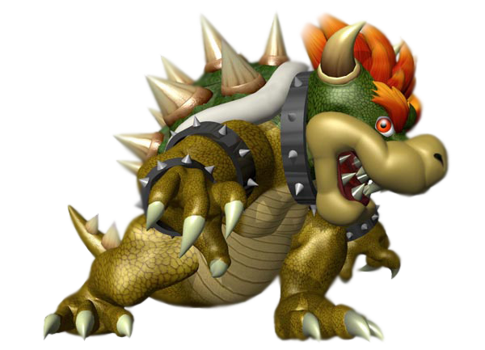</a></td><td>Due to his large sides and slow movement, Bowser only ranks 24th of Melee’s tier. Because he is sluggish and awkward, his powerful attacks don’t help him too much. Though he does have a projectile, it does nothing against opponent’s projectiles, especially lasers. Bowser is both the heaviest and largest character in Melee. So though it is harder to KO him, he’s very easy to hit. The good thing is that he does have a shield to protect himself. He also possess some very strong aerial attacks, but unless L-canceled, they are slow and laggy. His throw is strong but his wave dash is slow, useless even. He has fairly good edge guard, which is good, because he must rely on the edge to score most KO’s. Combos are his biggest weakness.
  
Works:
  
<li>F-ZERO (SNES)</li>
<li>F-ZERO X (N64)</li>
</td></tr></table>
  

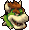&nbsp; &nbsp;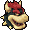&nbsp; &nbsp;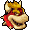&nbsp; &nbsp;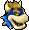&nbsp; &nbsp;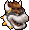&nbsp; &nbsp;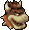




<table class="fixed" >
    <col width="200px" />
    <col width="1000px" />

    <tr>
        <td></td>
<td>Though Luigi has similar qualities as Mario, in Melee, he has his own unique traits. Luigi is a middle weight character and his wavedash attacks is the longest in the game. He ranks 14th in the game and with a short and predictable recovery, it’s easy to see why. His attacks often act as a double-edge sword.
  
Works:
  
<li>F-ZERO (SNES)</li>
<li>F-ZERO X (N64)</li>
</td></tr></table>
  

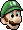&nbsp; &nbsp;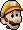&nbsp; &nbsp;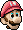&nbsp; &nbsp;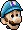&nbsp; &nbsp;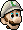&nbsp; &nbsp;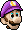




<table class="fixed" >
    <col width="200px" />
    <col width="1000px" />

    <tr>
        <td></td><td>Probably video game’s best known idol is Mario himself and he still remains popular in this game. He is best described as rounded, but average. Yet, he does have better combo hits and throws than most characters. He doesn’t have the best recovery, nor is he reliable when it comes to a finishing move. He is identical to Dr. Mario and Luigi is very similar. He is a middle weight character. He is also a decent edge guarder. Another asset he has in his favor is his cape, as it completely turns the opponent around.
  
Works:
  
<li>F-ZERO (SNES)</li>
<li>F-ZERO X (N64)</li>
</td></tr></table>
  

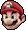&nbsp; &nbsp;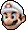&nbsp; &nbsp;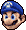&nbsp; &nbsp;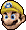&nbsp; &nbsp;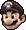&nbsp; &nbsp;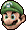




<table class="fixed" >
    <col width="200px" />
    <col width="1000px" />

    <tr>
        <td></td><td>This is the first game to feature Princess Peach and she has some good assets. Though certain moves are hard to regulate, such as the Float, with practice, she is one of the strongest in the game. She ranks 6th for Melee, due to powerful attacks, good recovery, aerial domination, and a sturdy ground level.
  
Works:
  
<li>F-ZERO (SNES)</li>
<li>F-ZERO X (N64)</li>
</td></tr></table>
  

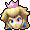&nbsp; &nbsp;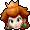&nbsp; &nbsp;&nbsp; &nbsp;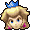&nbsp; &nbsp;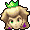&nbsp; &nbsp;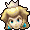




<table class="fixed" >
    <col width="200px" />
    <col width="1000px" />

    <tr>
        <td><a name="yoshi">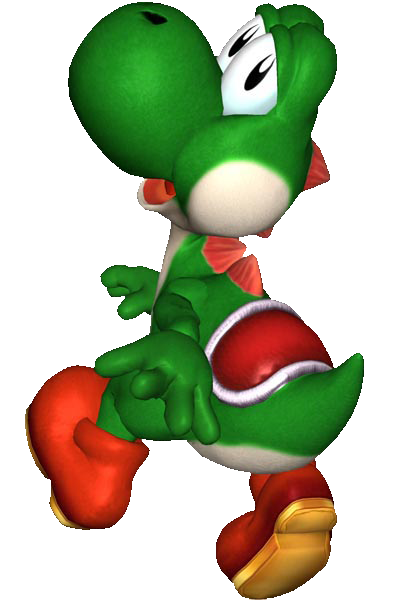</a></td><td>Yoshi is not one of the best characters in Melee, as he’s ranked 21st of the tier list. He lacks a decent third jump and is quite slow in the defense attribute. He also is not able to jump out of his shield and his roll is everything but fast. He has an okay combo routine, alright edge-guarding strategies, and a decent aerial move set. His shield does last longer than the others and is immune to any stabs. Though Yoshi is ranked in the heavy characters, he is small and quick. Yoshi is able to character-juggle pretty well, but it lacks on airy-characters.  
Yoshi also has he highest mid-air jump, but he lacks recovery, so he is in danger of an easy KO on his second jump in an attempt to recover. He does have an overall good air game, but ground is his weakness. His egg roll can easily be an accidental suicide.
  
Works:
  
<li>F-ZERO (SNES)</li>
<li>F-ZERO X (N64)</li>
</td></tr></table>
  

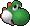&nbsp; &nbsp; 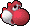&nbsp; &nbsp; &nbsp; &nbsp; 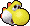&nbsp; &nbsp; 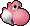 &nbsp; &nbsp;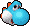




<table class="fixed" >
    <col width="200px" />
    <col width="1000px" />

    <tr>
        <td></td><td>Dr. Mario is ranked 9th of the tier list due to his use of combos and overall roundness as a fighter. Though there are differences in their attacks, they’re near clones. Dr. Mario is the only one to outrank the original in the Smash Bros. series. Due to his aerial, he is a good edge guarder and he is slightly stronger than Mario. He is a heavy weight character unlike Mario, who is middle weight. His Sex Kick gets stronger the more it’s used, but his only real weakness is his short recovery.
  
Works:
  
<li>F-ZERO (SNES)</li>
<li>F-ZERO X (N64)</li>
</td></tr></table>
  

&nbsp; &nbsp;&nbsp; &nbsp;&nbsp; &nbsp;&nbsp; &nbsp;&nbsp; &nbsp;




<table class="fixed" >
    <col width="200px" />
    <col width="1000px" />

    <tr>
        <td><a name="pichu">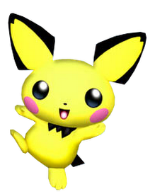</a></td>
<td>Pichu ranks number 26th on the tier, coming in dead last. Though he is smaller and lighter than his near clone, Pikachu, Pichu has very poor range and is a victim for chain throw. Being the lightest character in the game, Pichu is susceptible to recoil. His only favorable matchup is against Kirby.
Being so small, Pichu may be able to dodge, but flies further than the rest. The main problem is that Pichu must be close to the opponent to do damage, and because he is so easily combed, the matchup is unfavorable. Pichu has the shortest forward, backward, and tech/ledge roll in Melee. Its hitbox is also the third smallest in the game, but with it, many combos and chain throws follow.
Pichu usually has a solid KO regardless the many flaws and also possesses three strong Smash attacks. Pichu has decent recovery and chainthrow for fast fallers. Pichu also has a shorter landing lag than any other character. Also, Pichu receieves recoil from electric based-attacks.
  
Works:
  
<li>F-ZERO (SNES)</li>
<li>F-ZERO X (N64)</li>
</td></tr></table>
  

&nbsp; &nbsp;&nbsp; &nbsp;&nbsp; &nbsp;&nbsp; &nbsp;&nbsp; &nbsp;




<table class="fixed" >
    <col width="200px" />
    <col width="1000px" />

    <tr>
        <td><a name="link">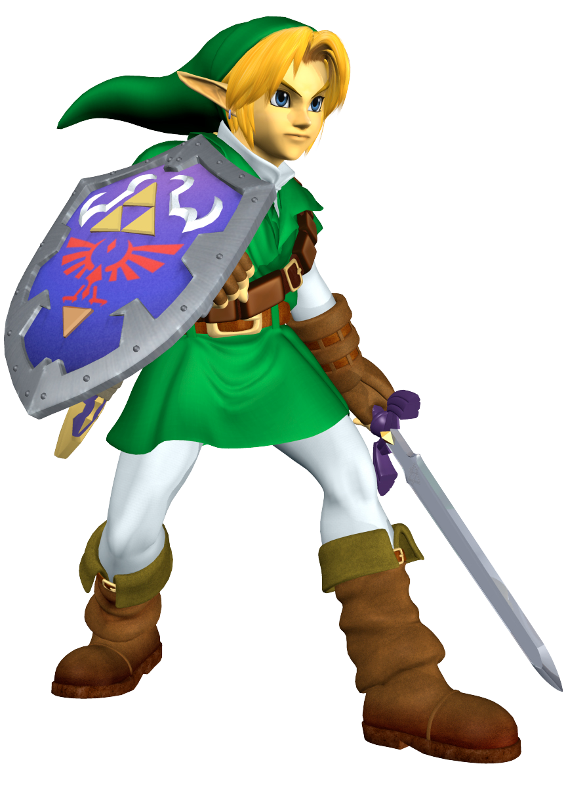</a></td>
<td>Link, being a starter character, possesses many hit or miss factors. Link’s merits include his aerial speed and ability to juggle, good close combat with steady access to long-distance projectiles, and a Hylian shield that protects him from a great deal of projectile attacks. However, he does lack in the throwing department and possesses somewhat slow recovery, resulting in vulnerability. Oddly enough, a character this heavy and slow does possess some speedy merits.
  
When battling with Link, if playing on an NTSC version, his spin attack gives him a beneficial role in edge guarding, and his arsenal contains many goodies such as bombs that provide opportunites for racking up massive damage rather quickly.
  
Link’s throws, although they have some of the worst knockout potential in the game, are not useless. They leave great openings for combos with his superb smash moves and frightening spin attack. His hookshot that he uses for his throws can also be a nifty mind trick for opponents and potentially be a saving throw for an otherwise doomed falling Link.
  
He does fall very fast, due to his weight. His weight also hinders him from moving very fast and far, creating a wavedash that is considered by some totally useless and not worth it. If you are a player that can do a good job of predicting opponents that can make good use of attacks without travelling too fast or far, Link may be a great eccentric character for you, as long as you keep his weaknesses in mind.
  
Works:
  
<li>F-ZERO (SNES)</li>
<li>F-ZERO X (N64)</li>
</td></tr></table>
  

&nbsp; &nbsp;&nbsp; &nbsp;&nbsp; &nbsp;&nbsp; &nbsp;&nbsp; &nbsp;




<table class="fixed" >
    <col width="275px" />
    <col width="700px" />

    <tr>
        <td></td><td>Captain Falcon is the player’s character from F-Zero, a racing game. In addition to being a great pilot, he is also a bounty hunter. He is from Port Town on Earth. Because of his bounty hunting, he has made a lot of enemies, and lives in seclusion when he’s not working. Now he's back again to pound the others with his memorable punch!
  
Though Ganondorf is his clone, he is much faster while still being very powerful. He should be played to combo, especially with aerials, as much as possible. He has the best dash dance in the game and is a fastfaller. His most powerful attacks are slow and he doesn’t have a good way to deal with projectiles, so players need to use his speed and combo abilities to make up for it.
  
Works:
  
<li>GAMES</li>

</td></tr></table>

 
&nbsp; &nbsp;

&nbsp; &nbsp;

&nbsp; &nbsp;

&nbsp; &nbsp;




<table class="fixed" >
    <col width="275px" />
    <col width="700px" />

    <tr>
        <td></td><td>INSERT CHARACTER BIO HERE
  
INSERT CHARACTER GAMEPLAY INFO HERE
  
Works:
  
<li>GAMES</li>

</td></tr></table>

 
&nbsp; &nbsp;

&nbsp; &nbsp;

&nbsp; &nbsp;

&nbsp; &nbsp;
















<table class="fixed" >
    <col width="200px" />
    <col width="1000px" />

    <tr>
        <td></td><td>The Ice Climbers are a mountain climbing duo debuting in the 1985 NES title “Ice Climber”. Also known as Popo (blue) and Nana (pink), the Ice Climbers scale large snowy mountains together, fighting off enemies with their hammers and collecting vegetables along the way.

  Since Popo and Nana both fight together in Smash Bros., they are unique in the fact that they are two fighters in one. They rank 7th on the tier list because they are able to quickly damage, perform combos, and KO opponents. However, the Ice Climbers are also very floaty, and while that may help with their wavedash, they are overall at a disadvantage when in the air. The Ice Climbers have a unique move called Wobbling (which will be explored below). In addition, the player controls Popo while Nana simply follows. If Nana is KO’d, Popo is left alone until he is KO’d and his attacks are much weaker with Nana’s assistance. If Popo is KO’d, Nana is as well.
  
Works:
  
<li>Ice Climber (NES)</li>
</td></tr></table>
  




<table class="fixed" >
    <col width="275px" />
    <col width="700px" />

    <tr>
        <td></td><td>INSERT After many adventures in Dream Land, Kirby is ready for another go in battle in Super Smash Bros. Melee. With a plethora of moves at his disposal only one question remains. Does this titular pink puff have the stuff?
  
Unlike Smash 64, Kirby is considered the worst character in Super Smash Bros. Melee. He is at the bottom of the tier list and gets countered hard by 7 characters. He is very light and dies early. He has little to no punish game due to his slow aerial momentum, bad aerial frame data, and slow ground speed. Also his throws don't really lead into anything, which really puts Kirby at a disadvantage when you have characters like Fox, Falco, and Marth on the opposite side of the spectrum. On the topic of his throws, forward throw and back throw can be easily mashed out of at low percents. Despite all these setbacks and weaknesses, Kirby does shine in some regards. He has some strong moves like back air, forward air, and up air. These also provide a potentially good gimp game. Dair in particular is a solid move. Kirby's wave dash is also pretty decent, so his movement is completely awful. With the right person behind the controller he doesn't seem as bad but his disadvantages are always evident.
  
Works:
  
<li>GAMES</li>

</td></tr></table>

 
&nbsp; &nbsp;

&nbsp; &nbsp;

&nbsp; &nbsp;

&nbsp; &nbsp;


