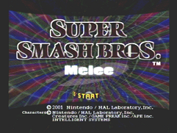
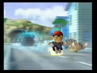
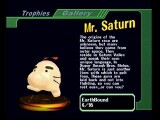



	
	<table valign="top">
		<tr>
			<td class="label">Title:</td>
			<td>Super Smash Bros. Melee (US) Dairantou Smash Brothers DX (JP)</td>
		</tr>
		<tr>
			<td class="label">System:</td>
			<td>Nintendo Gamecube</td>
		</tr>
		<tr>
			<td class="label">Genre:</td>
			<td>Action/Fighting</td>
		</tr>
		<tr>
			<td class="label">Release:</td>
			<td>December 3, 2001 (US) May 24, 2002 (EU) November 21, 2001 (JP) May 31, 2002 (AUS)</td>
		</tr>
		<tr>
			<td class="label">Rating:</td>
			<td>T for Teen (ESRB) Ages 12+ (EU)</td>
		</tr>
		<tr>
			<td class="label">Price:</td>
			<td>$49.99 (US) £39.99 (UK) ￥6,800 (JP)</td>
		</tr>
		<tr>
			<td class="label">Players:</td>
			<td>1-4</td>
		</tr>
		<tr>
			<td class="label">Save:</td>
			<td>Memory card - 11 blocks</td>
		</tr>
		<tr>
			<td class="label">Publisher:</td>
			<td>Nintendo</td>
		</tr>
		<tr>
			<td class="label">Developer:</td>
			<td>HAL Laboratories</td>
		</tr>
	</table>

What is this? Our favorite Nintendo icons duking it out once again? In one of the Gamecube's biggest titles? And it has even MORE EarthBound excitement than the last one?! Impossible you say? No! It's INCREDIBLE!

   

   Super Smash Bros. Melee, or SSBM for short, was released just weeks after the launch of the Gamecube.
   It has 25 playable Nintendo icons to choose from, many single player modes, numerous multiplayer modes, and enough options to keep all of these modes exciting every time! There are 290 collectible trophies, some only available with certain memory card data, and more than enough stages to add total chaos to any fight.
   On a larger note, our loveable hero from EarthBound, Ness, is a featured main character in the game.  Onett and Fourside just happen
   to be selectable levels, multiple EarthBound trophies exist in the game to be unlocked, and even Mr. Saturn makes an appearance as an item! But, on the other hand, we're not really sure what he does.

   This section of Starmen.net is dedicated to this Nintendo All-Star beat-em-up
   in every way that we can relate it to EarthBound, and then some.  So, if
   you have some questions on how to use Ness, or just want to see some
   pictures of Nintendo's best characters in action, there's no better place.
   Music, movies, images, and more, all pertaining to Earthbound, are found
   here.  And it's not without credit to you: the viewer.  So, if there's
   something you know about or have, that pertains to EarthBound and/or
   SSBM, and you want people to see it, then send it here and make it known!




<b>October 30, 2016:</b>
<ul><li>All music added. Characters and movesets underway. --CerealQueen</li></ul>

<b>February 27, 2006:</b> 
&nbsp; &nbsp; &#149; Thumbnailed the screenshots  

<b>August 26th, 2005:</b> 
&nbsp; &nbsp; &#149; Added Vital Stats  
&nbsp; &nbsp; &#149; Updated main text  

<b>August 10th, 2005:</b> 
&nbsp; &nbsp; &#149; <a href="videos/">Videos</a> section has received a MAJOR facelift and has some wonderful new submissions.  



<table1 />
Section maintainer: 
<table2 />
<a href="https://forum.starmen.net/members/CerealQueen">CerealQueen</a> 
<table3 />

