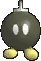
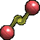
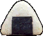
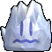
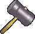
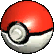


Listed below are the various items used in the game, their function, and a few useful tips.  

If you want to view a full list of trophies, you can do so <a href="https://starmen.net/ssbm/items/trophies/">here.</a>



<table class="fixed" border="1">
    <col width="200px" />
    <col width="150px" />
    <col width="800px" />
  <tr>
    <th>&nbsp;</th>
    <th>Barrel Cannon</th>
    <td>
When thrown, the Barrel Cannon will steadily move forward and spin across the stage. If a player makes contact, they will be forced inside and then after a short time, they will be jetted into the direction the arrow on the barrel is facing. While it can get someone out of a jam, if a player is not careful, they could send themselves flying out of bounds. If a player touches an occupied cannon, they will take a small amount of damage. This is also an obstacle in select stages.
</td>
  </tr>
  <tr>
    <th>&nbsp;</th>
    <th>Beam Sword</th>
    <td>
This item tends to be a fan favorite, large in part to its appearance, but its a useful item. The beam's size depends in the character holding the weapon and the power put behind the attack. Throwing the item can prove to be fatal as well.
</td>
  </tr>
  <tr>
    <th>&nbsp;</th>
    <th>Bob-omb</th>
    <td>
The Bob-omb is a risky item to deal with. After about 5 seconds, if left alone, it will start walking back and forth across the stage, only to explode a short time later. Even if a player holds it, it does not halt the timer. It's a great item to KO players with high percentages.
</td>
  </tr>
  <tr>
    <th>&nbsp;</th>
    <th>Bunny Hood</th>
    <td>
By equipping this head accessory, the wielder's movements will be significantly quicker. Running, jumping, and falling will be significantly faster for around ten seconds. A player can also equip another item while wearing the Bunny Hood.
</td>
  </tr>
  <tr>
    <th>&nbsp;</th>
    <th>Cloaking Device</th>
    <td>
Upon picking this up, a player will appear nearly invisible. However, this can be a double-edge sword, because while it may confuse opponents, a player may have a hard time making out their character, the best way to keep track is by the player name above the model. This item does not work against computers. While activated, a player can still pick up and use other items.
</td>
  </tr>
  <tr>
    <th>&nbsp;</th>
    <th>Fan</th>
    <td>
This item may not leave a strong impression, as it only deals 1% of damage, but it is able to rapidly hit an opponent, trapping the foe in a barrage of attacks that can be difficult to escape. Fans also break through shields more easily than other items.
</td>
  </tr>
  <tr>
    <th>&nbsp;</th>
    <th>Fire Flower</th>
    <td>
Picking up and using this item will cause fire to spew from the flower for about up to 10 seconds. Throwing the item at another player will burn them a bit and result in a small amount of damage.
</td>
  </tr>
  <tr>
    <th>&nbsp;</th>
    <th>Flipper</th>
    <td>
The Flipper will float in the place it is thrown and if a player comes into contact with it, they will be smacked around a bit, taking a bit of damage and being stunned for a brief time. A good use for this item are placing it over edges to prevent an opponent from recovering. 
</td>
  </tr>
  <tr>
    <th>&nbsp;</th>
    <th>Food</th>
    <td>
A variety of food can be found in the game. Party Ball's may drop several different types of food. Picking it a piece of food will recover 3-8% of health, depending on the item. Food can be picked up even when holding another item.
</td>
  </tr>
  <tr>
    <th>&nbsp;</th>
    <th>Freezie</th>
    <td>
This item can be thrown and players and freezes them in place for a short amount of time. The higher damage percentage a person has, the longer they'll stay frozen. The best methods for the item is to use the time to charge a Smash attack or use it to on a scrolling stage to knock a player out of bounds. A fire attack on the ice will immediately melt a player and the item itself can easily be shattered.
</td>
  </tr>
  <tr>
    <th>&nbsp;</th>
    <th>Green Shell</th>
    <td>
This can be used to knock back and damage an opponent. Unlike a Red Shell, it can be stopped by jumping on it or reversed by hitting it. When thrown, the Green Shell will follow the stage, going in one direction unless hit, going into a wall, or going offstage.
</td>
  </tr>
  <tr>
    <th>&nbsp;</th>
    <th>Hammer</th>
    <td>
After picking up the Hammer, the player will go into an animation and is unable to throw the item away and it expires after a small amount of time. Coming into contact results in a powerful move that sends players flying into the air, with a high chance of an immediate KO. While using the weapon, the player is restricted to a single jump and can still retain damage from select direct attacks, such as Kirby's Stone move. There is a chance for the head of the hammer to fall off, leaving the player defenseless, but the head can still be picked up and deal a hefty amount of damage.
</td>
  </tr>
  <tr>
    <th>&nbsp;</th>
    <th>Heart Piece</th>
    <td>
While typically taking off 100 points of percentage damage, in All-Star mode, it full heals a player. It has a weakened effect compared to the earlier title.
</td>
  </tr>
  <tr>
    <th>&nbsp;</th>
    <th>Home-Run Bat</th>
    <td>
There's more to this weapon than at first glance. A standard attack deals a fair amount of damage, but its true potential lies in its Smash attack. By charging the bat, if the player makes contact with another player, they will instantly be sent flying off the field in a KO (surrounds depending.) It's a strong weapon if the player is able to land a hit.
</td>
  </tr>
  <tr>
    <th>&nbsp;</th>
    <th>Lip's Stick</th>
    <td>
This item is similar to the Beam Sword, but its swings deal less damage. However, 
 if a player is able to hit another player with the Lip's Stick, a flower will spurt on the opponent's head and slowly deal damage. Further hits will cause the flower to grow and deal more continuous damage. The flower can fall off by shaking the character with quick movements on the joystick.
</td>
  </tr>
  <tr>
    <th>&nbsp;</th>
    <th>Maxim Tomato</th>
    <td>
This is another healing item, but one that took a downgrade from the former title. It reduces a player's damage percentage by 50%.
</td>
  </tr>
  <tr>
    <th>&nbsp;</th>
    <th>Metal Box</th>
    <td>
By picking this up, the character will be covered in a coat of metal. Their movements are more sluggish, making their speed far slower and greatly reducing their jump ability. However, it does make it harder to throw the player. If equipped, the character can still use other items.
</td>
  </tr>
  <tr>
    <th>&nbsp;</th>
    <th>Motion-Sensor Bomb</th>
    <td>
This item will stick to the surface where thrown, even on a wall of slope. If a player or item comes in proximity of the bomb, it will activate and do a decent amount of damage to a player. Even the player who plants the item is not immune to its effects. If a player has a high damage percentage, this item is useful for causing a KO.
</td>
  </tr>
  <tr>
    <th>&nbsp;</th>
    <th>Mr. Saturn</th>
    <td>
Mr. Saturn is an item with the purpose of being thrown. Unlike other items, Mr. Saturn can be picked up and thrown rapidly, dealing a bit of damage each time and is useful for breaking opponent's shields.
</td>
  </tr>
  <tr>
    <th>&nbsp;</th>
    <th>Parasol</th>
    <td>
Not only can this be used to smack about opponents, but it doubles its use as it allows a player to guide themselves more slowly and safely back to the stage.
</td>
  </tr>
  <tr>
    <th>&nbsp;</th>
    <th>Party Ball</th>
    <td>
This is a container item new to the game. Approximately 6 seconds after activating, the ball will release a random lot of items, each having a determined rarity. 
Self-destruction: 10% - Explode on impact 
Food banquet: 36% - About 15 pieces of food items drop 
Bob-omb fest: 12% - 4 Bob-ombs will release 
Other: 42% - A lot of 4 random items will appear
</td>
  </tr>
  <tr>
    <th>&nbsp;</th>
    <th>Poison Mushroom</th>
    <td>
Sharing a similar appearance to the Super Mushroom, the Poison Mushroom can trick players into nabbing it, only to be shrunk down significantly in size. Smaller players are dealt more damage and are far easier to knock back. When under the affects, characters can still weild items, however.
</td>
  </tr>
  <tr>
    <th>&nbsp;</th>
    <th>Poke Ball</th>
    <td>
Inside the ball is a random Pokemon, only to be revealed when thrown. Hitting a player with the ball itself can deal a little damage. You can see a full list of the various Pokemon and their affects below.
</td>
  </tr>
  <tr>
    <th>&nbsp;</th>
    <th>Ray Gun</th>
    <td>
This can fire off 16 laser shots, dealing moderate damage and is can rack up a chain attack. Throwing the item at another player also can deal a decent hit.
</td>
  </tr>
  <tr>
    <th>&nbsp;</th>
    <th>Red Shell</th>
    <td>
Compared to the Green Shell, the Red Shell is more powerful and unlike the other, its movements will follow a player and continuously bash into them for about 15 seconds. Certain moves can reflect the shell, but can only be used 5 times.
</td>
  </tr>
  <tr>
    <th>&nbsp;</th>
    <th>Screw Attack</th>
    <td>
If a player equips this item, their jump will replicate Samus's Screw attack, damaging opponents in an aerial motion. It only lasts for a select amount of time. It can also be thrown at another player, which will result in them immediately performing the move, leaving a moment at the end of the animation to perform a strike, but if you're too close, you'll get caught in the attack.
</td>
  </tr>
  <tr>
    <th>&nbsp;</th>
    <th>Star Rod</th>
    <td>
The Star Rod is capable of both standard melee weapon use and can also fire a star-shaped projectile. All in all, this item can fire 20 shots, each time firing one. There is an exception to this however; Captain Falcon is able to fire three shots, albeit a slightly smaller size and Sheik is able to produce two.
</td>
  </tr>
  <tr>
    <th>&nbsp;</th>
    <th>Starman</th>
    <td>
This item will appear and bounce across the stage. The first person to make contact will start to sparkle and will be invulnerable to attacks for a short amount of time, though can still KO from falling off stage. If a player were to touch the Starman, computer opponents would immediately flee from the player.
</td>
  </tr>
  <tr>
    <th>&nbsp;</th>
    <th>Super Mushroom</th>
    <td>
If a character makes contact with a Super Mushroom, they grow a noticable amount in size for a short period of time. The enlarged character's attacks will do more damage and are harder to throw/knock back. Some stage obstacles can prove tricky to navigate through when big, however. Players are able to pick up other items when under the mushroom's affect.
</td>
  </tr>
  <tr>
    <th>&nbsp;</th>
    <th>Super Scope</th>
    <td>
This weapon can deal 20 rapid-fire shots to an opponent. It is able to pass through players and items, so it is able to hit several players at once and the rapid rate of shots can leave an opponent stunned. This gun can instead be charged to deal a larger and stronger attack, which will automatically fire once fully charged; you cannot move while charging and is limited to 3, however. 
</td>
  </tr>
  <tr>
    <th>&nbsp;</th>
    <th>Warp Star</th>
    <td>
Upon picking this up, the player boards the star and shoots off into the sky. While offscreen, the player can aim for their starting location and attempt to plummet it into opponents, but does so blindly, so it is possible to overshoots and slam off stage.
</td>
  </tr>
</table>

