




<table class="fixed" border="1">
    <col width="200px" />
    <col width="150px" />
    <col width="800px" />

  <tr>
    <th></th>
    <th><b>Barrel Cannon</b></th>
    <td>
The Barrel Cannons were used in Donkey Kong games as a vital means of transportation, and their explosive nature is used similarly in Super Smash Bros. Melee. On the Kongo Jungle stage, one can catch characters as they fall from the main platform. Careful! The Barrel Cannon rotation may accidentally send you flying off the screen.
</td>
  </tr>

  <tr>
    <th></th>
    <th><b>Dixie Kong</b></th>
    <td>
More than just Diddy Kong's girlfriend, Dixie Kong is also a fearless adventurer and a reliable team player. She earned her wings helping Diddy rescue Donkey Kong from the clutches of King K. Rool. Dixie's amazingly quick and nimble, and she's even able to twirl her ponytail in order to float slowly through the air.
</td>
  </tr>

  <tr>
    <th></th>
    <th><b>Donkey Kong</b></th>
    <td>
While he now prefers the laid-back jungle lifestyle to construction site mischief, DK is often forced back into action by the Kremling Krew. The great ape is quite fast despite his burly physique, and he keeps his strength up with a steady diet of his favorite food: bananas. His one extravagance (and only piece of clothing) is a monogrammed necktie.
</td>
  </tr>

  <tr>
    <th></th>
    <th><b>Donkey Kong [Smash]</b></th>
    <td>
Donkey Kong is a huge target in a fight, so he hates crowds. When he's in the fray, his Giant Punch deals serious damage to multiple opponents. The big ape's Headbutt hits so hard that it temporarily buries opponent's in the ground. DK is a lot faster than he looks, and he's lethal in the hands of a master.
</td>
  </tr>

  <tr>
    <th></th>
    <th><b>Donkey Kong [Smash]</b></th>
    <td>
Being the strongest simian around, DK has the upper hand once he grabs an opponent. He can even lift his foe up and make him or her an unwilling traveling companion; if DK grabs you, shake your Control Stick as fast as you can to break his grip. His Spinning Kong covers more lateral distance than vertical, so use it quickly to recover.
</td>
  </tr>

  <tr>
    <th></th>
    <th><b>Donkey Kong Junior</b></th>
    <td>
Donkey Kong Jr. came to the rescue when Mario imprisoned his father. DK Jr.'s challenge was to collect the keys to Donkey Kong's cage, all the while dropping fruit on the enemies from high above. He was able to climb faster by using two ivy vines at once. This ape is also quite skilled as kart racing, tennis, and mathematics.
</td>
  </tr>

  <tr>
    <th>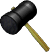</th>
    <th><b>Hammer</b></th>
    <td>
If you grab the Hammer, you'll run across the screen swinging it back and forth nonstop. In Donkey Kong, Mario used the Hammer in exactly the same fashion. It's an extremely powerful item, but you have no recovery move when carrying it. Every now and then, the mallet head will fall off, and you'll end up completely vulnerable, swinging just the handle.
</td>
  </tr>

  <tr>
    <th></th>
    <th><b>King K. Rool</b></th>
    <td>
The demented head of the Kremlings and big boss in the Donkey Kong series. K. Rool is a giant, greedy glutton with a serious eye tic. While he fits the evil boss mold nicely, he's just enough of a bumbler to have gained a few fans over the years. His plan to blow up the DK Isles with his Blast-o-Matic shows how unbalanced he is.
</td>
  </tr>

  <tr>
    <th></th>
    <th><b>Klap Trap</b></th>
    <td>
This low-slung alligator made its first appearance in Donkey Kong Country. You can subdue it by jumping on its back, but it's powerful jaws make it dangerous to approach from the front. In Super Smash Bros. Melee, it swims in the river and sometimes jumps in the Barrel Cannon to stop players from using it.
</td>
  </tr>

</table>



<table class="fixed" border="1">
    <col width="200px" />
    <col width="150px" />
    <col width="800px" />

  <tr>
    <th>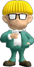</th>
    <th><b>Jeff</b></th>
    <td>
Another of Ness's close friends in EarthBound, Jeff is the only son of the famous scientist, Dr. Andonuts. Jeff is a mechanical genius, able to turn common, broken tools into complex weapons like the Hungry HP-sucker and the Slime Generator. He's a bit on the shy side but incredibly intelligent and brave in the heat of battle.
</td>
  </tr>
  <tr>
    <th></th>
    <th><b>Mr. Saturn</b></th>
    <td>
The origins of the Mr. Saturn race are unknown, but many believe they came from outer space. They reside in Saturn Valley and speak their own unique language. In Super Smash Bros. Melee, Mr. Saturn is just another item with which to pelt foes. These guys are laid back and not into fighting, so you can rest easy ...or can you?
</td>
  </tr>
  <tr>
    <th>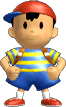</th>
    <th><b>Ness</b></th>
    <td>
Ness is a young boy who's mastered the psychic power known as PSI. Ness was living a normal life in the suburbs of Onett until a meteor crashed into a nearby mountain and sent him on a wild adventure. Believing in the ultimate powers of wisdom, courage, and friendship, Ness proves that some heroes come in small packages.
</td>
  </tr>
  <tr>
    <th></th>
    <th><b>Ness [Smash]</b></th>
    <td>
The key to mastering Ness is controlling his unique midair jump, which makes up for what he lacks in speed. His PK Flash attack may seem weak at first glance, but it grows more powerful the longer you hold down the B Button. To do a lot of damage with PK Fire, try to burn your opponent as many times as possible.
</td>
  </tr>
  <tr>
    <th></th>
    <th><b>Ness [Smash]</b></th>
    <td>
Ness' mind is his best weapon. PK Thunder is a PSI missile weapon that can be guided using the Control Stick, and if Ness hits himself with it, he turns into a living missile capable of doing massive damage. This move can also be used for recovery. PSI Magnet turns energy missile attacks into health; try out certain Pokémon for stamina replenishment.
</td>
  </tr>
  <tr>
    <th>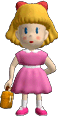</th>
    <th><b>Paula</b></th>
    <td>
Paula is a PSI master who used her incredible psychic abilities to call Ness from afar. Ness rescued Paula from the blue-stained clutches of the Happy Happyist cult, and she became integral to his EarthBound adventure. Originally, Ness didn't know either PK Thunder or PK Fire, so Paula probably taught him these techniques.
</td>
  </tr>
  <tr>
    <th>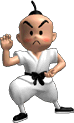</th>
    <th><b>Poo</b></th>
    <td>
Poo, the crown prince of the mysterious eastern country of Dalaam, joined Ness after completing rigorous training in his home country. While he doesn't stand out among Ness's friends, his vast experience and strong willpower make him a key to their success. Poo can assume the form of an enemy to gain its powers.
</td>
  </tr>
  <tr>
    <th></th>
    <th><b>Starman</b></th>
    <td>
Just one kooky subset of the diverse cast of enemies in EarthBound, these strange creatures are aliens in the employ of Giygas. Variations of the Starman race include Starman, Starman Jr., Starman Deluxe, and Starman Super. They all use PSI powers, but their strength differs depending on the level on which they're found.
</td>
  </tr>
  <tr>
    <th>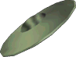</th>
    <th><b>UFO</b></th>
    <td>
At the beginning of EarthBound, this flying saucer appears along with the ominous message, "The War Against Giygas!" Adding to the mystery are three more UFOs while fly amok in the skies over Onett; how all of these alien craft are connected is anyone's guess. In Super Smash Bros. Melee, this slippery UFO appears on the Fourside level.
</td>
  </tr>
</table>




<table class="fixed" border="1">
    <col width="200px" />
    <col width="150px" />
    <col width="800px" />
  <tr>
    <th>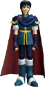</th>
    <th><b>Marth</b></th>
    <td>
The betrayed prince of the Kingdom of Altea, the blood of the hero Anri flows in Marth's veins. He was forced into exile when the kingdom of Dolua invaded Altea. Then, wielding his divine sword Falchion, he led a revolt and defeated the dark dragon Medeus. Afterwards, Altea was annihilated by King Hardin of Akanea.
</td>
  </tr>
  <tr>
    <th></th>
    <th><b>Marth [Smash]</b></th>
    <td>
Marth is a magnificent swordsman. While his swordplay is faster than that of Link, he lacks power, and his quickness if offset by a marginal endurance. His Shield Breaker gains power the longer it's held. The Dancing Blade combination uses both the Control Stick and the B Button to produce a series of up to four attacks.
</td>
  </tr>
  <tr>
    <th></th>
    <th><b>Marth [Smash]</b></th>
    <td>
The tip of Marth's blade causes the most damage, so you should try to create adequate distance between you and your enemy to gracefully strike with that point. Marth's Dolphin Slash is fast and powerful, but it leaves him vulnerable upon landing. Marth uses Counter to block a foe's attack and deal a return strike. If you're fighting a Counter-happy Marth, grab him.
</td>
  </tr>
  <tr>
    <th></th>
    <th><b>Roy</b></th>
    <td>
The son of the lord of Pharae Principality, Roy was studying in Ostia when the Kingdom of Bern invaded League of Lycia. His father fell ill at this time, so Roy assumed leadership of Pharae's armies. After his fateful meeting with the Princess Guinevere, his destiny became inextricably linked with the fate of the entire continent.
</td>
  </tr>
  <tr>
    <th></th>
    <th><b>Roy [Smash]</b></th>
    <td>
While Roy's moves are well balanced, he's a little on the slow side, and doesn't excel at midair combat. His blade, the Sword of Seals, gives him excellent reach, and makes his Double-Edge Dance slightly different then Marth's Dancing Blade. When it's fully charged, Roy's destructive Flare Blade delivers an instant KO.
</td>
  </tr>
  <tr>
    <th></th>
    <th><b>Roy [Smash]</b></th>
    <td>
Roy's blade is different than Marth's: he does the most damage hitting with the center of his sword. So, a fearless advance into the arms of his foe is Roy's best bet. Blazer is a bit slower than Marth's Dolphin Slash, but it's still a mighty attack that sets anyone it strikes aflame. Roy's attack after using Counter differs slightly from Marth's.
</td>
  </tr>
</table>




<table class="fixed" border="1">
    <col width="200px" />
    <col width="150px" />
    <col width="800px" />
  <tr>
    <th></th>
    <th><b>Captain Falcon</b></th>
    <td>
Usually a relentless bounty hunter, Captain Falcon shifts gears to become a race pilot once the F-Zero Grand Prix begins. His beloved racer, the Blue Falcon, can exceed the speed of sound, and he knows how to drive it; he'll go down as one of the all time-greats. Now 36 years old, Captain Falcon wears his F-Zero X visor.
</td>
  </tr>
  <tr>
    <th></th>
    <th><b>Captain Falcon [Smash]</b></th>
    <td>
Falcon's style is a balanced combination of raw power and speed. His attacks are slow, but when combined with Falcon's high mobility, he's a formidable combat force. The Falcon Punch packs the highest degree of destructive power, while the explosive Raptor Boost can be used to smash airborne foes into the depths.
</td>
  </tr>
  <tr>
    <th></th>
    <th><b>Captain Falcon [Smash]</b></th>
    <td>
The Knee Smash, used in midair on foes in front of you, is slow and has a short reach, but if it connects, it'll send foes flying a long way on a low trajectory. Falcon uses his Falcon Dive to grab an enemy in midair and fling them away with an explosive blast. He can do this technique repeatedly without landing, so it can also be used as a recovery move.
</td>
  </tr>
  <tr>
    <th></th>
    <th><b>Dr. Stewart</b></th>
    <td>
Dr. Stewart inherited the Golden Fox upon the death of his father and soon became an F-Zero pacesetter. The Fox, which bears the lucky number 3, doesn't have the highest of traction ratings, but a skilled pilot will thrill at the sensation of drifting through corners. This machine requires a high degree of technical ability.
</td>
  </tr>
  <tr>
    <th></th>
    <th><b>Falcon Flyer</b></th>
    <td>
Captain Falcon's speedy midsize star cruiser boasts an on-board computer that allows Falcon to control it remotely ... perhaps that's why it's never appeared on-screen in an F-Zero game. Without this ship, Falcon couldn't prowl the galaxy like a lone wolf: the Blue Falcon is a state-of-the-art machine, but it's only used for F-Zero races.
</td>
  </tr>
  <tr>
    <th></th>
    <th><b>F-Zero Racers</b></th>
    <td>
In the year 2560, an association of wealthy space merchants created the F-Zero Grand Prix in an attempt to add some excitement to their opulent lifestyles. The jet-powered racers have no tires, but use G-Diffuser systems to float a foot above the surface. Many believe the F-Zero championship is the highest claim to fame in the galaxy.
</td>
  </tr>
  <tr>
    <th></th>
    <th><b>Jody Summer</b></th>
    <td>
An ex-fighter pilot, Jody brings her skills to the F-Zero Grand Prix as an ambassador of the interstellar regime. Her machine, the White Cat, is not built for strength or endurance. However, it's incredibly light and has excellent traction. A good match for beginners, the White Cat's a solid all-around racer.
</td>
  </tr>
  <tr>
    <th></th>
    <th><b>Mute City</b></th>
    <td>
F-Zero courses are set hundreds of feet above ground and kept afloat by opposing-gravity guard beams on both sides of the tracks. Mute City, which grew from an intergalactic trading post to a city with a population of over two billion, is the most famous stop on the F-Zero Grand Prix. This course layout is from the F-Zero X era.
</td>
  </tr>
  <tr>
    <th></th>
    <th><b>Samurai Goroh</b></th>
    <td>
A rival bounty hunter, Samurai Goroh has crossed paths with Captain Falcon in many a dark corner of the universe. He also goes head-to-head with Falcon in F-Zero races, so the threads of their fates seem to be deeply intertwined. Samurai Goroh is famous for his katana, and his signature T-shirt is instantly recognizable.
</td>
  </tr>
</table>




<table class="fixed" border="1">
    <col width="200px" />
    <col width="150px" />
    <col width="800px" />
  <tr>
    <th></th>
    <th><b>Game & Watch</b></th>
    <td>
This stage of Super Smash Bros. Melee takes its motif from the Game & Watch series. It incorporates settings from Oil Panic, Helmet, and Manhole, and it's sure to send a wave of nostalgia crashing over old-school gamers. If you want to truly reproduce the Game & Watch experience, try playing this unique level in Fixed-Camera Mode!.
</td>
  </tr>
  <tr>
    <th></th>
    <th><b>Mr. Game & Watch</b></th>
    <td>
First appearing in 1980, the Game & Watch series is the father of all portable liquid crystal games. The main character is simple and monochrome but has a timeless individuality. There are 39 different games in the series and they've sold over 43 million units worldwide. Pictured at left is the particularly popular Fire model.
</td>
  </tr>
  <tr>
    <th></th>
    <th><b>Mr. Game & Watch [Smash]</b></th>
    <td>
A resident of a totally flat world, Mr. Game & Watch's frame-by-frame movement is distinctive. His image is known far and wide and respected by gamers everywhere. In Super Smash Bros. Melee, he hurls sausages with his Chef technique. The random strength of his Judgment is determined by the number displayed; food appears on lucky 7.
</td>
  </tr>
  <tr>
    <th></th>
    <th><b>Mr. Game & Watch [Smash]</b></th>
    <td>
A man of great stature in the world of Nintendo characters, Mr. Game & Watch is a comparatively light fellow and doesn't feature many powerful attacks. When he's in danger of falling, Fire calls out a rescue brigade to send him skyward once more. He can also catch missile weapons with Oil Panic; once he's caught three, he can dump the bucket on his foes.
</td>
  </tr>
</table>




<table class="fixed" border="1">
    <col width="200px" />
    <col width="150px" />
    <col width="800px" />
  <tr>
    <th></th>
    <th><b>Ice Climbers</b></th>
    <td>
That's Popo in the blue and Nana in the pink. These two stars of the game Ice Climber have scaled many an icy summit in their mountaineering careers. Back in their glory days, they chased eggplants, cucumbers, and other vegetables that inexplicably fell from frosty summits when a condor reigned supreme. They're rarely seen apart.
</td>
  </tr>
  <tr>
    <th></th>
    <th><b>Ice Climbers [Smash]</b></th>
    <td>
This unique twosome fights together as a team. Your score will not be affected if the CPU-controlled character is KO'd, but a lone Ice Climber won't be able to use teamwork moves, which will make for a tough and frantic solo fight. The Ice Shot fires mini-glaciers out of their hammers, while Squall Hammer is at its strongest when Nana and Popo combine their strength.
</td>
  </tr>
  <tr>
    <th></th>
    <th><b>Ice Climbers [Smash]</b></th>
    <td>
The colors of the Ice Climbers' parkas denotes who's in the lead: Nana's in pink or orange, while Popo's in green or blue. Their hairstyles are also slightly different. Belay allows them to cover great distances, but doesn't give foes the chance to target their landing. Blizzard is best used in close quarters; in the fray, Nana and Popo will sometimes freeze opponents.
</td>
  </tr>
  <tr>
    <th></th>
    <th><b>Polar Bear</b></th>
    <td>
This bizarre beast appears whenever the Ice Climbers take five during their ascents. Each leap the upright bear makes causes an earthquake and makes the mountain scroll upward. If the climbers fall off the bottom of the screen, they'll drop into a bottomless chasm. For reasons unknown, it sports pink shorts and sunglasses.
</td>
  </tr>
  <tr>
    <th>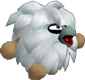</th>
    <th><b>Topi</b></th>
    <td>
Topis debuted in the game Ice Climber, shuttling ice with which to repair cracks in the floors. They were kept really busy as Nana and Popo constantly cracked the floors with single strikes of their ice hammers. Despite the monotony of their chilly work, these creatures never slacked off for an instant.
</td>
  </tr>
</table>




<table class="fixed" border="1">
    <col width="200px" />
    <col width="150px" />
    <col width="800px" />
  <tr>
    <th></th>
    <th><b>Ball Kirby</b></th>
    <td>
When Kirby swallows a ball enemy, he turns into a ball and can bounce off of floors and walls. It's tough to control, but well worth it for the strong attack power it gives Kirby. After his debut in Kirby's Adventure, Ball Kirby has popped up in several more Kirby games, such as Kirby's Pinball Land and Kirby's Block Ball.
</td>
  </tr>
  <tr>
    <th></th>
    <th><b>Fighter Kirby</b></th>
    <td>
Kirby dons a warrior's headband and becomes a fierce fighter when he swallows an enemy skilled at physical attacks. Fighter Kirby uses many colorful punching and kicking moves as he overpowers his enemies with his sparring skills. The Vulcan Jab is just one of the many techniques Kirby can use thanks to his copying power.
</td>
  </tr>
  <tr>
    <th></th>
    <th><b>Fire Kirby</b></th>
    <td>
When Kirby swallows a fire-wielding enemy, he transforms into Fire Kirby. Not only does he breathe fire in this form, but he can also sprout flames on his entire body and damage enemies by crashing into them. Fire Kirby wears the bright red headdress of his enemy Burning Leo. The hat turns into a helpful weapon when thrown.
</td>
  </tr>
  <tr>
    <th></th>
    <th><b>Fountain of Dreams</b></th>
    <td>
This mystical fountain in Dream Land uses the power of the Star Rod to create a gush of pleasant dreams that flow like water. The dreams then become a fine mist and drift over the land, bringing peaceful rest to one and all. It's been confirmed that there are identical facilities on other planets near Pop Star.
</td>
  </tr>
  <tr>
    <th>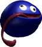</th>
    <th><b>Gooey</b></th>
    <td>
While Kirby swallows enemies in order to copy their powers, Gooey wraps them up in his tongue to steal their abilities. In Kirby's Dream Land 2, he occasionally appeared inside of a bag, but by Kirby's Dream Land 3, he was a full-fledged partner. He could be controlled by setting him up as Player Two.
</td>
  </tr>
  <tr>
    <th></th>
    <th><b>King Dedede</b></th>
    <td>
Dedede's the self-proclaimed king of Dream Land. While he says he's king, Dedede performs no administrative functions and the citizens of Dream Land continue to live as they always have. He's able to suck in air and fly like Kirby does, but only as a result of the vigorous training he undertook after being bested by Kirby.
</td>
  </tr>
  <tr>
    <th>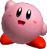</th>
    <th><b>Kirby</b></th>
    <td>
A denizen of the far-off, peaceful planet Pop Star, Kirby became a citizen of Dream Land after defeating King Dedede. Even though he's only about eight inches tall, Kirby is an extremely skilled technician. He has the ability to absorb the powers of his enemies, and his elastic body makes him a versatile adventurer.
</td>
  </tr>
 <tr>
    <th></th>
    <th><b>Kirby [Smash]</b></th>
    <td>
Kirby's small size lets him dodge many attacks, but his light weight makes him fly far when struck. Using his ability to inflate, he can jump five times. His Swallow attack creates wild combos; not only can he copy foes' moves, but he'll also put on special hats and mimic their voices. His Hammer is unwieldy but powerful.
</td>
  </tr>
 <tr>
    <th></th>
    <th><b>Kirby [Smash]</b></th>
    <td>
Because of his light weight, Kirby is always in danger of being sent flying, but his ability to puff up and fly allows him to come back from amazing distances. His Final Cutter strikes on the way up and on the way down, and it sends out a beam of force upon landing. Kirby transforms into various objects and crashes down when he uses his Stone technique.
</td>
  </tr>
 <tr>
    <th></th>
    <th><b>Maxim Tomato</b></th>
    <td>
Maxim Tomatoes cure 50 percentage points of your accumulated damage. Once you eat one, after a brief moment, your damage meter slowly drains the appropriate amount, regardless of whether or not you pick up another item right afterwards. In the Kirby series, these juicy, health-restoring items were a favorite of the pink hero.
</td>
  </tr>
  <tr>
    <th>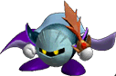</th>
    <th><b>Meta-Knight</b></th>
    <td>
The mysterious head of the Meta-Knights, he wields his sword with dignity. He delivered his sword to Kirby and demanded single combat in a show of knightly honor; his strict adherence to his code of ethics makes him a rarity in Dream Land. Sometimes he throws off his cape in battle. It occasionally transforms into wings.
</td>
  </tr>
  <tr>
    <th>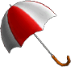</th>
    <th><b>Parasol</b></th>
    <td>
The Parasol, which was originally used by Kirby, can be used as a weapon to bludgeon enemies. Even better is that fact that players can open it while airborne and lazily float back toward safe ground. It's incredibly useful in returning to the field of play after an opponent gets the better of you and sends you flying.
</td>
  </tr>
  <tr>
    <th>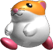</th>
    <th><b>Rick</b></th>
    <td>
Rick made his debut alongside Kirby's other friends, Coo and Kine. He looks like a meek hamster, but when he puffs himself up, he's bigger than Kirby. When he's carrying Kirby on his back, he can mimic Kirby's copy powers with some special moves of his own. Rick's claim to fame is his exceptional traction on icy surfaces.
</td>
  </tr>
 <tr>
    <th></th>
    <th><b>Star Rod</b></th>
    <td>
This magic wand holds 16 star shots and sends foes flying at a low angle when thrown. It's most powerful when Captain Falcon or Sheik performs a Smash Attack while holding it. In Kirby's Adventure, the Star Rod is the secret power behind the Fountain of Dreams. King Dedede steals the Star Rod in order to seal away the nasty Cloaked Nightmare.
</td>
  </tr>
  <tr>
    <th></th>
    <th><b>Waddle Dee</b></th>
    <td>
Many delicate creatures like this one inhabit Dream Land. They generally live carefree lives and have never considered themselves to be followers of King Dedede. Waddle Dees are innocent and generally harmless to man and beast. While they have virtually no offensive or defensive power, they'll sometimes try to wield a parasol.
</td>
  </tr>
 <tr>
    <th></th>
    <th><b>Warp Star</b></th>
    <td>
The Warp Star originated as Kirby's ride: it helped the ponderous puffball get around at high speed. Hop on the Warp Star in Super Smash Bros. Melee, and your character will rapidly launch up and off the screen. You'll return in a flash, causing an explosion as you hit the ground. Try holding a direction to alter your landing.
</td>
  </tr>
  <tr>
    <th></th>
    <th><b>Whispy Woods</b></th>
    <td>
A boss enemy from Kirby's Dream Land. Whispy Woods is a big tree that shoots whirlwinds at Kirby. It isn't the toughest enemy: all Kirby has to do is avoid the occasional whirlwind, suck in apples that fall down, and then shoot them back at the tree. In Super Smash Bros. Melee, Whispy Woods is quite the blowhard.
</td>
  </tr>

</table>



<table class="fixed" border="1">
    <col width="200px" />
    <col width="150px" />
    <col width="800px" />
  <tr>
    <th></th>
    <th><b>Bunny Hood</b></th>
    <td>
Don the Bunny Hood to improve your agility drastically, allowing you to jump great distances and move at high speed. The ears are a cute accessory: they're even adorable on characters they don't quite suit. The Bunny Hood was key in Majora's Mask, where it made Link move at one-and-a-half times his normal speed.
</td>
  </tr>
  <tr>
    <th></th>
    <th><b>Four Giants</b></th>
    <td>
"Swamp... Mountain... Ocean... Valley... The four who are there..." Link summons these four giant guardians to aid in his battle against the Skull Kid, who's possessed by Majora's Mask. They appear from the four compass points to catch the moon, which is about to crash into Clock Town. Without abandoning the innocent Skull Kid, they're able to protect the town.
</td>
  </tr>
  <tr>
    <th>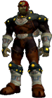</th>
    <th><b>Ganondorf</b></th>
    <td>
Said to be the sole man born to the Gerudo tribe in a hundred years, Ganondorf aspired to conquer the world. He plundered a piece of the sacred Triforce from the Temple of Time when Link pulled the Master Sword from its pedestal. With the Triforce of Power in Ganondorf's possession, Hyrule was plunged into darkness until Link and Zelda defeated the fiend.
</td>
  </tr>
  <tr>
    <th></th>
    <th><b>Ganondorf [Smash]</b></th>
    <td>
Since he's slow and can't jump very high, Ganondorf relies mainly on his immense physical strength to overwhelm his enemies. His great weight also makes him a difficult foe to send offscreen. Ganondorf's Warlock Punch is slow but absurdly powerful, and when he strikes with his Gerudo Dragon, enemies rise skyward enveloped in dark flames.
</td>
  </tr>
  <tr>
    <th></th>
    <th><b>Ganondorf [Smash]</b></th>
    <td>
Ganondorf's slow speed works against him in single combat, but in melees, his crazy power lets him earn his keep with innumerable KOs. Ganondorf can't strike quickly, but each blow he lands adds up. Ganondorf is at his quickest when he uses the Wizard's Foot, and his Dark Dive blasts foes in a burst of dark energy.
</td>
  </tr>
  <tr>
    <th>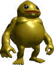</th>
    <th><b>Goron</b></th>
    <td>
Most Gorons inhabit the stony slopes of Death Mountain. They can achieve incredible land speeds by curling up into balls and rolling: they also curl up into small balls to sleep. They're a gentle and calm people, but their leader, Darunia, is impassioned and brave. Gorons use strong and dexterous fingers to make blades and bombs.
</td>
  </tr>
  <tr>
    <th></th>
    <th><b>Heart Container</b></th>
    <td>
Heart Containers drift toward the ground slowly and replenish 100 percentage points of health. In The Legend of Zelda, these items beefed up Link's life meter; in most cases, Link found them in the possession of bosses or hidden in secret areas. Heart Containers are often scattered across the land in several fragments.
</td>
  </tr>
  <tr>
    <th></th>
    <th><b>Like Like</b></th>
    <td>
In The Legend of Zelda, these slow-footed monsters inhaled Link and ate his shield, just beating out Wallmasters for the coveted title of "Most Aggravating Enemies Ever." Supposedly, their name comes from an old, almost indecipherable Hyrulian proverb: "Shield-eaters and world leaders have many likes alike.
</td>
  </tr>
  <tr>
    <th>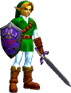</th>
    <th><b>Link</b></th>
    <td>
Even in his youth, Link was already becoming the warrior who would carry the destiny of Hyrule (and many other lands) on his shoulders. His epic struggles against the forces of darkness are written in legend, and he is bound to the Princess Zelda and the archfiend Ganondorf by the awesome power of the Triforce.
</td>
  </tr>
  <tr>
    <th></th>
    <th><b>Link [Smash]</b></th>
    <td>
Burdened with a shield, a heavy sword, and plenty of equipment, Link is not a very mobile character. Nevertheless, he's skilled with the blade, and his varied supply of missile weapons makes him a powerful fighter. To master Link, you must control the pace by balancing your long-range attacks with head-to-head swordplay.
</td>
  </tr>
  <tr>
    <th></th>
    <th><b>Link [Smash]</b></th>
    <td>
Link's Bow, Boomerang, and Bombs all take time to wield, so you may want to try drawing them in midair to prevent your foes from attacking you while you're vulnerable. The Spin Attack can score consecutive midair hits, and the final slash is very powerful. Link's Bombs are his trump card, but he can't pull one out if he's carrying another item.
</td>
  </tr>
  <tr>
    <th></th>
    <th><b>Lon Lon Milk</b></th>
    <td>
The pride of Lon Lon Ranch is this delicious and nutritious milk. When Link played Epona's Song for Lon Lon Cows, they would perk up and provide him with a bottle full of the tasty beverage. The fact that Link sometimes used bottles that had housed bugs is a matter of questionable hygiene. In Super Smash Bros. Melee, Young Link drinks milk instead of taunting.
</td>
  </tr>
  <tr>
    <th></th>
    <th><b>Majora's Mask</b></th>
    <td>
A lonely Skull Kid put on Majora's Mask and unknowingly allowed a great evil to invade the land of Termina. The mask manifested its evil power into the fearsome looking moon, and the Skull Kid became merely a puppet under its malevolent power. In the ultimate battle with Link, Majora's Mask transformed into three separate forms.
</td>
  </tr>
  <tr>
    <th></th>
    <th><b>Marin</b></th>
    <td>
Marin is a young girl who cares for Link after a shipwreck washes him up on the shores of Koholint Island. She's a talented harpist, well liked for her kind and gentle nature. She holds fast to the ideals of truth and honor; if Link happens to steal something during his adventure, she greets him with a shout of "THIEF!"
</td>
  </tr>
  <tr>
    <th></th>
    <th><b>Master Sword</b></th>
    <td>
The Master Sword varies a bit between titles in the Legend of Zelda series, but it's generally the most powerful blade that Link can carry. It's a magical weapon that can be wielded only by a true hero, and, as its name implies, it's the weapon of choice in decisive battles. At the end of The Legend of Zelda: Ocarina of Time, Link returned it to its stone pedestal.
</td>
  </tr>
  <tr>
    <th>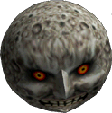</th>
    <th><b>Moon</b></th>
    <td>
High in the sky above the Clock Town Tower, a menacing moon slowly sinks towards the city. Shrouded in mystery and feared by all, it threatens to devour everything and everyone in a cataclysm of fire. Strangely, inside the moon is a beautiful, pristine plain broken by a single tree. The moon breaks after Link defeats Majora's Mask.
</td>
  </tr>
  <tr>
    <th></th>
    <th><b>Ocarina of Time</b></th>
    <td>
This ocarina, the treasure of the House of Hyrule, was entrusted to Link by Zelda when she fled from Ganondorf's insurrection. When used in conjunction with three Spiritual Stones, it opened the way to where the Master Sword rested. In Majora's Mask, it gave Link limited control over time, but it has other uses: it's fun to play as a musical instrument.
</td>
  </tr>
  <tr>
    <th>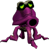</th>
    <th><b>Octorok</b></th>
    <td>
These common enemies made their debut in the very first Legend of Zelda game and have been a staple of every game in the series since. They shoot rocks from their mouths at high velocity, but the projectiles are simple to block and do very little damage. Octoroks have low stamina, so they don't pose much of a threat to good fighters.
</td>
  </tr>
  <tr>
    <th>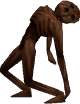</th>
    <th><b>ReDead</b></th>
    <td>
Seven years after Ganondorf took control of Hyrule, ReDeads roamed the ruins of Castle Town, moaning. At first, Link was shocked at the state of the town, and the apparent lack of survivors. He later learned that the townsfolk had evacuated to safety, and that the ReDeads were just magic animated into hideous humanoid shapes.
</td>
  </tr>
  <tr>
    <th>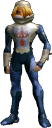</th>
    <th><b>Sheik</b></th>
    <td>
This is Zelda's alter ego. Using a variation of the name of the ancient Sheikah tribe, she appears before Link and teaches him melodies instrumental to his success. It's believed that she's not just a quick-change artist, but rather that she is able to instantaneously alter her clothing and her eye and skin color by using her magical skills.
</td>
  </tr>
  <tr>
    <th></th>
    <th><b>Sheik [Smash]</b></th>
    <td>
Strategically switching between Zelda and Sheik is key. Compared to her Zelda form, Sheik is nimble and has gorgeous moves, but she lacks a strong knockout attack. The number of needles thrown in Needle Storm is based on how long you hold the B Button before releasing it. Use the Control Stick to wave the Chain after brandishing it.
</td>
  </tr>
  <tr>
    <th></th>
    <th><b>Sheik [Smash]</b></th>
    <td>
The best strategy to use when playing as Sheik is to let her flow from one powerful attack into another, like a river of quicksilver. Zelda has some techniques with more punch, however, so in one-on-one battles, use Transform as needed. Sheik only travels a short way when using Vanish, but the move comes with a small explosion that damages foes around her.
</td>
  </tr>
  <tr>
    <th>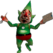</th>
    <th><b>Tingle</b></th>
    <td>
Tingle is a mysterious middle-aged man who thinks he's "the very reincarnation of a fairy." His bizarre behavior and unique speech are just little pieces of his vibrant personality. Tingle travels by way of a small hot-air balloon, making maps of the lands below him. Pop his balloon, and Tingle will fall to earth to sell his maps.
</td>
  </tr>
  <tr>
    <th>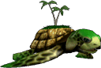</th>
    <th><b>Turtle</b></th>
    <td>
When Link played the New Wave Bossa Nova, what masqueraded as a lone island rose out of the waters of the Great Bay Coast and revealed itself to be a giant turtle. This mighty terrapin is ancient and wise beyond belief. It sensed Link's destiny and braved the stormy seas in order to transport him to the Great Bay Temple.
</td>
  </tr>
  <tr>
    <th></th>
    <th><b>Young Link</b></th>
    <td>
Link's younger incarnation is often considered to be the true Link: he was a young boy in the very first Legend of Zelda game, and he has appeared as a youth in most of the subsequent games. Since his debut on the original NES in 1987, Link's appearance has changed over and over again, each time adding to the mystique of his incomparable story.
</td>
  </tr>
  <tr>
    <th></th>
    <th><b>Young Link [Smash]</b></th>
    <td>
Young Link is lighter and faster than his older self, and his Kokiri sword packs less punch. Even though his Boomerang has a shorter range, he has greater control over it. He's a smaller target, and while his Hookshot has less reach than older Link's, you can still use it in midair as a last ditch attempt to grab a ledge.
</td>
  </tr>
  <tr>
    <th></th>
    <th><b>Young Link [Smash]</b></th>
    <td>
With a youthful spring in his step, Young Link can perform amazing wall-jumps. Once he hits a wall, tap the Control stick in the opposite direction to send him leaping upward; you can practice to your heart's content in Target Test. His Spin Attack can strike multiple times even on the ground, and although it's hard to discern, so do his Bombs.
</td>
  </tr>
  <tr>
    <th>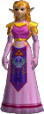</th>
    <th><b>Zelda</b></th>
    <td>
The crown princess of Hyrule. Zelda entrusted Link with the future of Hyrule after a revelation came to her in the world of dreams. She knows much about the Triforce; in fact, the only person who likely knows more about Triforce lore is Ganondorf himself, whom Zelda evaded in Ocarina of Time by transforming into her alter ego, Sheik.
</td>
  </tr>
  <tr>
    <th></th>
    <th><b>Zelda [Smash]</b></th>
    <td>
Zelda is a bit slow and, because of her light frame, easy to send flying. On the other hand, her magical skills lend her reliable and explosive attack power. Zelda's easier to use if you focus on waiting and countering rather than pressing attacks. She can use Nayru's Love to reflect projectile attacks or as an offensive weapon.
</td>
  </tr>
  <tr>
    <th></th>
    <th><b>Zelda [Smash]</b></th>
    <td>
Zelda's midair Lightning Kick centers immense magical power in the ball of her foot. If she strikes perfectly, the attack is as strong as can be. If her aim is slightly off, it'll be exceedingly weak. Farore's Wind again utilizes Zelda's magical prowess, this time by transporting her great distances. It's vital to know the lay of the land before using this move.
</td>
  </tr>
</table>



<table class="fixed" border="1">
    <col width="200px" />
    <col width="150px" />
    <col width="800px" />
  <tr>
    <th></th>
    <th><b>Chozo Statue</b></th>
    <td>
These statues, which provide power-ups to Samus and have some connection with her Power Suit, have been found in many places, most notably Zebes. The Chozo boasted the most advanced civilization in their galaxy. Some say that when they could advance no further, they chose to withdraw and observe other life forms.
</td>
  </tr>
  <tr>
    <th>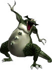</th>
    <th><b>Kraid</b></th>
    <td>
A boss enemy from Metroid. Kraid lives in the depths of Brinstar. He immobilizes enemies with his three red eyes, and his powerful jaws can crush anything. He can also shoot the three spikes in his belly; it's said he often fires them at his prey. Once Samus defeated Ridley and Kraid, the way to Tourian opened.
</td>
  </tr>
  <tr>
    <th>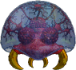</th>
    <th><b>Metroid</b></th>
    <td>
A parasitic life form that can absorb all types of energy, Metroids have strong resistance to most conventional weaponry. To defeat them, Samus Aran had to freeze them with Ice Beam shots and then blast them with missiles. Mochtroids, which look like Metroids, are weaker, with fewer internal nuclei.
</td>
  </tr>
  <tr>
    <th>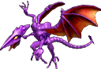</th>
    <th><b>Ridley</b></th>
    <td>
The head of the Space Pirates on Zebes, Ridley soars through space on wicked wings. Ridley may look like a mindless monster, but he's actually quite intelligent except, he has pitiful eyesight. After the SR-388 incident, where Samus captured the infant Metroid, Ridley took the Space Academy by storm, annihilating the complex and taking the Metroid back.
</td>
  </tr>
  <tr>
    <th></th>
    <th><b>Samus Aran</b></th>
    <td>
This intergalactic bounty hunter's full name is Samus Aran. Clad in a Power Suit made by the Chozo race and infused with their enhanced blood, she cleared the planet Zebes of a Metroid infestation. Samus is an orphan, the sole survivor of a Space Pirate raid that destroyed an Earth colony named K-2L.
</td>
  </tr>
  <tr>
    <th></th>
    <th><b>Samus Aran [Smash]</b></th>
    <td>
Samus has an abundance of projectile weapons, making her a long-distance attack specialist. The most powerful weapon in her arsenal is her Charge Shot, but be warned: it can be reflected. Her missiles have homing capabilities, but when fired as Smash Attacks, they fly on a straight trajectory and have boosted power.
</td>
  </tr>
  <tr>
    <th></th>
    <th><b>Samus Aran [Smash]</b></th>
    <td>
While Samus's arsenal of missile weapons is indeed formidable, her enemies are in for a rude awakening if they guard against nothing else. Her Grappling Beam captures foes and latches on to walls, and the Screw Attack drags foes upwards in a series of spins that doubles as a recovery move. Samus can also use her Bombs to perform Bomb Jumps.
</td>
  </tr>
  <tr>
    <th></th>
    <th><b>Samus's Starship</b></th>
    <td>
This compact ship is used by Samus as her base of operations. Of course, Samus can't fly it into the catacombs of every planet she visits, so she leaves it on the surface as her sanctuary. Samus can recharge her Power Suit inside the ship, so it tends to be the only safe and secure spot on inhospitable alien terrain.
</td>
  </tr>
  <tr>
    <th></th>
    <th><b>Samus Unmasked</b></th>
    <td>
It's said that the orphaned Samus Aran was raised by the few survivors of the Chozo race. They armed her with a Power Suit and taught her the ways of advanced combat; even burdened with her heavy suit, Samus is as graceful as a butterfly. In the Metroid series, it was standard that Samus would remove her helmet and armor if you cleared the game fast enough.
</td>
  </tr>
  <tr>
    <th></th>
    <th><b>Screw Attack</b></th>
    <td>
One of Samus Aran's power-ups from the original Metroid, the Screw Attack turns a jump into a rotating attack move. When carrying this item, any character's ordinary jump move will turn into a Screw Attack. By the same token, if you throw this item at an enemy, your foe will spontaneously do a Screw Attack.
</td>
  </tr>
</table>




<table class="fixed" border="1">
    <col width="200px" />
    <col width="150px" />
    <col width="800px" />
  <tr>
    <th>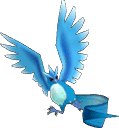</th>
    <th><b>Articuno</b></th>
    <td>
Clouds gather, the barometer plunges, and fresh snow falls from the frigid air when this legendary Pokémon takes wing. Graceful and elegant, it boasts long tail feathers that flap in the wind and are lovely to behold. As would be expected, its combat moves are based on its cold nature; they include Ice Beam and Blizzard.
</td>
  </tr>
  <tr>
    <th>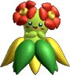</th>
    <th><b>Bellossom</b></th>
    <td>
From time to time, these beautiful flower Pokémon will gather in numbers and perform an odd sort of dance to call out the sun. While in the midst of this strange exhibition, their petals brush together to create a peaceful and soothing melody. A Gloom will only evolve into a Bellossom if it's exposed to a Sun Stone.
</td>
  </tr>
  <tr>
    <th>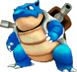</th>
    <th><b>Blastoise</b></th>
    <td>
Blastoise is the next evolutionary step after Wartortle. The thick jets of water they shoot from the cannons on their backs are strong enough to cut through steel plating. When in danger, they hide inside their armored shells. Blastoise is so popular among trainers that it's considered the definitive Water-type.
</td>
  </tr>
  <tr>
    <th>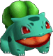</th>
    <th><b>Bulbasaur</b></th>
    <td>
Bulbasaur is a cute Pokémon born with a large seed firmly affixed to its back; the seed grows in size as the Pokémon does. Along with Squirtle and Charmander, Bulbasaur is one of three Pokémon available at the beginning of Pokémon Red & Blue. It evolves first into Ivysaur and ultimately into Venusaur.
</td>
  </tr>
  <tr>
    <th>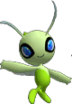</th>
    <th><b>Celebi</b></th>
    <td>
Celebi has the power to travel through time, and thus wanders from one age to the next. It is considered a deity by the forests: plants and trees are said to grow in unimaginable abundance wherever Celebi visits. Like Mew, Celebi is a Pokémon shrouded in mystery. Its special techniques blend grass and psychic powers.
</td>
  </tr>
  <tr>
    <th>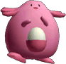</th>
    <th><b>Chansey</b></th>
    <td>
Renowned for its kind temperament, Chansey has been known to offer injured creatures a highly nutritious egg to aid their recovery. Legend has it that this charitable creature brings happiness to anyone who captures it. All Chansey are female, and every now and then one is found in possession of a Lucky Egg.
</td>
  </tr>
  <tr>
    <th>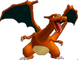</th>
    <th><b>Charizard</b></th>
    <td>
It's hard to believe, but this massive flame Pokémon evolves from the tiny Charmander. Not only can it fly at heights of over 4,500 feet, but it's flaming breath is hot enough to reduce almost anything to ashes in seconds. The flames at the end of a Charizard's tail are said to be a fairly accurate barometer of its power.
</td>
  </tr>
  <tr>
    <th>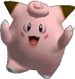</th>
    <th><b>Clefairy</b></th>
    <td>
Clefairy are very cute Pokémon, which makes them popular pets. However, as they're only found in a few areas, it takes a lot of work to find one. Strangely enough, legend has it that Clefairy are more active during the full moon. These Pokémon are known to use Metronome, a move that unleashes a randomly selected attack.
</td>
  </tr>
  <tr>
    <th>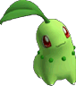</th>
    <th><b>Chikorita</b></th>
    <td>
Chikorita was one of the first three Pokémon available in Pokémon Gold, Silver, and Crystal. A Grass-type Pokémon, it emits a delightful fragrance from the leaves on its head and loves to spend its time leisurely sunbathing. When called into battle, it uses its Razor Leaf move to strike at opponents' weak points.
</td>
  </tr>
  <tr>
    <th>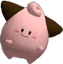</th>
    <th><b>Cleffa</b></th>
    <td>
With silhouettes that resemble stars, Cleffa are often sighted when the night sky is filled with shooting stars. Cleffa evolves into Clefairy, but only if it has a strong bond of friendship with its trainer. Since Cleffa are so cute and loveable, many trainers choose to keep it in this unevolved form.
</td>
  </tr>
  <tr>
    <th>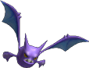</th>
    <th><b>Crobat</b></th>
    <td>
A bat Pokémon that evolves from Golbat. Crobat's hind legs have evolved into a second pair of wings, which allows it to fly at great speeds but limits its ability to rest. The affection a Golbat has for its trainer is vital for the evolution process: if a novice trainer has a Crobat, it shows that he or she cares for Pokémon well.
</td>
  </tr>
  <tr>
    <th>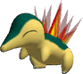</th>
    <th><b>Cyndaquil</b></th>
    <td>
Cyndaquil frighten easily, so they're often found curled up in balls. When threatened, they flare the flames on their backs to drive off enemies. Cyndaquil was one of the three Pokémon that trainers could choose from at the beginning of Pokémon Silver, Gold, and Crystal. No one knows if their eyes are open.
</td>
  </tr>
  <tr>
    <th>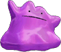</th>
    <th><b>Ditto</b></th>
    <td>
Every Ditto has the ability to copy a Pokémon's entire cell structure in an instant and become its exact replica. They're terrible at remembering techniques, but when they use Transform, they temporarily learn all of their foe's moves. If a Ditto starts to laugh, it weakens and can't hold it's transformation.
</td>
  </tr>
  <tr>
    <th>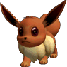</th>
    <th><b>Eevee</b></th>
    <td>
As adaptable a Pokémon as any yet discovered, Eevee's evolutionary progress changes to meet the conditions of its environment. So far, five evolutionary forms have been discovered and then catalogued for this unique Pokémon: Vaporeon, Jolteon, Flareon, Espeon, and Umbreon. All evolutions have special benefits.
</td>
  </tr>
  <tr>
    <th>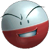</th>
    <th><b>Electrode</b></th>
    <td>
Electrode, an electric ball Pokémon, is the evolved form of Voltorb. It has the tendency to explode with even the slightest provocation, which has earned it the nickname "Wrecking Ball." Electrode is the quickest Pokémon found to date, and its distinct white-over-red coloring is the opposite of Voltorb's.
</td>
  </tr>
  <tr>
    <th>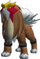</th>
    <th><b>Entei</b></th>
    <td>
A volcanic Fire-type, Entei is hotter than liquid magma and as tough as nails. This powerful creature was one of the three Pokémon running around the Burned Tower of Ecruteak City. Entei is extremely difficult to capture, as it tends to wander all over the landscape, sprouting intense flames from its body.
</td>
  </tr>
  <tr>
    <th>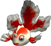</th>
    <th><b>Goldeen</b></th>
    <td>
These Water-types are often referred to as "water dancers," as their elegant fins make them incredibly agile underwater. They can even travel upstream in rapids at a speed of five knots; of course they're not quite as nimble on dry land. Goldeen's Horn Drill is so strong that it can KO an enemy with one strike if it connects.
</td>
  </tr>
  <tr>
    <th>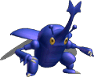</th>
    <th><b>Heracross</b></th>
    <td>
Heracross are powerful creatures that are known to drive their single horns into the bellies of their foes and then toss them over their heads. The immense power of their Megahorn move is said to be the strongest among insectoid Pokémon. They are one of several types of Pokémon that can be found by shaking trees.
</td>
  </tr>
  <tr>
    <th>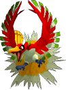</th>
    <th><b>Ho-oh</b></th>
    <td>
As it soars around the skies of the world, this multicolored flying Pokémon leaves a trail of rainbows and myths in its wake. Its signature move is called Sacred Fire, and it is believed to appear only before trainers who are pure of heart. If you see a trainer with Ho-oh, you can assume that catching it took a lot of work.
</td>
  </tr>
  <tr>
    <th>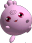</th>
    <th><b>Igglybuff</b></th>
    <td>
Igglybuff, which evolve into Jigglypuff, are so incredibly elastic that they always seem to be bouncing. They have extremely stubby legs, so for these Pokémon, bounding from place to place is much faster than walking. Unlike its equally adorable relatives, Jigglypuff and Wigglytuff, Igglybuff has red eyes.
</td>
  </tr>
  <tr>
    <th>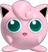</th>
    <th><b>Jigglypuff</b></th>
    <td>
This balloon Pokémon invites its opponents in close with its big, round eyes and then puts them to sleep with a soothing lullaby. It puffs itself up when angry, and while it may look adorable, it's not to be trifled with; it knows several powerful techniques. Jigglypuff evolves into Wigglytuff after exposure to a Moon Stone.
</td>
  </tr>
  <tr>
    <th></th>
    <th><b>Jigglypuff [Smash]</b></th>
    <td>
Jigglypuff's normal attacks are weak, and because of its light weight it's easily sent flying. However, with its incredible midair agility, it seems to dance when airborne. Rollout is a powerful speed attack, but be careful not to fly off the edge. Pound does serious damage, and it can also help as a recovery move.
</td>
  </tr>
  <tr>
    <th></th>
    <th><b>Jigglypuff [Smash]</b></th>
    <td>
Jigglypuff can put its enemies to sleep if they are in range of its Sing attack, although the attack does not work on airborne foes. Rest puts Jigglypuff into a deep sleep, but at the instant it drops off, an intense energy force radiates out of the exact center of its body. If this force comes in contact with an enemy, look out! Rest is Jigglypuff's wild card.
</td>
  </tr>
  <tr>
    <th></th>
    <th><b>Lugia</b></th>
    <td>
The waters of the Whirl Islands are home to this legendary Pokémon, whom few have seen. Lugia lives quietly in the deepest ocean trenches for one very good reason: its combined aerial and psychic powers are so strong as to be extremely dangerous. The special moves of this gargantuan creature include the destructive win assault known as Aeroblast.
</td>
  </tr>
  <tr>
    <th>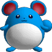</th>
    <th><b>Marill</b></th>
    <td>
This water-mouse Pokémon evolves into Azumarill. The round ball on the end of its tail acts like a flotation device, so it can float safely in the roughest of water conditions. It resides on Mt. Mortar in seclusion; few of the creatures are ever seen. Marill's cuteness has earned it a large and loyal fan base.
</td>
  </tr>
  <tr>
    <th>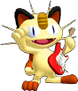</th>
    <th><b>Meowth</b></th>
    <td>
This... is Meowth's dream. Meowth strides all over the globe, scattering invitations to other Pokémon insisting they come to "Meowth's Party." At this wonderful party, guests are packed in like sardines as Meowth climbs up the stage with its faithful guitar. It strikes a chord, pauses, and then rocks their world!
</td>
  </tr>
  <tr>
    <th>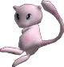</th>
    <th><b>Mew</b></th>
    <td>
Mew is an extremely rare Pokémon that has been seen by only a few people. Information on every Pokémon in the world is contained in Mew's cell structure, so it has the ability to use any and all TMs and HMs. Some Pokémon scholars believe Mew to be the ancestor of all existing Pokémon, but the idea is debatable.
</td>
  </tr>
  <tr>
    <th></th>
    <th><b>Mewtwo</b></th>
    <td>
A genetically created Pokémon, Mewtwo is the result of many long years of research by a solitary scientist. Although Mewtwo was cloned from the genes of the legendary Pokémon Mew, its size and character are far different than its ancestor. Its battle abilities have been radically heightened, making it ruthless.
</td>
  </tr>
  <tr>
    <th></th>
    <th><b>Mewtwo [Smash]</b></th>
    <td>
As Mewtwo relies mostly on its powerful brain, there are times when it scarcely uses its arms and legs. Since Mewtwo spends much of its time floating, it flies far when struck. Shadow Ball traces a jagged path once released: the longer Mewtwo holds it, the more powerful it becomes. Mewtwo uses Confusion to spin its foes around.
</td>
  </tr>
  <tr>
    <th></th>
    <th><b>Mewtwo [Smash]</b></th>
    <td>
Mewtwo is definitely not a speedy character, but its ESP-powered grab and throw moves are comparatively strong. Teleport has a short range, but doesn't leave it open to attack. It's best used as an escape move during disturbances. Mewtwo can daze a foe if it makes eye contact and uses Disable; the move is useless unless Mewtwo is facing its enemy.
</td>
  </tr>
  <tr>
    <th></th>
    <th><b>Misty</b></th>
    <td>
Misty's the gym leader of Cerulean City and a real tomboy. She loves swimming and all things aquatic, so she makes a point of collecting Starmie, Staryu, and other Water-type Pokémon. This is common among gym-leaders: typically the Pokémon kept by trainers tend to reflect that person's personality and preferences.
</td>
  </tr>
  <tr>
    <th></th>
    <th><b>Moltres</b></th>
    <td>
As tradition has it, the onset of spring heralds the return of this legendary Pokémon from its southern home. Its bright orange color and fiery aspect lends to its overwhelming appearance. Sky Attack, the strongest of flying moves, is a perfect fit for this burning phenom, but it obviously also excels at powerful Fire-type moves.
</td>
  </tr>
  <tr>
    <th></th>
    <th><b>Pichu</b></th>
    <td>
A baby Electric-type Pokémon identifiable by its big ears. Pichu evolves into Pikachu. It's not very skilled at storing up electrical energy and will sometimes discharge it if jarred. Although it's small, it has enough electrical power to give even an adult quite a shock. It's often startled by its own power.
</td>
  </tr>
  <tr>
    <th></th>
    <th><b>Pichu [Smash]</b></th>
    <td>
Compared with Pikachu, Pichu is a tad more nimble and a little more difficult to hit. Those are the only two advantages, however, and since Pichu damages itself when it uses electrical attacks, it's best suited for handicapped matches. Even though Pichu's tough to catch, it's easy to throw its tiny frame great distances.
</td>
  </tr>
  <tr>
    <th></th>
    <th><b>Pichu [Smash]</b></th>
    <td>
Pichu is the lightest character in Super Smash Bros. Melee., and it's top of the class in weakness, too! For Pichu, it's all about scampering here and there to pick up items that will help it survive. The first warp in Agility causes 1 point of damage to Pichu, and the second causes 3, so try to limit the number of times you use the move.
</td>
  </tr>
  <tr>
    <th></th>
    <th><b>Pikachu</b></th>
    <td>
It's safe to say that Pikachu is the most famous and popular of all Pokémon. It has electric pouches in both cheeks; when in danger, it shoots electricity at its enemies. Although Pikachu can evolve into Raichu by exposure to a Thunderstone, many trainers like Pikachu so much that they don't let it evolve.
</td>
  </tr>
  <tr>
    <th></th>
    <th><b>Pikachu [Smash]</b></th>
    <td>
While its electrical attacks, such as Thunder and Thunder Jolt, are powerful, Pikachu is at its best speeding around the fray and waiting for its chance to strike. You can control the path of Pikachu's two-directional Quick Attack, allowing you to jump twice. Hold down the B Button to charge up Skull Bash.
</td>
  </tr>
  <tr>
    <th></th>
    <th><b>Pikachu [Smash]</b></th>
    <td>
The angle of the Control Stick controls the direction of Pikachu's Quick Attack. Pikachu will move blindingly fast, and it will also cause damage to any character it runs into. Move the Control Stick during Quick Attack and Pikachu will move in up to two directions. Be sure to check out the ceilings on the level when you use Thunder.
</td>
  </tr>

  <tr>
    <th></th>
    <th><b>Poké Ball</b></th>
    <td>
These balls are used to capture and contain wild Pokémon. Most Pokémon must be weakened in some way before they can be captured, but once they're inside a Poké Ball, they enjoy their new home, since Poké Balls contain an environment specially designed for Pokémon comfort. Master Balls are the strongest type.
</td>
  </tr>
  <tr>
    <th></th>
    <th><b>Pokémon Stadium</b></th>
    <td>
Trainers come from far and wide to congregate at Pokémon Stadiums, the ultimate venues to show off their Pokémon teams. There are many different arenas with varying terrain designs, some of which afford advantages to certain Pokémon. This particular stadium is reserved for huge events and boasts a big screen and spectacular fireworks.
</td>
  </tr>
  <tr>
    <th></th>
    <th><b>Poliwhirl</b></th>
    <td>
Poliwhirl is an amphibious Pokémon able to live on either land or in the water. When on dry land, it's constantly sweating to keep its skin nice and slimy. When in danger, it spins the whirlpool marking on its stomach to put enemies into a deep sleep, then it runs away. It evolves into either Poliwrath or Politoed.
</td>
  </tr>
  <tr>
    <th></th>
    <th><b>Porygon2</b></th>
    <td>
Representing the next step in technological progress, this virtual Pokémon is a higher powered version of the man-made Pokémon, Porygon. Compared to the sharp edges of its relative, Porygon2's body is extremely smooth and rounded. In battle, it utilizes a special move called Conversion 2 to alter its type.
</td>
  </tr>
  <tr>
    <th></th>
    <th><b>Professor Oak</b></th>
    <td>
The leading expert on the study of Pokémon. It seems there are always new and mysterious species of Pokémon being brought to light, and Professor Oak is at the heart of it all with his insightful research. The Pokédex is one of his inventions: new trainers receive one, and a Pokémon to boot, when they start out.
</td>
  </tr>
  <tr>
    <th></th>
    <th><b>Raikou</b></th>
    <td>
These violent lightning Pokémon travel near and far, blasting out electrified whirlwinds. They carry storm clouds on their backs so they can produce lightning regardless of the local weather; it's even said that they descended to the earth via lightning bolts. Their extreme quickness lends itself to flight, so they're very hard to capture.
</td>
  </tr>
  <tr>
    <th></th>
    <th><b>Scizor</b></th>
    <td>
This evolved form of Scyther has arms ending in large pincers with distinctive eye-spot markings. Its evolution also includes the addition of a tough Metal Coat. It's unable to fly very far with its wings, but it can affect its body temperature by flapping them at high speeds. Its sleek look has made Scizor quite popular among collectors.
</td>
  </tr>
  <tr>
    <th></th>
    <th><b>Snorlax</b></th>
    <td>
Snorlax love to sleep and love to eat: these portly Pokémon get grumpy if they don't get 880 pounds of food per day. After snacking out, they always nap. They have cast-iron stomachs and can eat moldy and even rotten food with no digestion problems. They are the heaviest Pokémon on record, weighing in at over 1,000 pounds.
</td>
  </tr>
  <tr>
    <th></th>
    <th><b>Squirtle</b></th>
    <td>
Retreating into its shell and spitting water at its foes is Squirtle's trademark response to danger. It's one of the three Pokémon that trainers can receive from Professor Oak in Pokémon Red and Blue. Squirtle evolves into Wartortle and then Blastoise, ramping up its water powers with each evolution.
</td>
  </tr>
  <tr>
    <th></th>
    <th><b>Staryu</b></th>
    <td>
These star-shaped Pokémon that evolve into Starmie are found in large numbers at the seashore. At night, Staryu's red center glows and blinks on and off. It's said that as long as its red center remains, it can regrow its limbs. Whether it's related to Cleffa, another Pokémon with a vaguely star-shaped appearance, is unknown.
</td>
  </tr>
  <tr>
    <th></th>
    <th><b>Steelix</b></th>
    <td>
A combination of Steel- and Gound-types, Steelix are the longest Pokémon yet to be discovered, reaching over 30 feet in length. Since they live so deep under the surface of the earth, the intense pressure has made their bodies stronger than diamonds. Evolved from Onix, Steelix is every bit as intimidating as its relative.
</td>
  </tr>
  <tr>
    <th></th>
    <th><b>Sudowoodo</b></th>
    <td>
A copycat Pokémon with an aversion to battle, Sudowoodo always poses as a tree in order to avoid being attacked. Despite their arboreal appearance, these Pokémon are actually Rock-types, and therefore highly vulnerable to water. When it begins to rain, they vanish. Sudowoodo can be found blocking Route 36 in Johto.
</td>
  </tr>
  <tr>
    <th></th>
    <th><b>Suicune</b></th>
    <td>
This mystical aurora Pokémon constantly journeys in search of places with pure flowing water. Suicune wields the power to instantly purify any contaminated water it finds. Some say Suicune is the north wind reborn. Its strange and dramatic story is told over the course of the Crystal version of the Pokémon game.
</td>
  </tr>
  <tr>
    <th></th>
    <th><b>Togepi</b></th>
    <td>
These adorable spike-shelled Pokémon hatch from eggs given out by Professor Elm's assistant. Common superstition holds that their shells are chock-full of happiness and that they become good-luck charms when handled with kindness. It's impossible to predict which ability a Togepi will call upon when it uses its Metronome move, so you'd better be ready.
</td>
  </tr>
  <tr>
    <th></th>
    <th><b>Totodile</b></th>
    <td>
Little but feisty is the best description for these Water-type Pokémon. The first thing they do when they see something move is latch onto it with their powerful jaws. Totodile was one of the three Pokémon the Professor Elm offered to trainers in Pokémon Gold, Silver, and Crystal. They evolve into Croconaw.
</td>
  </tr>
  <tr>
    <th></th>
    <th><b>Unown</b></th>
    <td>
These Psychic-type symbol Pokémon resemble ancient hieroglyphics found on rocks, a resemblance that's said to be more than superficial. Quite a few different shapes of Unown have been confirmed, and it's believed that each type has unique abilities. These enigmatic Pokémon can be found in the Ruins of Alph.
</td>
  </tr>
  <tr>
    <th></th>
    <th><b>Venusaur</b></th>
    <td>
Evolving from Ivysaur, this deceptively toxic Pokémon has a huge flower on its back that emits a cloying fragrance: the scent lulls its enemies into a state of calmness. Venusaur's flower synthesizes sunshine into pure energy for its Solarbeam move. Think of Grass- and Poison-type Pokémon and Venusaur comes first.
</td>
  </tr>
  <tr>
    <th></th>
    <th><b>Weezing</b></th>
    <td>
The evolved form of Koffing. Weezing is basically a pair of Koffing fused together. They tend to float in the air and emit gas or noxious smoke from the outgrowths that cover their bodies. As strange as it may seem, diluting Weezing emissions as much as possible creates one of the most exquisite perfumes known to man.
</td>
  </tr>
  <tr>
    <th></th>
    <th><b>Wobbuffet</b></th>
    <td>
A patient Pokémon, Wobbuffet lives in darkness to hide its mismatched black tail. Even for a stoic Pokémon, this creature is a testament to self-control; it will not actively attack an opponent. Its Counter and Mirror Coat moves are solely used for reflecting attacks directly back at its antagonist.
</td>
  </tr>
  <tr>
    <th></th>
    <th><b>Zapdos</b></th>
    <td>
Zapdos flaps its wings, and summer storms appear, throwing lightning every which way. It's said that you can hear this legendary Pokémon coming, as its wings make a very distinctive popping sound as it flies. In addition to electrical moves like the dreaded Thunder, it also wields a vicious move called Drill Peck.
</td>
  </tr>
  <tr>
    <th></th>
    <th><b>ZERO-ONE</b></th>
    <td>
Many wild Pokémon live on Pokémon Island, and avid cameraman Todd uses the ZERO-ONE as his means to get close to them. The ZERO-ONE is fully automated: its progress is monitored by a series of strategically located beacons. The vehicle can instantly change its shape to allow it to travel by land, water and air.
</td>
  </tr>
</table>




<table class="fixed" border="1">
    <col width="200px" />
    <col width="150px" />
    <col width="800px" />
  <tr>
    <th></th>
    <th><b>Andross</b></th>
    <td>
Star Fox's archenemy. Whether it's a metallic manifestation of Andross or just a hologram is unknown, but from its outward appearance, it's safe to assume that it's not the fiend's true form. Andross occasionally sucks matter in and then violently exhales, sending out a cloud of metal tiles. Its eyes are its weak points.
</td>
  </tr>
  <tr>
    <th></th>
    <th><b>Andross</b></th>
    <td>
This incarnation of Andross was so big as to be ridiculous, but it at least appeared to be a living being. Andross was once a brilliant scientist, but was banished from the galaxy for his dangerous experiments. From the planet Venom, he readied his troops and directed his sword of vengeance toward the Lylat System.
</td>
  </tr>
  <tr>
    <th></th>
    <th><b>Arwing</b></th>
    <td>
The Arwing is the symbol of Star Fox. Like an F-Zero racer, it's equipped with an opposing-gravity device. It can barrel roll and flip with ease thanks to its quick acceleration and flexible control. In battle, the ship uses retractable wings for precise flying. Every Arwing has smart bombs as its sub-weapons.
</td>
  </tr>
  <tr>
    <th></th>
    <th><b>Falco Lombardi</b></th>
    <td>
Star Fox team pilot, Falco's constant air of casual indifference belies his precise piloting skills. He avoids discussion of what he did before joining the team, but many consider it likely that his past was filled with reckless behavior. He's not much for cooperation, but he does respect those more skilled than he is.
</td>
  </tr>
  <tr>
    <th></th>
    <th><b>Falco Lombardi [Smash]</b></th>
    <td>
Where his leader, Fox, has blinding speed, Falco has his own distinct skills and advantages. He has both a higher jump and a longer reach than Fox, and although his Blaster lacks rapid-fire capabilities, it strikes with shocking force. Unlike Fox Falco can stop enemies in their tracks with his Blaster fire.
</td>
  </tr>
  <tr>
    <th></th>
    <th><b>Falco Lombardi [Smash]</b></th>
    <td>
Falco's amazing jumping abilities have many merits, but it's vital to realize that it comes at the cost of some attack power and defensive strength. He falls at a high speed, which disrupts potential attackers, but this also prevents successful recoveries occasionally. Hit an opponent with Reflector, and he or she will fly straight up; this is Falco's quickest attack.
</td>
  </tr>
  <tr>
    <th></th>
    <th><b>Fox McCloud</b></th>
    <td>
Fox McCloud is the leader of a band of adventurers-for-hire known as Star Fox. Fox and his fellow pilots Peppy, Slippy, and Falco patrol the Lylat system in their mother ship, the Great Fox. From the cockpit of his Arwing, Fox leads the ceaseless pursuit of the evil scientist Andross, who doomed Fox's father.
</td>
  </tr>
  <tr>
    <th></th>
    <th><b>Fox McCloud [Smash]</b></th>
    <td>
Fox is among the quickest and nimblest of the Smash Bros. characters. His speed is offset by low firepower, however, and he's better at one-on-one fights than melees with multiple foes. His Blaster is unique: it does damage but it doesn't make enemies flinch. His Fox illusion is best used as a surprise attack.
</td>
  </tr>
  <tr>
    <th></th>
    <th><b>Fox McCloud [Smash]</b></th>
    <td>
Fox falls quickly, so he's a tough target to strike from below; however, this advantage can work against him when he goes flying sideways. You can use the Control Stick to set the direction of the Fire Fox technique while it's charging up. On a side note, Fox is also much lighter than he was in the N64 Super Smash Bros. game.
</td>
  </tr>
  <tr>
    <th></th>
    <th><b>Great Fox</b></th>
    <td>
The mother ship of the Star Fox team. When in battle, the ship's robot, ROB, can assume control of the bridge, allowing all hands to take to their Arwings or combat positions. The ship runs plasma engines capable of warp speeds, and its front lasers are effective both in battle and in clearing paths through asteroid belts.
</td>
  </tr>
  <tr>
    <th></th>
    <th><b>Landmaster Tank</b></th>
    <td>
Team Star Fox's high-powered, anti-aircraft hover tank. Its caterpillar-like treads allow it to perform quick lateral rolls. It can even fly for short periods of time. Its main cannons closely resemble the weapons technology on an Arwing, so the same rules apply: if you charge them up, you can shoot guided missiles.
</td>
  </tr>
  <tr>
    <th></th>
    <th><b>Peppy Hare</b></th>
    <td>
Peppy was a member of the original Star Fox team with Fox's father James McCloud. Peppy was the sole survivor of the Battle of Venom where a treacherous teammate named Pigma Dengar betrayed the team. Peppy now rarely climbs into the cockpit of an Arwing, preferring instead an advisory position in mission planning.
</td>
  </tr>
  <tr>
    <th></th>
    <th><b>Slippy Toad</b></th>
    <td>
Slippy Toad is the mechanical genius behind most of the Star Fox team's new weapons and technology, and just lately he's been spending the bulk of his time in Research and Development. He's also a competent pilot, but his enthusiasm tends to outweigh his technical flight skills. He and Fox have been friends ever since their school days.
</td>
  </tr>
  <tr>
    <th></th>
    <th><b>Wolfen</b></th>
    <td>
The beloved ship of the mercenary team Star Wolf, which was hired to destroy Fox and his team. The ship's abilities rival an Arwing.: As a matter of fact, the Wolfen II was an improvement over its predecessor and could nearly outperform team Star Fox's ships. Star Wolf's leader, Wold O'Donnell is Fox's most persistant rival.
</td>
  </tr>
</table>




<table class="fixed" border="1">
    <col width="200px" />
    <col width="150px" />
    <col width="800px" />
  <tr>
    <th></th>
    <th><b>Banzai Bill</b></th>
    <td>
Bullet Bills are shot out of cannons and fly on straight paths. In great numbers they're a nightmare; while Mario can stop most with a single jump, the giant one, Banzai Bill, is much tougher to avoid. In Super Smash Bros. Melee, only Banzai Bills can be seen. They burrow into Princess Peach's castle and then detonate with immense power.
</td>
  </tr>
  <tr>
    <th></th>
    <th><b>Birdo</b></th>
    <td>
First seen in Super Mario Bros. 2, Birdo is known for shooting eggs and fireballs from her mouth. Mario and his friends would have to jump onto the eggs in midair, pick them up and throw them back at her. Long missing from the Nintendo scene, Birdo recently reappeared in Mario Tennis and Super Mario Advance.
</td>
  </tr>
  <tr>
    <th></th>
    <th><b>Bob-omb</b></th>
    <td>
These little guys are just what they appear to be: walking bombs. Pick one up and hurl it for an incredibly potent attack. If no one picks them up, Bob-ombs light their own fuses and start wandering around armed and dangerous. In Super Mario 64, Bob-ombs chased Mario down once they noticed him. Pink Bob-ombs are nice and capable of speech.
</td>
  </tr>
  <tr>
    <th></th>
    <th><b>Boo</b></th>
    <td>
These shy spirits inhabit Mario's world and have been known to vanish or freeze when met face-to-face. In recent years, they seem to have overcome their fears in order to pursue tennis and other social activities. They usually appear in groups and fly in formation. From time to time, giant Boos make surprise appearances.
</td>
  </tr>
  <tr>
    <th></th>
    <th><b>Bowser</b></th>
    <td>
Bowser has a long history of kidnapping Princess Peach to lure his nemesis, Mario, into traps. He leads an enormous group of mischievous creatures, not the least of which are his seven children. With outrageous strength, flammable breath, and more spikes than you can shake a Star Rod at, Bowser is a constant threat.
</td>
  </tr>
  <tr>
    <th></th>
    <th><b>Bowser [Smash]</b></th>
    <td>
In many ways, Bowser is the toughest character around. Not only does he have near-impervious hide, but his great mass makes him almost impossible to hurl offscreen. Of course, his weight also makes him rather slow to maneuver, so when facing him in battle, it's best to press your attack and not give him a chance to counter.
</td>
  </tr>
  <tr>
    <th></th>
    <th><b>Bowser [Smash]</b></th>
    <td>
Bowser's Fire Breath strikes continually, but it grows gradually smaller over time until it's barely smoldering. The Koopa Klaw rakes enemies at a distance and pulls nearby foes in close for a good gnawing. Bowser's Whirling Fortress moves laterally over the ground; it works in midair as a recovery. The Bowser Bomb is powerful and paves the way for more attacks.
</td>
  </tr>
  <tr>
    <th></th>
    <th><b>Bucket</b></th>
    <td>
In Mario and Wario, an excellent game released only in Japan, this hidden item gets placed on Mario's head, rendering him sightless. The fairy Wanda then guides the helpless Mario past numerous obstacles to the goal. The M on the bucket becomes a W when turned upside down, signifying that Mario has fallen under Wario's wicked control.
</td>
  </tr>
  <tr>
    <th></th>
    <th><b>Coin</b></th>
    <td>
The Mushroom Kingdom is dotted with these mysterious coins. There seems to be an endless supply hidden in various blocks, and Mario gains an extra life when he manages to collect a hundred of them. No one can confirm whether or not these coins are actually used as the currency of the Mushroom Kingdom, but it's a safe assumption.
</td>
  </tr>
  <tr>
    <th></th>
    <th><b>Daisy</b></th>
    <td>
The princess of Sarasa-land. Daisy met Mario when he helped defeat the evil alien Tatanga in Super Mario Land. Princess Daisy is a bit of a tomboy when compared with her counterpart, Princess Peach. After her appearance in Mario Tennis, some gossips started portraying her as Luigi's answer to Mario's Peach.
</td>
  </tr>
  <tr>
    <th></th>
    <th><b>Dr. Mario</b></th>
    <td>
Immaculate in his medical garb, Dr. Mario destroys killer viruses with his amazing vitamin capsules. With his dedicated nurse, Princess Peach, at his side, Dr. Mario spends day and night in his laboratory working on new miracle cures. Somehow he's managed to keep up with all the new viruses that have arisen over the years.
</td>
  </tr>
  <tr>
    <th></th>
    <th><b>Dr. Mario [Smash]</b></th>
    <td>
There's hardly any difference in the abilities of Mario and Dr. Mario, so choosing is largely a matter of taste. Dr. Mario is a tad slower due to his lack of exercise, but his Megavitamins pack a bit more punch than Mario's Fireballs. The capsules travel on a unique trajectory and make a distinct sound on impact.
</td>
  </tr>
  <tr>
    <th></th>
    <th><b>Dr. Mario [Smash]</b></th>
    <td>
The differences between Dr. Mario and Mario are more pronounced in some areas than others, but basically they can be played in a similar fashion. While it may be hard to spot the contrasts, they do exist. For example, Dr. Mario's Super Sheet is longer and narrower than Mario's cape, and any opponents hit by Dr. Tornado will fly off in diverse directions.
</td>
  </tr>
  <tr>
    <th></th>
    <th><b>Fire Flower</b></th>
    <td>
Once you grab this item, press and hold down the A Button to make the flower breathe flames until its power gives out. The Fire Flower is incredibly useful when you want to push someone off the edge of a stage. In Super Mario Bros., it transformed Mario into Fire Mario, changing his garb and enabling him to throw fireballs.
</td>
  </tr>
  <tr>
    <th></th>
    <th><b>Freezie</b></th>
    <td>
Freezies slip and slide along smooth surfaces and will happily slide off the edge of a stage if left alone. In Mario Bros., they would stop and freeze portions of the ground; in Super Smash Bros. Melee, they can be picked up and hurled as weapons. Hit a foe with a Freezie, and he or she will be temporarily encased in a huge block of ice.
</td>
  </tr>
  <tr>
    <th></th>
    <th><b>Goomba</b></th>
    <td>
Goombas are actually traitors who've defected from the Mushroom Kingdom's forces. They're a slow and predictable nuisance, as they always try to wander into Mario's path. Fortunately for Mario, they don't have much stamina, as a single jump on the head is generally enough to defeat them.
</td>
  </tr>
  <tr>
    <th></th>
    <th><b>Green Shell</b></th>
    <td>
Hit or throw a Green Shell, and it'll follow the contours of the environment, causing heavy damage to any characters it hits. These Koopa shells have many uses in the Mario series: they've been picked up, kicked, swallowed and even spit out. Mario just uses them as tools to pummel Bowser's numberless henchmen.
</td>
  </tr>
  <tr>
    <th></th>
    <th><b>Koopa Clown Car</b></th>
    <td>
Bowser's single-seat, personal airship doesn't exactly handle like a dream, but it wasn't designed to be sporty. The Koopa Clown Car was made to carry Bowser's huge weight, not to mention a logic-defying arsenal of massive bowling balls. In Super Mario World, Mario busted the Koopa Clown Car by pelting it with Mecha Koopas.
</td>
  </tr>
  <tr>
    <th></th>
    <th><b>Koopa Paratroopa</b></th>
    <td>
These winged Koopa Troopas can fly, but they're none too smart: they tend to spend a lot of their time simply jumping or fluttering around a small area. As a result, no one exactly thinks of them as majestic, soaring creatures. They lose their wings and become normal Koopa Troopas if Mario or Luigi jumps on their backs.
</td>
  </tr>
  <tr>
    <th></th>
    <th><b>Koopa Troopa</b></th>
    <td>
Common soldiers in Bowser's army, Koopa Troopas can retreat into their shells. Unbelievable as it may seem, they're clearly unaware of being kicked and sent sliding when in this position. There are many Koopa types, each with a different shell color and unique traits. They all wear T-shirts and shorts under their shells.
</td>
  </tr>
  <tr>
    <th></th>
    <th><b>Lakitu</b></th>
    <td>
These airborne menaces used to ride their clouds exclusively as Bowser's henchmen. They typically hover just out of Mario's reach and hurl Spinies with irritating precision. More recently, however, they've been known to take on less evil tasks, such as doing camera work for sports events and even helping Mario on his quests.
</td>
  </tr>
  <tr>
    <th></th>
    <th><b>Luigi</b></th>
    <td>
Although Mario's younger brother has always played second fiddle, Luigi finally garnered the spotlight with his very own game, Luigi's Mansion. Things are looking up for the eternal understudy; he's even picked up his own rival in Waluigi. The day he's referred to as the "lean, mean, green machine" may not be too far off.
</td>
  </tr>
  <tr>
    <th></th>
    <th><b>Luigi [Smash]</b></th>
    <td>
Luigi has worse traction than his brother, but he's a more powerful jumper. His Fireballs aren't affected by gravity, so they fly straight horizontally. The Green Missile is similar to Pikachu's Skull Bash, but there's a 12.5% chance of a spontaneous misfire. Luigi's taunting pose inflicts minor damage.
</td>
  </tr>
  <tr>
    <th></th>
    <th><b>Luigi [Smash]</b></th>
    <td>
Smack someone with Luigi's Super Jump Punch, and if the timing is just right, it will become a Fire Jump Punch of incredible strength. However, Luigi can only jump straight up when delivering this blow, and if his aim is a bit off, he'll only do a single point of damage. The Luigi Cyclone sucks foes in and twirls them about.
</td>
  </tr>
  <tr>
    <th></th>
    <th><b>Mario</b></th>
    <td>
Known worldwide as Mr. Nintendo, Mario uses his incredible jumping ability to thwart the evil Bowser time after time. While he's best known as a hero, Mario has played many roles, including racer, doctor, golfer, and villain. His tastes have changed over 20 years of gaming; he long ago swapped the colors of his shirt and overalls.
</td>
  </tr>
  <tr>
    <th></th>
    <th><b>Mario [Smash]</b></th>
    <td>
Mario is a character without any glaring weaknesses and plenty of strong attacks: he's even equipped with a Meteor Smash. He's a straightforward character who'll reflect the actual skills of the player. Mario's Cape will turn other characters in the opposite direction and can also reflect missile weapons.
</td>
  </tr>
  <tr>
    <th></th>
    <th><b>Mario [Smash]</b></th>
    <td>
Mass determines how easily a character can be sent flying, as well as a character's physical strength: Mario's mass is the standard upon which other Smash fighters are measured. His Super Jump Punch sends foes skyward in a shower of coins, while the Mario Tornado pulls in nearby foes, spins them silly, and scatters them every which way.
</td>
  </tr>
  <tr>
    <th></th>
    <th><b>Mario and Yoshi</b></th>
    <td>
Yoshi was first introduced in Super Mario World, and the sight of Mario riding the helpful character soon became an enduring image. Despite his Cape, Mario can't fly while astride Yoshi. The pair can make huge jumps and drift slowly back to earth, though. As a last resort, Mario could leap off Yoshi's back to safety.
</td>
  </tr>
  <tr>
    <th></th>
    <th><b>Megavitamins</b></th>
    <td>
Megavitamins come in six color combinations of red, blue, and yellow. Dr. Mario uses these capsules by tossing them into contaminated bottle to destroy viruses. The origin of these wonder pills is a mystery, but the most likely theory is that they're the result of Dr. Mario's lifelong efforts to find a cure for the common cold.
</td>
  </tr>
  <tr>
    <th></th>
    <th><b>Metal Box</b></th>
    <td>
First spotted in Super Mario 64, the Metal Box holds the power to turn your character briefly into heavy metal. Your mass is exponentially greater while metallic, making it difficult for others to throw you. Be careful though: not only will you move a bit slower, but you'll also fall much more quickly than you ordinarily would.
</td>
  </tr>
  <tr>
    <th></th>
    <th><b>Paper Mario</b></th>
    <td>
The Star Rod: Bowser stole it, and Mario wants it back. Bowser vs. Mario is familiar for Mario aficionados, but Paper Mario is novel. What this game brings to the 3D polygon-filled gaming world is its art style: everything is wafer thin! What the visuals lack in realism, they more than make up for in unique artistry.
</td>
  </tr>
  <tr>
    <th></th>
    <th><b>Metal Mario</b></th>
    <td>
Mario was in for a surprise the first time he hit a Metal Box in Super Mario 64. The metal cap that popped out transformed Mario into living metal, giving him great stamina, a heavy tread, and the ability to walk underwater. In Super Smash Bros., Metal Mario showed up as an incredibly stubborn midlevel boss.
</td>
  </tr>
  <tr>
    <th></th>
    <th><b>Peach</b></th>
    <td>
Princess Peach presides over the Mushroom Kingdom from her huge castle. Her loyal subject Toad does his best to protect her but always seems to fail spectacularly. Besides her royal duties, Peach is interested in both tennis and golf; since she's so magnanimous, she'll even deign to play a few matches with the evil Bowser.
</td>
  </tr>
  <tr>
    <th></th>
    <th><b>Peach [Smash]</b></th>
    <td>
Peach's ability to float is invaluable in Super Smash Bros. Melee, as she can return from incredible distances. Balancing this talent, though, is the fact that she's quite light and can be sent flying with a single powerful attack. Her attacks are fairly weak, so you'll have to hang around to win.
</td>
  </tr>
  <tr>
    <th></th>
    <th><b>Peach [Smash]</b></th>
    <td>
Peach's Smash A attack will set her swinging with either a frying pan, tennis racket, or golf club. These bludgeoning devices appear randomly and have different reaches and power levels. The princess uses Toad to absorb attacks, and he counters by sending spores out at attackers. Don't worry about the little guy, though; he takes his job seriously.
</td>
  </tr>
  <tr>
    <th></th>
    <th><b>Pidgit</b></th>
    <td>
Pidgits are wingless birds enchanted by the vegetable-hating Wart to be the bearers of bad dreams. They live in Subcon, a land contained within Mario's dreams, where they fly around on magic carpets. Mario and friends were able to use these carpets for short distances once they dislodged the piloting Pidgit.
</td>
  </tr>
  <tr>
    <th></th>
    <th><b>Plum</b></th>
    <td>
Plum is one of the first playable golfers in Mario Golf. She's not all that strong, so her drives tend to lack distance. On the other hand, her strike area is large and allows for refined control. She's a very stable golfer, both well balanced and easy to master, which makes her a favorite among beginners and pros alike.
</td>
  </tr>
  <tr>
    <th></th>
    <th><b>Poison Mushroom</b></th>
    <td>
Poison Mushrooms made their debut in Super Mario All-Stars, where they'd cost characters a life if picked up. These nasty fungi are dark and foul-tasting, and in Super Smash Bros. Melee, they make you shrink on contact. With your diminished stature comes a loss of power and mass, making you a prime target to get smashed offscreen with even a light attack.
</td>
  </tr>
  <tr>
    <th></th>
    <th><b>Princess Peach's Castle</b></th>
    <td>
Princess Peach's magnificent royal castle appears to be inhabited solely by the princess and a multitude of Toads. Bowser tried to steal the castle's Power Stars in Super Mario 64, and in Paper Mario, the surly archfiend actually lifted the castle into the stratosphere with his own filthy fortress.
</td>
  </tr>
  <tr>
    <th></th>
    <th><b>Raccoon Mario</b></th>
    <td>
In Super Mario Bros. 3, Super Leafs caused Mario to grow raccoon ears and a tail. By sprinting and rapidly wagging the tail, Mario gained the ability to fly for short periods. Like the Cape in Super Mario World, the tail also reduced the speed at which he fell, making midair moves easier. Needless to say, real raccoons were jealous.
</td>
  </tr>
  <tr>
    <th></th>
    <th><b>Racing Kart</b></th>
    <td>
The famous racing karts from the ever-popular Mario Kart racing series come loaded for speed with three different engine sizes: 50, 100, and 150 cc. The karts' handling differs with the characters driving them, but all of them utilize Mario Kart standards like drift, jump, and turbo. They're extremely durable and impossible to total.
</td>
  </tr>
  <tr>
    <th></th>
    <th><b>Red Shell</b></th>
    <td>
Throw a Red Shell, and it will home in on random characters and send them flying straight up. Red Shells moving around the surface are dangerous to all players, but they may also present attack chances for players with good timing and strategy. Red Shells won't leave the platform they're on once they start moving.
</td>
  </tr>
  <tr>
    <th></th>
    <th><b>Shy Guys</b></th>
    <td>
There are many types of Shy Guys: they've been known to walk on the ground, fly through the air, traipse about on stilts, wear flowers or camouflage, throw balls, swing balls, swing bats, sail on pirate ships, carry fruit, do the Bamboo Dance, ride submarines, play guitar, play tennis, wear red, come in large or small sizes, steal people's toys, cause mischief...
</td>
  </tr>
  <tr>
    <th></th>
    <th><b>Starman</b></th>
    <td>
This item makes you invulnerable to all attacks for a short period of time. The Starman bounces around and eventually tumbles out of the stage, but all you need to do is touch it to power up. It possessed similar powers in Super Mario Bros., except you could also harm enemies just by touching them while under its influence.
</td>
  </tr>
  <tr>
    <th></th>
    <th><b>Super Mushroom</b></th>
    <td>
Super Mario Bros. veterans will recognize these power-ups, which hid inside brick blocks and helped Mario and Luigi withstand enemy attacks. In Super Smash Bros. Melee, they temporarily turn your character into a giant. Not only will your size and strength increase, but so will your mass, making it harder for foes to knock you off.
</td>
  </tr>
  <tr>
    <th></th>
    <th><b>Thwomp</b></th>
    <td>
Thwomps spend most of their time suspended in midair, waiting. When Mario passes below, they crash down with amazing speed. As you may guess from their appearance, they're heavy and solid enough to make any attack on them futile. Small ones are called Thwimps: despite their weight, they often form groups and bounce around.
</td>
  </tr>
  <tr>
    <th></th>
    <th><b>Toad</b></th>
    <td>
Toad, Peach's longtime servant, first showed off his strength in Super Mario Bros. 2, then proved to be an agile driver in Super Mario Kart. There are many Toads in Peach's castle and across the Mushroom Kingdom, and although they look similar, they have varied natures. Not the best of guards, Toad must often be rescued.
</td>
  </tr>
  <tr>
    <th></th>
    <th><b>Vacuum Luigi</b></th>
    <td>
In a strange twist of fate, Luigi wins a huge mansion in a contest he didn't even enter, and the place turns out to be haunted! After meeting a weird professor named Elvin Gadd, Luigi enters the place armed with a flashlight and a ghost-sucking vacuum cleaner. Mario's trapped somewhere in there! Can Luigi save him?
</td>
  </tr>
  <tr>
    <th></th>
    <th><b>Vegatable</b></th>
    <td>
These vegetables, which first appeared in Super Mario Bros. 2, can be plucked from the ground and hurled at enemies. Unlike regular veggies, they often sport eyes or even faces; in fact, when Princess Peach plucks them from the ground to use as projectiles, the expressions on their faces dictate how much damage they'll do.
</td>
  </tr>
  <tr>
    <th></th>
    <th><b>Viruses</b></th>
    <td>
These contagious viruses make life difficult for Dr. Mario. They infect everything they come into contact with, and the good doctor must attempt to neutralize them with his trusty megavitamins. Dr. Mario can stop these pesky germs by lining up the megavitamin capsules of the same color with the nasty microorganism.
</td>
  </tr>
  <tr>
    <th></th>
    <th><b>Waluigi</b></th>
    <td>
This tall, thin, evil-looking guy seems to be Luigi's rival. He works hard at his mischief: Waluigi reportedly spent a lot of time training for his debut in Mario Tennis by honing his ability to antagonize the Mario brothers. While it's general knowledge that he's the same age as Luigi, his relationship to Wario is unclear.
</td>
  </tr>
  <tr>
    <th></th>
    <th><b>Wario</b></th>
    <td>
An old acquaintance of Mario's. His failure to seize Mario's castle has fueled Wario's desire for a palace of his own. Wario has herculean strength and can do things that even Mario can't imitate. His unexpected skills include a talent with items and the ability to assume many roles, among them a snowman, a zombie, and a bat.
</td>
  </tr>
</table>



<table class="fixed" border="1">
    <col width="200px" />
    <col width="150px" />
    <col width="800px" />
  <tr>
    <th></th>
    <th><b>Barrel</b></th>
    <td>
Like Crates, Barrels are often filled with items and occasionally explosive. Thrown Barrels may break on contact or go rolling along the ground to smash into characters. Like the Crate, the Barrel is heavy, so it will restrict the speed at which the character carrying it can move. This speed differs between characters.
</td>
  </tr>
  <tr>
    <th></th>
    <th><b>Battlefield</b></th>
    <td>
Super Smash Bros. Melee borrows settings from many different games to create its stages, but the Battlefield is an original creation. While its initial impression may strike some players as a bit ominous, the layout itself is fairly standard, lending it to serious, straightforward matches. Additionally, it's used to pit players against the Fighting Wire Frames.
</td>
  </tr>
  <tr>
    <th></th>
    <th><b>Beam Sword</b></th>
    <td>
With its distinctive glowing blade, the Beam Sword is eye-catching and lethal. At first, the blade is about the size of a short sword, but the length changes depending on who wields it. The blade also lengthens in direct proportion to the power of an attack, so it reaches its maximum size when swung as a smash attack.
</td>
  </tr>
  <tr>
    <th></th>
    <th><b>Capsule</b></th>
    <td>
These small containers contain items that fly out when the Capsules break. Capsules will explode roughly 12.5% of the time, so deciding where to break them can be quite a strategic decision; sometimes it's better to throw them rather than attacking them directly. Explosive Capsules pack a tremendous punch.
</td>
  </tr>
  <tr>
    <th></th>
    <th><b>Crate</b></th>
    <td>
A Crate will release lots of items when it's broken open. It's very heavy, so unless your character is strong, you’ll walk slowly while under its burden. You can throw Crates up, down, left or right, but it's hard to hit opponents because the throwing process takes time. Every now and then, a Crate will explode under duress.
</td>
  </tr>
  <tr>
    <th></th>
    <th><b>Crazy Hand</b></th>
    <td>
Where the Master Hand loves to create, its alter ego is impulsive and destructive, consumed with that hollow feeling which comes from destroying one’s own creations. The Crazy Hand appears when a player clears obstacles quickly and the Master Hand’s power is low. You have only one chance to defeat the Crazy Hand.
</td>
  </tr>
  <tr>
    <th></th>
    <th><b>Egg</b></th>
    <td>
Eggs are basically the same as Capsules, in that they'll release items when you break them open. They've been known to explode, too. The likelihood that certain items may be inside Eggs depends on the type of stage being played. Sometimes Eggs will contain health-replenishing food items; other times, they may hold weapons.
</td>
  </tr>
  <tr>
    <th></th>
    <th><b>Fan</b></th>
    <td>
The Fan can be swung so rapidly that it leaves opponents unable to counterattack. It is, however, an exceedingly weak weapon. Despite this shortcoming, the Fan is quite effective as a shield breaker, and it works well at disrupting an enemy's equilibrium. Throw the fan to send your foe bouncing straight up into the sky.
</td>
  </tr>
  <tr>
    <th></th>
    <th><b>Female Wire Frame</b></th>
    <td>
This is the female model of the Fighting Wire Frames. The female's abilities are roughly the same as the male model's. All Fighting Wire Frames lack the ability to use special techniques, and their attacks lack any real physical strength. Additionally, they're slow and are therefore easy to outmaneuver. They tend to attack in gangs.
</td>
  </tr>
  <tr>
    <th></th>
    <th><b>Fighting Wire Frames</b></th>
    <td>
The Multi-Man Melee mode consists of 10-Man, 3-Minute, Endless, and other such matches, which pit you against the Fighting Wire Frames under varied rules. Of particular note is the Cruel Melee, where the Wire Frames pull no punches; they'll come after you with a single-minded fury rarely seen in CPU opponents.
</td>
  </tr>
  <tr>
    <th></th>
    <th><b>Final Destination</b></th>
    <td>
As time passes on this stage, the level appears to travel through a wormhole from the imaginary Super Smash Bros. Melee world into reality. You move through a cloud-filled sky over a vast mountain range, then into a deep-space vista of dark blues and purples. The scenery is as real as you get in this fantastical world.
</td>
  </tr>
  <tr>
    <th></th>
    <th><b>Food</b></th>
    <td>
These food items will restore your health when you eat them. There are 28 different types of food, and the nutritional value and yumminess quotient differs slightly with each type. Party Balls tend to hold the largest amount of food items. You may be vulnerable when gorging yourself, but you do need to eat to survive.
</td>
  </tr>
  <tr>
    <th></th>
    <th><b>Giga Bowser</b></th>
    <td>
An even more imposing figure than the original King of the Koopas. Giga Bowser is roughly twice the size of his scaly, fire-breathing, spike-studded Super Smash Bros. Melee counterpart. Predictably, this monstrous creature's offensive and defensive powers are a grade higher than those of regular Bowser. Good luck defeating this colossus!
</td>
  </tr>
  <tr>
    <th></th>
    <th><b>Home-Run Bat</b></th>
    <td>
Smash an enemy with this slugger, and you'll send them flying out of sight; hence the name Home-Run Bat. The sound of the bat being swung immediately strikes fear into the hearts of opponents and can turn the tide of a battle. It's slightly risky to use, though; it has a very limited range, and it takes a little time to wind up for your swing.
</td>
  </tr>
  <tr>
    <th></th>
    <th><b>Kirby Hat 1</b></th>
    <td>
Here's Kirby sporting several results of his Copy ability. In Link's hat he can shoot arrows, while Mario's cap gives him access to Fireballs. The Donkey Kong suit offers up a Giant Punch, while Samus's helmet allows Kirby to fire off charged-up energy shots. Finally, while wearing the Yoshi hat, Kirby can swallow enemies and turn them into eggs.
</td>
  </tr>
  <tr>
    <th></th>
    <th><b>Kirby Hat 2</b></th>
    <td>
Kirby's got several of his finest hats on here. In Ness's baseball cap, he can use the power of PSI to unleash PK Flash, while Captain Falcon's visor gives him the ability to unleash a huge punch. His adorable Pikachu cap comes complete with stored-up electric charges, allowing him to shock his foes, and the Fox ears come with a matching blaster.
</td>
  </tr>
  <tr>
    <th></th>
    <th><b>Kirby Hat 3</b></th>
    <td>
With all of these hats, Kirby could open his own haberdashery! Peach's crown lets him use Toad, while the Ice Climber parka allows him to shoot ice blocks. Kirby has Fire Breath in the Bowser horns, and he can copy Zelda in both her forms. In Zelda's headdress he can use Nayru's Love, while Sheik's wrap gives him a needle arsenal.
</td>
  </tr>
  <tr>
    <th></th>
    <th><b>Kirby Hat 4</b></th>
    <td>
Looks like Kirby's copied a bunch of hidden characters! In Luigi's hat, he can shoot green Fireballs, while copying Mewtwo gives him the power to throw Shadow Balls. Copying Mr. Game & Watch lets Kirby hurl sausages, and doing the same to Jigglypuff earns him a Rollout move. Marth's hair comes complete with a powerful Shield Breaker move.
</td>
  </tr>
  <tr>
    <th></th>
    <th><b>Kirby Hat 5</b></th>
    <td>
Secret hats galore! In Pichu's hat Kirby can shoot out electricity, while Dr. Mario's headgear gives him Megavitamins. When Kirby wears Falco's beak, he gets to use Falco's powerful Blaster; by the same token, he can fire arrows when in Young Link's cap. When Kirby copies Ganondorf he gets the Warlock Punch, and copying Roy produces a Flare Blade.
</td>
  </tr>
  <tr>
    <th></th>
    <th><b>Male Wire Frame</b></th>
    <td>
Who built the Fighting Wire Frames and to what purpose remains a mystery. They're a simple collection of wires which house a sparse framework of bones and organs that lends them a rather disturbing appearance. They look rather big and powerful, but in reality, both their offensive and defensive abilities are subpar.
</td>
  </tr>
  <tr>
    <th></th>
    <th><b>Master Hand</b></th>
    <td>
The Master Hand awaits anyone who survives the long and difficult road to the Final Destination. This symbolic link between the real world and the imaginary battlefields of Super Smash Bros. Melee is quite a handful in battle, and just because it wears a white glove doesn't mean it fights clean. Get ready to be flicked, swatted, punched, and poked like crazy!
</td>
  </tr>
  <tr>
    <th></th>
    <th><b>Party Ball</b></th>
    <td>
Party Balls are just what they sound like: a recipe for wild fun packed into a paper ball. Throw or strike one into the air, then wait for it to trigger its time-release. Parties are always unpredictable, so here are the odds on how zany your party might be: 
Self-destruction: 10% 
Food banquet: 36% 
Bob-omb fest: 12% 
Other: 42%
</td>
  </tr>
  <tr>
    <th></th>
    <th><b>Ray Gun</b></th>
    <td>
The Ray Gun is toy-like in appearance and shoots short, fat, highly reflective beams of green light. The gun is fairly weak, but since it fires so fast, it can easily juggle enemies. It contains enough energy for only 16 shots. Try dropping it with a few shots left and watch your foes waste time and energy retrieving it.
</td>
  </tr>
  <tr>
    <th></th>
    <th><b>Sandbag</b></th>
    <td>
Sandbag exists for one reason only: to get smashed in the Home-Run Contest. Pound on Sandbag as much as possible in the time allotted, then swing for the fences as you compete for the longest home run of all time. Getting hit doesn't hurt Sandbag at all. As a matter of fact, it loves to see players wind up and let loose.
</td>
  </tr>
  <tr>
    <th></th>
    <th><b>Smash Coins</b></th>
    <td>
These coins are used in Super Smash Bros. Melee Coin Battle mode. The gold coins are worth ten points, silver are worth five, and the copper are worth one. Hit an opponent and coins will come raining down. If you're knocked off the screen, you'll lose half of your coins. Once time's up, the player with the most coins wins.
</td>
  </tr>
  <tr>
    <th></th>
    <th><b>Target</b></th>
    <td>
This is one of the targets you must hit and destroy in a bonus stage of Super Smash Bros. Melee. All bonus stages are specially designed to test the individual abilities of each fighter. Clearing the target-breaking levels requires an ultimate combination of skill, timing, and the specific techniques of each character.
</td>
  </tr>
</table>



<table class="fixed" border="1">
    <col width="200px" />
    <col width="150px" />
    <col width="800px" />

  <tr>
    <th></th>
    <th><b>Baby Bowser</b></th>
    <td>
Even as a youngster, Baby Bowser was already playing pranks and causing trouble for Baby Mario and his pal Yoshi. Even at this early age of his evil career, Baby Bowser had tons of henchmen at his disposal. Many experts speculate that Mario and Bowser have some sort of connection that can be traced back to their mutual births.
</td>
  </tr>
  <tr>
    <th></th>
    <th><b>Baby Mario</b></th>
    <td>
Long ago, when the stork was carrying Baby Mario and Baby Luigi to the Mario household, the stork was ambushed, causing Baby Mario to tumble onto Yoshi's Island. This marked the beginning of the Yoshies' adventure to deliver Baby Mario to his parents. Since then, Baby Mario's been spotted on golf courses and tennis courts.
</td>
  </tr>
  <tr>
    <th></th>
    <th><b>Pak E. Derm</b></th>
    <td>
This pesky pachyderm bars Yoshi's path by sticking poles high into the air. Pak E. Derm has been practicing this skill for years, and he's so masterful that he can even block Yoshi's high-flying Flutter Jump. Pak E. Derm is a little unstable, however, and he tends to topple over if Yoshi pounds the ground anywhere nearby.
</td>
  </tr>
  <tr>
    <th></th>
    <th><b>Raphael Raven</b></th>
    <td>
The basically laid-back ravens come in several sizes. The smaller ones travel in flocks or traipse around small platforms all day long. The biggest of their breed is called Raphael the Raven, and his enormous size renders most direct attacks useless. Instead of fighting, Raphael and the Ravens helped Mario out in Paper Mario.
</td>
  </tr>
  <tr>
    <th></th>
    <th><b>Yoshi</b></th>
    <td>
Yoshis are gentle, fleet-of-foot dinosaurs that make their home on idyllic Yoshi's Island. They come in a variety of colors and have evolved an interesting trait to help increase their numbers: they can transform anything they swallow into an egg. With adhesive tongues and bottomless bellies, Yoshis have been known to eat anything.
</td>
  </tr>
  <tr>
    <th></th>
    <th><b>Yoshi [Smash]</b></th>
    <td>
To make up for his lack of powerful airborne attacks, Yoshi has a miraculous jumping ability and is resistant to damage while in the air. Yoshi can also swallow a foe and transform him or her into an egg: try doing this close to an edge! The speed and power of the Egg Roll increases if you hold down the B Button, but it'll be tougher to control.
</td>
  </tr>
  <tr>
    <th></th>
    <th><b>Yoshi [Smash]</b></th>
    <td>
Yoshi has no third jump, so the timing of his second jump is of vital importance. The angle and distance of his Egg Throw can be altered by how you tilt the Control Stick and how long you press the B Button. When Yoshi lands after doing his Yoshi Bomb, stars appear on either side of him, making it hard for enemies to deliver counterattacks.
</td>
  </tr>
</table>




<table class="fixed" border="1">
    <col width="200px" />
    <col width="150px" />
    <col width="800px" />
  <tr>
    <th></th>
    <th><b>Alpha</b></th>
    <td>
A creature in an imaginary cubist world where survival of the fittest is the rule. These creatures have strong, efficient bodies and the cute faces of pandas. They form family groups and treat each other lovingly, yet have no respect for other beasts. Their favorite foods seem to be meat and bamboo grass.
</td>
  </tr>
  <tr>
    <th></th>
    <th><b>Annie</b></th>
    <td>
Annie, a Jumper model in the Stunner line of robots, was the robot used by Nanase, a cadet at the Takuma Academy, a commander training school. At the climax of the story, Nanase fell prey to temptation and stained her hands with the illegal robot Majei. This act ultimately set the stage for her undeniably tragic end.
</td>
  </tr>
  <tr>
    <th></th>
    <th><b>Ayumi Tachibana</b></th>
    <td>
Ayumi's the heroine of the Detective Club games, which were made for the Famicom Disk System. In the first installment of the series, Ayumi solved the murder of one of her friends, and shortly thereafter, she opened her own investigative agency. Since those early days, she's proven to be a daring and peerless crime solver.
</td>
  </tr>
  <tr>
    <th></th>
    <th><b>Balloon Fighter</b></th>
    <td>
The goal in Balloon Fight is to break your enemy's two balloons, depriving him of his flotation devices. If you lose one balloon, your buoyancy drops and it becomes harder to rise. As you can pop both friends' and enemies' balloons, you have to stay alert in this two-player fun fest. The balloonist's name is unknown.
</td>
  </tr>
  <tr>
    <th></th>
    <th><b>Bayonette</b></th>
    <td>
Tsurugi and Yaiba, twin brothers who were bewitched by the dark power, combined their beloved robots Spear and Lance to form this illegal robot. The brothers used the Strike Vanisher model as a base, but then added a number of stealth capabilities. This successful power-up is nothing short of a Custom Robo miracle.
</td>
  </tr>
  <tr>
    <th></th>
    <th><b>Bubbles</b></th>
    <td>
The mysterious Bubbles can only move straight ahead and has problems stopping: she changes paths by sticking out her hand and grabbing a post on the way by. If Bubbles makes contact with a Sea Urchin, she'll pop and deflate like a balloon. Bubbles protects herself by shocking Sea Urchins and pushing them into walls to destroy them.
</td>
  </tr>
  <tr>
    <th></th>
    <th><b>Captain Olimar</b></th>
    <td>
The main character of the game Pikmin, Captain Olimar crash-lands on a mysterious planet after his spaceship malfunctions. In order to get off the planet, he must gather the pieces of his broken ship, but the atmosphere of the planet is poisonous to Olimar. As a result, he has to enlist the help of the native Pikmin.
</td>
  </tr>
  <tr>
    <th></th>
    <th><b>Cloaking Device</b></th>
    <td>
This state-of-the-art camouflage device bends light rays in such a way that players using it appear almost invisible. The device fosters confusion, and players using it will not take damage while cloaked. This does not mean, however, that players become invulnerable, so they can still be sent reeling or flying across the screen, depending on their damage percentages.
</td>
  </tr>
  <tr>
    <th></th>
    <th><b>Diskun</b></th>
    <td>
This little guy is the adorable mascot for a Nintendo Entertainment System peripheral device released in 1985. Using the disk system, you could rewrite games for 500 yen, an epochal and economical feature. Funnily enough, the instruction booklet was sold separately for 100 yen. The disk system's first game was The Legend of Zelda
</td>
  </tr>
  <tr>
    <th></th>
    <th><b>Donbe & Hikari</b></th>
    <td>
Donbe and Hikari are the main characters in this video-game version of a classic Japanese folk tale. The game chronicles the lives of our fearless heroes from their births to the time they drove the evil from the Island of Ogres. They are accompanied in their adventure by Ringo the dog, Matsunosuke the monkey, and Ohana the pheasant.
</td>
  </tr>
  <tr>
    <th></th>
    <th><b>Dr. Wright</b></th>
    <td>
The assistant to the mayor of SimCity, Dr. Wright was actually named after the creator of the game. As a player, you'd have to use your wisdom and experience to give timely advice to the mayor; if you did a good job, the city prospered. Dr. Wright is one of the leaders in the all-time, bizarre Nintendo-game-hairstyle contest.
</td>
  </tr>
  <tr>
    <th></th>
    <th><b>Ducks</b></th>
    <td>
These friendly fowl are the targets in the game Duck Hunt, which utilizes the Nintendo Zapper Light Gun. They appear and randomly fly about trying to escape after your faithful (if slightly clamorous) hunting dog flushes them out. Once you drop the ducks, your dog dutifully fetches them by the napes of their necks and grins at you.
</td>
  </tr>
  <tr>
    <th></th>
    <th><b>Eggplant Man</b></th>
    <td>
Eggplant Man debuted as an enemy in the NES game Wrecking Crew. Even though his movement pattern was very simple, he was a fairly formidable foe, since Mario and Luigi had limited means of attack. You could beat this enemy by dropping a Dead-End Drum on him or by trapping him behind a door and blowing up the room.
</td>
  </tr>
  <tr>
    <th></th>
    <th><b>Excite Bike</b></th>
    <td>
This top-of-the-line motocross motorcycle can accelerate like crazy with its turbo, but this also causes the temperature gauge to rise rapidly; if used too often, the bike will overheat. You can cool your hot bike down by running over special icons scattered across the track. The turbo and ramps let you pull insane airs.
</td>
  </tr>

  <tr>
    <th></th>
    <th><b>Flipper</b></th>
    <td>
Made famous as an unpredictable obstacle in Balloon Fight, the Flipper stops and hangs in midair when thrown. Any character who comes in contact with the bumper-balls on its ends will be knocked away as the Flipper spins wildly. Flippers can be a bit irksome: in Balloon Fight they caused accidents to friends and foes alike.
</td>
  </tr>
  <tr>
    <th></th>
    <th><b>Hate Giant</b></th>
    <td>
A reincarnation of the sun that appears on a solitary island in the south seas. Doshin feeds off the emotions of the islanders to grow into a giant. The islanders named it for the sound of its heavy footsteps: "Doh-Shin!" The red color of this Doshin points toward its malignant nature. It knows but one thing: Destroy! Destroy!
</td>
  </tr>
  <tr>
    <th></th>
    <th><b>Heririn</b></th>
    <td>
Kururin sets off in his specialized helicopter to rescue his siblings who have lost their way somewhere among ten worlds. The helicopter is fitted with an enormous blade, which propels the machine forward by slowly rotating. The mazes that Kururin must navigate are narrow and filled with all kinds of strange obstacles.
</td>
  </tr>
  <tr>
    <th></th>
    <th><b>Kensuke Kimachi</b></th>
    <td>
A member of the Vertical Air snowboard team of Japan. He's 19 years of age and a top boarder in Japan, but his team is still working on achieving world-class ranking. Kensuke is a mellow, laid-back guy who gets bored quickly with things that don't spark his interest. He plays a lot of Nintendo games when he's not riding.
</td>
  </tr>
  <tr>
    <th></th>
    <th><b>Lip's Stick</b></th>
    <td>
This magical stick was used by the character Lip in the Japanese game Panel De Pon, which was later released as Tetris Attack in the United States. Lip's Stick causes a flower to sprout from an enemy's head, inflicting damage as it grows. Quickly tap the Control Stick back and forth to get a flower off of your head.
</td>
  </tr>
  <tr>
    <th></th>
    <th><b>Love Giant</b></th>
    <td>
A reincarnation of the sun that appears on a solitary island in the south seas. Doshin feeds off the emotions of the islanders to grow into a giant. The islanders named it for the sound of its heavy footsteps: "Doh-Shin!" Its yellow color indicates its friendly nature: this Doshin likes to help with the villagers' daily tasks.
</td>
  </tr>
  <tr>
    <th></th>
    <th><b>Mach Rider</b></th>
    <td>
After the destruction of his home town, Mach Rider jumped onto his machine-gun-equipped combat motorcycle and set off in search of a new home, destroying all the Quadrunners who got in his way. His motorcycle had four gears and endless ammunition. When hit, Mach Rider would break into fragments and then rejoin together.
</td>
  </tr>
  <tr>
    <th></th>
    <th><b>Maruo Maruhige</b></th>
    <td>
His name is Maruo Maruhige. He has a splendid moustache, and he's the eldest son of a long-established card merchant. After stints as a taxi driver and convenience store clerk, he settled into his role as heir to the card business, which has been in his family for five generations. He manages the Maruhige Card Shop.
</td>
  </tr>
  <tr>
    <th></th>
    <th><b>Monster</b></th>
    <td>
This rally car tore up dirt and raced through uncharted lands in the Disk System game 3D Hot Rally. While it wasn't as fast as the other two car types, it had super-strong shocks to deal with horrible roads and other obstacles. Mario and Luigi are in command of this car, although they don't show themselves in the game very often.
</td>
  </tr>
  <tr>
    <th></th>
    <th><b>Motion-Sensor Bomb</b></th>
    <td>
The perfect accessory for ambushes, the Motion-Sensor Bomb has been a favorite covert weapon of spies and other stealthy operatives. It adheres to any surface, and once armed, detonates with incredible force when it detects motion in its range. In the frantic world of Super Smash Bros., it doesn't take long for it to go.
</td>
  </tr>
  <tr>
    <th></th>
    <th><b>Mr. Resetti</b></th>
    <td>
Prepare to receive a really long talking-to if you reset this game: the next time you play, Mr. Resetti will be waiting to deliver his best scolding. No matter what your intentions are, pressing the RESET Button will bring you face-to-face with this fervent character. Sometimes the only way to shut him up is to apologize.
</td>
  </tr>
  <tr>
    <th></th>
    <th><b>Nintendo GameCube</b></th>
    <td>
Nintendo's latest bundle of joy arrived in North America on November 18, 2001, and video-game fans rejoiced. This little beauty is sleek, compact and full of cutting-edge technology. Incorporating optical media for the first time, the Nintendo GameCube was truly born to play. Rumor has it that Super Smash Bros. Melee is a software title for this wondrous device.
</td>
  </tr>
  <tr>
    <th></th>
    <th><b>Pikmin</b></th>
    <td>
These strange beings are part plant, part animal. They spend most of their time buried in the earth, but they will befriend whoever plucks them, as evidenced by their devotion to Captain Olimar. Each Pikmin has a leaf on its head that grows into a bud and finally a flower. Like a flower, the life of a Pikmin is both fragile and beautiful.
</td>
  </tr>
  <tr>
    <th></th>
    <th><b>Pit</b></th>
    <td>
The head of Palutena's personal bodyguards, Pit traveled near and far to gather Three Sacred Treasures that would help him defeat the evil goddess of darkness, Medusa, and free Palutena, the goddess of light. Pit couldn't fly with his little wings; only the Wings of Pegasus let him take flight. Will Pit ever fight again?
</td>
  </tr>
  <tr>
    <th></th>
    <th><b>Ray MK II</b></th>
    <td>
The Custom Robo games feature combat between small robots averaging about 12 inches in height. Ray Mk II is the upgraded descendant of one of the combatants from the original game. It's a well-balanced Jumper model in the Shining Fighter line of robots. Its stable design lets it excel with a minimum of customization.
</td>
  </tr>
  <tr>
    <th></th>
    <th><b>Ryota Hayami</b></th>
    <td>
An 18-year-old Wave Race competitor from Japan. While he doesn't appear to have one outstanding trait, his acceleration, top speed, and maneuverability are quite well balanced. In Wave Race: Blue Storm, he's done away with his helmet and goggles in an attempt to make his face more recognizable across the world.
</td>
  </tr>
  <tr>
    <th></th>
    <th><b>Sheriff</b></th>
    <td>
Sheriff is a game with a particularly long history, even among other classic Nintendo arcade games. You aimed the sheriff's gun by way of an eight-directional dial controller, which you would depress to fire. The goal of this frontier shooter was to protect the territory from various scoundrels and ne'er-do-wells.
</td>
  </tr>
  <tr>
    <th></th>
    <th><b>Stanley</b></th>
    <td>
Stanley is a plucky exterminator who takes on Donkey Kong and an army of insects in the third installment of the original Donkey Kong series. Stanley has a tough job: he has to chase Donkey Kong away to another greenhouse with his insect repellant, then climb up the ivy to pump the main hive with the deadly spray.
</td>
  </tr>
  <tr>
    <th></th>
    <th><b>Super Scope</b></th>
    <td>
A peripheral device for the Super Nintendo Entertainment System, the Super Scope is a wireless weapon that shoots infrared light to a receiver placed on top of the television. In Super Smash Bros. Melee, it can be fired rapidly or charged up to release a more powerful blast. It only has enough energy for 3 charge shots.
</td>
  </tr>
  <tr>
    <th></th>
    <th><b>Tamagon</b></th>
    <td>
This is the main character of a Japanese NES game never released in North America. In this quirky maze game, your goal was to work your way through a series of scrolling mazes while battling the cyclopean henchmen of a large, winged demon. Tamagon not only had to worry about the evil creatures, but also the walls, which were extremely harmful.
</td>
  </tr>
  <tr>
    <th></th>
    <th><b>Tom Nook</b></th>
    <td>
This guy's the friendly neighborhood shopkeeper who kindly helps the player set up his or her first house. He has a nose for business, and his customer service is second to none. During the course of the game, his store starts as a corner shop, expands to become a convenience store, and finally becomes a thriving supermarket.
</td>
  </tr>
  <tr>
    <th></th>
    <th><b>Totakeke</b></th>
    <td>
A wandering musician whose daily life is a bit of a mystery. He plays in front of the train station every Saturday night starting at 8.00 p.m. He has a large repertoire and plays both old and new hits from all over the world. His music is so ingrained in the villagers that it's impossible to imagine them living without it.
</td>
  </tr>
</table>


