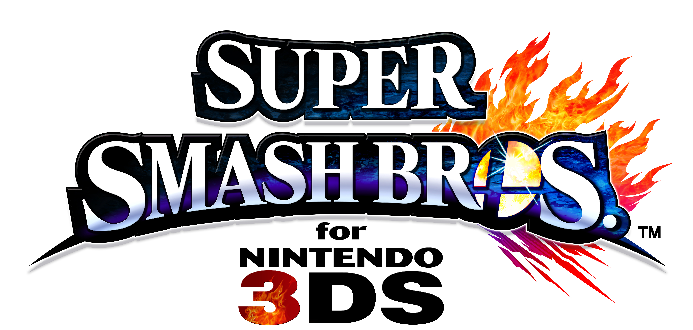



	
	<table valign="top">
		<tr>
			<td class="label">Title:</td>
			<td>Super Smash Bros. 3DS</td>
		</tr>
		<tr>
			<td class="label">System:</td>
			<td>3DS (Nintendo)</td>
		</tr>
		<tr>
			<td class="label">Genre:</td>
			<td>Fighting/Platformer</td>
		</tr>
		<tr>
			<td class="label">Release:</td>
                        <td>September 13, 2014(JP) October 3, 2014 (NA) October 13, 2014 (EU) October 4, 2014 (AUS)</td>
		</tr>
		<tr>
			<td class="label">Rating:</td>
			<td>ESRB: 10+</td>
		</tr>
		<tr>
			<td class="label">Price:</td>
			<td>$39.99 (US)</td>
		</tr>
		<tr>
			<td class="label">Players:</td>
			<td>1-4</td>
		</tr>
		<tr>
			<td class="label">Publisher:</td>
			<td>Nintendo</td>
		</tr>
		<tr>
			<td class="label">Developers:</td>
			<td>Sora Ltd. Bandai Namco Games</td>
		</tr>
		<tr>
			<td class="label">Director:</td>
			<td>Masahiro Sakurai</td>
		</tr>
	</table>

The third installment of Nintendo's successful series <i>Super Smash Bros</i>! The Smash Bros. series has always been about staple Nintendo characters duking it out, and Brawl is no different. Not only does Brawl bring back the action-packed multiplayer experience fans know and love, it also adds a new Adventure mode called The Subspace Emissary, an unprecedented journey across a massive landscape with intertwining stories between characters from Nintendo's franchises. With 35 characters and 41 stages, there's a lot to experience.

For more information, be sure to check out <a href="http://www.smashbros.com/">the official Smash. Bros. website</a>, which was updated slowly until the game was released, for complete details on the game.

 

