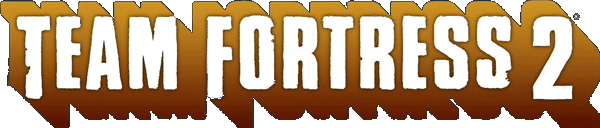
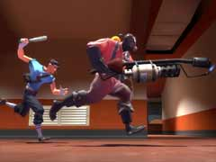
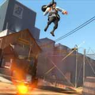
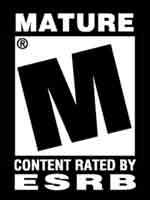
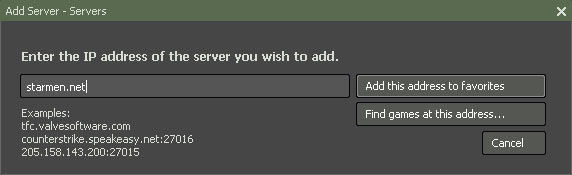







Team Fortress 2 is a multiplayer team-based first-person shooter, developed by Valve Corporation as part of the game compilation The Orange Box. It was released for the PC, Xbox 360, and PlayStation 3 in 2007.

The game was announced in 1998 as a sequel to the original Team Fortress mod for Quake, but has since been through various concepts and designs. In 1999, the game appeared to be deviating from the original Team Fortress and Valve's own Team Fortress Classic mod for Half-Life by heading toward a more realistic and militaristic style of gameplay, but the design metamorphosed further over the game's nine-year development and game engine switch. The final rendition of Team Fortress 2 bears more resemblance to the original Team Fortress and Team Fortress Classic games, and sports a cartoon-like visual style, based on the art of J. C. Leyendecker, Dean Cornwell and Norman Rockwell following a popular trend in recent CGI films (in particular, films recently made by Pixar/Disney, such as The Incredibles).

The lack of information or apparent progress for six years of the game's development caused it to be labeled as vaporware, and it was regularly featured in Wired News' annual vaporware list among other ignominies. The game has received critical acclaim and several awards since its release.

<i><s>Lifted</s><s>Borrowed</s><s>Stolen</s>Plagiarized from Wikipedia.</i>





Danger! 





How do I play? First, you have to buy Team Fortress 2, if you haven't already. You can even buy it <a href="http://steampowered.com">online and play (almost) immediately</a>.

Once you've downloaded Team Fortress 2, you have to go to our server. It's real easy, go to "Favorite" servers, and just add "starmen.net" in your favorite set.

Now you're 100% ready to go! :D


