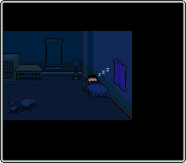
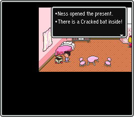
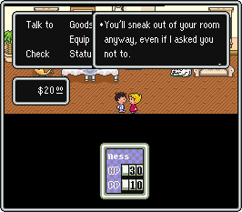
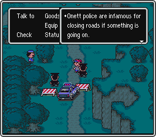
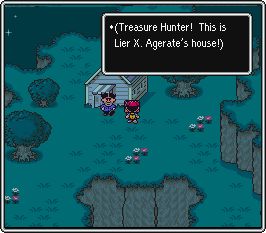
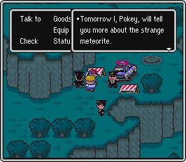



  

<table width="30%" border="0" align="center" cellpadding="0" cellspacing="0" vspace="5" hspace="5" >
<tr height="5px">
<td width="5px" background="../tl.png"></td>
<td background="../tbside.png" width="30%-10"></td>
<td background="../tbside.png" width="70%-10"></td>
<td width="5px" background="../tr.png"></td>
</tr>

<tr bgcolor="#101010">
<td background="../lrside.png"></td>
<td valign="top">
<b>&nbsp; Location</b>
</td>
<td valign="top">
Onett - Ness's House
</td>
<td background="../lrside.png"></td>
</tr>

<tr bgcolor="#101010">
<td background="../lrside.png"></td>
<td valign="top">
<b>&nbsp; Enemies</b>
</td>
<td valign="top">
none
</td>
<td background="../lrside.png"></td>
</tr>

<tr bgcolor="#101010">
<td background="../lrside.png"></td>
<td valign="top">
<b>&nbsp; Bosses</b>
</td>
<td valign="top">
none
</td>
<td background="../lrside.png"></td>
</tr>

<tr bgcolor="#101010">
<td background="../lrside.png"></td>
<td valign="top">
<b>&nbsp; Items</b>
</td>
<td valign="top">
<A HREF="http://starmen.net/mother2/ebdb/items.php?item=17">Cracked Bat</A> 
<A HREF="http://starmen.net/mother2/ebdb/items.php?item=103">Bread roll</A>
</td>
<td background="../lrside.png"></td>
</tr>

<tr bgcolor="#101010">
<td background="../lrside.png"></td>
<td valign="top">
<b>&nbsp; Shops</b>
</td>
<td valign="top">
none
</td>
<td background="../lrside.png"></td>
</tr>

<tr height="5px">
<td width="5px" background="../bl.png"></td>
<td background="../tbside.png" width="40%-10"></td>
<td background="../tbside.png" width="60%-10"></td>
<td width="5px" background="../br.png"></td>
</tr>
</table>

  
<table width="100%" align="center" border="0" cellpadding="0" cellspacing="25">
<TR>
<TD width="366px">

</TD><TD>

   The year is 199X.  In the town of Onett, Eagleland, a boy named Ness sleeps soundly.
Suddenly, the sound of something huge crashing into the nearby hilltop wakes him up.
You take control of Ness from this point on.

</TD></TR>
<TR><TD>

</TD><TD>

In your sister's room you will find a gift box with a <A HREF="http://starmen.net/mother2/ebdb/items.php?item=17">Cracked Bat</A> in it.  This is
your first weapon.  Equip it and go downstairs.  
To Equip the <A HREF="http://starmen.net/mother2/ebdb/items.php?item=17">Cracked Bat</A>, open up the menu with the A button and select Equip. When weapon is highlighted, press the A button and your inventory will appear. Choose the <A HREF="http://starmen.net/mother2/ebdb/items.php?item=17">Cracked Bat</A> with the A button. The Cracked Bat is now equipped!

</TD></TR>
<TR><TD>

</TD><TD>

   Your mom is too scared to see what the noise was, and if you talk to her she asks
you not to go out.  Even though she says this, she knows you will still go out anyway, so she makes
you change out of your pajamas into regular clothes.  
If you don't talk to her
you can go outside in your pajamas.

</TD></TR>
<TR><TD>

</TD><TD>

  Now that you're outside, you will find the nearby area swarming with police officers
blocking the road and complaining about their lives, the local ruffians, or whatever
else they have on their minds.

</TD></TR>
<TR><TD>

</TD><TD>

  As you make your way up the hilltop, you will find Lier X. Agerate.  As his name
suggests, you shouldn't believe everything he says, but later on you will meet him again,
so remember where his house is.  

Be sure to pick up the <A HREF="http://starmen.net/mother2/ebdb/items.php?item=103">Bread roll</A> in the
gift box south of Lier's house.

</TD></TR>
<TR><TD>

</TD><TD>

   At the top of the hill you will find Pokey, who is trying to get a look at the meteorite
that crashed only a short while ago.  Talk to Pokey, and he will tell you to return home.
When you get back home, you will find your mom waiting for you, and she will make you go
back to bed.

</TD></TR>
</table>


