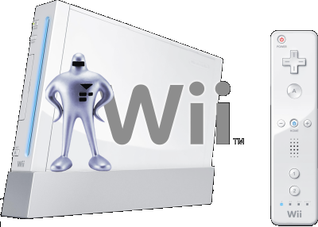



  
With the release of the Wii and its Virtual Console, EarthBound fans instantly saw the potential for MOTHER games finally coming stateside. Alas, there's nothing yet, but there's always hope. In the meantime, Starmen.Net is expanding its awesomeness into the Wii realm in the hopes of creating a solid Wii community of MOTHER fans. Below is what Wii are Starmen is all about:

<ul>
 <li><h3>SIGN UP!</h3>
 Send your friend code and other information here to become a member of the Starmen.Net Wii community. Signing up will also subscribe you to our Wii Newsletter.</li>

    
 <li><h3>WII NEWSLETTER</h3>
 Each month, an email will be sent to your Wii featuring updates, announcements, interviews, contests, and more. Of course, there will be the occasional prize here and there so be sure to sign up!</li>

    
 <li><h3>"EVERYBODY VOTES" FOR MOTHER!</h3>
 Nintendo's free Everybody Votes channel is yet another outlet ripe for sieging. As a member of the Starmen.Net Wii comunity, you have the ability to let Nintendo know that you want MOTHER games from a very unique position: that of a Wii owner. Be sure to suggest a MOTHER-related poll each day!</li>

    
 <li><h3>PK SMASH</h3>
As soon as the community learned that Smash Bros. Brawl will feature online play, a group called "PK Smash" was organized. Brawl isn't out just yet, but you can count on finding a dedicated Smash Bros. play group within our Wii community.</li>

    
 <li><h3>CONTESTS AND EVENTS</h3>
We're coming up with cool ideas that will light your hair on fire!</li>

    
 <li><h3>AND MUCH MORE IN THE FUTURE!</h3></li>
</ul>

 
So if you're a die-hard EarthBound fan and have a Nintendo Wii, sign up without delay! For those not good with stuff like this, follow the detailed steps listed below.



<b><u>Directions on How to Sign Up:</u></b>
  
<ul><li>Add the e-mail address "<b>wii@starmen.net</b>" to your Contact List.  If you're not sure how to do this, check out the video below. It takes you through step-by-step:</li></ul>

<youtube src="b7yo4sB-g_8" />

  
Once you've signed up, you'll get confirmation within a week or so.

  
Sign up now so we can turn your system's blue light on once in a while! <b>BLUE BLUE</b>

