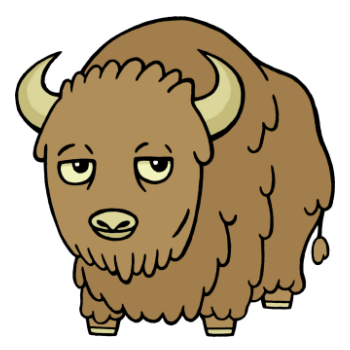



  

1913, 1925, 1937, 1949, 1961, 1973, 1985, 1997, 2009
 

Despite the name, people born in the Year of the Bad Buffalo are not inherently "bad". However, they have a tendency to charge into situations without thinking first. They are commonly known for their lack of interest in physical appearance and overall stubborn nature, making them easy candidates for nomadic life. Though their people skills could always use some work, Buffaloes are very attentive listeners and can usually count on their friends to help them out in a pinch. To a Buffalo, failure is not an option.

