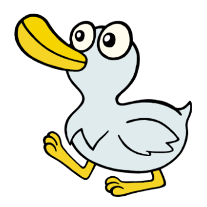



  

1921, 1933, 1945, 1957, 1969, 1981, 1993, 2005, 2017
 

People born in the Year of the Mad Duck tend to be a bit absent-minded. They sometimes struggle with deadlines, but are able to keep a level head under stress. Mad Ducks are very friendly and easy to start conversations with, but they will sometimes talk the other person's ear off without realizing it. Their most endearing quality is their sense of humor - Mad Ducks are always the life of the party. They love being surrounded by people, yet they have maybe one or two really close friends with whom they are able to share secrets.

