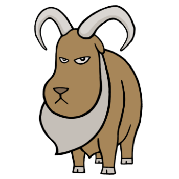



  

1919, 1931, 1943, 1955, 1967, 1979, 1991, 2003, 2015
 

Shy and sympathetic, people born in the Year of the Gruff Goat always try to fit in, even in places they knows they cannot.  One of their most admired traits is their compassionate nature and understanding of others' troubles, though they sometimes have difficulty dealing with their own problems. Despite their name, Gruff Goats are, for the most part, peaceful. They can get moody when rubbed the wrong way, however, and that's when their more hostile side surfaces.

