
The year in which you were born corresponds with an animal of the EarthBound Kingdom. Your specific animal exhibits certain traits that you may or may not have yourself. The years go in order, so find your animal and have some fun!   

<a href="mouse.php">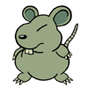</a>
<a href="buffalo.php">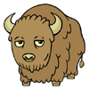</a>
<a href="bear.php">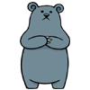</a>
<a href="fobby.php">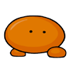</a>
<a href="kraken.php">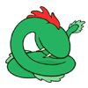</a>
<a href="snake.php">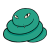</a> 
<a href="booka.php">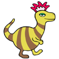</a>
<a href="goat.php">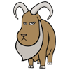</a>
<a href="monkey.php">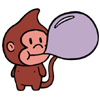</a>
<a href="duck.php">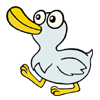</a>
<a href="dog.php">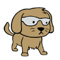</a>
<a href="mole.php">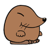</a>
  

Legend:  

According to ancient legend, 12 animals in the EarthBound Kingdom got together for a party and a fight broke out between the Runaway Dog and the Coil Snake over a cookie. There was one cookie left and they both wanted it. The other animals were overcome with greed and an all-out brawl was started in pursuit of the last cookie. An old, retired dungeon master by the name of Dirt Road heard the commotion and tried to stop it (he was taking a lovely nap at the time). The animals refused to back down, so Dirt Road proposed a contest be held to determine the order that the animals got to take a bite of the final cookie. Realizing that the animal who won first place would probably take the biggest bite and leave barely anything for the rest, the animals agreed and started to plot.  

Dirt Road demanded that each animal tell him a joke, and he would rank the jokes based on how funny they were. The Rowdy Mouse, being the conniving little rodent that he was, charged forward and demanded he be last, knowing that the last joke always leaves the biggest impression. Unfortunately, the Mole Playing Rough was chosen to go first and barely got a chuckle out of Dirt Road. The Rowdy Mouse got to take the first bite of the cookie, and the order in which the animals ate the cookie determined the cycle of the EarthBound Zodiac as a tribute to the greatest Amateur Night that Dirt Road had ever experienced.

