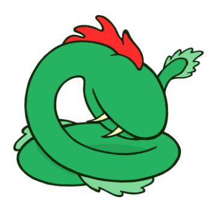



  

1916, 1928, 1940, 1952, 1964, 1976, 1988, 2000, 2012
 

People born in the Year of the Kraken are very strong souls and put every ounce of themselves into whatever they do. They are always very passionate about what they love to do, which is an attractive characteristic to many people. Krakens are loyal, always patrolling the same places, but can be barbaric and tyrannical too, sometimes to the point of being hot-headed. They usually have poor eyesight.

