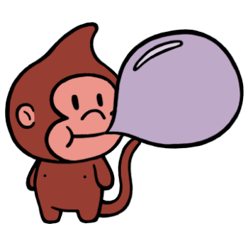



  

1920, 1932, 1944, 1956, 1968, 1980, 1992, 2004, 2016
 

People born in the Year of the Bubble Monkey are usually kind and friendly. They'll help anyone out, but they'll often require a reward for their efforts. Bubble Monkeys are fascinated by things that many people would find odd. They love to travel and often dream about inventing new ways of performing old, boring tasks. Sometimes their many ideas will build up before one comes to fruition; their hardest task is always getting started. Bubble Monkeys seek companionship above all else.

