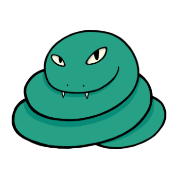



  

1917, 1929, 1941, 1953, 1965, 1977, 1989, 2001, 2013
 

People born in the Year of the Coil Snake always have people asking for their advice, no matter what the issue may be. They are sometimes unwilling to participate in group activities, since they often lack social skills. Coil Snakes are naturally creative and somewhat frugal when it comes to money matters. Though they sometimes like to bare their fangs, they rarely hurt anyone. Another interesting trait of Coil Snakes is that they have a weakness for confections, especially cookies.

